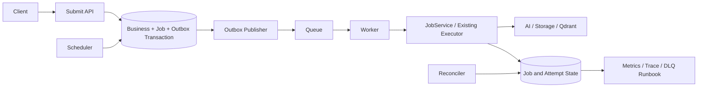
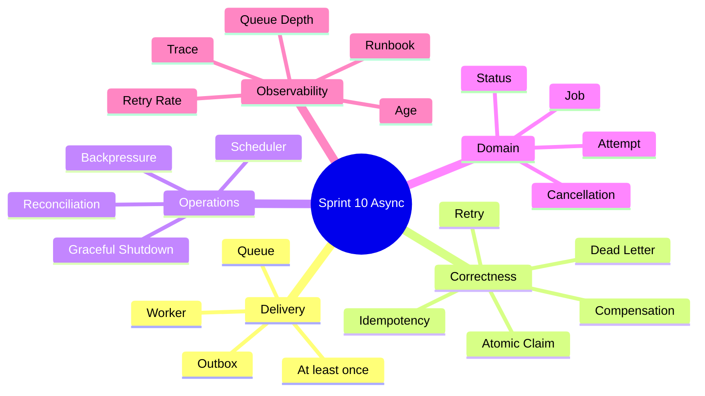
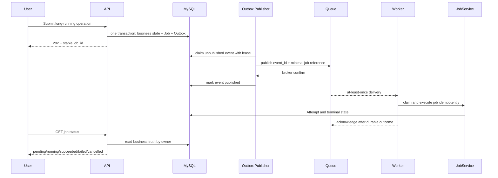

# Sprint 10: Async Platform（可靠异步任务平台）

## 状态

Sprint 10 为计划阶段，必须在同步业务状态机和可观测基线已经被真实验证后开始。

```text
Planned Sprint: Sprint 10 Async Platform
Entry Condition: 已知道哪些任务耗时、失败频率、恢复目标和用户等待体验
North Star: 以 at-least-once 投递和业务幂等实现不丢、可恢复的后台执行
```

## Sprint 定位

Queue 不是 Workflow，也不是业务数据库：

```text
Workflow / Job Domain: 定义任务状态、业务幂等和终态
Outbox:                防止数据库提交与消息发布之间丢任务
Queue:                 传递最小任务引用，通常提供 at-least-once
Worker:                认领并调用现有 Service/Executor
Scheduler:             触发周期任务与 reconciliation，不决定业务真相
```

## Sprint North Star



## 知识思维导图



## 端到端异步流程



## Sprint 范围

### 本 Sprint 实现

- Job、Attempt、Outbox、Dead Letter 和状态机。
- `submit/get/cancel/retry` Service-first 契约和稳定 `job_id`。
- Transactional Outbox、Publisher、Queue/Worker Adapter。
- 通过 Spike 与 ADR 选择成熟任务框架，不手写 Broker。
- 幂等、Retry/Backoff/Jitter、错误分类和人工重放；Broker Redelivery 只恢复消费者崩溃，
  业务重试由 Job Attempt 与 `next_run_at` 统一管理。
- 将 Sprint 5 同步索引/清理迁移为后台 Job。
- Scheduler、Reconciliation、Cancellation、Backpressure 和优雅停机。
- Queue/Worker Observability、Runbook 和破坏性故障演练。

### 本 Sprint 明确不做

- 宣称 Exactly-once；业务只基于 at-least-once + Idempotency 保证正确性。
- Kafka、多区域队列和复杂事件流平台。
- 任意用户代码、无限优先级和全局公平调度平台。
- 把大文件、Prompt、Chunk 或 Secret 放进消息 Payload。
- 重新实现 Workflow/Agent 状态机；Worker 只调度既有业务能力。

## Service-first 入口

```python
JobService.submit(...)
JobService.get_job(...)
JobService.cancel(...)
JobService.retry(...)
JobExecutor.execute(job_id=...)
ReconciliationService.recover_stale_jobs(...)
```

客户端和 Queue 都只持有稳定 `job_id`。Broker Message ID、内部队列名和 Worker 实现不进入
公共 API，也不能成为任务是否完成的业务真相。

## Story 路线图

| Story | 核心问题 | 真实项目练习 | 完成标准 |
| --- | --- | --- | --- |
| 10.0 Async Evolution & SLO Map | 哪些任务真的需要异步 | 用 Sprint 9 数据盘点索引、清理、Workflow | 每类任务有延迟、恢复、Payload 和取消目标；暂不装框架 |
| 10.1 Job Domain & Service | 异步 API 怎样保持稳定 | 定义 Job/Attempt 状态和 submit/get/cancel | 原子状态转换；API 只暴露 job_id 和安全状态 |
| 10.2 Transactional Outbox | DB 成功、消息丢了怎么办 | 同事务写业务状态、Job 和 Outbox，实现 lease claim -> publish event_id -> broker confirm -> mark published | 发布后标记前崩溃允许重复但不丢失；Publisher/Reconciler 可安全恢复 |
| 10.3 Queue & Worker Adapter | 应选什么成熟工具 | 对候选做 Spike，记录能力/运维/故障取舍并接真实 Worker | Worker 重启可重投；Queue 不承担业务状态 |
| 10.4 Idempotency & DLQ | 重复消息和毒任务怎么办 | 按 event_id/job_id 幂等；Broker Redelivery 处理崩溃，Attempt/next_run_at 处理业务退避；加入 DLQ 和人工重放 | 不发生双重重试；重复执行无重复副作用；重试耗尽可查可恢复 |
| 10.5 Async Indexing | 现有 5.6 Pipeline 怎样迁移 | Upload 返回 202，Worker 复用索引状态机 | 旧 active Version 可用；failed/cleanup_required 语义不变 |
| 10.6 Scheduler & Reconciliation | 任务卡死或事件未发出怎么办 | Outbox 补发、过期认领回收、周期清理 | Scheduler 重复触发无破坏；stale job 可恢复 |
| 10.7 Cancel & Backpressure | 高峰和停机怎样保护系统 | 并发上限、Provider 限流、合作式取消、优雅停机 | 不接新任务后安全结束/释放/留下可恢复状态 |
| 10.8 Operations | 后台任务怎样定位和处理 | Queue depth/age、retry、DLQ、Trace 和 Runbook | API 请求可追到 Worker、依赖和终态 |
| 10.9 Resilience Review | 平台能否经得住真实故障 | 杀 Worker、停 Queue/MySQL、重复消息和恢复演练 | 自动/人工恢复路径验证；文档和 Sprint Tag 完整 |

## 正确性原则

- Message 只保存 Job ID、类型和必要路由信息，业务输入从受权限保护的存储读取。
- Job 创建与 Outbox 必须在同一个 MySQL 事务中完成。
- Publisher 使用有期限的 Claim；只有收到 Broker Confirm 后才标记 `published_at`。若在确认后、
  标记前崩溃，事件会重复发布，因此消费者必须按 `event_id/job_id` 幂等。
- Worker 在持久化终态后才确认消息；重复投递是正常情况。
- Broker Redelivery 只处理 Worker 崩溃或 Ack 丢失；业务 Retry 只由持久化 Attempt、
  `next_run_at`、错误分类和总 Deadline 管理，禁止两层同时退避形成重试风暴。
- Cancellation 是合作式状态，不假装能瞬间撤回已经发生的外部副作用。
- Reconciler 修复“应该发生但没有发生”的状态，不盲目重置所有旧 Job。

## 测试与故障矩阵

| 场景 | 必须证明的行为 |
| --- | --- |
| Duplicate Delivery | 同一 Job 多次投递不重复创建 Chunk、向量或副作用 |
| Crash Window | DB 提交前、提交后发布前、Broker confirm 后标记 published 前、执行中、终态后 Ack 前崩溃 |
| Dependency Failure | Queue、MySQL、Qdrant、Provider 暂时/永久失败 |
| Retry | Backoff、Jitter、最大次数、Deadline、DLQ 和手工重放 |
| Cancellation | 排队中取消、运行中合作取消、外部调用不可撤销 |
| Shutdown | Worker 停止取新任务、完成/释放当前任务、恢复认领 |
| Security | 越权查询 Job、伪造类型、敏感/超大 Payload |

## ADR 与面试题候选

- ADR：任务框架/Broker 选择与 at-least-once 边界。
- ADR：Transactional Outbox Publish Confirm、Job Truth、单一业务 Retry Owner 和 Idempotency Strategy。
- 面试题：为什么 Queue 成功投递不等于业务成功。
- 面试题：Outbox 解决了哪个双写问题。
- 面试题：Exactly-once 为什么通常落到业务幂等。

## 主要风险

| 风险 | 约束 |
| --- | --- |
| DB 与 Queue 双写丢任务 | Transactional Outbox + Reconciliation |
| 重复投递造成副作用 | 原子认领、Idempotency Key、稳定 Point/Resource ID |
| 重试风暴压垮依赖 | 分类、退避、Jitter、Deadline、并发上限 |
| Payload 过大或泄密 | Queue 只放 ID；正文留在受控存储 |
| Worker 僵死或失联 | Lease/heartbeat、stale scan、可恢复 attempt |
| Scheduler 多实例重复触发 | 任务幂等、唯一键和原子 Claim |

## Sprint 验收标准

- 能准确解释 Outbox、Queue、Worker、Job State 和 Workflow 的区别。
- 上传到异步索引的完整链路以 `202 + job_id` 闭环，并保持 Version 语义。
- 重复消息、进程崩溃、依赖中断和重试耗尽均有真实演练证据。
- Queue 中不保存敏感正文，Worker 不绕过现有 Service 和权限边界。
- Metrics、Trace、Runbook、ADR、面试题、Review 和 Sprint Tag 完整。

## 前后衔接

```text
Sprint 5/6/7: 提供已验证的同步状态机和长任务
Sprint 9:     提供选择异步化与设定 SLO 的真实数据
Sprint 10:    建可靠 Queue/Worker 平台并迁移长任务
Sprint 11:    将 API、Worker、Scheduler 部署到 k3s 并独立扩缩
Sprint 13:    复用异步执行器调度多 Agent DAG Node
```
