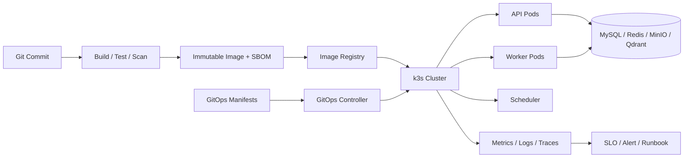
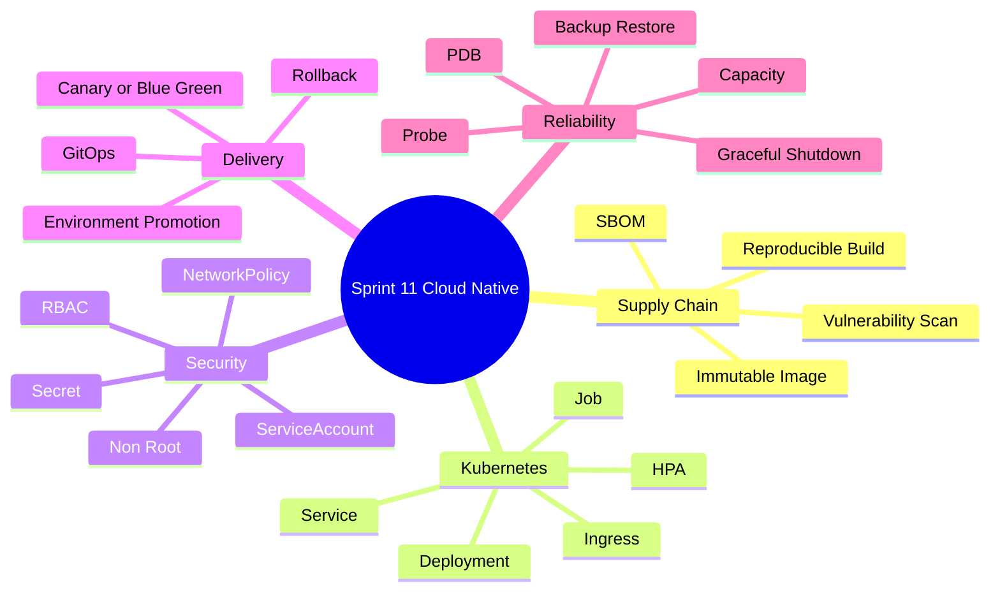
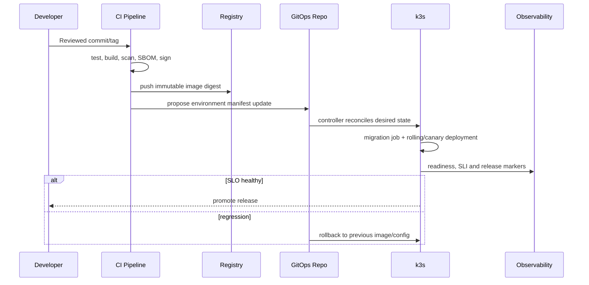

# Sprint 11: Cloud Native & SRE（云原生交付与可靠性）

## 状态

Sprint 11 为计划阶段，必须在 API 与 Worker 运行边界、负载和可观测信号稳定后开始。

```text
Planned Sprint: Sprint 11 Cloud Native & SRE
Entry Condition: API/Worker/Scheduler 可独立运行，关键 SLI 与后台任务恢复边界已明确
North Star: 在本地 k3s 上可重复部署、扩缩、发布、回滚并恢复整个平台
```

## Sprint 定位

Cloud Native 不是把 Compose 文件翻译成 YAML，而是把应用已经明确的运行边界变成可声明、
可验证、可回滚的部署系统。

```text
Application Correctness: Service、状态机、幂等、迁移兼容
Container:               不可变进程与依赖
Kubernetes/k3s:          调度、网络、生命周期和扩缩
GitOps:                  Git 中的期望状态与审计提升
SRE:                     SLO、容量、故障演练、备份与恢复
```

## Sprint North Star



## 知识思维导图



## 端到端发布流程



## Sprint 范围

### 本 Sprint 实现

- 多阶段、非 root、固定依赖的生产镜像，以及 SBOM、漏洞扫描、镜像签名和部署侧验证。
- 在 Story 11.0 明确 MySQL、Redis/Queue、MinIO、Qdrant 和 Observability 的集群内/外拓扑、
  数据持久化责任和本地开发差异。
- 本地 k3s 的 Namespace、API/Worker/Scheduler Deployment、Service、Job、Ingress 和资源边界。
- Alembic Migration Job、启动兼容和 Expand/Contract 演进。
- TLS、ServiceAccount、RBAC、NetworkPolicy 和 Secret 引用。
- Startup/Readiness/Liveness、优雅终止、PDB 和分布策略。
- 选择一套 Helm 或 Kustomize 路径，以及 Argo CD 或 Flux 路径并通过 ADR 固化。
- 不可变 Release、环境提升、Canary/Blue-Green 与真实 Rollback。
- 压测、容量模型、API HPA、基于 Queue 指标的 Worker 扩缩。
- MySQL、MinIO、Qdrant 等关键数据的备份恢复和 Game Day。

### 本 Sprint 明确不做

- Service Mesh、多集群、跨地域容灾和完整生产数据库 Operator。
- 同时学习两套模板工具和两套 GitOps Controller。
- 为展示复杂度拆成微服务；模块化边界没有证据前保持模块化单体。
- 把 Secret 明文提交 Git、写入镜像或普通 ConfigMap。
- 用 Kubernetes Probe 代替业务监控和 SLO。
- 没有测量依据的资源限制与 HPA 参数。

## Service-first 运行边界

Cloud Native 不改变业务 API，但进入实现前必须列出独立进程及其退出契约：

```text
API Process:       接收 HTTP，停止时不再接流量并完成/取消请求
Worker Process:    停止拉取新 Job，完成或释放当前 Attempt
Scheduler Process: 只产生幂等触发，不与 Worker 混成单例假设
Migration Job:     每个 Release 最多成功执行一次，失败阻止错误版本接流量
```

## Story 路线图

| Story | 核心问题 | 真实项目练习 | 完成标准 |
| --- | --- | --- | --- |
| 11.0 Runtime & Capacity Map | 系统有哪些进程和状态依赖 | 画 API/Worker/Scheduler/所有数据与 Observability 依赖/SLO 图，决定每项依赖集群内或外 | 无状态/有状态、持久化 owner、启动/终止、容量和恢复假设明确 |
| 11.1 Production Container | 镜像如何可复现且最小权限 | 多阶段 Build、非 root、固定依赖、SBOM、扫描、签名和验证 | 镜像不含 Secret；相同输入可复现；部署拒绝未签名/错误来源镜像 |
| 11.2 k3s Foundation | 应用怎样进入集群 | Namespace、API/Worker/Scheduler Deployment、Service、Config、资源限制及每个外部依赖连接 | 全新 k3s 可按已决定拓扑重复部署或连接全部依赖；Scheduler 多副本触发保持幂等 |
| 11.3 State & Migration | 多副本下谁执行 Migration | Alembic Job、版本兼容和失败阻断 | 不并发迁移；失败版本不接流量；可安全重试 |
| 11.4 Traffic & Security | 网络和身份如何最小授权 | Ingress/TLS、ServiceAccount、RBAC、NetworkPolicy、Secret | 默认拒绝非必要流量；Secret 不进 Git/镜像/日志 |
| 11.5 Lifecycle Reliability | 发布时怎样不截断请求和任务 | 三类 Probe、termination grace、PDB、分布约束 | Rolling Update 中请求/Job 有可验证终态 |
| 11.6 GitOps & Environments | 环境变更如何审计和纠偏 | 选择单一模板/GitOps 工具，建 dev/staging 提升 | Git 是期望状态；漂移可见；环境差异显式 |
| 11.7 Release & Rollback | 数据库变化下怎样回滚 | Immutable digest、Expand/Contract、Canary/Blue-Green | 新旧版本短期共存；真实完成一次发布和回滚 |
| 11.8 Capacity & Autoscaling | 怎样用数据扩缩容 | 压测、requests/limits、API HPA、Worker queue metric | 参数来自测量；可解释瓶颈和扩缩滞后 |
| 11.9 Backup, Restore & Game Day | 集群没了数据如何回来 | MySQL/MinIO/Qdrant 备份、空环境恢复、节点故障 | 实测 RPO/RTO；核心 Upload->RAG 链路恢复 |

## 生产安全与可靠性原则

- 镜像以 Digest 提升，不使用 `latest` 或启动时在线安装依赖。
- Sprint 11 建立镜像签名和部署侧来源验证的机械闭环；Sprint 14 在此基础上增加源码到
  Artifact 的 Provenance、Attestation 和风险门禁。
- Readiness 决定是否接流量，Liveness 只检测进程无法自愈，Startup 保护慢启动。
- Migration 与应用版本采用向后兼容的 Expand/Contract，不依赖“回滚数据库到过去”。
- Secret 通过专用机制引用；应用日志和诊断页面永不显示值。
- Worker 扩缩考虑 Queue Age、Provider 限流和下游容量，不只看 CPU。
- 备份成功日志不等于可恢复，必须定期从空环境 Restore。

## 测试与故障矩阵

| 层级 | 必须证明的行为 |
| --- | --- |
| Image | 非 root、固定依赖、扫描、SBOM、签名验证、Secret 检查、启动命令 |
| Manifest | Schema/Lint、渲染、Policy、资源请求和内部链接 |
| Lifecycle | Probe、Pod Kill、Node Drain、滚动发布、Worker Graceful Shutdown |
| Security | RBAC、NetworkPolicy、Secret、容器权限和镜像来源 |
| Release | Migration 失败、Canary 回归、Rollback、新旧 Schema 兼容 |
| Capacity | Load Test、HPA、Queue Backlog、下游限流和饱和点 |
| Recovery | 数据丢失、节点故障、备份损坏和空集群 Restore |

## ADR 与面试题候选

- ADR：选择 k3s、单一 Manifest 管理工具和 GitOps Controller。
- ADR：Release、Migration 与 Expand/Contract 策略。
- 面试题：Liveness、Readiness、Startup Probe 的区别。
- 面试题：为什么 Worker HPA 不应只看 CPU。
- 面试题：如何让数据库 Migration 支持零停机发布和回滚。

## 主要风险

| 风险 | 约束 |
| --- | --- |
| Probe 错误导致重启雪崩 | 语义分离、故障注入和宽容启动窗口 |
| Migration 竞态或不可回滚 | 独立 Job、唯一执行、Expand/Contract |
| Secret 进入 Git/镜像 | 扫描、引用机制、最小 RBAC、轮换演练 |
| 资源值凭感觉配置 | 压测、分位数、饱和点和容量余量 |
| HPA 压垮 Provider/DB | 端到端限流、Queue Age 和下游容量约束 |
| 有备份但无法恢复 | 定期 Restore、校验和、RPO/RTO 记录 |

## Sprint 验收标准

- 从空 k3s 集群能够按文档部署或连接已声明的状态依赖，并验证 API、Worker、Scheduler 及
  Upload、Index、RAG、Workflow/Agent 主线。
- 完成一次兼容 Migration、渐进发布、指标观察和 Rollback。
- API 与 Worker 能独立扩缩并在终止时保持请求/Job 状态正确。
- Secret、NetworkPolicy、RBAC、镜像供应链和数据恢复均有实际证据。
- ADR、Runbook、面试题、Review、故障演练和 Sprint Tag 完整。

## 前后衔接

```text
Sprint 9:  提供 SLI、Trace、Alert 和容量证据
Sprint 10: 提供 API/Worker/Scheduler 独立运行边界
Sprint 11: 建立 k3s、GitOps、Release、Autoscaling 和 Recovery
Sprint 12: 在稳定运行底座上建设多 Workspace AI 控制平面
```
