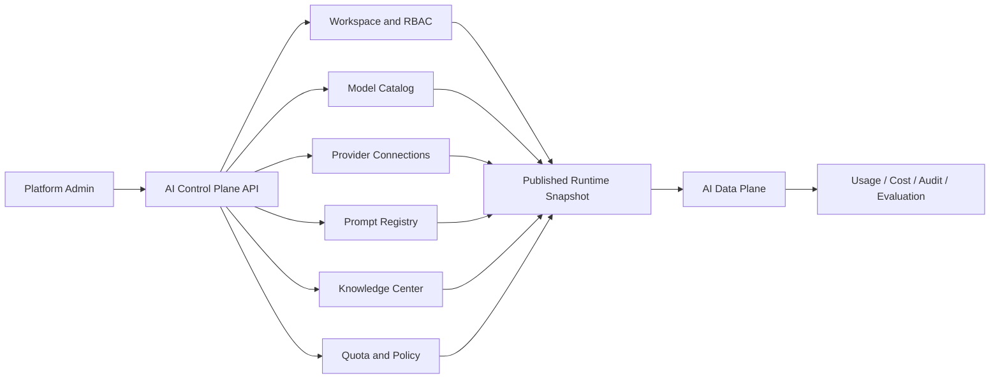
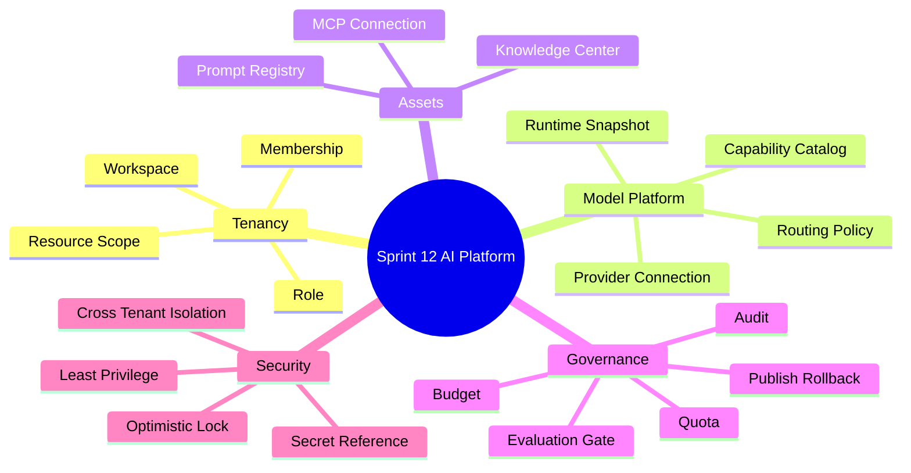
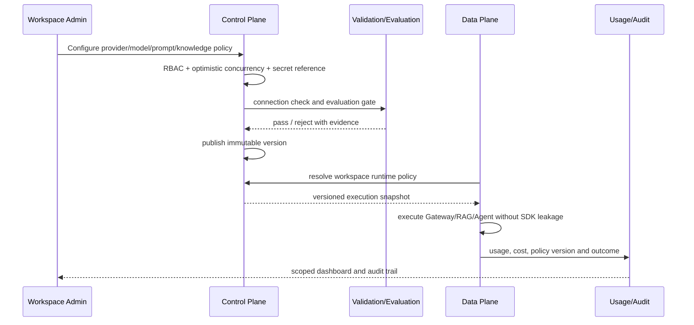

# Sprint 12: AI Platform（多租户 AI 控制平面）

## 状态

Sprint 12 为计划阶段，必须在核心 AI 能力和 Cloud Native 运行底座稳定后开始。

```text
Planned Sprint: Sprint 12 AI Platform
Entry Condition: Gateway、Knowledge、Workflow、Agent、MCP 已有稳定契约和生产式运行能力
North Star: 用 Workspace、策略、版本、配额和审计统一治理 AI 能力
```

## Sprint 定位

前面的 Sprint 建的是单个用户可使用的能力；AI Platform 建的是控制面：谁可以配置什么、
哪些配置已经发布、运行时实际用了哪个版本、成本归到哪里，以及变更怎样审计和回滚。

```text
Control Plane: Workspace、成员、Model/Provider/Prompt/Knowledge 配置与发布
Data Plane:    实际 Chat、Embedding、RAG、Workflow、Agent 和 MCP 运行
Policy Plane:  权限、配额、预算、路由、风险和评测门禁
```

## Sprint North Star



## 知识思维导图



## 端到端平台流程



## Sprint 范围

### 本 Sprint 实现

- Personal Workspace 兼容迁移、Workspace、Membership、Role 和资源作用域。
- Model Capability Catalog 与模型别名/生命周期。
- Provider Connection、Secret Reference、验证、健康和停用。
- Workspace Runtime Policy、预算、有限路由/Fallback 和执行快照。
- Prompt Draft/Immutable Version/Publish/Rollback 与变量契约。
- Knowledge Center 的共享范围、索引 Profile 和生命周期。
- Workspace/User/Capability 的 Quota、Rate Limit 和成本归因。
- 配置变更 Audit、Optimistic Lock 和发布前 Evaluation Gate。
- 新 Workspace 从配置到 RAG/Agent 的完整 Onboarding。

### 本 Sprint 明确不做

- 财务级账单、充值、税务和合同结算。
- 基础模型训练、GPU Serving 和模型权重管理。
- 开放 Marketplace、任意插件安装和全局跨区域控制面。
- 企业 SSO、SCIM 和复杂组织层级；作为后续身份演进候选。
- 将业务配置直接改为任意数据库 JSON 而没有 Schema/Version。
- 运行时读取“当前最新配置”导致请求不可复现。

## Service-first 入口

```python
WorkspaceService.create_workspace(...)
MembershipService.invite_or_assign_role(...)
ModelCatalogService.publish_model_profile(...)
ProviderConnectionService.validate_and_enable(...)
PromptRegistryService.publish(...)
KnowledgeCenterService.share_base(...)
RuntimePolicyService.resolve_snapshot(...)
QuotaService.reserve(...)
QuotaService.finalize(reservation_id=...)
QuotaService.release(reservation_id=...)
QuotaService.reap_expired(...)
```

公开 API 的 Workspace ID 仍必须结合认证 Membership 校验，不能因为请求带了 ID 就获得访问权。

## Story 路线图

| Story | 核心问题 | 真实项目练习 | 完成标准 |
| --- | --- | --- | --- |
| 12.0 Control Plane Map | 配置和运行为什么要分面 | 画控制面、数据面、策略面和 Secret 边界 | 动态配置不把 Provider SDK 或凭据扩散到业务 |
| 12.1 Workspace & RBAC | owner-only 怎样兼容升级 | 建 Personal Workspace 迁移、成员角色和资源作用域 | 旧数据可用；跨 Workspace 隔离纵向验证 |
| 12.2 Model Catalog | 模型能力怎样稳定表达 | 将现有 Settings Model Alias/Profile 导入 Catalog，增加 Capability、Context、Dimension、Lifecycle 和切换点 | Settings 保留为 bootstrap/回滚输入；业务按稳定 Catalog Snapshot 请求，不绑定真实模型名 |
| 12.3 Provider Connection | 平台怎样保存和验证连接 | 将现有 Provider Registry 配置迁入 Secret Reference + Connection，增加验证、健康、启停和轮换 | 凭据不以明文进入 DB、日志或 API；旧配置有明确退役条件 |
| 12.4 Runtime Policy & Routing | 每次运行如何可复现 | Workspace 策略、预算、有限 Fallback、执行快照 | 可还原 Provider/模型/策略版本；流开始后不 Fallback |
| 12.5 Prompt Registry | Prompt 怎样在线治理又可回滚 | 导入现有文件 Prompt Key/Version，再增加 Draft、发布、Immutable Version、变量和 Rollback | 切换前双读验证；运行固定版本；文件源按退役计划转只读/移除 |
| 12.6 Knowledge Center | 私有、部门、公开知识怎样授权 | 将现有 owner KnowledgeBase 迁入 Personal Workspace，再增加可见范围、共享、索引 Profile 和生命周期 | 权限在 Base/Document 边界；Chunk 不复制 ACL；旧 owner 行为兼容 |
| 12.7 Quota & Cost | 怎样防止资源被一个租户耗尽 | Workspace/User/Capability 额度、速率，使用 reservation_id 执行 reserve/finalize/release/reap | 并发不能绕过额度；未知 Usage、取消、超时、超额和过期回收语义明确 |
| 12.8 Audit & Evaluation Gate | 配置变更如何证明安全 | Audit、乐观锁、发布前质量/安全评测 | 谁改了什么可追溯；退化阻止发布 |
| 12.9 Platform Onboarding | 新租户是否无需改代码 | 创建 Workspace 到受控 RAG/Agent 的完整演练 | 配置、权限、Secret、额度、审计和运行闭环 |

## 权限与版本原则

- 现有每个用户迁移到 Personal Workspace，先保持行为兼容，再引入共享。
- Role 只表达平台动作；资源查询仍必须包含 Workspace Scope。
- 公共知识不等于没有所有者，而是由受治理 Workspace 发布公开可见性。
- Prompt、Model Profile、Policy 和 Knowledge Index Profile 发布后不可原地修改。
- 每次 AI Run 保存执行快照 ID，不能只记录“当前配置”。
- Chunk 不单独复制一套 ACL；通过 Document -> Base -> Workspace 校验。

## 现有能力演进路径

- Settings 中的 Model Alias 与 Provider 配置先作为 Bootstrap Source 导入新 Catalog/Connection；
  通过兼容读取和纵向对比完成切换，达到回滚窗口后才退役旧动态读取路径。
- 文件型 Prompt Center 先按原 `prompt_key + version` 导入 Registry，完成内容 Hash 与渲染契约
  对比；切换期文件源保持只读回滚能力，不能直接出现两套可写真相。
- 现有 KnowledgeBase 先迁入每个用户的 Personal Workspace，再逐步启用成员共享和公开范围；
  Migration 必须保留原 ID、active Version 和 owner-only 行为。
- 每次切换都定义 Source of Truth、双读/校验窗口、Rollback 和旧路径删除条件，禁止永久双写。

## 测试与验证矩阵

| 层级 | 必须证明的行为 |
| --- | --- |
| Migration | 现有 owner 数据进入 Personal Workspace 且 ID/权限兼容 |
| RBAC | Admin/Editor/Viewer、跨 Workspace、已移除成员和公开资源 |
| Version | Draft/Publish/Rollback、并发修改、旧 Run 可复现 |
| Secret | 创建、读取屏蔽、轮换、日志/Trace/API 无明文 |
| Quota | reservation_id 幂等、并发预留、finalize/release、未知 Usage、取消/超时、过期回收、超额和成本归因 |
| Runtime | Model/Prompt/Policy/Knowledge Snapshot 与有限 Fallback |
| Evaluation | Provider 验证、发布门禁、故意退化和审计证据 |

## ADR 与面试题候选

- ADR：Personal Workspace 兼容迁移与 Workspace-scoped Authorization。
- ADR：版本化 AI Runtime Policy 与 Execution Snapshot。
- ADR：Secret Reference、Quota Reservation 和发布门禁边界。
- 面试题：AI 控制面与数据面有什么区别。
- 面试题：多租户系统为什么不能只在 Router 检查 Workspace ID。
- 面试题：为什么运行记录必须保存配置快照版本。

## 主要风险

| 风险 | 约束 |
| --- | --- |
| 跨租户数据泄漏 | Repository 强制 Workspace Scope + 纵向越权测试 |
| 动态配置绕过 Review | Draft/Publish、RBAC、Audit、Evaluation Gate |
| Secret 泄漏 | 外部 Secret Store/引用、屏蔽输出、轮换和扫描 |
| Embedding Profile 不兼容 | Capability/Dimension 校验 + 新 DocumentVersion |
| 并发绕过 Quota | 原子 Reservation、终态结算、超时回收 |
| 运行不可复现 | Immutable Version + Execution Snapshot |

## Sprint 验收标准

- 现有用户数据无损迁移到 Personal Workspace，且跨 Workspace 隔离通过。
- 管理员可以在不改代码的情况下发布受控 Model、Provider、Prompt 和 Knowledge 策略。
- 每个 RAG/Agent Run 可还原实际执行配置、成本归属和审批/审计证据。
- Secret、Quota、并发修改、发布回滚和评测门禁均有真实验证。
- ADR、API、测试、面试题、Review、Onboarding Runbook 和 Sprint Tag 完整。

## 前后衔接

```text
Sprint 11: 提供可部署、扩缩、回滚和恢复的运行底座
Sprint 12: 提供 Workspace、资产、策略、配额和审计控制面
Sprint 13: 多 Agent DAG 复用 Workspace Policy、Async Worker 和 Evaluation
Sprint 14: 将平台变更纳入可审计 AI SDLC 和可信交付
```
