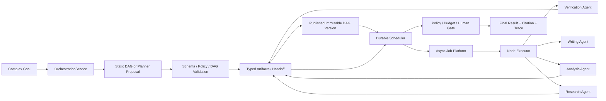
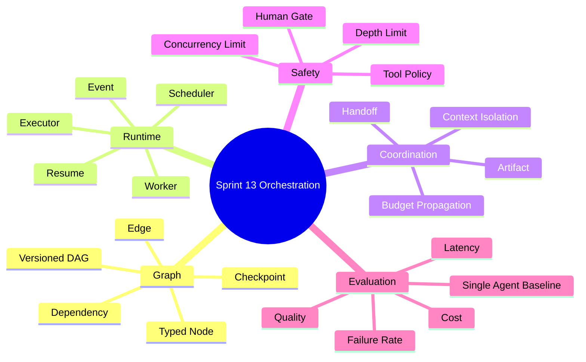
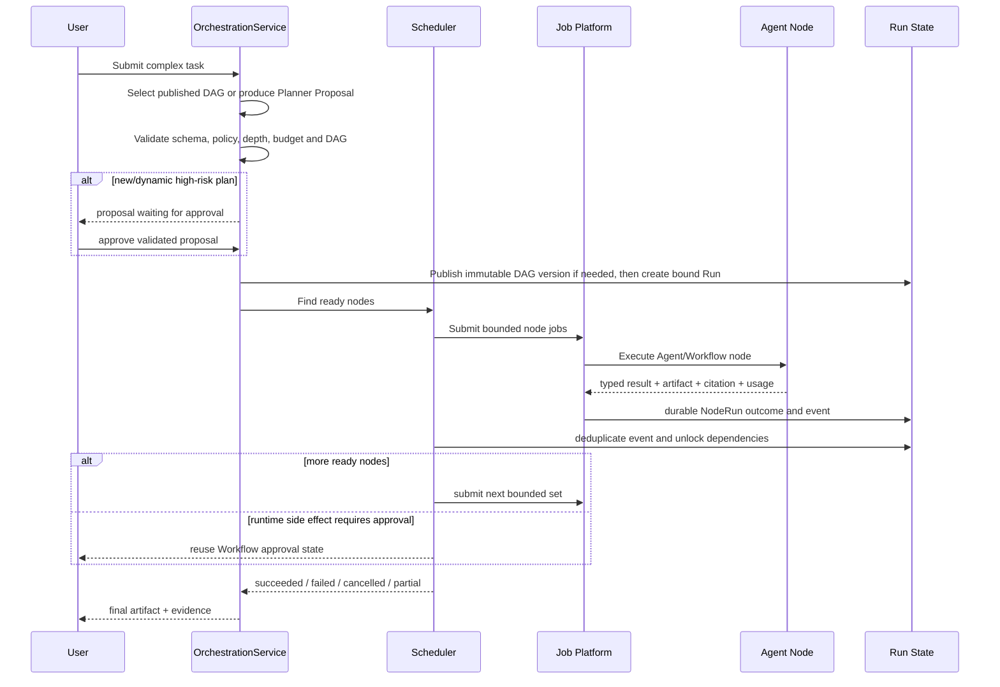

# Sprint 13: Agent Orchestration（多 Agent 编排）

## 状态

Sprint 13 为计划阶段。只有单 Agent 基线证明复杂任务确实需要角色分工和受控并行时才开始。

```text
Planned Sprint: Sprint 13 Agent Orchestration
Entry Condition: 单 Agent、Workflow、Async Platform、Workspace Policy 和 Evaluation 均稳定
North Star: 用持久状态、受控并行和类型化交接协调多个有限职责 Agent
```

## Sprint 定位

多 Agent 不是“多调用几次模型”。它增加了调度、状态、并发、交接、成本和故障组合：

```text
Sprint 6 Workflow: 固定业务步骤与人工节点
Sprint 7 Agent:    单个 Agent 的受控动态 Tool Loop
Sprint 10 Async:   Job/Worker 的可靠后台执行
Sprint 13:         将多个 Agent/Workflow Node 放入持久 DAG 并协调执行
```

第一原则是先建立单 Agent 基线。若多 Agent 没有可复现的质量、延迟或职责隔离收益，就保留
更简单的单 Agent 方案。

## Sprint North Star



## 知识思维导图



## 端到端编排流程



## Sprint 范围

### 本 Sprint 实现

- 单 Agent 对照基线和多 Agent 采用门槛。
- 不可变、类型化、发布前校验的 DAG Definition。
- 只拥有图级状态的 OrchestrationRun/NodeBinding/Checkpoint；每个 Node 引用已有
  WorkflowRun、AgentRun 或 Job/Attempt，不复制其内部状态机。
- 复用 Sprint 10 Domain Event/Outbox/Worker，扩展图级 Event 的顺序、去重语义和 Handler。
- Ready-node Scheduler、受限并行与 Sprint 10 Worker Executor；审批复用 Sprint 6 Workflow。
- Timeout、Retry、Cancel、Resume、Partial Failure 和补偿策略。
- Typed Handoff、Artifact 引用、Context 隔离和预算传递。
- Planner Proposal 验证、深度上限和 Human Approval。
- DAG Trace、Node 成本/延迟/质量与单 Agent 对照评测。
- Research -> Analyze -> Verify -> Write Capstone。

### 本 Sprint 明确不做

- 无限自治、Swarm、无限递归或模型动态修改运行图。
- 共享一份无限增长且可变的多 Agent Chat History。
- Agent 自己提升权限、预算、并发或 Tool Allowlist。
- 为多 Agent 另建一套 Queue、Identity、Tool 或 Observability 平台。
- 为“看起来先进”而替换效果更好的单 Agent/Workflow。
- 未经批准的高风险副作用和自主生产操作。

## Service-first 入口

```python
OrchestrationService.start_run(...)
OrchestrationService.get_run(...)
OrchestrationService.cancel_run(...)
OrchestrationService.resume_run(...)
OrchestrationService.approve_plan(...)
OrchestrationService.get_artifact(...)
```

请求只提交目标和业务输入。DAG Version、Agent Definition、Tool Policy、Workspace Principal、
Budget 和最大并行度由服务器形成不可变 Run Snapshot。

## Story 路线图

| Story | 核心问题 | 真实项目练习 | 完成标准 |
| --- | --- | --- | --- |
| 13.0 Use Case & Baseline | 为什么需要多个 Agent | 用单 Agent 完成研究报告，记录质量/成本/延迟 | 明确多 Agent 假设和成功阈值；不能只凭主观感受 |
| 13.1 Versioned DAG | 图怎样在执行前保证合法 | Typed Node/Edge、拓扑、环检测、不可变 Version | 非法图发布前失败；Run 固定引用版本 |
| 13.2 Durable Run State | 进程重启后怎样继续 | 建图级 Run/NodeBinding/Checkpoint，Binding 引用现有 WorkflowRun/AgentRun/Job | 图从持久状态恢复；Node 内部状态只由所属 Runtime 维护；已完成 Node 不重做 |
| 13.3 Event Contract | 事件重复、乱序怎么办 | 在 Sprint 10 Outbox 上增加 graph_run_id、sequence/dedup key 和幂等 Handler | 不另建消息真相；重复或延迟事件不破坏图状态 |
| 13.4 Scheduler & Executor | 哪些节点可以并行 | Ready-node 计算、依赖解析、受限并行，提交现有 Worker Job | Scheduler 不执行 Agent；同 Binding 不重复派发副作用；并发受策略约束 |
| 13.5 Failure Semantics | 一个分支失败是否全局失败 | 映射已有 Run/Job 的 Timeout/Retry/Cancel/Resume，增加图级 Partial/Compensation 规则 | Node 失败由所属 Runtime 处理，Orchestrator 只决定图级传播和终态 |
| 13.6 Agent Handoff | Agent 怎样交接而不污染 Context | Typed Task/Result、Artifact、Citation、Budget | 不共享可变对话；来源、责任和版本可追溯 |
| 13.7 Planner & Human Gate | 动态 Plan 能否直接执行 | 在静态 DAG 能力稳定后增加 LLM Proposal -> Schema/Policy/DAG 验证 -> Workflow 审批 -> 发布不可变 Version -> Create Run | Proposal 在运行前冻结；Planner 不能绕过 Tool、深度、成本和审批 |
| 13.8 Observability & Evaluation | 多 Agent 改善还是恶化 | DAG Trace、Node Usage、质量/成本/延迟对照 | 能定位慢/贵/差节点；同基线可重复比较 |
| 13.9 Capstone & Review | 全链路是否有真实收益 | Research -> Analyze -> Verify -> Write + 故障演练 | 达标才保留多 Agent，否则记录结论并回到简化方案 |

## 图与执行正确性原则

- Definition 发布后不可变，运行中禁止模型随意插入未验证 Node。
- Planner 只产生候选 Definition；校验和必要审批完成、发布不可变 Version 后，才能创建 Run。
- Scheduler 只计算 Ready Node，Executor 只执行一个明确 Node Contract。
- Event 传递事实，不直接携带大 Context；正文通过 Artifact ID 引用。
- Handoff 传递任务、证据、约束和输出 Schema，不传隐藏推理过程。
- 每个子 Agent 都继承更小而非更大的权限和预算。
- Parallelism 受总预算、Provider 限流、下游容量和依赖关系共同限制。
- Orchestrator 只拥有图级依赖和终态；WorkflowRun、AgentRun、Job/Attempt、审批、Outbox 和
  Worker 分别由 Sprint 6/7/10 的既有组件保持唯一业务真相。

## 测试与故障矩阵

| 层级 | 必须证明的行为 |
| --- | --- |
| Graph | 环、孤立 Node、非法 Edge、类型不匹配、Version 不可变 |
| Scheduler | Ready 计算、受限并行、重复事件、乱序、重启恢复 |
| Node | Agent/Workflow Contract、Deadline、Retry、Artifact 和 Citation |
| Failure | 单分支失败、部分成功、取消、补偿、Worker/Provider 中断 |
| Security | Planner 注入、权限/预算扩大、恶意 Handoff、跨 Workspace Artifact |
| Evaluation | 与单 Agent 同数据、同目标、质量/成本/延迟显著性比较 |

## ADR 与面试题候选

- ADR：Versioned Durable Agent DAG、Event Contract 与 Scheduler 边界。
- ADR：Typed Agent Handoff、Artifact Context 与 Budget Propagation。
- 面试题：Workflow DAG 和 Agent Orchestration 有什么区别。
- 面试题：多 Agent 为什么可能比单 Agent 更差。
- 面试题：事件重复和乱序下怎样保持状态机正确。

## 主要风险

| 风险 | 约束 |
| --- | --- |
| Token/成本随 Agent 数爆炸 | 全局/Node Budget、基线门槛、并发上限 |
| Context 污染和注入传播 | Typed Handoff、Artifact 隔离、不可信内容标记 |
| 重复 Tool 副作用 | Job/Node 幂等、原子 Claim、Workflow 审批 |
| 循环等待或图死锁 | DAG 校验、Depth/Timeout、stuck-run reconciler |
| 非确定性难以定位 | Durable Step、Event、Trace、版本化输入输出 |
| 技术复杂度无收益 | 单 Agent A/B 基线，不达标则删除/停用编排 |

## Sprint 验收标准

- 能证明多 Agent Capstone 相比单 Agent 基线的明确收益或诚实否定结论。
- 任一进程重启、重复 Event、节点失败或取消后，DAG 状态仍可解释和恢复。
- Planner、Agent 和 MCP Tool 都不能绕过 Workspace Policy、预算与审批。
- 每个 Handoff、Artifact、Citation、Usage、Definition Version 和终态可追溯。
- ADR、评测报告、故障演练、面试题、Review 和 Sprint Tag 完整。

## 前后衔接

```text
Sprint 6:  提供固定 Workflow 和状态机
Sprint 7:  提供受控单 Agent Runtime
Sprint 10: 提供 Job/Worker/Outbox 可靠执行
Sprint 12: 提供 Workspace Policy、资产、预算和审计
Sprint 13: 在上述能力之上协调多个有限职责 Agent
Sprint 14: 将编排变更纳入可信 AI 研发与发布流程
```
