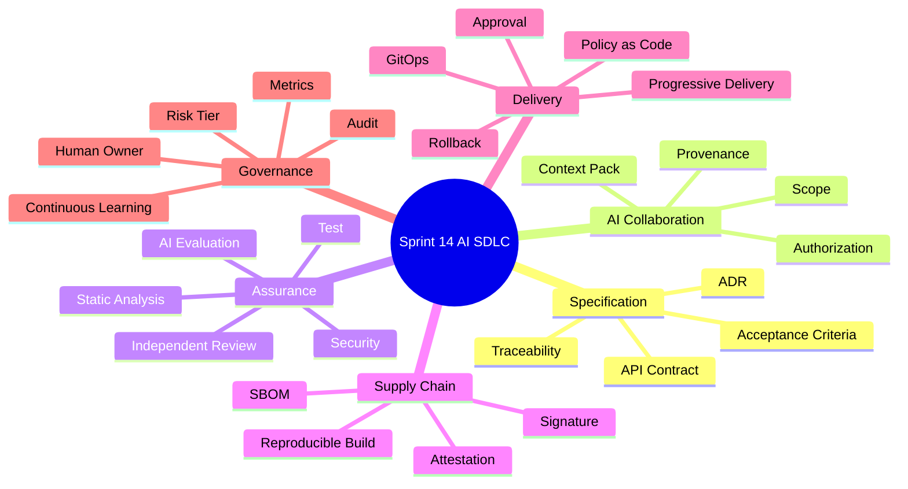
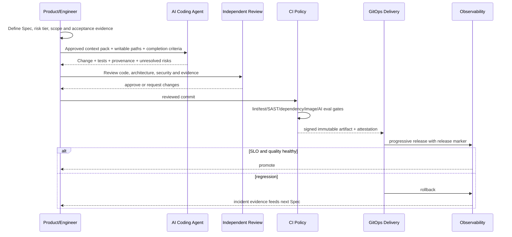

# Sprint 14: Enterprise AI SDLC（企业级 AI 研发交付体系）

## 状态

Sprint 14 为计划阶段，是当前长期路线的综合工程 Capstone。

```text
Planned Sprint: Sprint 14 Enterprise AI SDLC
Entry Condition: 产品、平台、运行和评测能力已具备证据，并从 Sprint 9 持续积累交付基线
North Star: 把 AI 作为不可信但高效的协作者，建立从 Spec 到生产与回滚的证据链
```

## Sprint 定位

本 Sprint 不再增加一个孤立业务功能，而是治理“需求怎样变成可信生产变更”：

```text
Spec -> Design/ADR -> Scoped AI Work -> Code -> Independent Review
     -> Test/Evaluation -> Policy Gate -> Signed Artifact
     -> GitOps Delivery -> Observe -> Rollback -> Learning
```

AI 可以生成方案、代码和测试，但不能同时成为需求批准者、实现者、唯一 Reviewer 和生产
发布者。最终责任始终属于明确的人类 Owner。

## Sprint North Star

```mermaid
flowchart LR
    R[Requirement] --> S[Executable Spec]
    S --> D[Design / ADR / Threat and Risk]
    D --> W[Scoped AI Worktree]
    W --> C[Code + Provenance]
    C --> V[Independent Review]
    V --> T[Test / Security / AI Eval]
    T --> G[Risk-based Policy Gate]
    G --> B[Signed Artifact + SBOM]
    B --> P[GitOps Promotion]
    P --> O[Production Signals]
    O --> RB[Rollback / Improvement]
    RB --> S
```



## 知识思维导图



## 端到端变更流程



## Sprint 范围

### 本 Sprint 实现

- 冻结并审计从 Sprint 9 持续积累的交付速度、缺陷、返工、回滚和 AI 使用 Baseline；
  对只能从 Git 回溯的数据记录偏差、观察窗口和最小样本量。
- 变更 Risk Tier 与不同强度的 Evidence/Gate。
- Executable Spec、ADR、API、验收标准和 Traceability ID 模板。
- AI Context Pack、允许修改范围、一次性授权和完成标准。
- 隔离 Worktree/Sandbox、最小权限、Secret 与 Network Policy。
- AI 变更 Provenance、人类 Owner 和审计记录。
- 独立 AI/人工 Review、Architecture Rule 和 Code Owner。
- 风险驱动测试、Mutation、对抗样本和 RAG/Agent Evaluation。
- CI Policy as Code、SAST、依赖/镜像扫描和分级门禁。
- 复用 Sprint 11 的 Artifact Signature/SBOM 验证，在其上增加源码 Provenance、Attestation、
  风险门禁、GitOps 提升和 Rollback 证据。
- 从 Spec 到生产的完整 Capstone 与错误注入。

### 本 Sprint 明确不做

- AI 自动批准、合并保护分支或直接部署生产。
- 让同一个 AI 生成代码后成为唯一 Reviewer。
- 以代码行数、提交数或 AI 调用数衡量工程生产力。
- 为追求“全自动”取消高风险变更的人类责任人。
- 一次性建设全公司合规平台或宣称获得法律认证。
- 将生产 Secret、客户数据或不必要的私有代码发送给外部模型。

## Service-first / Process-first 入口

本 Sprint 的顶层 Use Case 是“交付一项变更”，公共契约先于工具选择：

```text
ChangeService.propose(spec, risk_tier, owner)
AIWorkService.prepare_context(change_id, allowed_scope)
EvidenceService.collect(change_id)
ReviewService.record_decision(change_id, reviewer)
ReleaseService.promote(artifact_digest, environment)
ReleaseService.rollback(release_id, reason)
```

这些可以先以仓库模板、CI Metadata 和 Git 证据落地，不为了形式提前建设庞大审批微服务。

## Story 路线图

| Story | 核心问题 | 真实项目练习 | 完成标准 |
| --- | --- | --- | --- |
| 14.0 Baseline & Risk Tier | AI 研发到底改善了什么 | 冻结 Sprint 9 起的观察窗口、指标定义和样本，审计缺失/回溯偏差并定义风险等级 | 前后对照使用既有数据而非本 Sprint 临时采集；最小样本和门禁强度明确 |
| 14.1 Executable AI Spec | 模糊需求怎样变成可验证输入 | 建 Spec/ADR/API/Acceptance/Trace ID 模板 | 需求可追到代码、测试、评测和发布证据 |
| 14.2 AI Work Contract | AI 可以改什么、何时算完成 | Context Pack、Writable Scope、一次性授权、Done Definition | AI 不因历史授权扩大范围；未决问题显式交回 |
| 14.3 Secure Sandbox | 仓库文本能否诱导 Agent 越权 | 隔离 Worktree、Secret、Network、Dependency 和 Tool Policy | 恶意 Prompt 文件不能取得生产凭据或扩大写入 |
| 14.4 Coding & Provenance | 谁对 AI 代码负责 | 记录变更来源、模型/Prompt/上下文版本和 Human Owner | 每项 AI 辅助变更可审计且有人承担责任 |
| 14.5 Independent Review | AI 能否自己证明自己正确 | 独立 Review、静态分析、架构规则和 Code Owner | 实现者不能独自批准；关键边界有人工判断 |
| 14.6 Test & Eval Engineering | 测试是否真的能抓住缺陷 | 风险测试、Mutation、对抗样本、RAG/Agent Eval | 能发现注入的真实缺陷，不只复述实现逻辑 |
| 14.7 CI Policy as Code | 怎样自动执行但不过度拖慢 | Lint/Test/SAST/Dependency/Image/Eval 分级 Gate | 低风险快速；高风险无法绕过必要证据和审批 |
| 14.8 Trusted Delivery | 怎样证明部署的是被审过的内容 | Signature、SBOM、Attestation、GitOps、Progressive Release | 可回答构建了什么、谁批准、部署到哪、如何回滚 |
| 14.9 Governance Capstone | 整套体系能否挡住错误 | 从 Spec 到生产，注入缺陷并触发拦截/回滚 | 证据链完整；AI 无生产权限；复盘形成流程改进 |

## 风险分级候选

| 级别 | 示例 | 最小证据 |
| --- | --- | --- |
| Low | 文档、无行为格式修复 | Lint、范围检查、普通 Review |
| Medium | 普通业务逻辑、API 非破坏变更 | Unit/API Test、独立 Review、回归 |
| High | Auth、权限、Migration、计费、异步一致性 | ADR、Security Review、Integration/Failure Test、人工批准 |
| Critical | Secret、生产数据、发布策略、跨租户边界 | 双人审批、演练、渐进发布、明确 Rollback 和审计 |

风险由潜在影响、可恢复性、数据敏感度和 Blast Radius 决定，不由“代码改了几行”决定。

## 测试与交付证据矩阵

| 证据 | 必须回答的问题 |
| --- | --- |
| Spec/ADR | 为什么改、边界是什么、未采用什么 |
| Diff/Provenance | 谁或哪个 AI 在什么范围产生了什么变更 |
| Review | 是否由独立主体检查行为、架构、安全和维护性 |
| Test/Eval | 哪些风险被证明，哪些仍未覆盖 |
| Build/SBOM/Signature | Artifact 是否来自受控源码和依赖 |
| Release Attestation | 谁批准、部署何处、使用哪个 Digest/Config |
| Runtime Evidence | SLO、质量、成本和错误是否健康 |
| Rollback/Incident | 失败时是否恢复，学到了什么 |

## ADR 与面试题候选

- ADR：风险分级 AI 研发流程与人类责任边界。
- ADR：AI Change Provenance、独立 Review 和 Evidence Contract。
- ADR：Signed Artifact、Attestation 与 GitOps Promotion。
- 面试题：怎样安全使用 AI Coding Agent，而不是只提高代码生成速度。
- 面试题：为什么 AI 不能审核并批准自己的代码。
- 面试题：如何衡量 AI 对研发效能和质量的真实影响。

## 主要风险

| 风险 | 约束 |
| --- | --- |
| 自动化偏见和 AI 自审 | Independent Reviewer + Code Owner + Risk Tier |
| Secret/代码/客户数据外泄 | Context 最小化、Sandbox、Network/Secret Policy |
| 仓库 Prompt Injection | 指令与数据分离、Tool Allowlist、Scope Enforcement |
| Flaky Eval 被忽略 | 确定性检查优先、稳定数据集、隔离非阻断实验指标 |
| 指标被游戏化 | 组合 Lead Time/Defect/Recovery/Quality，不看行数 |
| Pipeline 太慢被绕开 | 风险分级、并行执行、缓存和明确例外审计 |
| 签名了错误 Artifact | 源码到 Artifact Provenance、独立 Gate、Digest Promotion |

## Sprint 验收标准

- 一项真实高风险功能从 Spec 到 k3s 生产式环境形成完整、可查询证据链。
- AI 只能在明确 Scope 和权限中工作，不能合并保护分支或访问生产 Secret。
- 独立 Review、风险测试、Security Gate 和 AI Evaluation 能拦住故意注入的缺陷。
- 发布使用签名 Digest、SBOM、Attestation，并完成渐进发布或真实 Rollback。
- 对比 Sprint 9 起持续采集的 Baseline 给出 AI 研发收益、成本、缺陷和改进结论；明确样本量、
  回溯偏差和无法归因的因素，而非使用宣传性指标。
- ADR、模板、CI、Runbook、审计、复盘、面试题和最终 Sprint Tag 完整。

## 长期能力闭环

```text
Product and Architecture Judgment
  -> Reliable AI Application Engineering
  -> Observable and Recoverable Platform
  -> Multi-tenant Governance
  -> Controlled Agent Orchestration
  -> Trusted AI-assisted Software Delivery
```

Sprint 14 结束不代表学习结束，而是项目从“能实现功能”进入“能以证据持续、安全地交付和
运营企业 AI 系统”的阶段。
