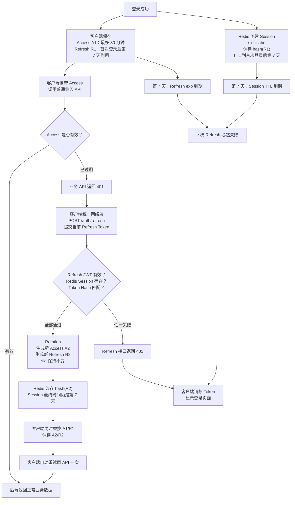

# Sprint 2: Session & Identity Management（会话与身份管理）

## 状态

已完成（2026-07-31）。

```text
Current Story: Sprint 2 Complete
Current Goal: Preserve Session and Identity Management decisions
Current Step: Ready for Sprint 3 Storage
```

## Sprint 目标

Sprint 2 的目标不是单独学习 Redis，也不是只实现 Refresh Token，而是构建企业级 Session（会话）管理体系，为未来 AI Platform 打下认证基础。

1. 能解释 Cookie、Session、JWT、Refresh Token、Redis Session、OAuth2/OIDC 各自解决什么问题。
2. 能设计 Access/Refresh Token 的签发、轮换、撤销、过期和重放防护。
3. 能正确使用 Redis 的 TTL、原子操作和数据结构支撑认证，而不把 Redis 只当缓存。
4. 能设计多设备会话、浏览器安全、Secret 轮换及 Redis 故障策略。
5. 能用 Fake/Stub 和真实 Redis 分层测试，并建立安全事件日志。

## 学习推进方式

Sprint 2 内容较多，按学习依赖逐步推进，不要求一次理解全部内容。

每次只学习当前 Story 中的一个小步骤：

```text
理解概念
  -> 完成小练习
  -> 开发者实现关键代码
  -> AI Review
  -> 测试验证
  -> 记录总结
```

如果当前概念没有理解，暂停编码和后续 Story，先通过项目中的真实场景继续讲解和练习。

全项目协作约定统一记录在 `docs/AI协作规范.md`，当前 Sprint 不维护单独副本。

建议学习顺序：

```text
Story 2.0 Authentication Evolution
  -> Story 2.1 Redis Foundation
  -> Authentication Security 基础概念预习
  -> Story 2.2 Session Architecture Design
  -> Story 2.3 Refresh Token Rotation
  -> Story 2.4 Logout
  -> Story 2.5 Client Refresh Contract
  -> Story 2.6 Authentication Security Review
  -> Story 2.7 Testing
  -> Story 2.8 Observability
  -> Story 2.9 User Session Design
  -> Sprint Review
```

Security 基础概念在架构设计前预习，是为了让 Replay Attack、Token Hash 和过期策略进入设计；完整安全验收仍在 Story 2.6 完成。

### 当前认证功能地图

```text
注册
  [完成] 校验输入 -> 密码 Hash -> MySQL 创建 User -> 返回 User

登录
  [完成] Redis 原子占用尝试额度 -> MySQL 查询 User -> bcrypt 验证
  [完成] Access Token 签发
  [完成] Session ID、Refresh JWT、Token Hash 和过期策略基础
  [完成] 创建 Redis Session -> 同时返回 Access/Refresh Token

Access 认证
  [完成] Bearer Access Token -> JWT 验证 -> 加载当前 User

Refresh
  [完成] Refresh JWT Claims 的签发、解码和基础校验
  [完成] 固化 Refresh 契约与 ADR-0017
  [完成] Redis Session/Hash 校验 -> 原子 Rotation -> Replay 撤销
  [完成] Refresh Service/API -> 返回新 Token

Logout
  [完成] Lua 原子校验用户与当前 Token Hash -> DEL Session Hash + ZREM 用户索引
  [完成] Logout Service/API -> 客户端删除本地 Token

认证安全
  [完成] 固定/Sliding 过期边界与绝对上限
  [完成] JWT kid、Active Key、Key Ring 和正常/紧急 Secret Rotation
  [完成] 真实 Redis 并发准入与旧 Token Logout 竞态测试

多设备 Session
  [完成基础] 独立 Session ID、Hash、Sorted Set、TTL 和失效索引清理
  [完成] 当前设备、IP、User Agent 和 Session 管理接口

Sprint 收尾
  [完成] 认证测试矩阵与真实 Redis 纵向集成测试
  [完成] 认证事件日志、敏感数据边界和日志洪泛边界
  [完成] 用户 Session 设计与实现
  [完成] 注册、登录、Refresh、Logout 和 Session 管理总流程图
  [完成] Sprint Review
```

当前学习位置：Sprint 2 已完成并通过最终 Review。下一阶段进入 Sprint 3 Storage，开始前应先盘点 Sprint 3 的学习目标、知识点、练习和完成标准。

### 固定过期模式认证流程图（学习版）

下图展示端到端目标行为，帮助定位后续每个代码步骤。登录 Token Pair、Access 最终过期上限和 Refresh Service/API 已经实现；客户端统一重试契约已由 Story 2.5 固化，具体实现属于客户端工程。



固定过期模式的时间关系：

```text
Session expires_at = 首次登录时间 + 7 天
Redis Session TTL  = expires_at - 当前时间
Refresh Token exp  = Session expires_at
Access Token exp   = min(当前时间 + 30 分钟, Session expires_at)
```

成功 Refresh 会同时返回新的 Access Token 和 Refresh Token。Refresh Rotation 是为了让旧 Refresh Token 立即失效，不会把固定 7 天重新计算为“从本次 Refresh 再加 7 天”。Refresh 或 Redis Session 任一失效时，客户端不能继续刷新，必须清除登录状态并重新登录。

### 当前学习检查点

- Story 2.0 Authentication Evolution：已完成（2026-07-24）。
- 已完成（2026-07-24）：区分 Cookie、认证 Session、SQLAlchemy Session 和 JWT。
- 已完成（2026-07-24）：理解多设备 Session 需要使用独立 Session ID，不能只用 User ID 作为唯一 Key。
- 已完成（2026-07-24）：理解 JWT 验证和 Redis Session 验证的职责不同，Session 不存在时认证失败。
- 已完成（2026-07-24）：理解有状态与无状态认证，以及无状态 Access Token 不能被单独立即撤销。
- 已完成（2026-07-24）：理解 Access Token、Refresh Token 和 Redis Session 的不同职责。
- 已完成（2026-07-24）：理解无服务端 Session 的 Refresh Token 在 Logout、撤销、Rotation 和多设备管理上的限制。
- 已完成（2026-07-24）：理解 OAuth2 解决授权问题，OIDC 在 OAuth2 之上解决身份认证问题，当前项目暂不需要立即引入。
- 已完成（2026-07-24）：理解 Authorization Code、Token Exchange、第三方身份到本地用户的映射，以及本地 Session 创建流程。
- 已完成（2026-07-24）：完成 `docs/architecture/authentication-evolution.md` 初稿。
- 已完成（2026-07-24）：文档 Review 通过，确认当前项目选择 JWT + Redis Session 的原因和边界。
- Story 2.1 Redis Foundation：已完成（2026-07-27）。
- 已完成（2026-07-24）：理解进程内存、Redis 和 MySQL 的生命周期、共享范围和适用场景。
- 已完成（2026-07-24）：使用固定版本镜像、密码认证、健康检查、AOF 和 Named Volume 启动 Redis。
- 已完成（2026-07-24）：通过真实 Redis 验证 TTL 自动过期，并验证 AOF 数据可在容器重建后恢复。
- 已完成（2026-07-24）：通过 `INCR` 实验理解单命令原子性，并识别 `INCR` 与 `EXPIRE` 之间的失败窗口。
- 已完成（2026-07-24）：使用 Pydantic Settings 校验 Redis Host、Port、DB、Password 和操作超时，测试不依赖本机 `.env`。
- 已完成（2026-07-24）：安装固定版本 Python Redis 客户端，通过集中工厂配置密码和超时，并使用真实 Redis 验证 PING、SET、GET 和 TTL。
- 已完成（2026-07-24）：MySQL 和 Redis 正常时 Readiness 返回 200；Redis 不可用时返回 503，Liveness 始终返回 200 且不访问外部依赖。
- 已完成（2026-07-27）：通过项目代码实现固定窗口登录限流，使用 Redis String、TTL 和事务化的 `INCR + EXPIRE NX`。
- 已完成（2026-07-27）：登录失败计数达到上限后返回 HTTP 429，成功登录清除计数，Redis 不可用时失败关闭并返回 HTTP 503。
- 已完成（2026-07-27）：使用 Settings 配置限流次数和窗口，生产依赖使用真实 Redis，API 与 Service 测试使用 Mock。
- 已完成（2026-07-27）：登录标识规范化并使用 SHA-256 构造 Redis Key，同时记录确定性摘要不能替代加密或 HMAC 的边界。
- 已完成（2026-07-27）：创建 ADR-0015，记录认证系统选择 Redis 的原因、故障策略和未采用方案。
- 已记录技术债（2026-07-27）：当前仅按邮箱限流，后续安全 Review 设计账号与可信客户端 IP 双维度策略，并评估并发请求的严格准入控制。
- 已完成（2026-07-27）：Story 2.1 Review 通过，完整测试 79 项通过，Ruff、Compose 展开、真实 Redis 和 Documentation Review 均无阻断问题。
- Story 2.2 Session Architecture Design：已完成（2026-07-28）。
- 已完成（2026-07-28）：使用 Redis Hash 表达单个 Session，使用 Sorted Set 表达按最后活动时间排序的用户 Session 索引。
- 已完成（2026-07-28）：实现 Session Repository 的创建、获取、删除和用户 Session 列表，并使用事务 Pipeline 保持 Hash、TTL 和索引一致。
- 已完成（2026-07-28）：使用 Mock 覆盖 Session 存在、不存在、显式撤销、批量读取、空索引和过期索引懒清理，共 6 项测试通过。
- 已完成（2026-07-28）：使用真实 Redis 验证 Hash、TTL、Sorted Set 排序，以及 Hash 自然过期后由列表读取清理残留成员。
- 已完成（2026-07-28）：创建 `session-architecture.md` 和 ADR-0016，记录 Session Key、字段、生命周期、多设备和过期清理决策。
- 已完成（2026-07-28）：确定 Refresh Token Claims、JSON 传输、固定/Sliding 过期边界、客户端单航班 Refresh 和失败语义。
- 已完成（2026-07-28）：创建 `refresh-token-design.md` 和 ADR-0017，并在 API 规范记录“尚未启用”的 Sprint 2 目标契约。
- 已完成（2026-07-28）：Story 2.2 Documentation Review 通过；完整后端测试 108 项、Ruff 和格式检查全部通过。
- Story 2.3 Refresh Token Rotation：开始实现（2026-07-29）。
- 已完成（2026-07-29）：定义 Rotation 输入/结果契约，使用 Redis Lua 原子比较并替换 Refresh Token Hash。
- 已完成（2026-07-29）：Mock 覆盖成功、Session 不存在、Token Hash 不匹配和未知脚本返回码，共 10 项 Session Repository 测试通过。
- 已完成（2026-07-29）：使用真实 Redis 验证 Rotation 更新 Hash、TTL、最近使用排序，以及旧 Token 再次使用返回不匹配。
- 已决定（2026-07-29）：旧 Refresh Token 重用时原子撤销当前设备 Session，其他设备 Session 不受影响，并创建 ADR-0018。
- 已完成（2026-07-29）：Lua 在 Hash 不匹配时原子删除 Session Hash 和用户 Session 索引成员。
- 已完成（2026-07-29）：真实 Redis Integration Test 覆盖成功 Rotation、Replay 撤销和双线程并发；并发测试连续运行 20 轮通过。
- 已完成（2026-07-29）：完整普通测试 112 项通过、3 项 Integration Test 默认跳过，Ruff 和格式检查通过。
- 已完成（2026-07-29）：Login 创建初始 Redis Session 并返回 Token Pair；API 覆盖 Token Pair 契约以及限流检查、Session 创建失败时的 HTTP 503。
- 已完成（2026-07-29）：Login Token Pair 接入后完整普通测试 115 项通过、3 项 Integration Test 默认跳过，Ruff、import 顺序和格式检查通过。
- 已完成（2026-07-29）：Refresh Service 编排 JWT、用户状态、固定过期时间和 Redis 原子 Rotation，成功时返回新的 Token Pair。
- 已完成（2026-07-29）：`POST /auth/refresh` 接入 Router；无效 Token 或 Session 返回 401、停用账号返回 403、Redis 故障返回 503。
- 已完成（2026-07-29）：完整普通测试 123 项通过、3 项 Integration Test 默认跳过，Ruff、import 顺序和格式检查通过。
- 已完成（2026-07-29）：真实 Redis Integration Test 3 项通过；Story 2.3 代码、接口、测试、ADR 和文档 Review 通过。
- Story 2.3 Refresh Token Rotation：已完成（2026-07-29）。
- 已完成（2026-07-29）：当前设备 Logout 校验 Refresh JWT、Session 用户与当前 Token Hash，成功时删除 Session Hash 和用户索引。
- 已完成（2026-07-29）：`POST /auth/logout` 成功或 Session 已不存在时返回 204；无效或旧 Token 返回 401，Redis 故障返回 503。
- 已完成（2026-07-29）：完整普通测试 134 项、真实 Redis Integration Test 4 项通过，Story 2.4 Review 通过。
- Story 2.4 Logout：已完成（2026-07-29）。
- 已完成（2026-07-29）：固定客户端 Refresh 触发条件、单航班协调、Token Pair 原子替换、一次重试上限和失败终态。
- 已完成（2026-07-29）：明确当前 iOS JSON Body/Keychain 契约，以及未来浏览器 Cookie、CSRF、CORS 和 Origin 安全基线。
- 已完成（2026-07-29）：创建 `client-refresh-contract.md` 和 ADR-0019；客户端具体异步任务实现留在对应客户端工程。
- 已完成（2026-07-29）：完整普通测试 134 项通过、4 项 Integration Test 默认跳过，Ruff、格式和 Documentation Review 通过。
- Story 2.5 Client Refresh Contract：已完成（2026-07-29）。
- 已完成（2026-07-30）：Logout 改为 Redis Lua 原子校验当前用户和 Refresh Token Hash 后删除，旧 Token 不再可能因检查与删除之间的竞态撤销新 Session 状态。
- 已完成（2026-07-30）：Access 与 Refresh JWT 增加 `kid`，使用 Active Key 签发并按 Key Ring 验证；正常轮换兼容旧 Token，紧急移除密钥可强制重新登录。
- 已完成（2026-07-30）：固定过期继续作为默认策略；Sliding Rotation 可以延长当前期限，但 Refresh Token `exp`、Redis TTL 和响应秒数保持一致，并受 `absolute_expires_at` 限制。
- 已完成（2026-07-30）：登录限流改为密码验证前原子占用尝试额度，关闭 `GET` 检查与失败计数之间的并发窗口。
- 已完成（2026-07-30）：真实 Redis 验证 20 个并发登录请求在上限为 5 时只有 5 个准入，并连续运行 20 轮通过。
- 已完成（2026-07-30）：创建 ADR-0020，并同步 ADR-0012、ADR-0015、ADR-0017、API、Session、Refresh、README 和项目状态文档。
- 已决定（2026-07-30）：当前仍按规范化邮箱限流；客户端 IP 维度必须先定义可信反向代理边界，不能直接信任可伪造的 `X-Forwarded-For`。
- 已完成（2026-07-30）：完整普通测试 146 项、真实 Redis Integration Test 6 项通过，Ruff、格式和 Documentation Review 无阻断问题。
- Story 2.6 Authentication Security：已完成（2026-07-30）。
- Story 2.7 Testing 开始；第一步审计认证测试矩阵和端到端覆盖缺口。
- 已完成（2026-07-30）：盘点 152 项测试，其中默认测试 146 项、真实 Redis Integration Test 6 项。
- 已识别（2026-07-30）：API 测试使用 SQLite 和 Redis Mock，真实 Redis 测试只覆盖 Repository；当前缺少 HTTP、Router、Service 与真实 Redis 串联的纵向集成测试。
- 已决定（2026-07-30）：Story 2.7 只补完整 Login/Refresh/Logout 生命周期和 Replay 撤销两条纵向测试，不重复已有单元与 API 分支测试。
- 已完成（2026-07-30）：新增真实 Redis 认证 Fixture，仅覆盖数据库依赖为 SQLite，RateLimiter 和 SessionRepository 使用真实 Redis 实现。
- 已完成（2026-07-30）：纵向验证 Register、Login、Current User、Refresh、Logout 和 Logout 后 Refresh 返回 401；同时固定 Logout 后未过期 Access Token 仍可使用的当前契约。
- 已完成（2026-07-30）：纵向验证 R1 Rotation 得到 R2 后重用 R1 会撤销当前 Session，R2 随后也无法继续 Refresh。
- 已完成（2026-07-30）：两条纵向测试连续运行 10 轮通过；完整普通测试 146 项、真实 Redis Integration Test 8 项通过，Ruff 和格式检查通过。
- Story 2.7 Testing：已完成（2026-07-30）。
- 已完成（2026-07-30）：为 Register、Login、Refresh、Replay、Logout 和 Redis 故障增加固定认证事件日志，并按业务语义划分 INFO、WARNING 和 ERROR。
- 已完成（2026-07-30）：使用 `caplog` 验证邮箱、昵称、密码、原始 Token、Token Hash 和完整 Session ID 不进入日志；普通无效 Access Token 不产生 WARNING/ERROR。
- 已完成（2026-07-30）：扩充 ADR-0005，明确 Service、全局异常 Handler、标准流和未来集中式日志平台的职责边界。
- 已完成（2026-07-30）：完整普通测试 150 项、真实 Redis Integration Test 8 项通过，Ruff、格式和 Documentation Review 无阻断问题。
- Story 2.8 Observability：已完成（2026-07-30）。
- Story 2.9 User Session Design & Implementation：已完成（2026-07-31）。
- 已决定（2026-07-31）：Session 管理接口使用 Access Token `sub` 查询用户 Session，并使用新增 `sid` 标记和二次验证当前 Session；当前 Session 已失效时返回 401。
- 已决定（2026-07-31）：IP 由可信服务端请求边界提取，User Agent 仅作展示；相同 User Agent 不代表同一设备，每次登录仍创建独立 Session。
- 已决定（2026-07-31）：普通 Access API 不更新 `last_used_at`；目标 Session 不存在或不属于当前用户时统一返回 404，基础策略不引入主设备与 MFA。
- 已决定（2026-07-31）：提供单个 Session 撤销和全部设备登出；全部撤销使用 Lua 原子完成，当前客户端立即清 Token，其他设备的 Refresh 立即失效而普通 Access 最迟自然有效到 `exp`。
- 已决定（2026-07-31）：Access 解码返回结构化 Claims；新 Token 必须带 `sid`，旧 Token 缺少 `sid` 时普通 API 继续可用，但敏感 Session 管理接口返回 401。
- 范围调整（2026-07-31）：Story 2.9 从仅设计调整为直接实现；按 Token Claims、Session 元数据、原子 Repository、Service/API 和完整验收顺序推进。
- 已完成（2026-07-31）：实现 `GET /users/sessions`、`DELETE /users/sessions/{session_id}` 和 `DELETE /users/sessions`，支持当前设备标记、单设备撤销和全部设备登出。
- 已完成（2026-07-31）：普通测试 185 项、真实 Redis Integration Test 10 项、Ruff、格式和 `git diff --check` 全部通过。
- 已完成（2026-07-31）：创建 `docs/architecture/authentication-flow.md`，用总流程图和分步时序图汇总注册、登录、Access、Refresh、Logout 和多设备 Session 管理。
- Sprint 2 Review：97/100，通过（2026-07-31）；功能、架构、测试、文档、ADR 和日志验收无阻断问题。

## North Star

构建企业级 Session & Identity Management，而不是单纯增加 Redis。

完成后应具备：

- 企业级认证体系认知。
- Refresh Token 生命周期管理能力。
- 正确使用 Redis 支撑认证系统的能力。
- 多设备登录扩展能力。
- 安全设计意识。
- 自动化测试基础。
- 可观测性基础。

## 能力演进

```text
Authentication（认证）
        ↓
Authorization（授权）
        ↓
Session（会话）
        ↓
Token Lifecycle（Token 生命周期）
        ↓
Security（安全）
        ↓
Scalability（可扩展）
```

## Story 2.0: Authentication Evolution

**状态：已完成（2026-07-24）**

### 学习目标

理解认证体系的发展过程：

```text
Cookie Session
      ↓
JWT
      ↓
JWT + Refresh Token
      ↓
JWT + Redis Session
      ↓
OIDC / OAuth2
```

### 输出

- `docs/architecture/authentication-evolution.md`

### 完成结果

- 理解 Cookie、认证 Session、SQLAlchemy Session 和 JWT 的职责边界。
- 理解 Access Token、Refresh Token 和 Redis Session 的生命周期及撤销边界。
- 理解有状态与无状态认证、多设备 Session 和 Refresh Token Rotation 的演进原因。
- 区分 OAuth2 授权与 OIDC 身份认证，理解 Authorization Code 和本地用户映射流程。
- 完成并 Review `docs/architecture/authentication-evolution.md`。
- Documentation Review：通过，无阻断问题，综合评分 96/100。

## Story 2.1: Redis Foundation

**状态：已完成（2026-07-27）**

### 技术实现

- Docker Compose 增加固定版本的 Redis。
- 使用 Pydantic Settings 管理 Redis 配置。
- Readiness 检查 Redis。
- 配置 Redis 操作超时。
- 管理 TTL。
- 设计登录限流。

### 学习重点

理解 Redis 不只是缓存，还可以承担以下职责：

- Memory Store。
- TTL。
- Atomic Operation。
- Distributed Cache。
- Distributed Lock。
- Queue。

学习以下数据结构：

- String。
- Hash。
- Set。
- Sorted Set。

### 输出

- ADR-0015：为什么认证系统选择 Redis。

### 完成结果

- 完成固定版本 Redis、密码认证、AOF、Named Volume、健康检查和本机端口约束。
- 完成 Pydantic Settings、集中 Redis 客户端、超时配置和零自动重试策略。
- Readiness 同时检查 MySQL 和 Redis，Liveness 不访问外部依赖。
- 使用 String、TTL 和事务化的 `INCR + EXPIRE NX` 实现固定窗口登录限流。
- 登录失败达到上限后返回 HTTP 429，Redis 不可用时失败关闭并返回 HTTP 503。
- 使用 Mock 完成单元/API 测试，并使用真实 Redis 验证 TTL、事务、哈希 Key 和故障行为。
- 完成 ADR-0015 和 API、README、Sprint、Constitution 文档同步。
- Story Review：通过，无阻断问题；账号/IP 双维度限流和严格并发准入记录为后续安全技术债。

## Story 2.2: Session Architecture Design

**状态：已完成（2026-07-28）**

先设计，再编码。

### 时序设计

- 登录时序图。
- Refresh 时序图。
- Logout 时序图。

### 设计内容

- Redis Key。
- Session 生命周期。
- Token Rotation。
- 多设备登录。
- Secret Rotation。

### 输出

- Architecture Diagram。
- Sequence Diagram。
- ADR-0016：Session Architecture。
- ADR-0017：Refresh Token Design。

### 当前结果

- 已完成 Session Hash、用户 Sorted Set、多设备索引和过期懒清理设计。
- 已完成 Login、Refresh 和 Logout 设计时序图。
- 已完成 `docs/architecture/session-architecture.md` 和 ADR-0016。
- 已完成 Refresh Token 传输、Claims、过期规则、客户端职责和 Secret Rotation 边界。
- 已完成 `docs/architecture/refresh-token-design.md` 和 ADR-0017。
- Documentation Review：通过；Session 字段、Token Claims、过期规则、客户端职责和失败边界与当前代码基线一致。
- 验证结果：完整后端测试 108 项通过，Ruff 和格式检查通过。

## Story 2.3: Refresh Token Rotation

**状态：已完成（2026-07-29）**

### 接口

```http
POST /auth/refresh
```

### 要求

- Access Token 有效期为 30 分钟。
- Refresh Token 有效期为 7 天。
- JWT 包含 `jti`。
- JWT 包含 `type=refresh`。
- Redis 保存 Session 或 Token 标识。
- Rotation 后旧 Token 立即失效。

### 测试范围

- Token 过期。
- Token 类型错误。
- Session 不存在。
- Replay Attack。

### 输出

- ADR-0018：Token Rotation。

### 完成结果

- 登录创建初始 Redis Session 并返回 Token Pair。
- Refresh Service 校验 JWT、Session、用户状态与固定过期边界，并调用 Redis Lua 原子 Rotation。
- `POST /auth/refresh` 返回新 Token Pair；无效或重放返回 401，停用账号返回 403，Redis 故障返回 503。
- Mock/API 测试覆盖成功、Session 缺失、Rotation 失败和错误映射；真实 Redis 覆盖成功、Replay 撤销与并发竞争。
- 完整普通测试 123 项、真实 Redis Integration Test 3 项通过，Ruff、import 顺序、格式和文档检查通过。

## Story 2.4: Logout

**状态：已完成（2026-07-29）**

### 接口

```http
POST /auth/logout
```

### 实现范围

- 当前设备登出。
- 通过 Refresh Token 的 `sub` 和 `sid` 识别当前设备 Session。
- 删除前校验 Session 用户和当前 Refresh Token Hash。
- 删除当前 Refresh Session。
- Session 已不存在时返回 204，保持重复 Logout 幂等。
- 无效或旧 Refresh Token 返回 401，Redis 故障返回 503。
- Access Token 自然过期。

### 预留范围

- Logout All Devices。

### 完成结果

- `LogoutRequest` 与 `RefreshRequest` 共享 Refresh Token 长度校验，并保持独立 OpenAPI Schema。
- Logout Service 不查询 MySQL；Session 缺失时幂等成功，用户或 Hash 不匹配时拒绝删除。
- `POST /auth/logout` 返回 HTTP 204 空响应；无效 Token 返回 401，Redis 故障返回 503。
- Mock、Service 与 API 测试覆盖成功、重复 Logout、不匹配和故障；真实 Redis 验证 Hash 与 Sorted Set 成员同时删除。
- 完整普通测试 134 项、真实 Redis Integration Test 4 项通过，Ruff、import 顺序、格式和文档检查通过。

## Story 2.5: Client Refresh Contract

**状态：已完成（2026-07-29）**

### 客户端约定

客户端统一网络层负责刷新 Token，后端普通业务 API 不在内部自动刷新：

```text
API
 ↓
401
 ↓
Refresh
 ↓
Retry
```

### 要求

- 同一客户端只允许一个共享 Refresh 请求，其他并发失败请求等待同一结果。
- 成功后原子替换 Token Pair，并让每个原请求最多重试一次。
- Refresh 自身、403 和已经重试过的请求不得触发 Refresh。
- Refresh 401/403 清除 Token；503 或网络错误不能误判为登出。
- 当前 iOS 使用 JSON Body 和 Keychain，不在后端仓库实现客户端异步任务。
- 浏览器 Cookie、CSRF、CORS 和 Origin 安全基线已经定义，但当前接口尚未启用 Cookie 模式。

### 完成结果

- 创建 `docs/architecture/client-refresh-contract.md`，固定客户端状态机和失败终态。
- 创建 ADR-0019，记录客户端/后端职责边界和未直接启用浏览器 Cookie 的原因。
- API 规范明确 Refresh 触发范围、一次重试上限及 401/403/503 的不同处理。
- 本 Story 为契约与架构文档交付，不修改后端或创建临时客户端代码。
- 完整普通测试 134 项通过、4 项 Integration Test 默认跳过，Ruff、格式和文档检查通过。
- Documentation Review：96/100，无阻断问题；客户端状态机与未来浏览器 Cookie 仍需在对应客户端/浏览器功能启用时补充自动化测试。

## Story 2.6: Authentication Security

**状态：已完成（2026-07-30）**

### 学习内容

- Replay Attack。
- Sliding Session。
- Absolute Expiration。
- Token Rotation。
- Refresh Token Hash。
- Secret Rotation。

### 需要理解

- 为什么 Redis 不保存原始 Refresh Token。

### 完成结果

- Replay 继续按 ADR-0018 原子撤销当前设备 Session，其他设备不受影响。
- Logout 使用 Lua 原子比较当前 Refresh Token Hash，消除检查后删除的竞态窗口。
- 固定过期保持默认；Sliding 模式受 30 天绝对上限约束，不形成无限登录。
- Access 与 Refresh Token 使用 `kid`、Active Key 和 Key Ring 支持 Secret Rotation。
- 登录尝试在密码验证前使用事务 Pipeline 原子准入，并通过真实 Redis 并发测试。
- 邮箱/IP 双维度限流保留为部署安全技术债，启用前必须先定义可信代理链。
- 创建 ADR-0020，并完成代码、API、架构和 Sprint 文档同步。
- Story Review：97/100，无阻断问题。

## Story 2.7: Testing

**状态：已完成（2026-07-30）**

### 测试体系

- pytest。
- JWT Test。
- 使用 Fake 或 Stub 完成 Redis 边界的单元测试。
- 使用真实 Redis 完成 TTL、原子轮换和重放场景的集成测试。
- API Test。

### 当前测试分层

```text
Schema / Config / Security Unit Test
  -> Repository / Service Unit Test with Mock
  -> FastAPI TestClient + SQLite + Redis Mock
  -> Real Redis Repository Integration Test
  -> HTTP + Service + Real Redis Vertical Integration Test
```

现有测试已经覆盖各层独立行为，并通过两条纵向测试串联 HTTP、Router、AuthService、真实 SessionRepository 和真实 Redis。Story 2.7 使用 SQLite 隔离用户数据，Redis 使用真实服务，从而聚焦当前 Sprint 的 Session 与认证边界；真实 MySQL 方言和 Migration 验证不在这两条 Redis 纵向测试中重复承担。

### 纵向集成测试

1. Register -> Login -> Current User -> Refresh -> Logout -> Refresh 失败，并确认 Logout 后 Access Token 仍自然有效到自身 `exp`。
2. Login -> Refresh R1 得到 R2 -> 重用 R1 触发 Replay -> R2 也无法继续 Refresh。

### 完成结果

- 默认测试共 146 项，覆盖 Schema、Config、Security、Repository、Service 和 API 契约。
- 真实 Redis Integration Test 共 8 项，覆盖限流并发、Rotation、Replay、原子 Logout 和两条 HTTP 纵向认证流程。
- 完整生命周期测试证明真实 Redis Session 会被 Login 创建、Refresh 更新、Logout 删除。
- Replay 纵向测试证明旧 Refresh Token 重用会撤销当前 Session，并使已经签发的当前 Refresh Token 同样失效。
- 真实 MySQL 方言和 Alembic Migration 不由本 Story 的 Redis 纵向测试重复验证，保留在数据库与部署测试边界。
- Story Review：96/100，无阻断问题。

### 最低覆盖范围

- Login。
- Refresh。
- Logout。
- Replay。

## Story 2.8: Observability

**状态：已完成（2026-07-30）**

### 认证事件矩阵

| 事件 | 级别 | 触发条件 | 安全字段 |
| --- | --- | --- | --- |
| `auth.register.success` | INFO | 用户事务已成功提交 | `user_id` |
| `auth.login.success` | INFO | Session 已成功写入 Redis | `user_id` |
| `auth.login.rate_limited` | WARNING | 登录尝试被限流器拒绝 | 固定 `reason` |
| `auth.refresh.success` | INFO | Refresh Token 和 Session 已原子轮换 | `user_id` |
| `auth.refresh.replay_detected` | WARNING | 旧 Refresh Token Hash 与 Session 不匹配 | `user_id`、固定 `reason` |
| `auth.refresh.rejected` | WARNING | Session 不存在、用户不匹配或 Session 已过期 | 固定 `reason`，可确认身份时记录 `user_id` |
| `auth.logout.success` | INFO | Session 已删除，或目标 Session 已不存在 | `user_id`、固定 `result` |
| `auth.redis.unavailable` | ERROR | Redis 异常到达 HTTP 异常处理边界 | HTTP `method`、`path`、异常类型 |

### INFO 日志

- Register Success。
- Login Success。
- Refresh Success。
- Logout。

### WARNING 日志

- Replay Attack。
- Invalid Refresh Token。

### ERROR 日志

- Redis 不可用。
- Session 持久化或轮换失败。

日志不得记录密码、邮箱、原始 Access Token、原始 Refresh Token、Refresh Token Hash、完整 Session ID、JWT 密钥或 Redis 密码。拒绝原因和登出结果使用固定内部值，不能直接拼接请求数据或异常消息。

普通无效 Access Token 属于预期认证失败，不默认记录为 ERROR，避免攻击者制造日志洪泛。

本 Story 为 Sprint 9 的 Prometheus 和 Grafana 可观测性建设铺路。

### 完成结果

- AuthService 在最终业务结果明确后记录 Register、Login、Refresh、Replay、Rejected 和 Logout 事件。
- 全局 RedisError Handler 统一记录 HTTP method、path 和异常类型，不重复记录异常消息。
- `caplog` 测试覆盖事件名称、日志级别、安全字段和敏感数据排除边界。
- 普通无效 Access Token 返回 401，但不产生应用 WARNING/ERROR 日志。
- 完整默认测试 150 项、真实 Redis Integration Test 8 项、Ruff 和格式检查全部通过。
- Story Review：97/100，无阻断问题；结构化日志、Request ID 和集中式存储留到 Sprint 9。

## Story 2.9: User Session Design & Implementation

**状态：已完成（2026-07-31）**

### 实现接口

```http
GET /users/sessions
DELETE /users/sessions/{session_id}
DELETE /users/sessions
```

### 完成内容

- Access Token 增加 `sid`，Refresh Rotation 保持同一 Session ID，旧 Token 缺少 `sid` 时仅限制敏感 Session 管理接口。
- Session Hash 保存可选 IP 和 User Agent；列表返回登录时间、最后活动时间、过期时间和当前设备标记。
- Service 在 Session 管理前验证 SQL 用户状态，以及 Access Token `sid` 对应的 Redis Session 所有权。
- 单设备撤销使用 Lua 原子校验目标所有者并删除 Hash 与 Sorted Set 成员。
- 全部设备登出使用 Lua 原子验证当前 Session，并删除当前用户操作开始前已有的全部 Session。
- 不存在和其他用户的目标 Session 统一返回 404；当前 Session 失效统一返回 401。
- 日志只记录用户 ID、固定原因、目标类型或撤销数量，不记录 Token、Session ID、IP 和 User Agent。

### 完成结果

- AuthService 测试覆盖当前 Session 鉴权、列表映射、单设备撤销、404、全部撤销和并发竞态。
- API 测试覆盖 200、204、401、403、404、503 和敏感日志排除。
- Repository 单元测试与真实 Redis 集成测试验证所有者校验、原子删除和索引维护。
- 完整普通测试 185 项、真实 Redis Integration Test 10 项通过。

## 文档输出

- `docs/architecture/authentication-evolution.md`
- `docs/architecture/authentication-flow.md`（已汇总注册、登录、Refresh、Logout 和 Session 管理时序与职责关系）
- `docs/architecture/session-architecture.md`
- `docs/architecture/refresh-token-design.md`
- `docs/architecture/redis-authentication.md`
- `docs/architecture/authentication-security.md`
- Sprint 过程和验收结果继续记录在当前 `docs/Sprint/Sprint2.md`。

## ADR 输出

- ADR-0015：为什么认证使用 Redis，已接受。
- ADR-0016：Session Architecture，已接受。
- ADR-0017：Refresh Token Design，已接受。
- ADR-0018：Token Rotation，已接受。
- ADR-0019：Client Refresh Contract，已接受。
- ADR-0020：JWT Signing Key Rotation，已接受。

## 验收标准

### 功能

- [x] Redis 接入完成。
- [x] Refresh Token Rotation 完成。
- [x] Logout 完成。
- [x] Session 生命周期正确。
- [x] 多设备设计与实现完成。

### 工程

- [x] Architecture Review 完成。
- [x] Code Review 完成。
- [x] 文档同步完成。
- [x] ADR 完成。
- [x] 测试通过。
- [x] 日志规范完成。
- [x] 注册、登录、Refresh、Logout 和 Session 管理全流程时序图与职责关系图完成。

## Sprint Review

**Review 日期：2026-07-31**

| 维度 | 得分 | 结论 |
| --- | ---: | --- |
| 功能完整性 | 30/30 | Login、Refresh、Logout、多设备 Session 管理和错误契约完整 |
| 架构与安全 | 28/30 | Redis 状态、Token 生命周期、原子操作和密钥轮换边界明确 |
| 测试与可靠性 | 20/20 | 普通测试 185 项、真实 Redis Integration Test 10 项通过 |
| 工程规范 | 10/10 | Router、Service、Repository、Schema、Exception 和 Logging 职责清晰 |
| 文档与学习闭环 | 9/10 | 架构文档、ADR、总流程图和学习记录完整 |
| **综合评分** | **97/100** | **通过，可以进入 Sprint 3** |

Review 无阻断问题。以下边界保留到后续 Sprint：

- 普通 Access Token 不支持服务端逐个立即撤销，最迟使用到自身 `exp`。
- 登录限流尚未增加可信客户端 IP 维度。
- 浏览器 Cookie、CSRF 和生产 CORS 尚未实现。
- Redis Cluster 跨 Slot Lua、MFA、recent re-auth 和受信任设备属于后续能力。
- 结构化日志、Request ID、指标和集中式日志平台留到 Observability Sprint。

## 长期路线

- Sprint 1：Authentication。
- Sprint 2：Session & Identity。
- Sprint 3：Storage。
- Sprint 4：AI Gateway。
- Sprint 5：RAG。
- Sprint 6：Workflow。
- Sprint 7：Agent Runtime。
- Sprint 8：MCP。
- Sprint 9：Observability。
- Sprint 10：Async Platform。
- Sprint 11：Cloud Native。
