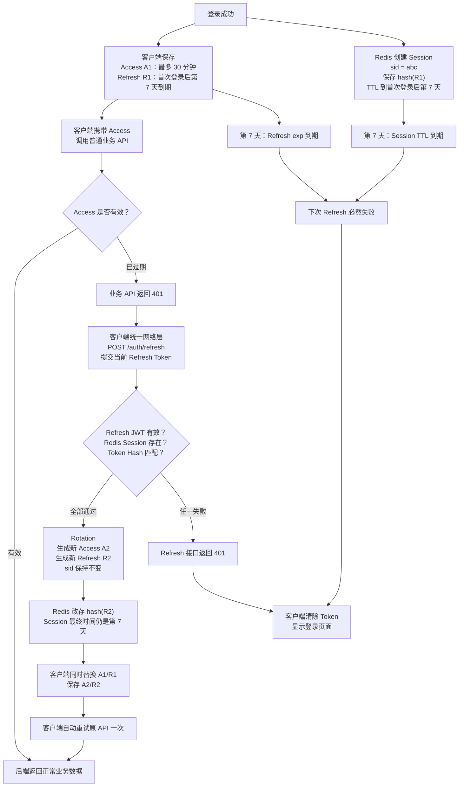

# Sprint 2: Session & Identity Management（会话与身份管理）

## 状态

进行中（2026-07-23）。

```text
Current Story: Story 2.4 Logout
Current Goal: Revoke the current device Session
Current Step: Design Logout Service/API contract
```

## Sprint 目标

Sprint 2 的目标不是单独学习 Redis，也不是只实现 Refresh Token，而是构建企业级 Session（会话）管理体系，为未来 AI Platform 打下认证基础。

1. 能解释 Cookie、Session、JWT、Refresh Token、Redis Session、OAuth2/OIDC 各自解决什么问题。
2. 能设计 Access/Refresh Token 的签发、轮换、撤销、过期和重放防护。
3. 能正确使用 Redis 的 TTL、原子操作和数据结构支撑认证，而不把 Redis 只当缓存。
4. 能设计多设备会话、浏览器安全、Secret 轮换及 Redis 故障策略。
5. 能用 Fake/Stub 和真实 Redis 分层测试，并建立安全事件日志。

## 学习推进方式

Sprint 2 内容较多，按学习依赖逐步推进，不要求一次理解全部内容。

每次只学习当前 Story 中的一个小步骤：

```text
理解概念
  -> 完成小练习
  -> 开发者实现关键代码
  -> AI Review
  -> 测试验证
  -> 记录总结
```

如果当前概念没有理解，暂停编码和后续 Story，先通过项目中的真实场景继续讲解和练习。

全项目协作约定统一记录在 `docs/AI协作规范.md`，当前 Sprint 不维护单独副本。

建议学习顺序：

```text
Story 2.0 Authentication Evolution
  -> Story 2.1 Redis Foundation
  -> Authentication Security 基础概念预习
  -> Story 2.2 Session Architecture Design
  -> Story 2.3 Refresh Token Rotation
  -> Story 2.4 Logout
  -> Story 2.5 Client Refresh Contract
  -> Story 2.6 Authentication Security Review
  -> Story 2.7 Testing
  -> Story 2.8 Observability
  -> Story 2.9 User Session Design
  -> Sprint Review
```

Security 基础概念在架构设计前预习，是为了让 Replay Attack、Token Hash 和过期策略进入设计；完整安全验收仍在 Story 2.6 完成。

### 当前认证功能地图

```text
注册
  [完成] 校验输入 -> 密码 Hash -> MySQL 创建 User -> 返回 User

登录
  [完成] 登录限流 -> MySQL 查询 User -> bcrypt 验证
  [完成] Access Token 签发
  [完成] Session ID、Refresh JWT、Token Hash 和过期策略基础
  [完成] 创建 Redis Session -> 同时返回 Access/Refresh Token

Access 认证
  [完成] Bearer Access Token -> JWT 验证 -> 加载当前 User

Refresh
  [完成] Refresh JWT Claims 的签发、解码和基础校验
  [完成] 固化 Refresh 契约与 ADR-0017
  [完成] Redis Session/Hash 校验 -> 原子 Rotation -> Replay 撤销
  [完成] Refresh Service/API -> 返回新 Token

Logout
  [完成基础] Repository 同时 DEL Session Hash 和 ZREM 用户索引
  [当前] Logout Service/API -> 客户端删除本地 Token

多设备 Session
  [完成基础] 独立 Session ID、Hash、Sorted Set、TTL 和失效索引清理
  [待设计] 当前设备、IP、User Agent、单设备/多设备策略接口

Sprint 收尾
  [待完成] 集成测试、安全 Review、ADR、注册登录全流程图和 Story Review
```

当前学习位置：Story 2.3 Refresh Token Rotation 已完成。现在进入 Story 2.4 Logout，使用 Refresh Token 识别当前设备 Session，并从 Redis 同时删除 Session Hash 和用户 Session 索引。

### 固定过期模式认证流程图（学习版）

下图展示端到端目标行为，帮助定位后续每个代码步骤。登录 Token Pair、Access 最终过期上限和 Refresh Service/API 已经实现；客户端统一重试仍由 Story 2.5 实现。



固定过期模式的时间关系：

```text
Session expires_at = 首次登录时间 + 7 天
Redis Session TTL  = expires_at - 当前时间
Refresh Token exp  = Session expires_at
Access Token exp   = min(当前时间 + 30 分钟, Session expires_at)
```

成功 Refresh 会同时返回新的 Access Token 和 Refresh Token。Refresh Rotation 是为了让旧 Refresh Token 立即失效，不会把固定 7 天重新计算为“从本次 Refresh 再加 7 天”。Refresh 或 Redis Session 任一失效时，客户端不能继续刷新，必须清除登录状态并重新登录。

### 当前学习检查点

- Story 2.0 Authentication Evolution：已完成（2026-07-24）。
- 已完成（2026-07-24）：区分 Cookie、认证 Session、SQLAlchemy Session 和 JWT。
- 已完成（2026-07-24）：理解多设备 Session 需要使用独立 Session ID，不能只用 User ID 作为唯一 Key。
- 已完成（2026-07-24）：理解 JWT 验证和 Redis Session 验证的职责不同，Session 不存在时认证失败。
- 已完成（2026-07-24）：理解有状态与无状态认证，以及无状态 Access Token 不能被单独立即撤销。
- 已完成（2026-07-24）：理解 Access Token、Refresh Token 和 Redis Session 的不同职责。
- 已完成（2026-07-24）：理解无服务端 Session 的 Refresh Token 在 Logout、撤销、Rotation 和多设备管理上的限制。
- 已完成（2026-07-24）：理解 OAuth2 解决授权问题，OIDC 在 OAuth2 之上解决身份认证问题，当前项目暂不需要立即引入。
- 已完成（2026-07-24）：理解 Authorization Code、Token Exchange、第三方身份到本地用户的映射，以及本地 Session 创建流程。
- 已完成（2026-07-24）：完成 `docs/architecture/authentication-evolution.md` 初稿。
- 已完成（2026-07-24）：文档 Review 通过，确认当前项目选择 JWT + Redis Session 的原因和边界。
- Story 2.1 Redis Foundation：已完成（2026-07-27）。
- 已完成（2026-07-24）：理解进程内存、Redis 和 MySQL 的生命周期、共享范围和适用场景。
- 已完成（2026-07-24）：使用固定版本镜像、密码认证、健康检查、AOF 和 Named Volume 启动 Redis。
- 已完成（2026-07-24）：通过真实 Redis 验证 TTL 自动过期，并验证 AOF 数据可在容器重建后恢复。
- 已完成（2026-07-24）：通过 `INCR` 实验理解单命令原子性，并识别 `INCR` 与 `EXPIRE` 之间的失败窗口。
- 已完成（2026-07-24）：使用 Pydantic Settings 校验 Redis Host、Port、DB、Password 和操作超时，测试不依赖本机 `.env`。
- 已完成（2026-07-24）：安装固定版本 Python Redis 客户端，通过集中工厂配置密码和超时，并使用真实 Redis 验证 PING、SET、GET 和 TTL。
- 已完成（2026-07-24）：MySQL 和 Redis 正常时 Readiness 返回 200；Redis 不可用时返回 503，Liveness 始终返回 200 且不访问外部依赖。
- 已完成（2026-07-27）：通过项目代码实现固定窗口登录限流，使用 Redis String、TTL 和事务化的 `INCR + EXPIRE NX`。
- 已完成（2026-07-27）：登录失败计数达到上限后返回 HTTP 429，成功登录清除计数，Redis 不可用时失败关闭并返回 HTTP 503。
- 已完成（2026-07-27）：使用 Settings 配置限流次数和窗口，生产依赖使用真实 Redis，API 与 Service 测试使用 Mock。
- 已完成（2026-07-27）：登录标识规范化并使用 SHA-256 构造 Redis Key，同时记录确定性摘要不能替代加密或 HMAC 的边界。
- 已完成（2026-07-27）：创建 ADR-0015，记录认证系统选择 Redis 的原因、故障策略和未采用方案。
- 已记录技术债（2026-07-27）：当前仅按邮箱限流，后续安全 Review 设计账号与可信客户端 IP 双维度策略，并评估并发请求的严格准入控制。
- 已完成（2026-07-27）：Story 2.1 Review 通过，完整测试 79 项通过，Ruff、Compose 展开、真实 Redis 和 Documentation Review 均无阻断问题。
- Story 2.2 Session Architecture Design：已完成（2026-07-28）。
- 已完成（2026-07-28）：使用 Redis Hash 表达单个 Session，使用 Sorted Set 表达按最后活动时间排序的用户 Session 索引。
- 已完成（2026-07-28）：实现 Session Repository 的创建、获取、删除和用户 Session 列表，并使用事务 Pipeline 保持 Hash、TTL 和索引一致。
- 已完成（2026-07-28）：使用 Mock 覆盖 Session 存在、不存在、显式撤销、批量读取、空索引和过期索引懒清理，共 6 项测试通过。
- 已完成（2026-07-28）：使用真实 Redis 验证 Hash、TTL、Sorted Set 排序，以及 Hash 自然过期后由列表读取清理残留成员。
- 已完成（2026-07-28）：创建 `session-architecture.md` 和 ADR-0016，记录 Session Key、字段、生命周期、多设备和过期清理决策。
- 已完成（2026-07-28）：确定 Refresh Token Claims、JSON 传输、固定/Sliding 过期边界、客户端单航班 Refresh 和失败语义。
- 已完成（2026-07-28）：创建 `refresh-token-design.md` 和 ADR-0017，并在 API 规范记录“尚未启用”的 Sprint 2 目标契约。
- 已完成（2026-07-28）：Story 2.2 Documentation Review 通过；完整后端测试 108 项、Ruff 和格式检查全部通过。
- 当前 Story：2.3 Refresh Token Rotation。
- 已完成（2026-07-29）：定义 Rotation 输入/结果契约，使用 Redis Lua 原子比较并替换 Refresh Token Hash。
- 已完成（2026-07-29）：Mock 覆盖成功、Session 不存在、Token Hash 不匹配和未知脚本返回码，共 10 项 Session Repository 测试通过。
- 已完成（2026-07-29）：使用真实 Redis 验证 Rotation 更新 Hash、TTL、最近使用排序，以及旧 Token 再次使用返回不匹配。
- 已决定（2026-07-29）：旧 Refresh Token 重用时原子撤销当前设备 Session，其他设备 Session 不受影响，并创建 ADR-0018。
- 已完成（2026-07-29）：Lua 在 Hash 不匹配时原子删除 Session Hash 和用户 Session 索引成员。
- 已完成（2026-07-29）：真实 Redis Integration Test 覆盖成功 Rotation、Replay 撤销和双线程并发；并发测试连续运行 20 轮通过。
- 已完成（2026-07-29）：完整普通测试 112 项通过、3 项 Integration Test 默认跳过，Ruff 和格式检查通过。
- 已完成（2026-07-29）：Login 创建初始 Redis Session 并返回 Token Pair；API 覆盖 Token Pair 契约以及限流检查、Session 创建失败时的 HTTP 503。
- 已完成（2026-07-29）：Login Token Pair 接入后完整普通测试 115 项通过、3 项 Integration Test 默认跳过，Ruff、import 顺序和格式检查通过。
- 已完成（2026-07-29）：Refresh Service 编排 JWT、用户状态、固定过期时间和 Redis 原子 Rotation，成功时返回新的 Token Pair。
- 已完成（2026-07-29）：`POST /auth/refresh` 接入 Router；无效 Token 或 Session 返回 401、停用账号返回 403、Redis 故障返回 503。
- 已完成（2026-07-29）：完整普通测试 123 项通过、3 项 Integration Test 默认跳过，Ruff、import 顺序和格式检查通过。
- 已完成（2026-07-29）：真实 Redis Integration Test 3 项通过；Story 2.3 代码、接口、测试、ADR 和文档 Review 通过。
- Story 2.3 Refresh Token Rotation：已完成（2026-07-29）。
- 当前 Story：2.4 Logout；当前 Step：设计当前设备 Logout 的 Service/API 契约。

## North Star

构建企业级 Session & Identity Management，而不是单纯增加 Redis。

完成后应具备：

- 企业级认证体系认知。
- Refresh Token 生命周期管理能力。
- 正确使用 Redis 支撑认证系统的能力。
- 多设备登录扩展能力。
- 安全设计意识。
- 自动化测试基础。
- 可观测性基础。

## 能力演进

```text
Authentication（认证）
        ↓
Authorization（授权）
        ↓
Session（会话）
        ↓
Token Lifecycle（Token 生命周期）
        ↓
Security（安全）
        ↓
Scalability（可扩展）
```

## Story 2.0: Authentication Evolution

**状态：已完成（2026-07-24）**

### 学习目标

理解认证体系的发展过程：

```text
Cookie Session
      ↓
JWT
      ↓
JWT + Refresh Token
      ↓
JWT + Redis Session
      ↓
OIDC / OAuth2
```

### 输出

- `docs/architecture/authentication-evolution.md`

### 完成结果

- 理解 Cookie、认证 Session、SQLAlchemy Session 和 JWT 的职责边界。
- 理解 Access Token、Refresh Token 和 Redis Session 的生命周期及撤销边界。
- 理解有状态与无状态认证、多设备 Session 和 Refresh Token Rotation 的演进原因。
- 区分 OAuth2 授权与 OIDC 身份认证，理解 Authorization Code 和本地用户映射流程。
- 完成并 Review `docs/architecture/authentication-evolution.md`。
- Documentation Review：通过，无阻断问题，综合评分 96/100。

## Story 2.1: Redis Foundation

**状态：已完成（2026-07-27）**

### 技术实现

- Docker Compose 增加固定版本的 Redis。
- 使用 Pydantic Settings 管理 Redis 配置。
- Readiness 检查 Redis。
- 配置 Redis 操作超时。
- 管理 TTL。
- 设计登录限流。

### 学习重点

理解 Redis 不只是缓存，还可以承担以下职责：

- Memory Store。
- TTL。
- Atomic Operation。
- Distributed Cache。
- Distributed Lock。
- Queue。

学习以下数据结构：

- String。
- Hash。
- Set。
- Sorted Set。

### 输出

- ADR-0015：为什么认证系统选择 Redis。

### 完成结果

- 完成固定版本 Redis、密码认证、AOF、Named Volume、健康检查和本机端口约束。
- 完成 Pydantic Settings、集中 Redis 客户端、超时配置和零自动重试策略。
- Readiness 同时检查 MySQL 和 Redis，Liveness 不访问外部依赖。
- 使用 String、TTL 和事务化的 `INCR + EXPIRE NX` 实现固定窗口登录限流。
- 登录失败达到上限后返回 HTTP 429，Redis 不可用时失败关闭并返回 HTTP 503。
- 使用 Mock 完成单元/API 测试，并使用真实 Redis 验证 TTL、事务、哈希 Key 和故障行为。
- 完成 ADR-0015 和 API、README、Sprint、Constitution 文档同步。
- Story Review：通过，无阻断问题；账号/IP 双维度限流和严格并发准入记录为后续安全技术债。

## Story 2.2: Session Architecture Design

**状态：已完成（2026-07-28）**

先设计，再编码。

### 时序设计

- 登录时序图。
- Refresh 时序图。
- Logout 时序图。

### 设计内容

- Redis Key。
- Session 生命周期。
- Token Rotation。
- 多设备登录。
- Secret Rotation。

### 输出

- Architecture Diagram。
- Sequence Diagram。
- ADR-0016：Session Architecture。
- ADR-0017：Refresh Token Design。

### 当前结果

- 已完成 Session Hash、用户 Sorted Set、多设备索引和过期懒清理设计。
- 已完成 Login、Refresh 和 Logout 设计时序图。
- 已完成 `docs/architecture/session-architecture.md` 和 ADR-0016。
- 已完成 Refresh Token 传输、Claims、过期规则、客户端职责和 Secret Rotation 边界。
- 已完成 `docs/architecture/refresh-token-design.md` 和 ADR-0017。
- Documentation Review：通过；Session 字段、Token Claims、过期规则、客户端职责和失败边界与当前代码基线一致。
- 验证结果：完整后端测试 108 项通过，Ruff 和格式检查通过。

## Story 2.3: Refresh Token Rotation

**状态：已完成（2026-07-29）**

### 接口

```http
POST /auth/refresh
```

### 要求

- Access Token 有效期为 30 分钟。
- Refresh Token 有效期为 7 天。
- JWT 包含 `jti`。
- JWT 包含 `type=refresh`。
- Redis 保存 Session 或 Token 标识。
- Rotation 后旧 Token 立即失效。

### 测试范围

- Token 过期。
- Token 类型错误。
- Session 不存在。
- Replay Attack。

### 输出

- ADR-0018：Token Rotation。

### 完成结果

- 登录创建初始 Redis Session 并返回 Token Pair。
- Refresh Service 校验 JWT、Session、用户状态与固定过期边界，并调用 Redis Lua 原子 Rotation。
- `POST /auth/refresh` 返回新 Token Pair；无效或重放返回 401，停用账号返回 403，Redis 故障返回 503。
- Mock/API 测试覆盖成功、Session 缺失、Rotation 失败和错误映射；真实 Redis 覆盖成功、Replay 撤销与并发竞争。
- 完整普通测试 123 项、真实 Redis Integration Test 3 项通过，Ruff、import 顺序、格式和文档检查通过。

## Story 2.4: Logout

**状态：进行中（2026-07-29）**

### 接口

```http
POST /auth/logout
```

### 实现范围

- 当前设备登出。
- 删除当前 Refresh Session。
- Access Token 自然过期。

### 预留范围

- Logout All Devices。

## Story 2.5: Client Refresh Contract

**状态：未开始**

### 客户端约定

客户端负责刷新 Token：

```text
API
 ↓
401
 ↓
Refresh
 ↓
Retry
```

### 要求

- 同一客户端只允许一个 Refresh 请求。
- 不实现静默刷新。
- 定义浏览器安全策略。

## Story 2.6: Authentication Security

**状态：未开始**

### 学习内容

- Replay Attack。
- Sliding Session。
- Absolute Expiration。
- Token Rotation。
- Refresh Token Hash。
- Secret Rotation。

### 需要理解

- 为什么 Redis 不保存原始 Refresh Token。

## Story 2.7: Testing

**状态：未开始**

### 测试体系

- pytest。
- JWT Test。
- 使用 Fake 或 Stub 完成 Redis 边界的单元测试。
- 使用真实 Redis 完成 TTL、原子轮换和重放场景的集成测试。
- API Test。

### 最低覆盖范围

- Login。
- Refresh。
- Logout。
- Replay。

## Story 2.8: Observability

**状态：未开始**

### INFO 日志

- Login Success。
- Refresh Success。
- Logout。

### WARNING 日志

- Replay Attack。
- Invalid Refresh Token。

### ERROR 日志

- Redis 不可用。
- Session 持久化或轮换失败。

普通无效 Access Token 属于预期认证失败，不默认记录为 ERROR，避免攻击者制造日志洪泛。

本 Story 为 Sprint 9 的 Prometheus 和 Grafana 可观测性建设铺路。

## Story 2.9: User Session Design

**状态：仅设计，暂不实现接口**

### 设计接口

```http
GET /users/sessions
```

### 设计内容

- 当前设备。
- 登录时间。
- IP。
- User Agent。
- 最后活动时间。

### 预留范围

- 单设备踢下线。
- 全部设备登出。

## 文档输出

- `docs/architecture/authentication-evolution.md`
- `docs/architecture/authentication-flow.md`（Sprint 收尾时汇总注册、登录、Refresh 和 Logout 时序与职责关系）
- `docs/architecture/session-architecture.md`
- `docs/architecture/refresh-token-design.md`
- `docs/architecture/redis-authentication.md`
- `docs/architecture/authentication-security.md`
- Sprint 过程和验收结果继续记录在当前 `docs/Sprint/Sprint2.md`。

## ADR 规划

- ADR-0015：为什么认证使用 Redis。
- ADR-0016：Session Architecture。
- ADR-0017：Refresh Token Design。
- ADR-0018：Token Rotation。

## 验收标准

### 功能

- Redis 接入完成。
- Refresh Token Rotation 完成。
- Logout 完成。
- Session 生命周期正确。
- 多设备设计完成。

### 工程

- Architecture Review 完成。
- Code Review 完成。
- 文档同步完成。
- ADR 完成。
- 测试通过。
- 日志规范完成。
- 注册、登录、Refresh 和 Logout 全流程时序图与职责关系图完成。

综合评分达到 **90 分及以上**，才进入 Sprint 3。

## 长期路线

- Sprint 1：Authentication。
- Sprint 2：Session & Identity。
- Sprint 3：Storage。
- Sprint 4：AI Gateway。
- Sprint 5：RAG。
- Sprint 6：Workflow。
- Sprint 7：Agent Runtime。
- Sprint 8：MCP。
- Sprint 9：Observability。
- Sprint 10：Async Platform。
- Sprint 11：Cloud Native。
