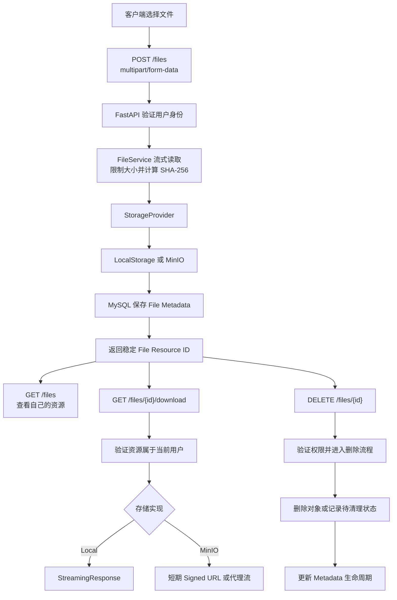
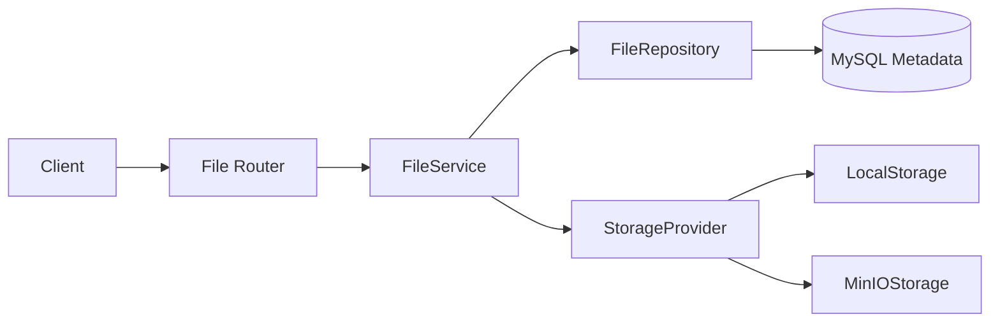

# Sprint 3: Storage & Resource Management（存储与资源管理）

## 状态

Story 3.0 已完成（2026-08-02）；Story 3.1 尚未开始。

```text
Current Sprint: Sprint 3 Storage & Resource Management
Current Story: Story 3.1 HTTP Upload & Streaming Foundation
Current Goal: Understand how a client file safely enters FastAPI
Current Step: Confirm the multipart request shape and streaming memory boundary
```

## Sprint 定位

Sprint 3 标志项目从认证基础设施进入 AI Platform 的资源基础设施阶段。

本 Sprint 的目标不是只做一个文件上传接口，而是构建一套可以被未来 Knowledge、Document、RAG、Workflow、Agent 和 MCP 共同使用的资源管理基础：

```text
客户端文件
  -> 安全接收
  -> 流式处理
  -> 对象存储
  -> MySQL 元数据
  -> 权限控制
  -> 下载与删除
  -> 生命周期管理
  -> 未来进入解析、切分、Embedding 和 RAG
```

文件 Upload 只是入口。真正需要掌握的是：存储边界、对象与元数据的关系、跨系统一致性、安全校验、权限、失败补偿和可测试性。

## Sprint North Star

完成后，应具备以下能力：

1. 能解释 Block、File 和 Object Storage 的区别及适用场景。
2. 能解释 `multipart/form-data`、`UploadFile`、Streaming Upload 和大文件内存边界。
3. 能设计业务层不依赖具体 SDK 的 `StorageProvider`。
4. 能使用 MySQL 管理文件资源元数据，而不把大文件内容写入数据库。
5. 能处理对象存储与 MySQL 无法共享事务时的失败补偿和孤儿对象问题。
6. 能实现带所有者权限、安全限制和明确错误语义的上传、列表、下载和删除流程。
7. 能使用 LocalStorage 完成快速开发，并使用真实 MinIO 验证对象存储契约。
8. 能为未来 RAG 提供稳定的 File Resource ID、对象位置、Checksum 和生命周期状态。
9. 能使用当前 Sprint 的代码、测试和 ADR 回答对象存储与文件安全高频面试题。

## 先看一张大图



学习过程中每个小步骤都必须能回答：现在正在实现这张图里的哪一段、输入是什么、输出是什么、失败后系统留下什么状态。

## Sprint 范围

### 本 Sprint 实现

- 文件资源元数据 Model、Migration、Repository 和 Schema。
- `StorageProvider` 抽象。
- LocalStorage 实现。
- MinIO S3-compatible 对象存储实现或适配器。
- 文件上传、元数据查询、资源列表、下载和删除 API。
- Owner-only 基础权限控制。
- Streaming 大小限制、服务端 Object Key、SHA-256 和明确类型策略。
- MySQL 与对象存储之间的一致性与失败补偿。
- Local Mock/Unit Test、API Test 和真实 MinIO Integration Test。
- Storage 日志、错误映射、架构文档和 ADR。

### 本 Sprint 只学习或设计，不实现

- CDN 分发。
- 浏览器直传、分片上传和断点续传。
- 病毒扫描服务、内容审核和沙箱执行。
- 图片转码、文档解析、OCR、Chunk 和 Embedding。
- 跨用户共享、组织空间、RBAC 和公开链接。
- 后台定时 Cleanup Worker；只设计可重试状态和未来 Job 边界。
- Tencent COS、Amazon S3 等生产 Provider；只保证抽象层可以扩展。
- Redis Cluster、Kubernetes 和生产 Secret Manager 部署。

这些边界避免 Sprint 3 提前进入 RAG、Async Platform 或 Cloud Native。

## 文档组织决策

Sprint 3 继续使用一个总控文件保持全局学习视角：

```text
docs/Sprint/Sprint3.md
```

具体且稳定的技术内容放入现有文档体系：

```text
docs/architecture/storage-evolution.md
docs/architecture/storage-architecture.md
docs/architecture/file-resource-design.md
docs/architecture/storage-security.md
docs/architecture/storage-flow.md
docs/architecture/adr/ADR-0021-*.md
...
```

暂不为每个 Story 创建独立目录和重复的 README、Learning Path、Checklist。原因是当前开发者更需要随时看到完整方向；同一事实如果同时出现在多个 Story 文件中，很容易产生状态漂移。只有单个 Sprint 文档确实难以维护时再拆分。

## 如何使用这份计划

不要求一次读完或记住全部内容。每次学习只看三部分：

1. 顶部 `Current Story / Current Goal / Current Step`。
2. “先看一张大图”，确认当前步骤位于哪一段。
3. 当前 Story 的目标、练习和完成标准。

其他 Story 只作为路线地图。进入对应 Story 时再展开学习，遇到不懂的概念立即暂停并结合正式项目代码解释。

## 学习推进方式

每个大功能开始前先一次性确认：

```text
目标
  -> 完整调用链
  -> 数据模型与 API
  -> 失败和一致性
  -> 安全与日志
  -> 测试矩阵
  -> 实现顺序
```

之后每次只实现一个小步骤：

```text
理解当前位置
  -> 开发者实现关键代码
  -> AI Review
  -> 测试验证
  -> 文档同步
  -> Story Review
  -> Git Commit
```

关键业务代码默认由开发者编写。格式、导入、ADR、配套文档、重复测试和开发者明确授权的代码由 AI 处理。

## Story 路线图

```text
Story 3.0 Storage Evolution & System Map
  -> Story 3.1 HTTP Upload & Streaming Foundation
  -> Story 3.2 Resource Domain, API & Consistency Design
  -> Story 3.3 StorageProvider & LocalStorage
  -> Story 3.4 File Metadata & Repository
  -> Story 3.5 Secure Upload Service & API
  -> Story 3.6 Download, Permission & Delete
  -> Story 3.7 MinIO & Real Object Storage Integration
  -> Story 3.8 Lifecycle, Testing, Observability & Sprint Review
```

测试、日志和文档随每个 Story 同步完成。Story 3.8 负责整体验收，不负责把前面遗漏的工程工作集中补上。

## 目标架构



职责边界：

| 层 | 职责 |
| --- | --- |
| Router | HTTP、上传对象、参数、依赖注入和响应 |
| FileService | 权限、流程编排、跨系统一致性、错误翻译和日志时机 |
| FileRepository | File Metadata SQL 读写，不访问对象存储 |
| StorageProvider | 保存、读取、删除对象，不访问业务数据库 |
| Model | 描述 Metadata 表结构和状态，不承担上传业务 |
| Schema | 输入输出和字段校验，不访问数据库或文件系统 |

Service 不直接写 SQL；Repository 不决定 HTTP；Provider 不知道用户权限。

## 初始 API 候选

Story 3.2 会完成最终契约，当前候选为：

```http
POST   /files
GET    /files
GET    /files/{file_id}
GET    /files/{file_id}/download
DELETE /files/{file_id}
```

- `POST /files`：上传并创建资源。
- `GET /files`：有界分页查看当前用户资源。
- `GET /files/{file_id}`：返回 Metadata，不返回对象内容。
- `GET /files/{file_id}/download`：完成权限校验后返回流或短期下载地址。
- `DELETE /files/{file_id}`：进入资源删除生命周期。

路径中的 `file_id` 是稳定业务资源 ID，不直接暴露本地磁盘路径、Bucket 内部路径或客户端原始文件名。

## Metadata 初始草案

Story 3.2 先 Review，Story 3.4 才创建 Migration：

```text
id
owner_id
storage_provider
bucket
object_key
original_filename
content_type
size_bytes
sha256
status
created_at
updated_at
deleted_at
```

关键原则：

- `owner_id` 只从当前认证用户获得，不接受客户端 Body 指定。
- `object_key` 由服务端生成并保持不可猜测，不使用原始文件名拼路径。
- `original_filename` 只用于展示，必须限制长度和控制字符。
- `sha256` 用于完整性和重复观察，不在 Sprint 3 默认做跨用户物理去重。
- `status` 用于表达跨系统操作状态，不把对象存储与 MySQL 假装成一个事务。
- `bucket` 和 `storage_provider` 允许未来迁移或多 Provider 共存。

## 跨系统一致性问题

MySQL Transaction 不能回滚 MinIO 或本地文件系统操作：

```text
对象上传成功
  +
Metadata Commit 失败
  =
可能产生孤儿对象
```

反方向也可能发生：

```text
Metadata 已创建
  +
对象上传失败
  =
可能产生不可下载的资源记录
```

Story 3.2 必须明确：

- 操作顺序。
- `PENDING / ACTIVE / DELETE_PENDING / DELETED / FAILED` 等状态是否全部需要。
- 哪些错误同步补偿。
- 补偿失败如何记录和未来重试。
- API 成功前必须达到什么一致状态。
- 列表和下载是否只允许 `ACTIVE` 资源。

不使用分布式事务。当前阶段采用明确状态、幂等操作和补偿设计。

## 错误语义候选

| HTTP | 场景 |
| --- | --- |
| 400 | 文件或请求结构不符合业务规则 |
| 401 | Access Token 无效或缺失 |
| 403 | 用户状态不允许操作 |
| 404 | 资源不存在或不属于当前用户 |
| 409 | 明确启用的同用户重复或状态冲突 |
| 413 | 流式读取过程中确认文件超过大小上限 |
| 415 | 文件类型不在支持范围 |
| 503 | Storage Provider 暂时不可用，操作未被安全确认 |

不能只信任 `Content-Length`；真正的大小限制必须在读取数据流时累计字节数。

## 日志候选

| 事件 | 级别 | 允许字段 |
| --- | --- | --- |
| `storage.upload.success` | INFO | `user_id`、`file_id`、大小 |
| `storage.upload.rejected` | WARNING | `user_id`、固定 `reason` |
| `storage.delete.success` | INFO | `user_id`、`file_id` |
| `storage.permission.rejected` | WARNING | `user_id`、固定 `reason` |
| `storage.provider.unavailable` | ERROR | operation、provider、异常类型 |
| `storage.compensation.failed` | ERROR | operation、provider、`file_id`、异常类型 |

日志禁止记录原始文件内容、Signed URL、访问密钥、完整本地路径、原始 Object Key 或未经处理的文件名。

## Story 3.0: Storage Evolution & System Map

### 在大功能中的位置

先理解为什么需要 Storage System，再决定代码结构。当前 Story 不实现上传 API。

### 学习目标

- 理解 Block Storage、File Storage 和 Object Storage。
- 理解 Local Disk、NAS、Object Storage 和 CDN 的演进关系。
- 理解对象存储的 Bucket、Object Key、Metadata、ETag 和 Signed URL。
- 理解 AI Platform 为什么需要稳定的 Resource ID，而不是直接传文件路径。
- 理解 RAG 未来依赖文件资源，但 Chunk 和 Embedding 不属于本 Sprint。

### 项目练习

- 根据当前项目画出从客户端文件到未来 RAG 的完整资源链路。
- 对比 LocalStorage、MinIO、Tencent COS 和 Amazon S3 的共同能力与差异。
- 解释为什么 MySQL 保存 Metadata、对象存储保存 Bytes。
- 识别单机磁盘在多实例部署、扩容、备份和容器重建中的问题。

### 输出

- `docs/architecture/storage-evolution.md`
- Sprint 3 总流程图和范围确认。
- ADR-0021 初稿：为什么采用对象存储边界，以及 Local + MinIO 的学习策略。

### 完成标准

- 能用自己的话区分三类存储。
- 能解释当前 Sprint 为什么不能只写 `uploads/filename`。
- 能指出 LocalStorage 的适用范围和生产限制。
- 设计 Review 通过后再进入 HTTP 代码。

### 验收记录

- [x] 完成客户端文件到未来 RAG 的资源链路图。
- [x] 区分 Block、File 和 Object Storage，以及 Local Disk、NAS、Object Storage 和 CDN 的边界。
- [x] 解释 MySQL Metadata 与对象存储 Bytes 的职责分离。
- [x] 解释稳定 `file_id` 与内部 `object_key` 的差异和迁移边界。
- [x] 新增 Storage Evolution 文档和 ADR-0021。
- [x] 同步 Sprint 3 第 1 道面试题。

## Story 3.1: HTTP Upload & Streaming Foundation

### 在大功能中的位置

学习客户端文件怎样安全进入 FastAPI，尚不决定最终数据库和 Provider 实现。

### 学习目标

- `multipart/form-data` 的 Boundary、字段和文件部分。
- FastAPI `UploadFile`、Spooled Temporary File 和 `bytes` 参数的区别。
- Streaming Upload、Chunk Size、Backpressure 和内存边界。
- `Content-Type`、MIME、扩展名和文件签名不是同一概念。
- `Content-Length` 可缺失或不可信，大小上限必须在流中执行。

### 项目练习

- 阅读真实 Multipart 请求结构，并能指出普通字段、文件 Header 和文件 Body 的边界。
- 对比 `bytes`、`UploadFile` 和分块读取在内存、临时磁盘和调用方式上的差异。
- 为 Story 3.2 提供上传请求、文件大小和类型错误的协议约束草案。

### 输出

- HTTP Upload 学习记录同步到 `storage-architecture.md`。
- Upload API 协议与 Streaming 约束草案。
- 上传大小与 Chunk Size 配置草案。

### 完成标准

- 能解释 Streaming 为什么仍可能使用临时磁盘，但不会把整个文件常驻内存。
- 能解释为什么请求 Header 不能替代实际字节计数。
- 能指出大小限制、类型验证和 Provider 写入分别属于后续哪一层。
- 不在 Story 3.2 架构确认前增加生产上传 Helper。

## Story 3.2: Resource Domain, API & Consistency Design

### 在大功能中的位置

在写 Model 和 Provider 前，一次性确定资源领域、API、状态机和两个存储系统的职责。

### 学习目标

- File Object 与 File Resource 的区别。
- 稳定 Resource ID、Object Key 和 Original Filename 的职责。
- Owner-only 权限模型。
- MySQL 与对象存储之间没有共享 Transaction。
- Saga/Compensation、幂等删除、孤儿对象和失败状态。

### 设计任务

- 确认 Metadata 字段、索引、唯一约束和状态枚举。
- 确认五个 API 的请求、响应和状态码。
- 画上传、下载、删除的时序图。
- 选择上传和删除的操作顺序及补偿策略。
- 确认哪些错误由 Provider、Repository、Service、Router 或全局 Handler 负责。
- 定义日志事件、敏感字段和测试矩阵。

### 输出

- `docs/architecture/storage-architecture.md`
- `docs/architecture/file-resource-design.md`
- `docs/architecture/storage-flow.md`
- ADR-0022：为什么抽象 StorageProvider。
- ADR-0023：Metadata 与对象存储一致性策略。

### 完成标准

- 架构、Model、API、状态、异常、日志、兼容和测试设计一次性 Review 完成。
- 能解释每种失败发生后 MySQL 和对象存储分别可能留下什么。
- 未确认设计前不创建 Migration 和业务代码。

## Story 3.3: StorageProvider & LocalStorage

### 在大功能中的位置

先建立存储能力边界，再让业务代码调用它；当前不接入 MySQL Metadata。

### 学习目标

- Python `Protocol` 或 ABC 的取舍。
- Dependency Inversion 和 Provider Capability。
- 流式写入、流式读取、删除、存在性检查和下载地址能力。
- Local Path Traversal、根目录约束和原子落盘。
- Provider Error 与业务 Error 的边界。

### 实现任务

- 定义最小 `StorageProvider` 接口和返回对象，不为未来 SDK 过度抽象。
- 实现 `LocalStorageProvider`。
- Object Key 完全由服务端生成，不使用客户端文件名作为路径。
- 先写临时文件，完成后原子移动，失败时清理临时文件。
- 使用 Pydantic Settings 管理 Provider 类型、Local Root、Chunk Size 和大小上限。
- 增加成功、读取、删除、缺失、超限、路径越界和写入失败测试。

### 输出

- Provider 接口和 Local 实现。
- Provider Unit Test。
- Storage Config 与 `.env.example`。

### 完成标准

- 业务调用方不需要知道本地根目录。
- 测试证明 Object Key 不能逃出 Storage Root。
- 写入中断不留下对外可见的半文件。
- Story Review、文档同步和 Commit 完成。

## Story 3.4: File Metadata & Repository

### 在大功能中的位置

把对象变成受业务管理的 File Resource；当前仍不开放完整上传 API。

### 学习目标

- SQLAlchemy 2.x Model、Foreign Key、Index 和 Enum/字符串状态。
- Alembic Migration 的生成、Review、Upgrade 和 Downgrade。
- Repository 查询边界和事务所有权。
- 分页、Owner 过滤和软删除查询。
- `sha256` 索引与唯一约束的区别。

### 实现任务

- 创建 FileResource Model 和 Alembic Migration。
- 创建 FileRepository：create、get_owned、list_owned、update_status。
- 所有读取默认过滤 owner 和允许状态。
- `sha256` 默认不做全局唯一，避免跨用户信息泄露和引用计数复杂度。
- 测试 Migration、Repository、排序、分页、外键、缺失和其他用户隔离。

### 输出

- Model、Migration、Repository 和测试。
- Metadata Schema。
- ADR-0023 最终状态。

### 完成标准

- Service 不写 SQL。
- Repository 不访问对象存储。
- Migration 可以升级和降级。
- 其他用户的资源查询结果与不存在保持相同边界。
- Story Review、文档同步和 Commit 完成。

## Story 3.5: Secure Upload Service & API

### 在大功能中的位置

第一次把 HTTP Stream、StorageProvider 和 Metadata 组合成完整上传流程。

### 学习目标

- 上传编排和跨系统补偿。
- 文件大小、文件名、MIME/类型策略和 Checksum。
- 客户端声明与服务端观察值的区别。
- 同用户重复检测与物理去重的区别。
- 成功日志必须在最终业务状态明确后记录。

### 实现任务

- 实现 `POST /files`。
- 通过 `uv` 增加 FastAPI Multipart 所需依赖，不手工修改锁文件。
- `owner_id` 来自当前用户，不接受客户端指定。
- 分块读取时同时累计大小和 SHA-256。
- 限制文件名长度、控制字符、允许类型和实际字节大小。
- 明确支持类型的签名校验策略；不声称已经完成通用病毒扫描。
- 根据 Story 3.2 的状态机写对象和 Metadata，并在失败时补偿。
- 补偿失败记录固定 ERROR 事件，但不泄露 Object Key 和本地路径。
- 返回稳定 File Resource，不返回 Provider Secret 或内部路径。

### 测试

- 正常小文件。
- 空文件策略。
- 超过上限返回 413。
- 不支持类型返回 415。
- 文件名异常。
- Provider 写入失败。
- Metadata Commit 失败后的对象补偿。
- 补偿再次失败时的状态与日志。
- 未认证、停用用户和 Redis/Auth 既有边界回归。

### 完成标准

- 上传成功时对象和 ACTIVE Metadata 同时可用。
- 任何失败路径都有明确状态或补偿，不静默留下未知结果。
- 大小限制由实际 Stream 字节证明。
- 日志不包含文件内容、内部路径、Object Key 或未经处理的原始文件名。
- Story Review、文档同步和 Commit 完成。

## Story 3.6: Download, Permission & Delete

### 在大功能中的位置

让已经上传的资源能够被所有者查看、下载和撤销，同时保持 Provider 细节隐藏。

### 学习目标

- Metadata Response 与文件内容 Response 分离。
- FastAPI `StreamingResponse`。
- Signed URL 的授权时机、有效期和泄露边界。
- Owner-only 权限和 404 隐藏策略。
- 幂等删除、软删除、对象删除失败和重试状态。

### 实现任务

- 实现资源列表、Metadata 查询、下载和删除 API。
- 列表使用有界分页，只返回当前用户允许状态的资源。
- 下载前先验证 Metadata 所有者和状态。
- LocalStorage 使用 StreamingResponse，不一次读取完整文件。
- 删除使用 Story 3.2 的状态与补偿策略。
- 不存在和其他用户资源统一返回 404。
- 下载成功默认不记录高频 INFO；删除成功和安全拒绝按日志契约记录。

### 测试

- 列表排序和分页。
- Metadata 与下载成功。
- 大文件流式响应。
- 其他用户无法读取、下载或删除。
- 缺失对象但 Metadata 存在。
- 删除成功、重复删除和 Provider 删除失败。

### 输出

- `docs/architecture/storage-security.md`
- ADR-0024：受控下载与 Signed URL 策略。

### 完成标准

- Router 不读取磁盘路径或直接调用 Provider SDK。
- 权限检查发生在生成下载流或 Signed URL 之前。
- 删除失败不会让资源回到不明确状态。
- Story Review、文档同步和 Commit 完成。

## Story 3.7: MinIO & Real Object Storage Integration

### 在大功能中的位置

验证 Provider 抽象不只适用于本地文件系统，并实际学习 S3-compatible Object Storage。

### 学习目标

- MinIO Endpoint、Bucket、Object Key、Access Key 和 Secret Key。
- S3-compatible API 与具体云厂商 SDK 的关系。
- Bucket 初始化、Health Check 和应用 Readiness。
- Presigned Download URL 的短期授权。
- 本地 FastAPI 访问 Compose MinIO 时的 Host 配置。

### 实现任务

- 在 Compose 增加固定版本 MinIO、Healthcheck 和 Named Volume。
- 使用 `infra/.env` 管理容器凭据，使用 `backend/.env` 管理 FastAPI 连接配置。
- 通过 `uv` 增加选定的 S3-compatible SDK。
- 实现 MinIOStorageProvider，不修改 FileService 业务流程。
- 增加 Bucket 可用性检查，并决定是否进入 Readiness。
- 对 MinIO 下载使用短期 Signed URL 或明确采用后端代理流，并由 ADR-0024 固化。

### 真实集成测试

- 上传、读取 Metadata、下载和删除完整链路。
- 对象大小与 SHA-256 一致。
- Signed URL 只在权限检查后生成并具有短 TTL。
- Bucket 不存在、凭据错误和 MinIO 不可用。
- 测试使用独立 Object Key 并在结束时清理。

### 完成标准

- 切换 `STORAGE_PROVIDER` 后业务 Service 不修改。
- 真实 MinIO Integration Test 通过。
- Compose 停止/恢复验证不会遗留错误状态。
- Story Review、文档同步和 Commit 完成。

## Story 3.8: Lifecycle, Testing, Observability & Sprint Review

### 在大功能中的位置

整合上传到删除的资源生命周期，并验证整个 Sprint，而不是首次补前面遗漏的测试和日志。

### 学习目标

- `PENDING -> ACTIVE -> DELETE_PENDING -> DELETED/FAILED` 等状态转换。
- Cleanup Job、Orphan Object 和 Retry 的边界。
- 同步请求与未来 Async Worker 的职责。
- Storage 指标、日志和审计事件。
- 单元、API、Integration 和纵向测试的分层。

### 实现与 Review 任务

- Review 所有状态转换和幂等性。
- 提供手动或可调用的 Cleanup 边界，但不提前引入任务队列和 Scheduler。
- 完成 Local 与 MinIO 的纵向资源生命周期测试。
- 验证 Provider 故障时 503、补偿日志和恢复行为。
- 确认文件内容、Secret、Signed URL、内部路径和 Object Key 不进入日志。
- 更新 README、Project Constitution、Sprint 文档和所有 ADR 状态。
- 创建端到端 `storage-flow.md` 学习图。
- 按 Code Review 规范评分，达到 90 分后收尾。

### 完成标准

- 每个 File Resource 的状态转换可解释、可测试、可恢复。
- Local 和真实 MinIO 都通过完整生命周期验证。
- 普通测试、Integration Test、Ruff、格式和 `git diff --check` 全部通过。
- Architecture Review、Security Review、Code Review 和 Documentation Review 无阻断问题。
- 创建 Sprint 收尾 Commit，并创建 Annotated Tag `sprint3`。

## 测试矩阵

| 层级 | 重点 |
| --- | --- |
| Schema/Utility Unit | 文件名、类型、Object Key、大小、Checksum、状态转换 |
| Provider Unit | Local 流式保存、读取、删除、路径安全和异常映射 |
| Repository Unit | Owner 过滤、状态、分页、排序和事务边界 |
| Service Unit | 上传编排、权限、一致性、补偿和日志 |
| API Test | 201/200/204、401/403/404/409/413/415/503 |
| Real MinIO Integration | Put/Get/Delete、Signed URL、Bucket 和故障 |
| Vertical Flow | Login -> Upload -> List -> Download -> Delete -> 再次访问失败 |

测试文件使用生成的数据和临时目录，不把大二进制 Fixture 提交到仓库。Large File Test 使用可控的分块生成器验证流式行为，不依赖真实超大文件。

## 面试题同步

Sprint 3 对应 `docs/interview/AI-Agent-Engineer-100.md` 中的 8 道 Storage 核心题。

每个 Story 完成时同步 1 至 2 道题，答案必须引用当前已完成的代码、测试、架构图或 ADR。Sprint 3 Review 时至少完成一次不看文档的口述或白板演练，并记录题目的 `理解 / 能讲 / 能画 / 能写` 状态。

面试题不是额外的理论阶段，而是 Story Review 的输出。尚未实现的 MinIO、Signed URL 或一致性方案只能写为候选设计，不能提前描述成项目事实。

## ADR 输出

现有 ADR 已使用到 ADR-0020，Sprint 3 从 ADR-0021 开始：

- ADR-0021：为什么采用对象存储边界，以及 Local + MinIO 策略。
- ADR-0022：为什么抽象 StorageProvider。
- ADR-0023：为什么 MySQL 只保存 Metadata，以及跨系统一致性策略。
- ADR-0024：为什么下载必须经过权限检查，以及何时使用 Signed URL。

新的重要决策如果不能被上述 ADR 清晰覆盖，再顺序增加 ADR-0025，禁止复用已有编号。

## Sprint 输出成果

### 功能

- 文件上传。
- 当前用户文件列表和 Metadata 查询。
- 文件下载。
- 文件删除与生命周期状态。
- Owner-only 权限控制。
- StorageProvider 抽象。
- LocalStorage 和 MinIOStorage。
- MySQL File Metadata。

### 工程

- Storage 架构、流程、安全和资源模型文档。
- ADR-0021 至 ADR-0024。
- Alembic Migration。
- Provider、Repository、Service、Router 和 Schema 分层。
- 配置、异常、日志和健康检查。
- Unit、API、真实 MinIO 和纵向测试。

### 学习

- Storage 类型与对象存储模型。
- HTTP Multipart 和 Streaming。
- SQLAlchemy Metadata 建模。
- 跨系统一致性与补偿。
- 上传安全、权限和 Signed URL。
- 生命周期与未来异步 Cleanup 边界。

## Sprint 验收标准

### 功能

- [ ] 上传、列表、Metadata、下载和删除流程完整可用。
- [ ] Owner-only 权限正确，不泄露其他用户资源存在性。
- [ ] Local 和 MinIO Provider 可以通过配置切换。
- [ ] Metadata 与对象状态在成功和失败路径上都有明确一致性。
- [ ] 文件大小、类型、Object Key 和 SHA-256 策略完成。

### 工程

- [ ] Service、Repository、Provider、Router 和 Schema 职责边界清晰。
- [ ] Migration Upgrade/Downgrade 通过。
- [ ] 错误码、日志和敏感字段边界完成。
- [ ] Unit、API、真实 MinIO 和纵向测试通过。
- [ ] README、Sprint、Architecture 和 ADR 同步。
- [ ] Sprint 3 的 8 道 Storage 面试题已同步项目证据和掌握状态。
- [ ] Code Review 综合评分达到 90 分及以上。
- [ ] 每个 Story 有独立 Commit，Sprint 有收尾 Commit 和 `sprint3` Tag。

## 已明确的后续边界

- RAG 文档解析、Chunk、Embedding 和 Vector Store 留到 Sprint 5。
- 后台 Cleanup Worker、重试队列和定时任务留到 Async Platform。
- 组织级 RBAC、共享链接、公共资源和配额系统另行设计。
- 大文件 Multipart Upload、断点续传和客户端直传在真实规模需求出现后再实现。
- CDN、跨区域复制、对象版本控制和生产备份属于部署与容量规划。
- 病毒扫描和内容审核需要独立安全服务，不用简单扩展名校验冒充。

## 与长期路线的关系

```text
Sprint 1 Authentication
  -> Sprint 2 Session & Identity
  -> Sprint 3 Storage & Resource Management
  -> Sprint 4 AI Gateway
  -> Sprint 5 RAG
  -> Sprint 6 Workflow
  -> Sprint 7 Agent Runtime
  -> Sprint 8 MCP Integration
  -> Sprint 9 Observability
  -> Sprint 10 Async Platform
  -> Sprint 11 Cloud Native
```
