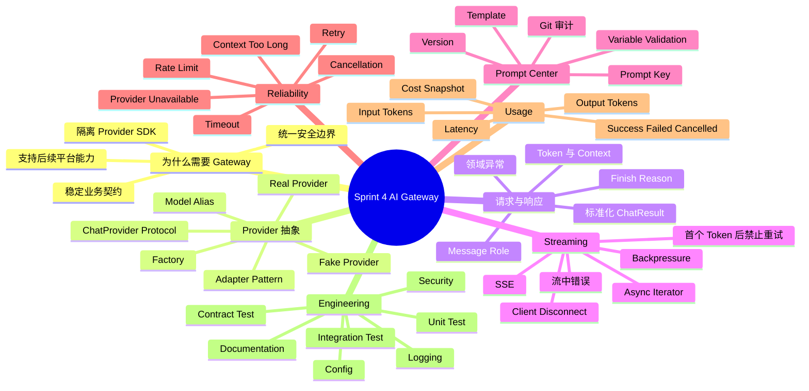
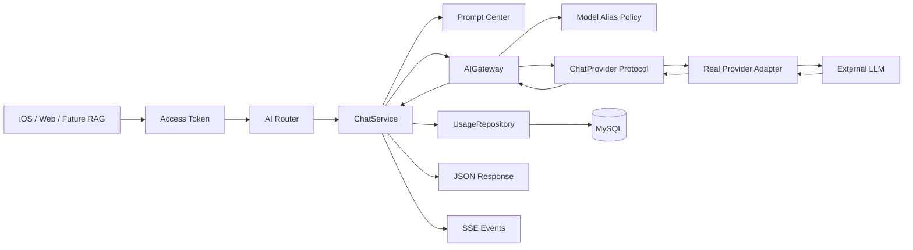
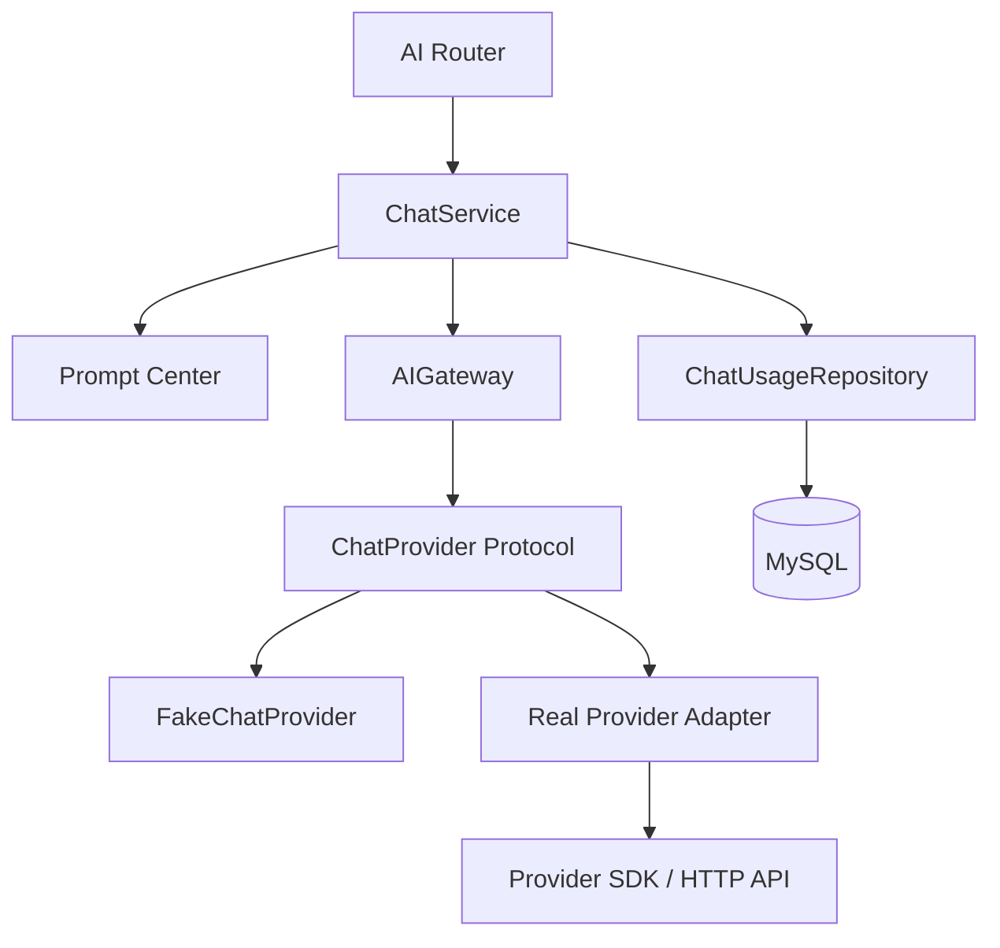
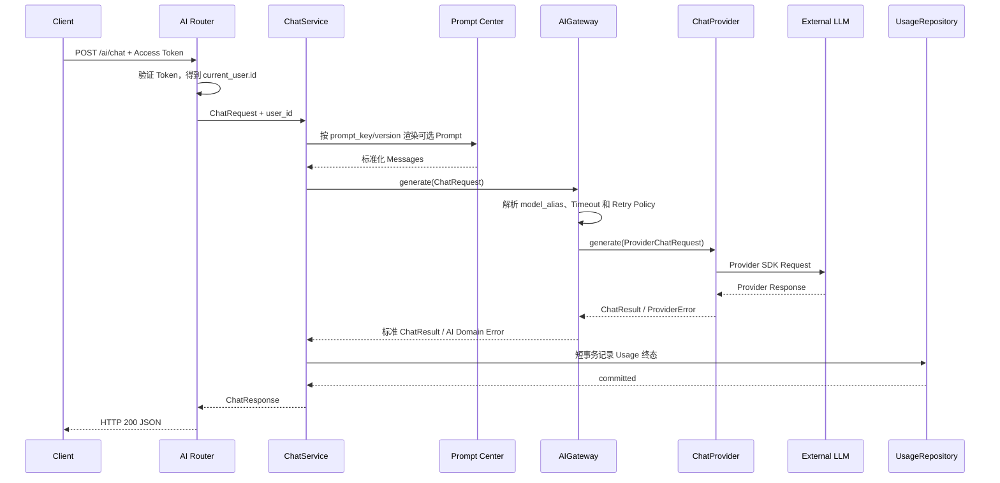
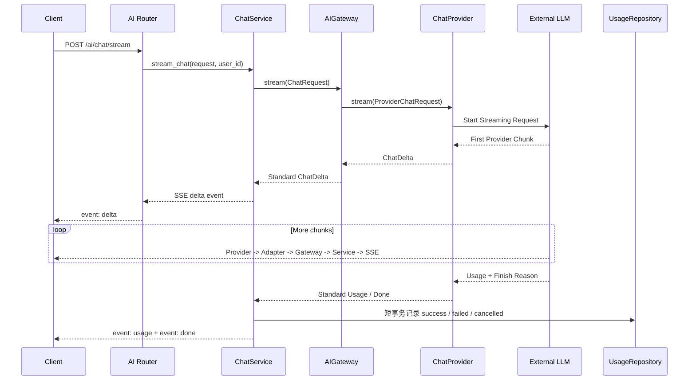
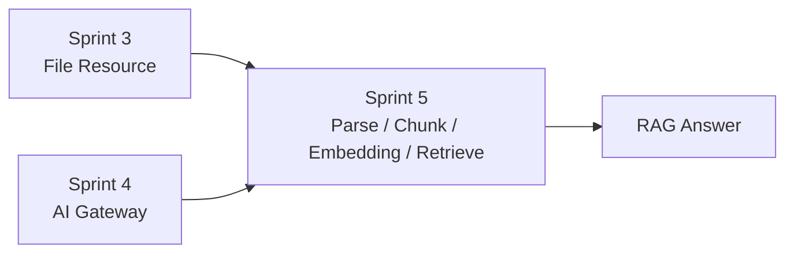

# Sprint 4: AI Gateway（AI 接入层）

## 状态

Sprint 4 正在实施。Story 4.0 至 4.5 已完成：Provider 稳定契约、领域异常、
Fake Provider、配置注册表、Factory、OpenAI-compatible Adapter、AIGateway、
ChatService 和非流式 `/ai/chat` 已有代码、离线测试与真实纵向验证；Prompt Center、
Streaming 与 Usage 持久化仍在后续 Story 中实现。

```text
Current Sprint: Sprint 4 AI Gateway
Current Story: Story 4.6 SSE Streaming
Current Goal: 在非流式主线上增加可取消、可识别终态的 SSE 响应
Current Step: Step 1 - 确认 Gateway Stream 的输入、输出与首个 Event 前重试边界
```

| Story | 状态 | 已形成的证据 |
| --- | --- | --- |
| 4.0 Gateway Evolution & System Map | 已完成 | 稳定业务边界、完整调用链与 Sprint 地图 |
| 4.1 LLM & HTTP Streaming Foundation | 已完成 | Token、Context、SSE、取消与 Backpressure 设计 |
| 4.2 Domain, API & Failure Design | 已完成 | 分层契约、失败矩阵、三份架构文档与 ADR-0025 至 ADR-0027 |
| 4.3 ChatProvider & Fake Provider | 已完成 | Provider DTO、Protocol、领域异常、Fake 与 22 个测试 |
| 4.4 Config, Factory & Real Provider | 已完成 | Provider Registry、Factory 缓存、真实 Adapter 与真实联调 |
| 4.5 AIGateway & Non-stream Chat API | 已完成 | AIGateway、ChatService、`POST /ai/chat`、Context Window、安全错误、API 测试与真实纵向验证 |
| 4.6 SSE Streaming | 当前 | 待实现流式 Gateway、Service、Router、事件终态与取消释放 |

## Sprint 定位

Sprint 3 已经解决“用户文件如何安全进入、保存、授权和退出系统”。Sprint 4 开始解决另一个平台级问题：业务如何以稳定、安全、可观测的方式调用外部大模型。

本 Sprint 不是只实现一个聊天页面，也不是把某个 SDK 包一层函数，而是建立后续 RAG、Workflow、Agent 和 MCP 都能复用的 AI 接入层：

```text
客户端与未来业务
  -> 统一 Chat API
  -> 业务服务
  -> AI Gateway
  -> Provider Adapter
  -> 外部模型服务
  -> 标准化结果或流式事件
  -> Usage 与成本记录
```

外部 Provider、SDK、模型名称和响应结构可以变化；业务依赖的请求、结果、异常和流式事件必须尽量稳定。

## Sprint North Star

Sprint 4 完成后，应具备以下能力：

1. 能解释直接调用模型 SDK 与建立 AI Gateway 的适用边界。
2. 能设计不泄露 Provider SDK 类型的 Chat 请求、结果和流式事件。
3. 能使用最小 `ChatProvider` 抽象隔离具体模型厂商。
4. 能通过配置、Factory 和模型别名切换 Provider，而不修改业务 Service。
5. 能实现带认证、参数约束和安全错误语义的非流式 Chat API。
6. 能使用 SSE 实现流式输出，并正确处理断连、取消、流中错误和资源释放。
7. 能区分可重试与不可重试错误，避免流式响应开始后重复生成和重复计费。
8. 能建立文件型 Prompt Center，管理 Prompt Key、版本、模板和变量。
9. 能记录 Token Usage、Latency、结果状态和成本快照，同时不保存敏感正文。
10. 能使用 Fake Provider、Provider Contract Test 和真实 Provider Integration Test 验证完整链路。
11. 能让 Sprint 5 RAG 直接复用 AI Gateway，而不把 Provider SDK 引入 RAG 业务层。

## Sprint 4 思维导图



学习过程中先用这张图确认当前知识点属于哪个分支，再回到端到端调用链定位它在真实请求中的位置。

## 先看一张大图



每个小步骤都必须能回答：

1. 当前正在实现图中的哪一段。
2. 这一层接收什么稳定输入，返回什么稳定输出。
3. Provider 失败后由哪一层转换异常。
4. 请求结束后 Usage 和日志留下什么安全证据。
5. 更换 Provider 时哪些业务代码不应该变化。

## Sprint 范围

### 本 Sprint 实现

- 面向文本生成的最小 `ChatProvider` 能力边界。
- 标准化 Message、Chat Request、Chat Result、Token Usage 和 Stream Event。
- Fake Provider、Provider Contract Test 和至少一个真实 Provider Adapter。
- Provider Factory、模型别名、默认模型和统一配置。
- 非流式 Chat Gateway、Chat Service 和认证 API。
- SSE Streaming、客户端断连取消、流中错误和资源释放。
- Timeout、有限 Retry、Provider 异常翻译和安全日志。
- 文件型 Prompt Center、显式版本和严格变量校验。
- Chat Usage Model、Alembic Migration、Repository 和成本快照。
- Unit、API、Contract、真实 Provider Integration 和纵向测试。
- AI Gateway 架构、流程、安全、API、ADR 和面试题文档。

### 本 Sprint 只学习或设计，不实现

- Circuit Breaker、多 Provider 自动故障转移、负载均衡和复杂动态路由。
- 每用户预算、配额、充值、账单和财务级成本核算。
- Provider 请求队列、异步任务、Scheduler 和后台重试 Worker。
- Prompt 在线编辑后台、审批流、灰度发布和 A/B Test。
- Conversation、消息历史、长期 Memory 和多轮会话持久化。
- Tool Calling、Agent Planning 和 MCP Tool 执行。
- 图片、音频、视频和其他多模态生成。
- 内容审核、DLP、PII 自动识别和完整 Prompt Injection 防护平台。
- 将外部 LLM Provider 纳入整个应用的全局 Readiness。

### 明确属于后续 Sprint

- 文档解析、Chunk、Embedding、Rerank、Vector Store 和 RAG 属于 Sprint 5。
- Workflow 编排属于 Sprint 6。
- Tool Calling、Memory、Planning 和 Agent Runtime 属于 Sprint 7。
- MCP Client、MCP Server 和工具生态属于 Sprint 8。
- 跨系统 Metrics、Tracing、Dashboard 和告警平台属于 Sprint 9；Sprint 4 只完成自身必要日志与 Usage。
- 消息队列、后台任务、异步重试和调度属于 Sprint 10。

## 为什么不直接调用 Provider SDK

直接调用：

```text
ChatService
  -> OpenAI SDK Request
  -> OpenAI SDK Exception
  -> OpenAI SDK Response
```

问题是业务层会同时依赖：

- Provider 的请求字段和模型名称。
- Provider 的同步、异步和 Streaming API。
- Provider 的异常类与错误码。
- Provider 的 Token Usage 和 Finish Reason 结构。
- Provider 的认证、Base URL、Timeout 和 Retry 配置。

使用 Gateway：

```text
ChatService
  -> Stable ChatRequest
  -> AIGateway
  -> ChatProvider
  -> Provider SDK
```

业务层只依赖项目自己的稳定契约。Gateway 不隐藏所有差异，而是只统一当前业务真正需要的共同能力；Provider 特有能力不能为了“看起来通用”而提前塞入接口。

## 学习推进方式

每个大功能开始前一次性确认：

```text
目标与用户主线
  -> 完整调用链
  -> 稳定契约与职责边界
  -> 失败、取消和一致性
  -> 安全、日志与 Usage
  -> 测试矩阵
  -> 实现顺序
```

之后每次只推进一个小步骤：

```text
理解当前位置
  -> 开发者实现关键代码
  -> AI Review 真实修改
  -> 测试验证
  -> 文档同步
  -> Story Review
  -> Git Commit
```

关键业务代码默认由开发者编写。AI 负责设计解释、代码 Review、测试执行、错误定位、机械格式修复、ADR、Sprint 状态和配套文档同步。开发者明确要求 AI 直接实现时，再由 AI 完成约定范围。

复杂功能默认同时提供：

- 一张知识思维导图，用于建立全局概念地图。
- 一张端到端用户流程图，用于定位真实请求。
- 必要的时序图或状态图，用于解释调用顺序和失败分支。

## Story 路线图

```mermaid
flowchart LR
    S40["4.0 Gateway Evolution<br/>& System Map"] --> S41["4.1 LLM & HTTP<br/>Streaming Foundation"]
    S41 --> S42["4.2 Domain, API<br/>& Failure Design"]
    S42 --> S43["4.3 ChatProvider<br/>& Fake Provider"]
    S43 --> S44["4.4 Config, Factory<br/>& Real Provider"]
    S44 --> S45["4.5 AIGateway<br/>& Non-stream API"]
    S45 --> S46["4.6 SSE Streaming"]
    S46 --> S47["4.7 Prompt Center"]
    S47 --> S48["4.8 Usage<br/>& Observability"]
    S48 --> S49["4.9 Lifecycle, Testing<br/>& Sprint Review"]
```



测试、日志、安全和文档随每个 Story 同步完成。Story 4.9 负责整体验收，不负责把前面遗漏的工程工作集中补上。

## 目标架构与职责



| 层 | 主要职责 | 禁止事项 |
| --- | --- | --- |
| AI Router | HTTP、认证依赖、请求 Schema、JSON/SSE 响应 | 不调用 Provider SDK，不写业务流程 |
| ChatService | 用户业务用例、Prompt 选择、调用 Gateway、Usage 终态 | 不写 SQL，不处理厂商响应结构 |
| AIGateway | 模型别名、Provider 调用、Timeout、Retry、结果和异常标准化 | 不访问 HTTP Request，不保存业务数据 |
| ChatProvider | 将稳定契约适配为厂商 SDK，并转换底层错误 | 不知道当前用户、Repository 或 FastAPI |
| Prompt Center | Prompt 加载、版本、模板和变量校验 | 不调用模型，不访问用户数据库 |
| ChatUsageRepository | Usage SQL 读写 | 不保存 Prompt/回答正文，不决定 HTTP |
| Model | 描述 Usage 数据库结构 | 不承担计费或调用流程 |
| Schema / DTO | 输入输出与校验 | 不访问数据库或 Provider |

当前不同时保留职责重复的 `AIClient` 和 `AIGateway`。本 Sprint 使用 `AIGateway` 作为业务内部的稳定 AI 调用入口；未来出现跨进程 SDK 或独立网关服务需求时，再评估是否引入单独 Client。

## 非流式完整时序



如果 Provider 在返回内容前失败，Gateway 根据统一规则进行有限重试或抛出领域异常，全局 Exception Handler 再映射为安全 HTTP 响应。

## SSE Streaming 完整时序



流式请求的重要边界：

- 第一个 SSE Event 发送前，可以返回普通 HTTP 错误，也可以按策略进行有限重试。
- 第一个 Delta 发送后，HTTP Header 已经发出，后续错误只能使用安全的 SSE `error` Event 表达。
- 第一个 Delta 发送后禁止自动重试，否则可能产生重复文本和重复计费。
- 客户端断开时取消上游请求、关闭 Provider Stream，并记录 `cancelled`；不能当作系统错误重试。
- Streaming 期间不持有数据库 Transaction；Usage 在终态使用短事务落库。
- Provider 未返回最终 Usage 时，Token 字段允许为空或标记为不完整，不能伪造精确数据。

## 公共 API 契约

非流式 `POST /ai/chat` 已在 Story 4.5 实现。流式接口保留独立路径，在 Story 4.6 实现，避免同一路径根据 `stream` 布尔值返回两种 Content-Type：

```http
POST /ai/chat
POST /ai/chat/stream
```

非流式请求：

```json
{
  "messages": [
    {
      "content": "Explain AI Gateway."
    }
  ],
  "model": "general",
  "temperature": 0.7,
  "max_output_tokens": 1024
}
```

约束：

- `messages` 必填且至少一条，每条 `content` 非空；条数、单条长度和总输入预算均受服务端限制。
- 客户端不提交 `role`。ChatService 将公开 Message 转为内部 `user` Message，并由 Prompt Center 提供受控的 `system` Message。
- `model` 是项目控制的模型别名，不是任意 Provider 模型名称。
- `model`、`temperature` 和 `max_output_tokens` 可省略并使用服务端默认值；显式值超过服务端上限时直接拒绝，不静默截断。
- 客户端不能提交 `provider`、`base_url`、API Key 或厂商特有参数。
- `owner_id/user_id` 只能来自当前认证用户，不能由 Body 指定。
- 输入 Token 估算加输出预算超过模型 Context Window 时直接拒绝；合法生成达到输出上限时以 `finish_reason=length` 正常结束。

非流式响应：

```json
{
  "request_id": "01J...",
  "model": "general",
  "content": "An AI Gateway is...",
  "finish_reason": "stop",
  "usage": {
    "input_tokens": 24,
    "output_tokens": 80,
    "total_tokens": 104
  }
}
```

响应不返回真实 Provider、Base URL、内部模型名称、原始厂商响应或 Secret。

## SSE 事件候选

```text
event: delta
data: {"request_id":"01J...","content":"An AI"}

event: usage
data: {"request_id":"01J...","input_tokens":24,"output_tokens":80,"total_tokens":104}

event: done
data: {"request_id":"01J...","finish_reason":"stop"}
```

流开始后的失败使用稳定错误事件：

```text
event: error
data: {"code":"ai_provider_unavailable","detail":"AI service is temporarily unavailable."}
```

SSE 数据不得直接透传 Provider 原始 Chunk；否则业务客户端会重新依赖厂商协议。
Provider 层本身不产生 `error` Event，而是抛出项目定义的 `ProviderError`；
Gateway、Service 和 Router 在流已经开始后，才把异常翻译成公共 SSE `error` Event。

## 已确认的分层契约

```text
Public API Schema（Story 4.5 已实现）
  messages[].content
  model alias / temperature / max_output_tokens

Internal ChatRequest（Story 4.5 已实现）
  messages
  model_alias
  temperature
  max_output_tokens

ProviderChatRequest（已实现）
  request_id / messages / provider_model
  temperature / max_output_tokens

ChatResult（已实现）
  request_id
  content
  finish_reason
  usage

TokenUsage（已实现）
  input_tokens
  output_tokens
  total_tokens

Provider ChatEvent（已实现）
  delta | usage | done

Public SSE Event（计划）
  delta | usage | done | error
```

`ProviderChatRequest.provider_model` 是 Gateway 根据模型别名解析后的内部字段，不能回传客户端；API Key 只属于真实 Provider 初始化配置，不进入任何 Request DTO。`finish_reason` 和 `usage` 是 Provider 返回结果，不是 Provider 初始化参数。

接口只包含当前文本生成主线需要的能力。不要在同一个 Provider Protocol 中提前增加 `embedding()`、`rerank()` 和 `image()`；Sprint 5 或后续阶段应按真实能力新增独立 Protocol，避免一个 Provider 被迫实现不支持的方法。

## 模型别名与 Provider 配置

```text
客户端 model=general-chat
  -> Model Alias Policy
  -> provider=openai_compatible
  -> internal_model=provider-model-name
  -> ChatProvider
```

模型别名解决两个问题：

1. 客户端不绑定真实厂商模型名称。
2. 运维可以切换底层模型，而不要求所有业务客户端发版。

候选配置：

```text
AI_PROVIDER
AI_API_KEY
AI_BASE_URL
AI_DEFAULT_MODEL_ALIAS
AI_MODEL_ALIASES
AI_CONNECT_TIMEOUT_SECONDS
AI_READ_TIMEOUT_SECONDS
AI_MAX_RETRY_ATTEMPTS
AI_MAX_OUTPUT_TOKENS
AI_DEFAULT_TEMPERATURE
```

所有配置通过 Pydantic Settings 管理。API Key 使用 Secret 类型，禁止写入代码、日志、测试快照或提交到仓库。

## Timeout 与 Retry 边界

| 场景 | 是否重试 | 原因 |
| --- | --- | --- |
| 建连失败，尚未收到输出 | 有限重试 | 通常属于短暂网络故障 |
| Provider 429，尚未收到输出 | 按上限和 Retry-After 候选重试 | 需要严格限制等待和次数 |
| Provider 5xx，尚未收到输出 | 有限重试 | 可能是短暂服务故障 |
| Provider 鉴权或余额错误 | 不重试 | 配置或账号问题不会自行恢复 |
| Context Too Long 或请求校验失败 | 不重试 | 相同请求重试仍会失败 |
| 已经发送第一个 Delta | 不重试 | 会重复输出并可能重复计费 |
| 客户端主动断开 | 不重试 | 用户已不再需要响应 |

即使尚未收到输出，Provider 也可能已经开始计费，所以 Retry 不是免费的可靠性按钮。Story 4.2 必须确认最大次数、退避、总体 Deadline、日志和 Usage 记录方式。

## 错误语义候选

| 场景 | 非流式 HTTP 候选 | Streaming 开始后 |
| --- | ---: | --- |
| Access Token 缺失或无效 | 401 | 流不会开始 |
| 账号停用 | 403 | 流不会开始 |
| 请求字段、Message 或模型别名非法 | 422/400 | 流不会开始 |
| Context Too Long | 400 | `error` Event |
| Provider Rate Limit | 503 或受控 429 | `error` Event |
| Provider Timeout | 504 | `error` Event |
| Provider 不可用 | 503 | `error` Event |
| Provider 凭据或余额配置错误 | 503 | `error` Event |
| 未预期内部错误 | 500 | 安全 `error` Event |
| 客户端断开 | 无最终响应 | 记录 cancelled |

Provider 原始错误信息可能包含 Request、Endpoint 或内部细节，不能直接作为客户端 `detail` 或日志内容。最终状态码与错误码在 Story 4.2 设计 Review 后固化。

## Prompt Center 候选

Sprint 4 先使用文件型 Prompt Center，通过 Git 获得 Review、审计和回滚能力：

```text
app/ai/prompts/
  summary/
    v1.md
  translate/
    v1.md
  assistant/
    v1.md
```

每个 Prompt 至少具有：

```text
prompt_key
version
template
required_variables
```

规则：

- 业务代码只引用 `prompt_key + version`，不硬编码长 System Prompt。
- 缺少变量、未知变量、未知 Prompt 或未知版本必须明确失败。
- 使用严格模板渲染，不能静默把缺失变量渲染为空字符串。
- 日志记录 Prompt Key 和 Version，不记录渲染后的完整 Prompt。
- Prompt 版本不会自动覆盖旧版本；变更通过新版本和代码 Review 发布。
- RAG Prompt 可以预留名称，但在 Sprint 5 进入前不实现 RAG 内容和检索变量。

## Usage 数据模型候选

```text
id
request_id
user_id
model_alias
provider
provider_model
prompt_key
prompt_version
input_tokens
output_tokens
total_tokens
latency_ms
status
error_code
estimated_cost
currency
pricing_version
created_at
completed_at
```

关键原则：

- `provider` 和真实模型是内部审计字段，不返回普通客户端。
- `status` 至少区分 `success / failed / cancelled`。
- Streaming 未获得最终 Usage 时 Token 字段允许为空，不伪造为 0。
- 成本使用请求发生时的价格快照或价格版本，避免未来价格变化改写历史估算。
- 成本使用 Decimal，不用二进制浮点承担金额计算。
- Usage 表不保存 Message、System Prompt、模型回答正文、API Key 或原始异常。
- Usage Repository 只负责 SQL；成本规则和请求终态由 Service 协调。

## 日志候选

| 事件 | 级别 | 允许字段 |
| --- | --- | --- |
| `ai.chat.success` | INFO | `request_id`、`user_id`、model alias、token、latency |
| `ai.chat.rejected` | WARNING | `request_id`、`user_id`、固定 reason |
| `ai.provider.retry` | WARNING | `request_id`、attempt、固定 reason |
| `ai.provider.unavailable` | ERROR | `request_id`、provider、固定 error type |
| `ai.stream.cancelled` | INFO | `request_id`、`user_id`、elapsed time |
| `ai.usage.persist_failed` | ERROR | `request_id`、固定 reason |

日志禁止记录：

- API Key、Authorization Header 和 Provider 凭据。
- 用户 Message、System Prompt、模型回答和原始 SSE Chunk。
- Provider Base URL 中的敏感查询参数。
- Provider 原始异常正文和完整请求响应。
- 未经清理的用户变量、文件内容或未来 RAG Context。

## 候选项目结构

保持当前项目的 Router、Service、Schema、Model 和 Repository 结构，不直接采用多层空目录：

```text
backend/app/
  ai/
    provider.py
    gateway.py
    factory.py
    exceptions.py
    providers/
      fake.py
      openai_compatible.py
    prompts/
      ...
  api/
    ai.py
  services/
    chat_service.py
  schemas/
    ai.py
  models/
    chat_usage.py
  db/repositories/
    chat_usage_repository.py
```

这是设计候选，不在 Story 4.2 Review 前创建目录。只有出现明确职责和真实代码时才新增模块，避免为了“像平台”而制造空抽象。

## Story 4.0: Gateway Evolution & System Map

### 在大功能中的位置

先理解为什么需要 AI Gateway，以及哪些部分必须稳定。当前 Story 不安装 SDK、不创建目录、不实现 Chat API。

### 学习目标

- 区分“直接 SDK 调用”“项目内 Gateway”和未来“独立 AI Gateway 服务”。
- 理解业务契约与 Provider 契约的边界。
- 理解 Adapter、Dependency Inversion 和最小 Capability。
- 识别模型、SDK、错误、Usage 和 Streaming 中的变化点。
- 理解 Sprint 3 File Resource、Sprint 4 AI Gateway 和 Sprint 5 RAG 的衔接。

### 项目练习

- 画出从客户端到外部模型的完整调用链。
- 对比直接 SDK 与 Gateway 下的依赖方向。
- 将系统内容分为“业务必须稳定”和“Provider 可以变化”两组。
- 解释为什么 `embedding/rerank/image` 不应进入当前 ChatProvider。
- 解释为什么外部 LLM 不应默认决定整个应用的 Readiness。

### 当前小步骤

Step 1 只完成稳定边界识别，在对话中用自己的话填写：

```text
业务层必须稳定：
Provider 可以变化：
AIGateway 应负责：
ChatService 应负责：
```

### 输出

- Sprint 4 思维导图。
- AI Gateway 端到端架构图。
- Sprint 范围和与 Sprint 3、Sprint 5 的边界。
- 后续 `ai-gateway-evolution.md` 和 ADR-0025 初稿输入。

### 完成标准

- 能用自己的话说明为什么不能让 ChatService 直接依赖 Provider SDK。
- 能指出 Gateway 需要统一什么，以及不应该强行统一什么。
- 能解释更换 Provider 时哪些业务代码必须保持不变。
- 能画出 Router、Service、Gateway、Provider 和外部模型的依赖方向。
- 设计 Review 通过后再进入 Story 4.1。

## Story 4.1: LLM & HTTP Streaming Foundation

### 在大功能中的位置

理解模型请求和 HTTP Streaming 的基本行为，为后续稳定契约提供依据，尚不接入真实 Provider。

### 学习目标

- System、User、Assistant Message Role。
- Token、Context Window、Input/Output Token 和 Finish Reason。
- Temperature、Max Output Tokens 和模型别名。
- HTTP 普通响应、Chunked Transfer、SSE 和 WebSocket 的区别。
- Async Iterator、Backpressure、Disconnect 和 Cancellation。

### 项目练习

- 阅读一份非流式模型响应和一段流式事件，识别稳定信息与厂商字段。
- 对比 SSE 与 WebSocket，说明当前单向文本生成为什么优先 SSE。
- 画出首个 Token 前后错误处理能力的变化。
- 草拟 JSON Response 与 `delta/usage/done/error` SSE Event。

### 完成标准

- 能解释 Token 不等于字符或单词。
- 能解释为什么 Context Too Long 不能通过重试修复。
- 能解释为什么流开始后不能再改 HTTP 状态码。
- 能说明客户端断开后服务端必须取消什么、关闭什么、记录什么。
- Story Review、文档同步和 Commit 完成。

## Story 4.2: Domain, API & Failure Design

### 在大功能中的位置

在创建 Provider 和 API 前，一次性确认领域契约、API、失败语义、Retry、安全、Usage 和测试矩阵。

### 学习目标

- 公共 API Schema、内部 DTO 和 Provider SDK Model 的区别。
- 模型别名与真实 Provider Model 的映射。
- Provider Error、AI Domain Error 和 HTTP Error 的边界。
- Timeout、Retry、Deadline、幂等与重复计费风险。
- 非流式与 Streaming 的不同错误终态。

### 设计任务

- 确认 ChatMessage、ChatRequest、ChatResult、TokenUsage 和 ChatEvent。
- 确认两个 API 的输入、输出、限制和状态码。
- 确认 Provider Protocol 的最小方法和 Async 边界。
- 确认模型别名、配置、Factory 和依赖注入方式。
- 确认错误分类、Retry Matrix、SSE Error Event 和取消行为。
- 确认 Prompt、Usage、日志敏感字段和测试矩阵。

### 输出

- [AI Gateway Architecture](../architecture/ai-gateway-architecture.md)
- [AI Gateway Flow](../architecture/ai-gateway-flow.md)
- [AI Gateway Security](../architecture/ai-gateway-security.md)
- [ADR-0025：建立 AI Gateway 边界](../architecture/adr/ADR-0025-use-ai-gateway-boundary.md)
- [ADR-0026：使用 Capability-specific ChatProvider](../architecture/adr/ADR-0026-use-capability-specific-chat-provider.md)
- [ADR-0027：Streaming、Retry 与错误终态](../architecture/adr/ADR-0027-streaming-retry-and-terminal-state.md)

### 完成标准

- 架构、API、异常、日志、安全、兼容和测试设计一次性 Review 完成。
- 每种失败都能说明客户端看到什么、是否重试、Usage 留下什么状态。
- 未确认设计前不安装 SDK、不创建 Migration、不实现业务代码。

## Story 4.3: ChatProvider & Fake Provider

### 在大功能中的位置

先建立模型调用能力边界和可控测试替身，不访问真实外部 Provider。

### 学习目标

- Python `Protocol`、ABC 和继承的取舍。
- Adapter Pattern 与 Dependency Inversion。
- Capability-specific Interface 和过度抽象。
- Async Function、Async Iterator 和类型契约。
- Provider Error 与 Domain Error 的边界。

### 实现任务

- 定义最小 ChatProvider Protocol。
- 定义 Provider 层稳定 Request、Result 和 Event。
- 实现可配置的 FakeChatProvider。
- 支持成功、分块输出、Rate Limit、Timeout、断流和取消模拟。
- 建立 Provider Contract Test，未来真实 Adapter 必须复用。

### 完成标准

- 业务调用方不导入任何厂商 SDK 类型。
- Fake Provider 能确定性验证非流式和流式行为。
- 接口中没有提前加入 Embedding、Rerank、Image 或 Tool Calling。
- Contract Test 能约束结果、事件、异常和资源关闭。
- Story Review、文档同步和 Commit 完成。

### 完成记录

- `app/ai/provider.py` 定义不可变 Provider DTO、`ChatEvent` 联合类型和 `ChatProvider` Protocol。
- `app/ai/exceptions.py` 定义 Rate Limit、Timeout、Unavailable 和 Stream 领域异常。
- `app/ai/providers/fake.py` 支持确定性的非流式成功/失败、流式事件、流前/流中错误、延迟、关闭和取消。
- Provider 契约、异常和 Fake Provider 共 22 个测试通过；完整非 Integration 测试、Ruff 与格式检查通过。
- Story 4.3 完成时尚未实现 Factory、真实 Provider、Gateway、ChatService 或 AI Router；这些能力不能从 Fake Provider 的存在推断为已经完成。

## Story 4.4: Config, Factory & Real Provider

### 在大功能中的位置

将一个真实 Provider 接入已经确认的能力边界，验证抽象不是只为 Fake Provider 服务。

### 学习目标

- 官方 SDK 与直接 HTTP 调用的取舍。
- API Key、Base URL、Model 和 Timeout 配置。
- OpenAI-compatible API 与特定厂商能力的边界。
- SDK Exception、HTTP Status 和领域异常转换。
- 真实外部服务 Integration Test 的稳定性与清理策略。

### 实现任务

- 通过 `uv` 增加选定 SDK，不手工修改 Lock File。
- 使用 Pydantic Settings 增加 AI 配置与校验。
- 实现 Provider Factory 和一个真实 Adapter。
- 将厂商请求、响应、Usage、Finish Reason 和异常转换为稳定契约。
- 运行真实非流式与 Streaming Integration Test。
- 验证 Secret 不进入日志、异常和测试输出。

### 完成标准

- 切换 Provider 配置不修改 ChatService。
- 真实 Adapter 通过与 Fake Provider 相同的 Contract Test。
- API Key 只来自 Settings Secret，不进入提交内容。
- Provider 临时不可用不会让整个应用 Readiness 失败。
- Story Review、文档同步和 Commit 完成。

### 完成记录

- `AI_PROVIDERS` 使用 Provider Key 到受校验配置的注册表；API Key 由 `SecretStr` 持有，Base URL 必须指向兼容 API 根路径。
- Factory 按 Provider Key 创建并缓存 Adapter，SDK 内部重试关闭，连接、读取、写入和连接池等待均使用显式 Timeout。
- `OpenAICompatibleChatProvider` 完成请求、结果、Usage、Finish Reason、异常和 Streaming Event 转换，并在取消或结束时关闭上游 Stream。
- 单元测试覆盖成功、缺失 Usage、错误翻译、畸形响应、流前/流中失败、主动关闭和任务取消；真实 Integration Test 默认跳过且限制为两次短请求。
- 使用配置的真实 Provider 完成非流式与 Streaming 联调；完整离线测试、Ruff、格式检查和文档检查通过。

## Story 4.5: AIGateway & Non-stream Chat API

**状态：已完成（2026-08-12）**

### 在大功能中的位置

第一次组合认证、ChatService、Gateway 和 Provider，完成非流式纵向主线。Prompt Center
与 UsageRepository 已在调用链中预留，但分别留到 Story 4.7 和 Story 4.8。

### 学习目标

- Application Service 与 Gateway 的职责分工。
- 模型别名解析、默认值和参数上限。
- Timeout、Retry、Deadline 与异常翻译。
- FastAPI Async Router 和依赖注入。
- 业务成功日志与最终状态时机。

### 实现任务

- 实现 AIGateway 非流式 `generate()`。
- 实现 ChatService 非流式编排。
- 实现认证 `POST /ai/chat`。
- 对 Message、模型别名和生成参数进行有界校验。
- 将领域异常映射为稳定 HTTP 错误。
- 使用 Fake Provider 完成 API 测试，使用真实 Provider 完成纵向验证。

### 完成记录

- AIGateway 完成模型别名与默认值解析、生成参数上限、Context Window 预检、总 Deadline、有限重试和安全异常翻译。
- ChatService 完成请求 ID、受控 USER Message、Gateway 结果转换和无正文成功日志。
- 注册认证 `POST /ai/chat`，公共响应不泄露 Provider Model、API Key、原始错误或正文日志。
- API 测试覆盖认证、成功纵向链路、非法字段、领域错误映射和 Context Window 边界。
- 真实 `/ai/chat` 纵向测试通过；该测试默认跳过，并限制为一次、最多 16 输出 Token。
- 完整离线测试 `483 passed, 18 skipped`，Ruff、格式检查和 `git diff --check` 通过。

### 完成标准

- 认证用户能通过稳定 API 获得标准 ChatResponse。
- Router 不调用 Provider，ChatService 不导入 SDK，Gateway 不访问 HTTP。
- 不支持的模型别名和 Provider 故障具有安全错误语义。
- Retry 次数、总 Deadline 和日志可以验证。
- Story Review、文档同步和 Commit 完成。

## Story 4.6: SSE Streaming

### 在大功能中的位置

在已完成的非流式主线之上增加流式响应，不复制第二套 Provider 业务逻辑。

### 学习目标

- SSE Event、Data、Content-Type 和连接生命周期。
- Async Generator、Cancellation 和 `finally` 清理。
- 首个 Token 延迟、总耗时和流式空闲超时。
- 首个 Delta 前后的 Retry 与错误表达差异。
- 客户端消费、断开和完成状态。

### 实现任务

- 实现 AIGateway 和 ChatService 的 Stream 边界。
- 实现认证 `POST /ai/chat/stream`。
- 输出标准 `delta/usage/done/error` Event。
- 客户端断开时取消 Provider 请求并释放 Stream。
- 覆盖首个 Chunk 前失败、流中失败、正常完成和取消。
- 确保流开始后不会返回 Provider 原始错误或触发自动重试。

### 完成标准

- SSE 客户端可以逐段接收文本并识别明确终态。
- 所有成功、失败和断连路径都会关闭 Provider Stream。
- 首个 Delta 后不重试、不重复输出。
- Streaming 期间不持有长数据库 Transaction。
- Story Review、文档同步和 Commit 完成。

## Story 4.7: Prompt Center

### 在大功能中的位置

将稳定业务 Prompt 从 Python 代码中分离，让 ChatService 按 Key 和 Version 使用可审计模板。

### 学习目标

- Prompt Template、Variable、Version 和渲染边界。
- Git-based Prompt Management 与数据库 Prompt Center 的取舍。
- Strict Variable Validation。
- Prompt Injection、用户输入和 System Prompt 的边界。
- Prompt 日志、测试和回滚策略。

### 实现任务

- 定义 Prompt 文件组织和元数据格式。
- 实现 Prompt Registry、加载、缓存和严格渲染。
- 增加未知 Prompt、未知版本、缺少变量和多余变量测试。
- ChatService 通过 Prompt Key 使用模板，不读取文件路径。
- 日志只记录 Prompt Key 和 Version。

### 完成标准

- 业务 Python 中不包含需要独立维护的长 Prompt。
- Prompt 变更有显式版本、Review、测试和回滚路径。
- 用户输入不会被当作模板结构或内部变量名执行。
- Prompt/回答正文不进入应用日志。
- Story Review、文档同步和 Commit 完成。

## Story 4.8: Usage & Observability

### 在大功能中的位置

让每次 AI 调用具有可查询的资源消耗、耗时和终态，为未来预算、限流和平台可观测性提供事实基础。

### 学习目标

- Token Usage、Latency、Time to First Token 和 Finish Reason。
- 成本估算、Decimal、价格版本和历史快照。
- 成功、失败、取消和部分 Usage。
- SQLAlchemy Model、Migration、Repository 与短事务。
- Usage、业务日志、Metrics 和 Billing 的区别。

### 实现任务

- 创建 ChatUsage Model 和 Alembic Migration。
- 创建 ChatUsageRepository，不在 ChatService 中写 SQL。
- 非流式和 Streaming 都记录明确终态。
- 记录 Token、Latency、可选 TTFT、模型和成本快照。
- Provider 未返回 Usage 时保留未知，不伪造数据。
- 验证 Message、Prompt、回答、Secret 和原始错误不进入数据库或日志。

### 完成标准

- Migration 可以 Upgrade、Downgrade、再次 Upgrade。
- 成功、Provider 失败、流中失败和客户端取消都有记录。
- Usage 写入失败不会把已完成的模型回答伪装成未发生。
- 成本历史不会因以后修改价格配置而被重新解释。
- Story Review、文档同步和 Commit 完成。

## Story 4.9: Lifecycle, Testing & Sprint Review

### 在大功能中的位置

整合从认证请求到模型输出和 Usage 落库的完整生命周期，完成 Sprint 级验收。

### 学习目标

- AI 请求的 `started -> streaming -> success/failed/cancelled` 生命周期。
- Unit、Contract、API、Integration 和 Vertical Test 的职责。
- 外部 Provider 测试的成本、速率和稳定性边界。
- AI 安全日志、错误审计和数据最小化。
- Gateway 对 Sprint 5 RAG 的复用边界。

### 实现与 Review 任务

- Review 非流式与 Streaming 所有终态。
- 使用 Fake Provider 验证确定性失败、Retry、断流和取消。
- 使用真实 Provider 验证最小非流式和 Streaming 链路。
- 验证 Provider 故障不影响认证、文件和 Health 基线。
- 检查日志、数据库、异常和响应不存在敏感正文或 Secret。
- 更新 README、Project Constitution、Sprint、API、Architecture 和 ADR。
- 完成 Code Review 评分和 Sprint 面试题复查。
- 全量验收后创建 Sprint 收尾 Commit 与 Annotated Tag `sprint4`。

### 完成标准

- 每次 AI 请求的成功、失败和取消终态可解释、可测试、可审计。
- Fake 与真实 Provider 都通过约定的核心契约。
- 普通测试、Integration Test、Ruff、格式和 `git diff --check` 全部通过。
- Architecture、Security、Code 和 Documentation Review 无阻断问题。
- Code Review 综合评分达到 90 分及以上。
- 创建 Sprint 收尾 Commit，并创建 Annotated Tag `sprint4`。

## 测试矩阵

| 层级 | 重点 |
| --- | --- |
| Schema / Domain Unit | Message、参数范围、模型别名、Result、Event 和错误码 |
| Prompt Unit | Prompt Key、Version、变量、严格渲染、缓存和日志边界 |
| Provider Contract | 非流式、Delta、Usage、Done、Error、取消和资源关闭 |
| Gateway Unit | 模型路由、Timeout、Retry、Deadline 和异常转换 |
| Repository Unit | Usage 成功/失败/取消、Nullable Token、排序和事务边界 |
| Service Unit | Prompt、Gateway、Usage 终态、成本快照和日志时机 |
| API Test | 200/400/401/403/422/429/500/503/504 与 SSE Content-Type |
| Streaming Test | 首个 Chunk、多个 Delta、流中错误、断连、取消和 Close |
| Real Provider Integration | 真实非流式、Streaming、Usage、超时和安全配置 |
| Vertical Flow | Register/Login -> Chat -> Stream -> Usage -> Provider 故障恢复 |

真实 Provider Test 必须设置严格调用数量和 Token 上限，避免测试失控产生费用。默认普通测试不依赖网络或真实 API Key；真实测试使用 Integration Marker 和本地环境 Secret。

## 面试题同步

Sprint 4 至少覆盖以下核心问题：

1. 为什么业务系统需要 AI Gateway，而不是直接调用 OpenAI SDK？
2. Adapter Pattern 和简单 SDK Wrapper 有什么区别？
3. 为什么 Provider 接口应该按 Capability 拆分？
4. SSE 和 WebSocket 如何选择？
5. 为什么 Streaming 发出首个 Token 后不能自动重试？
6. Timeout、Retry、Rate Limit 和 Context Too Long 应如何分类？
7. Prompt 为什么需要版本、变量校验和审计？
8. Usage、成本、Latency 和 TTFT 应如何记录？

每个 Story 完成时同步 1 至 2 道与真实代码直接相关的题目，记录简答、深入回答、项目证据、常见追问和 `理解 / 能讲 / 能画 / 能写` 状态。Sprint Review 不集中补题，而是复查已经随 Story 完成的内容。

## ADR 输出

当前 ADR 已使用到 ADR-0024，Sprint 4 从 ADR-0025 开始：

- ADR-0025：为什么建立 AI Gateway，而不是业务直接依赖 Provider SDK。（已接受）
- ADR-0026：为什么使用 Capability-specific Provider Protocol。（已接受）
- ADR-0027：SSE Streaming、Retry 和错误终态策略。（已接受）
- ADR-0028：Prompt Center 的文件版本策略。
- ADR-0029：Usage、成本快照与内容数据最小化。

只有形成长期且重要的技术决策时才创建 ADR。Story 4.2 必须先检查最新 ADR 编号，禁止直接复用候选编号。

## Sprint 输出成果

### 功能

- 认证非流式 Chat API。
- 认证 SSE Streaming Chat API。
- AI Gateway 与 ChatProvider 抽象。
- Fake Provider 和一个真实 Provider Adapter。
- 模型别名、配置、Timeout 和有限 Retry。
- 文件型 Prompt Center。
- Chat Usage 与成本快照。

### 工程

- Router、Service、Gateway、Provider、Repository 和 Schema 分层。
- AI Gateway 架构、流程和安全文档。
- Usage Alembic Migration。
- 统一异常、日志和敏感数据边界。
- Unit、Contract、API、Streaming、Integration 和 Vertical Test。
- ADR-0025 起的必要架构决策。

### 学习

- AI Gateway 与 Provider Adapter。
- LLM 请求、Token、Context 和 Finish Reason。
- Async Streaming、SSE、Backpressure 和 Cancellation。
- Timeout、Retry、Rate Limit 和错误分类。
- Prompt 工程化与版本管理。
- Usage、Latency、TTFT 和成本快照。

## Sprint 验收标准

### 功能

- [ ] 认证用户可以完成非流式 Chat。
- [ ] 认证用户可以接收标准 SSE 流并识别明确终态。
- [ ] Provider 可以通过配置切换，ChatService 不修改。
- [ ] Prompt 可以通过 Key 和 Version 严格渲染。
- [ ] 成功、失败和取消请求都有可查询 Usage 记录。

### 工程

- [ ] Router、Service、Gateway、Provider 和 Repository 职责清晰。
- [ ] Provider SDK 类型和原始事件不泄露到业务与客户端。
- [ ] Timeout、Retry、错误、取消和资源释放行为完成。
- [ ] Secret、Message、Prompt 和回答正文不进入日志或 Usage 表。
- [ ] Migration Upgrade/Downgrade 通过。
- [ ] Unit、Contract、API、Streaming、真实 Provider 和纵向测试通过。
- [ ] README、Sprint、API、Architecture、ADR 和面试题同步。
- [ ] Code Review 综合评分达到 90 分及以上。
- [ ] 每个 Story 有独立 Commit，Sprint 有收尾 Commit 和 `sprint4` Tag。

## 与 Sprint 3 的衔接

Sprint 3 提供：

```text
Access Token -> current_user.id
File Resource -> stable file_id
StorageProvider -> LocalStorage / MinIO
MySQL -> File Metadata
```

Sprint 4 复用：

- 认证依赖产生可信 `current_user.id`，AI API 不重复实现认证。
- Pydantic Settings、Factory、Protocol 和 Dependency Injection 模式。
- Router -> Service 的边界，以及 Service 不写 SQL 的规则。
- 统一 Exception Handler、Logging 和安全字段策略。
- Fake/Unit、API、真实依赖 Integration 和纵向测试分层。

Sprint 4 不直接消费 File Bytes。文件进入模型前仍需要解析、Chunk、Embedding 和检索，这属于 Sprint 5：



这意味着 Sprint 3 和 Sprint 4 是 Sprint 5 的两条独立基础设施输入：一条提供可靠文件资源，一条提供稳定模型调用。

## 与长期路线的关系

```text
Sprint 1 Authentication
  -> Sprint 2 Session & Identity
  -> Sprint 3 Storage & Resource Management
  -> Sprint 4 AI Gateway
  -> Sprint 5 Knowledge / RAG
  -> Sprint 6 Workflow
  -> Sprint 7 Agent Runtime
  -> Sprint 8 MCP Integration
  -> Sprint 9 Observability
  -> Sprint 10 Async Platform
  -> Sprint 11 Cloud Native
```

Sprint 4 的核心承诺是：后续 RAG、Workflow、Agent 和 MCP 只依赖稳定 AI Gateway，不直接依赖某个 Provider SDK。
