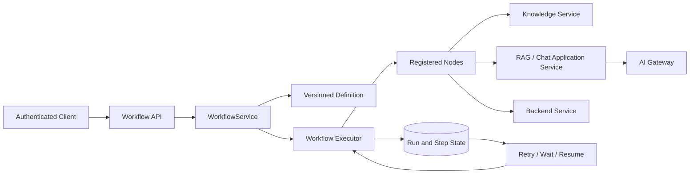
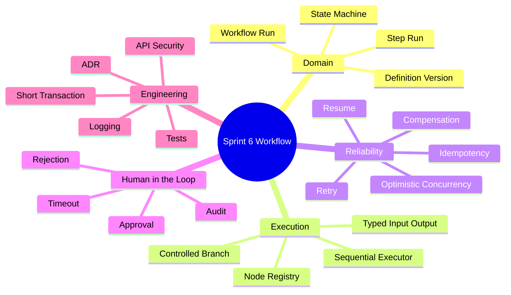
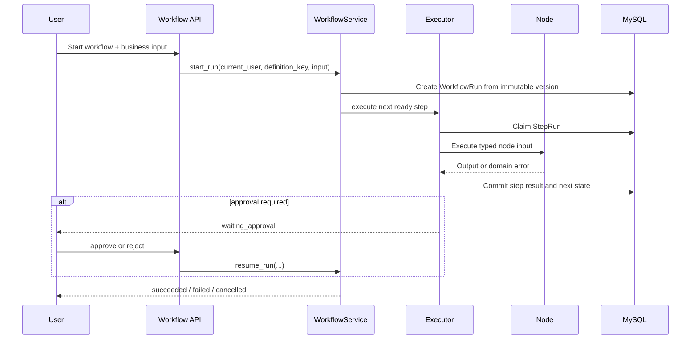
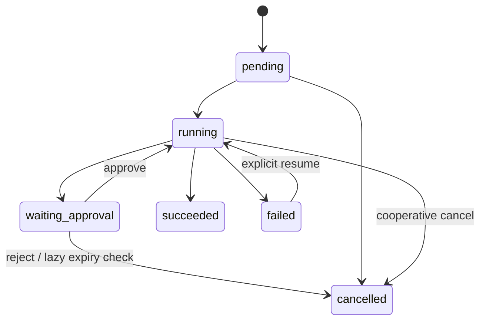

# Sprint 6: Workflow（工作流编排）

## 状态

Sprint 6 为计划阶段，必须在 Sprint 5 Knowledge / RAG 完成并验收后开始；同时选定一个
足够小的真实业务场景作为贯穿案例。

```text
Planned Sprint: Sprint 6 Workflow
Entry Condition: Sprint 5 RAG 闭环、Citation、测试与文档验收完成；已选定一个贯穿业务案例
North Star: 让开发者预定义的多步骤业务可以持久化、重试、暂停和恢复
```

本文件定义未来学习与实施顺序，不代表相关能力已经实现。进入 Sprint 6 后仍严格按照
“一个 Story、一个小步骤”推进。

## 业务学习方式

Sprint 6 不要求在开始前完成一套完整的产品设计。先选择一个真实业务案例，在每个 Story
中只补充当前步骤需要的角色、规则和异常路径；遇到新的失败或边界，再回到案例中修正模型。

贯穿案例暂定为：

```text
知识修订提交 -> 审核 -> 索引/发布 -> 员工检索并获得带 Citation 的回答
```

案例用于理解 Workflow 与业务的关系，不代表现在就实现完整的知识治理产品。

## Sprint 定位

Workflow 解决的是“步骤已经由开发者确定，系统怎样可靠执行”。它不是普通 Service 中的
一串函数，也不是让模型临时决定下一步的 Agent。

```text
普通 Service: 单次请求内完成一个业务用例
Workflow:      固定步骤跨状态执行，可等待、失败、恢复
Agent:         模型在受控范围内动态建议下一步动作
Async Queue:   把已定义任务交给后台 Worker，不决定业务流程
```

## Sprint North Star



完成后，开发者应能围绕一个真实业务案例设计“提交修订 -> 人工审核 -> 索引/发布 -> RAG 问答”的
可靠流程，并解释每个业务状态、执行状态、事务、重试和权限判断由谁负责。

## 知识思维导图



## 端到端用户流程



外部模型、Qdrant 或存储调用期间不得持有长数据库事务；执行前后使用短事务认领和提交状态。

## Sprint 范围

### 本 Sprint 实现

- 代码管理、不可变版本的 Workflow Definition。
- WorkflowRun、StepRun、Attempt 与明确状态机。
- 类型化 Node、注册表、顺序执行和受控条件分支。
- Retry、Resume、Idempotency 与显式补偿边界。
- Human-in-the-loop 审批、拒绝、过期策略和审计。
- 启动、查询、取消、恢复和审批 API。
- 一个真实 RAG + AI Gateway 工作流及完整测试。

### 本 Sprint 明确不做

- 可视化拖拽编辑器、用户自定义 Python/DSL 或任意 `eval`。
- 任意 DAG 并行、循环节点和无限动态拓扑。
- Cron、自动过期扫描、消息队列、分布式 Worker；这些属于 Sprint 10。Sprint 6 只在读取、
  审批或手工 reconciliation 时惰性判断审批是否过期。
- 模型动态选择步骤；这属于 Sprint 7 Agent Runtime。
- 通用跨服务 Saga 框架。

## Service-first 入口

进入 Story 6.0 时，先从以下 Use Case 建立完整方向，再补 Domain 和执行器：

```python
WorkflowService.start_run(...)
WorkflowService.get_run(...)
WorkflowService.cancel_run(...)
WorkflowService.resume_run(...)
WorkflowService.approve_run(...)
WorkflowService.reject_run(...)
```

`owner_id` 来自认证上下文；Definition Key 和业务输入来自受校验的 API；状态、已完成步骤和
审批人不得由客户端伪造。

## Story 路线图

| Story | 核心问题 | 真实项目练习 | 完成标准 |
| --- | --- | --- | --- |
| 6.0 Business Case & System Map | 业务问题怎样变成可执行流程 | 用贯穿案例画出用户、Service、Workflow 和 RAG 的全链路 | 能讲清目标、参与者、主要状态、输入来源和事务边界 |
| 6.1 Domain & State Machine | 什么状态才允许恢复 | 建 Definition、Run、StepRun、Attempt 和 Migration | 合法/非法迁移明确；Run 绑定不可变 Definition Version |
| 6.2 Definition & Node Contract | 怎样在执行前发现错误流程 | 建代码型 Registry、Node Protocol、类型化输入输出和拓扑校验 | 缺 Node、重复 ID、环路、非法边和类型不匹配启动前失败 |
| 6.3 Sequential Executor | 怎样逐步执行且留下可靠状态 | 实现认领、执行、结果持久化与下一步推进 | 成功流程逐步可查；外部 I/O 不持有数据库事务 |
| 6.4 Mapping & Branching | 上一步输出怎样安全进入下一步 | 实现字段映射和开发者定义条件分支 | 同一输入稳定走同一路径；缺字段明确失败而不误走分支 |
| 6.5 Retry, Resume & Idempotency | 重试怎样避免重复副作用 | 分类临时/永久错误，加入幂等键、attempt 和补偿 | 故障后从失败步骤恢复；成功步骤不重复执行 |
| 6.6 Human Approval | 怎样安全暂停并由人继续 | 实现 waiting_approval、批准、拒绝、expires_at 和手工 reconciliation | 读取/审批时惰性判定过期；仅有权限的人可处理；并发审批只有一次成功 |
| 6.7 API & Security | HTTP 层怎样暴露流程而不接管编排 | 实现启动、查询、取消、恢复和审批 API | Router 无业务编排；跨用户 Run 不可见；错误语义稳定 |
| 6.8 RAG Vertical Slice | 现有 Knowledge 和 Gateway 怎样服务真实业务 | 用贯穿案例完成提交/审核/索引/问答纵向闭环 | 不绕过 Prompt/Usage 终态；Citation 全程保留；依赖故障可恢复或解释 |
| 6.9 Lifecycle & Review | 系统是否真的经得住失败 | 并发、取消、超时、恢复、权限和故障注入 | 测试、ADR、面试题、Review、提交和 Sprint Tag 完整 |

## 状态与恢复原则



- 状态更新使用条件更新或乐观锁，禁止“先查再随意覆盖”。
- Retry 只针对分类后的临时失败；业务拒绝和非法输入不自动重试。
- 非幂等副作用必须有幂等键、查询确认或人工恢复策略。
- Definition 发布新版本不能改变历史 Run 的含义。
- 大结果进入 Artifact/File Resource，Run 表只保留有限摘要和引用。
- Sprint 6 没有后台 Scheduler；`expires_at` 只在查询、审批或管理员手工 reconciliation 时
  转为过期终态，Sprint 10 再加入自动扫描。

## 测试与验证矩阵

| 层级 | 必须证明的行为 |
| --- | --- |
| Domain Unit | 状态迁移、Definition 校验、字段映射、分支选择 |
| Executor Unit | 成功、失败、重试、恢复、取消、幂等和补偿 |
| Repository Integration | 原子认领、并发审批、乐观并发、Migration 升降级 |
| API | 认证、越权隐藏、输入限制、稳定错误和状态查询 |
| Real Dependency | RAG、AI Gateway 超时/失败及 Citation 保留 |
| Failure Drill | 进程在 Step 前后中断、重复 Resume、重复审批 |

## ADR 与面试题候选

- ADR：使用代码定义且带不可变版本的 Workflow。
- ADR：Workflow Run/Step Run 状态、Retry 与审批边界。
- 面试题：Workflow 与 Agent、Queue、普通 Service 的区别。
- 面试题：为什么 at-least-once 式恢复必须配合幂等。
- 面试题：外部 I/O 期间为什么不能持有数据库事务。

## 主要风险

| 风险 | 约束 |
| --- | --- |
| 并发恢复造成同一步执行两次 | 原子认领、attempt、幂等键 |
| 新 Definition 破坏历史运行 | Run 固定引用不可变版本 |
| Retry 重复扣费或写外部系统 | 错误分类、幂等、人工恢复 |
| 审批接口越权 | Principal 来自认证，资源范围由 Service 校验 |
| JSON Context 无限增长 | 大小上限、Artifact 引用、数据保留策略 |
| Workflow 演变成任意代码平台 | 只允许注册的 Node 和受控映射 |

## Sprint 验收标准

- 能从 Service 方法开始画出完整执行、等待、失败和恢复路径。
- 一个真实 Workflow 可以查询每个 Step 的状态和可审计结果。
- 重复请求、进程中断、并发审批和外部依赖故障不会破坏最终状态。
- Workflow 不直连 Provider SDK，也不直接承担 Prompt/Usage 协调；AI Node 调用现有
  RAG/Chat Application Service，再由它使用 AIGateway。
- 测试、日志、ADR、Sprint 文档、面试题和运行证据同步完成。

## 前后衔接

```text
Sprint 5: 提供 Retrieval、Context、Citation 和 RAG Answer
Sprint 6: 将这些确定性能力组成可恢复业务流程
Sprint 7: 允许模型在严格策略内动态选择已注册 Tool/Workflow
Sprint 10: 把已经验证的长 Workflow 执行迁移到后台 Worker
```
