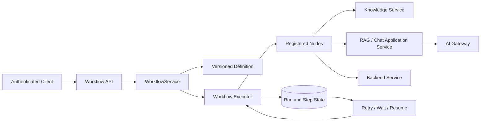
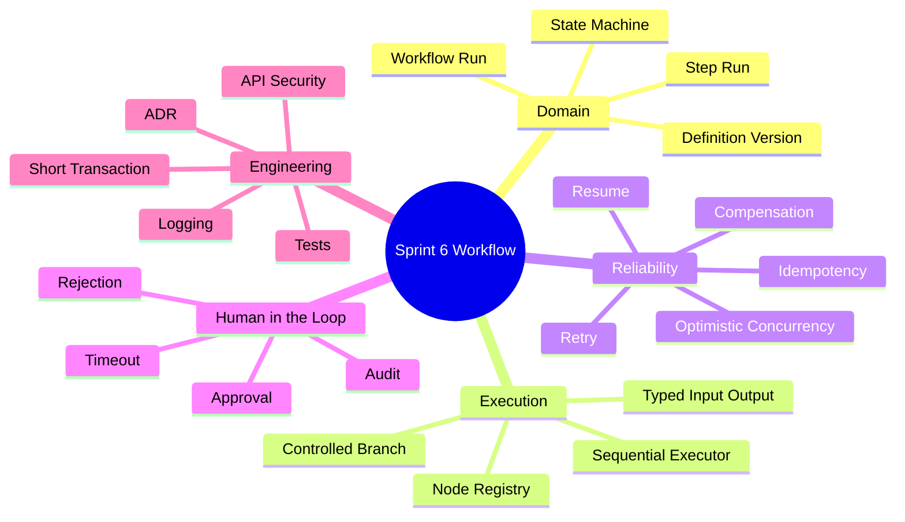
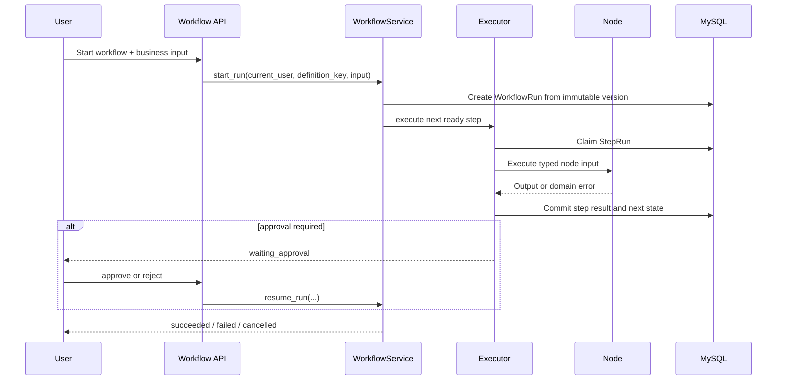
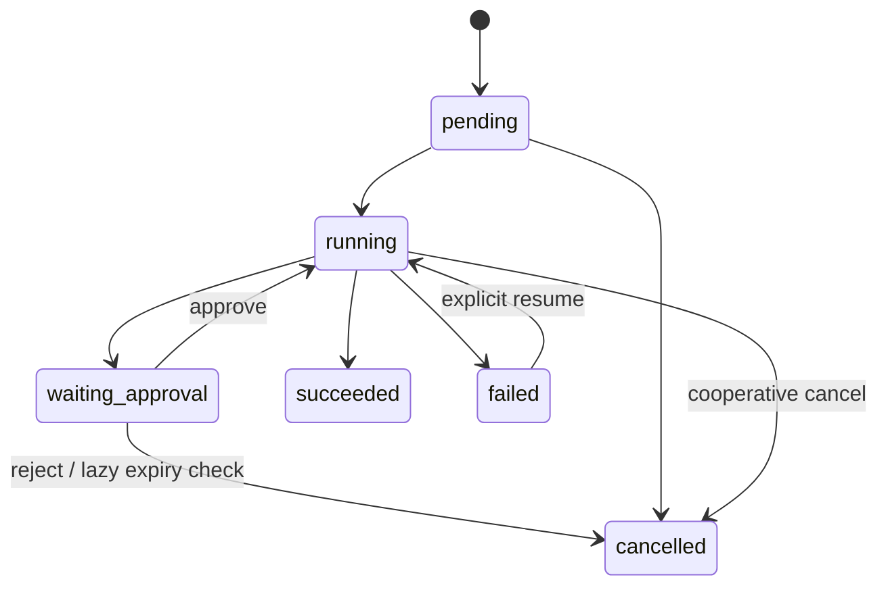

# Sprint 6: Workflow（工作流编排）

## 状态

Sprint 6 已在 Sprint 5 Knowledge / RAG 第一版完成收尾验收后进入学习阶段，并选定一个
足够小的真实业务场景作为贯穿案例。

```text
Current Sprint: Sprint 6 Workflow
Current Story: Story 6.4 Mapping & Branching
Current Step: 已完成受控字段映射、固定条件分支及其 Executor 输入接入；下一步进入 Retry、Resume 与幂等恢复
North Star: 让开发者预定义的多步骤业务可以持久化、重试、暂停和恢复
```

Workflow 能力尚未实现；Sprint 6 仍严格按照“一个 Story、一个小步骤”推进。

## 业务学习方式

Sprint 6 不要求在开始前完成一套完整的产品设计。先选择一个真实业务案例，在每个 Story
中只补充当前步骤需要的角色、规则和异常路径；遇到新的失败或边界，再回到案例中修正模型。

贯穿案例暂定为：

```text
知识修订提交 -> 审核 -> 索引/发布 -> 员工检索并获得带 Citation 的回答
```

案例用于理解 Workflow 与业务的关系，不代表现在就实现完整的知识治理产品。

## Sprint 定位

Workflow 解决的是“步骤已经由开发者确定，系统怎样可靠执行”。它不是普通 Service 中的
一串函数，也不是让模型临时决定下一步的 Agent。

```text
普通 Service: 单次请求内完成一个业务用例
Workflow:      固定步骤跨状态执行，可等待、失败、恢复
Agent:         模型在受控范围内动态建议下一步动作
Async Queue:   把已定义任务交给后台 Worker，不决定业务流程
```

## Sprint North Star



完成后，开发者应能围绕一个真实业务案例设计“提交修订 -> 人工审核 -> 索引/发布 -> RAG 问答”的
可靠流程，并解释每个业务状态、执行状态、事务、重试和权限判断由谁负责。

## 知识思维导图



## 端到端用户流程



外部模型、Qdrant 或存储调用期间不得持有长数据库事务；执行前后使用短事务认领和提交状态。

## Sprint 范围

### 本 Sprint 实现

- 代码管理、不可变版本的 Workflow Definition。
- WorkflowRun、StepRun、Attempt 与明确状态机。
- 类型化 Node、注册表、顺序执行和受控条件分支。
- Retry、Resume、Idempotency 与显式补偿边界。
- Human-in-the-loop 审批、拒绝、过期策略和审计。
- 启动、查询、取消、恢复和审批 API。
- 一个真实 RAG + AI Gateway 工作流及完整测试。

### 本 Sprint 明确不做

- 可视化拖拽编辑器、用户自定义 Python/DSL 或任意 `eval`。
- 任意 DAG 并行、循环节点和无限动态拓扑。
- Cron、自动过期扫描、消息队列、分布式 Worker；这些属于 Sprint 10。Sprint 6 只在读取、
  审批或手工 reconciliation 时惰性判断审批是否过期。
- 模型动态选择步骤；这属于 Sprint 7 Agent Runtime。
- 通用跨服务 Saga 框架。

## Service-first 入口

进入 Story 6.0 时，先从以下 Use Case 建立完整方向，再补 Domain 和执行器：

```python
WorkflowService.start_run(...)
WorkflowService.get_run(...)
WorkflowService.cancel_run(...)
WorkflowService.resume_run(...)
WorkflowService.approve_run(...)
WorkflowService.reject_run(...)
```

`owner_id` 来自认证上下文；Definition Key 和业务输入来自受校验的 API；状态、已完成步骤和
审批人不得由客户端伪造。

## Story 6.0 学习记录：知识修订审批与索引闭环

本节记录当前贯穿案例已经确认的设计结论。它是进入 Story 6.1 前的学习基线，**不是已实现的
生产代码或数据库 Schema**；现有 Sprint 5 上传入口仍会在准备 Version 后直接索引。

### 1. 先分清四类事实，不能混用状态

| 事实来源 | 回答的问题 | 典型状态 / 字段 |
| --- | --- | --- |
| Document / KnowledgeBase 审批策略 | 这类内容是否需要人工审批 | `REQUIRE_APPROVAL` / `AUTO_APPROVE_AND_INDEX` |
| KnowledgeRevision（未来业务对象） | 这次修订是否获准进入索引 | `pending` / `approved` / `rejected` / `not_required` |
| WorkflowRun / StepRun / Attempt（未来执行对象） | 这条流程、某一步、某次尝试走到哪里 | `running` / `waiting_approval` / `succeeded` / `failed` / `cancelled` |
| DocumentVersion（已实现技术对象） | 这版内容的向量索引是否可靠、是否可被 RAG 使用 | `pending` / `processing` / `indexed` / `failed` / `cleanup_required` |

因此：

```text
业务 rejected != Workflow failed != DocumentVersion failed

approved != 已被员工 RAG 使用
```

`rejected` 是人作出的正常业务决定；`failed` 是技术执行失败。员工是否能使用某一 Version，
仍由 `DocumentVersion.status == indexed` 且 `Document.active_version_id` 指向该 Version 决定。

### 1.1 Story 6.1 已实现：Workflow 执行事实模型

Story 6.1 已实现最小的持久化 Workflow 领域基础，尚未实现 Node、Executor、Service 或 API：

```text
WorkflowRun
  -> WorkflowStepRun（每条 Run 中每个固定 Step 一条）
      -> WorkflowAttempt（该 Step 的 A1、A2…）
```

- `WorkflowRun` 保存 owner、Definition key/version、受校验的 `run_input` 快照和整体状态；
  Definition 身份在后续 Service 中不可修改。
- `WorkflowStepRun` 用 `step_id` 与 `step_index` 固定当前 Run 中的步骤语义和顺序；二者在同一
  Run 内都唯一。
- `WorkflowAttempt` 用同一 Step 内唯一且大于 0 的 `attempt_number` 记录真实执行尝试。
- 三层状态均由 `StrEnum` 和 MySQL `CheckConstraint` 限制；`failed` 必须带稳定
  `failure_code`，其余状态不得残留失败码。
- `app.workflow.state_machine` 将 Run 的合法“状态 + 事件 -> 下一状态”规则集中为只读表；
  非法状态或事件立即明确失败。它不直接写数据库，后续 Service 将用该规则构造条件 UPDATE。
- Migration `e6f4c13e2a7b` 创建三张表；模型测试覆盖默认值、外键、状态、失败码和唯一约束。

状态迁移本身仍属于后续 WorkflowService / Executor：它必须使用带旧状态条件的 `UPDATE`，
并把 `rowcount == 0` 分类为幂等成功、409 或 404，不能在 ORM Model 内部偷偷改状态。

### 1.2 Story 6.2 已实现：Definition、Node 与启动期校验

Story 6.2 将“流程说明书”和“节点能力”定义为服务端代码契约，而不是数据库可编辑图或客户端
DSL。当前只支持线性单后继，尚不执行任何 Node：

```text
WorkflowDefinition(key, version, input_type, start_step_id)
  -> WorkflowStepDefinition(step_id, node_key, input_type, next_step_id)
      -> WorkflowNode(node_key, input_type, output_type, execute)
```

- `WorkflowDefinition` / `WorkflowStepDefinition` 是 `frozen dataclass`；key/version、Step ID、
  Node key 和输入类型在创建时就校验，历史 Run 将按保存的精确 key/version 查找。
- `WorkflowNode` 是 Python `Protocol`，规定 Node 必须声明输入/输出类型与 `execute()`；
  它不会直接调用 Qdrant 或 Provider SDK，真实 Node 的业务实现属于后续 Story。
- `WorkflowNodeRegistry` 先注册唯一 Node；`WorkflowDefinitionRegistry` 再检查 Definition。
  两个表均在组装后只读，Registry 校验绝不调用 `execute()`。
- 启动期明确拒绝：重复 Node key、重复 Definition key/version、缺 Node、未知后继、多个前驱、
  环、不可达 Step、Definition/Node 输入不匹配和相邻 Node 输出/输入不匹配。
- 当时 `next_step_id` 只表达固定顺序；字段映射和条件分支已在 Story 6.4 以受控契约加入，仍然
  不能使用任意 `dict`、字符串表达式或 `eval` 绕过类型校验。

因此 `start_run()` 在后续 Story 只会使用已验证的 Definition 创建 Run；若历史版本没有注册，
必须安全报 `WorkflowDefinitionNotFoundError`，绝不改用最新 Definition。

### 1.3 Story 6.3 已实现：最小顺序 Executor 与两段短事务

`SequentialWorkflowExecutor.execute_next(run_id, node_input=None)` 是当前唯一公开执行入口：它只处理
处于 `running` 的 Run 中 `step_index` 最小的 `pending` Step；没有可认领工作时返回 `None`，而
不是把并发的正常竞争误写成系统错误。

```text
短事务 1
  StepRun: pending --(带旧状态 WHERE 的 UPDATE)--> running
  Attempt: 创建 A1 = running
  commit

事务外
  根据 Run 保存的 key/version 找 Definition，再按 Step 的 node_key 找已注册 Node
  Node.execute(node_input)

短事务 2
  成功：Attempt / StepRun -> succeeded，写入安全 JSON 输出；最后一个 Step 再将 Run -> succeeded
  失败：Attempt / StepRun / Run -> failed，并共同保存稳定 failure_code
  commit
```

- `WorkflowRepository` 只封装查询和条件 `UPDATE`，不自行 `commit`；事务边界由 Executor 清晰
  控制。`rowcount == 1` 表示本调用完成状态迁移；`rowcount == 0` 是竞争或状态已变化，Executor
  回滚本段事务，绝不覆盖别人的结果。
- Node 调用、任意业务 Service 和未来的网络 I/O 都在两段 MySQL 短事务之外。当前测试 Node 只
  模拟同步调用；未来真实 Node 仍只能调用 `KnowledgeService`，不能直连 Embedding、Qdrant 或
  Provider SDK。
- Step 已认领后，无论 Node 抛异常、输入/输出契约不符合，还是历史 Definition / Node 意外缺失，
  Executor 都会尝试将 Attempt、StepRun 与 Run 收口为 `failed`，避免留下无法解释的 `running`。
- 当前输出限定为可持久化的 JSON object（`dict[str, object]`）；大结果、文件或敏感原文不能
  塞进 `output_payload`，应在后续通过受控 Artifact / File Resource 引用。
- 当时尚未实现从 `run_input` / 上一步输出构造下一步输入或条件分支；这两项已在 Story 6.4 加入。
  审批等待、重试、Service/API 和后台 Worker 仍不属于此最小执行器。

### 1.4 Story 6.4 已实现：受控映射与固定条件分支

这一层只解决两个确定性问题：下一 Node 的字段从哪里来，以及当前 Node 的安全 JSON 输出允许走向
哪一个后继。它不是脚本语言、规则引擎或让模型自由决定路径的入口。

```text
WorkflowInputBinding
  target_field <- run_input.source_field
  target_field <- previous_step_output.source_field

WorkflowBranchDefinition(selector_field="decision")
  "approved" -> "index"
  "rejected" -> "record_rejection"
```

- `WorkflowInputSource` 只有 `run_input` 与 `previous_step_output`；每个 `WorkflowInputBinding`
  只能读取它们的顶层字段并写入唯一的目标字段，不能访问任意对象属性、环境变量或客户端临时参数。
- `WorkflowBranchDefinition` 保存非空且不重复的 `WorkflowBranchCase`。一个 Step 只能有线性
  `next_step_id`、固定 `branch` 或终点三者之一；所有候选目标在应用启动时都由 Registry 检查存在、
  可达、无环、无多前驱且类型兼容。
- `WorkflowRouteResolver` 是不访问数据库、不执行 Node 的纯计算类：`build_node_input()` 缺字段时
  抛 `WorkflowInputMappingError`；`select_next_step_id()` 缺 selector、selector 非字符串或值不在
  case 中时抛 `WorkflowBranchResolutionError`。因此没有“默认批准”或静默回退分支。
- Executor 对声明 `input_bindings` 的 Step 不接受外部 `node_input`；它只读取持久化的 Run 快照和
  最后一个已成功 Step 的有限输出。无 bindings 的旧线性 Step 仍必须显式提供输入，保证 6.3 已有
  契约不被悄悄改变。
- 当前 `StepExecutionResult.next_step_id` 明确报告线性或分支选择结果。真正把非选中分支标记为
  取消、激活选中 Step 的持久化协调需要配合后续 WorkflowService；本 Story 不伪造这一事务事实。

### 2. 当前 Version 在索引前已经存在

现有 Sprint 5 路径的顺序为：

```text
FileService.upload
  -> KnowledgeDocument
  -> Parse + Chunk
  -> 原子提交 DocumentVersion V1 + 全部 DocumentChunk
  -> V1 = pending
  -> Embedding + Qdrant
  -> V1 = indexed + 可能提升 active_version_id
```

`DocumentVersion` 与全部 `DocumentChunk` 处于同一个 MySQL 事务：Chunker 先在内存中生成
完整 `ChunkDraft[]`，随后才写入 Version 和所有 Chunk 并一次 `commit`。切分失败时尚未写
MySQL；任一 SQL 写入或提交失败时回滚，不会留下“只有半批 Chunk”的已提交 Version。

所以 WorkflowRun 创建时可以安全冻结：

```text
revision_id
document_id
document_version_id
processing_fingerprint
approval_mode_snapshot
```

Run 必须保存 `document_version_id`，而不是在恢复时只按 `document_id` 读取“当前最新 Version”；
否则 V1 的审批可能错误索引后来提交的 V2。

### 3. 免审批与需审批的两条入口

“是否需要审批”是 Document 所属业务配置的策略，不能由客户端请求体伪造，也不能从
`DocumentVersion.status` 推断。若整座 KnowledgeBase 都使用同一规则，策略应放在
KnowledgeBase；若某个 Document 有例外，则 Document 可覆盖。每次提交都要把最终解析出的
策略快照保存到 Revision / Run，避免后来改配置篡改历史流程。

```text
REQUIRE_APPROVAL
  -> 准备 V1 + Chunk，V1 = pending
  -> 创建 REV1 = pending
  -> 创建 WorkflowRun R1
  -> 等待人工审批
  -> 通过后由 Workflow Node 调用 KnowledgeService 索引 V1

AUTO_APPROVE_AND_INDEX
  -> 直接走现有 KnowledgeService 技术闭环
  -> 不必为了“可恢复”额外创建 WorkflowRun
```

并非所有免审批内容都要经过 Workflow。当前 `KnowledgeService` 已有 `failed`、
`cleanup_required` 和 retry 的**技术恢复闭环**；只有需要人工等待、跨请求业务编排、
业务审计、取消或多 Step 恢复时，才需要 Workflow 的**业务恢复闭环**。

若未来免审批流程也需要额外通知、分支或审计，可增加固定 Definition，例如
`knowledge_revision_auto_index`；这不是首版的必要前提。

### 4. 审批路径的最小端到端状态

```text
提交：
  REV1 = pending
  R1 = pending -> running -> waiting_approval
  S1(approval) = waiting_approval
  S2(index_and_activate) = pending
  V1 = pending

人工 approve：
  REV1 = approved
  S1 = succeeded，输出 decision=approved
  R1 = running
  S2 保持 pending，成为下一可执行步骤
  V1 仍为 pending

执行 S2：
  S2 = running，创建 Attempt A1 = running
  KnowledgeService: V1 pending -> processing
  事务外执行 Embedding / Qdrant
  KnowledgeService: V1 processing -> indexed，并安全提升 active_version_id
  A1 = succeeded，S2 = succeeded，R1 = succeeded

人工 reject：
  REV1 = rejected
  S1 完成，输出 decision=rejected
  R1 = cancelled
  S2 不执行，V1 不进入 Qdrant
```

审批通过不等于员工已经能检索到新知识。审批后仍必须完成：

```text
Workflow Step 成功
  + DocumentVersion indexed
  + active_version_id 指向该 Version
```

在 V1 等待审批、索引中或索引失败时，旧的 active Version V0 继续为 RAG 服务。V1 成功索引后
才可能替换 `active_version_id`。若 V2 已经成为 active，较旧 V1 即使晚到并 `indexed`，也不能
把 active 指针回退；该条件更新的 `rowcount = 0` 是正常的“较新版本已生效”，不是数据库失败。

### 5. MySQL 条件更新、rowcount 与幂等

Workflow、审批和索引状态都必须在一条带“旧状态”条件的 SQL 中迁移：

```sql
UPDATE workflow_run
SET status = 'approved'
WHERE id = :run_id
  AND status = 'waiting_approval';
```

`UPDATE` 的行锁会序列化同一记录的竞争；`WHERE ... AND old_status` 表达“只有状态仍符合
预期才允许迁移”。只靠 `WHERE id = :run_id` 不足以防止后来请求覆盖已完成决定。

| 结果 | 含义 | Service 层处理 |
| --- | --- | --- |
| SQL `execute()` 或 `commit()` 抛异常 | 连接、死锁、约束、超时等技术失败 | rollback，映射数据库/基础设施异常 |
| `rowcount == 0` | SQL 正常完成，但没有记录符合全部条件 | 重读当前状态，映射 404、409 或幂等成功 |
| `rowcount == 1` 且 commit 成功 | 本次状态迁移已持久化 | 返回成功 |

`rowcount == 0` 不会自动抛异常。例如 approve 的重复请求，若当前已是 `approved` 且业务目标
已经达成，应返回同一 Run 的**幂等成功**；若当前为 `rejected` / `cancelled`，则是 409 冲突。
只有驱动/SQLAlchemy 的技术异常才由 `except` 捕获并映射。Redis Pipeline / Lua 也遵循同一
区分：网络或命令故障是异常，条件不满足通常是返回值；Redis 不能替代 MySQL 持久化 Workflow
状态。

### 6. 索引失败、补偿与 reconciliation

`DocumentVersion` 的恢复规则是：

```text
Embedding 失败（确定尚未写 Qdrant）
  -> processing -> failed
  -> retry: failed -> pending -> 正常索引

Qdrant 分批 upsert 失败，清理成功
  -> processing -> failed

Qdrant 已部分写入，清理失败或结果不确定
  -> processing -> cleanup_required
  -> retry 前必须 delete_by_document_version
  -> cleanup_required -> pending -> 正常索引
```

Qdrant Point 使用稳定 `chunk_id`，重复 upsert 覆盖同一个 Point，不生成重复 Point；清理按
`document_version_id` 删除整版 Point。Embedding 向量不写入 MySQL，失败重试会读取同一 Version
已有的 Chunk，重新进行 Embedding，不覆盖 Chunk 内容。

硬崩溃与可捕获异常不同：若 Qdrant 已成功而进程在 MySQL `indexed` 前被杀死，`except` 没有机会
运行，Version 会留下 `processing`，Qdrant 可能已有 Point。此时不能仅凭“Qdrant 有 Point”就
直接标 `indexed`，因为它可能只有部分批次。

首版安全恢复闭环是：

```text
确认旧执行者已终止（例如应用重启后的管理员手工操作）
  -> 条件更新 processing -> cleanup_required
  -> 事务外 delete_by_document_version(V1)
  -> 条件更新 cleanup_required -> pending
  -> 正常重新索引
```

`cleanup_required` 不是“永远失败”，而是一条持久化修复指令：“外部状态不确定，下一次必须先
清理”。删除已不存在的 Point 也是安全的。不能仅凭 `updated_at` 超时就抢占 `processing`，因为
旧请求可能仍在运行；自动 lease / heartbeat / fencing 的回收属于后续 Worker / Scheduler 能力。

### 7. Workflow Definition、Run、Step、Attempt

Definition 不是执行工具类，而是服务端代码维护的不可变流程说明书。首版不允许用户提交任意
Workflow JSON、DSL 或 Python。

```text
WorkflowDefinition（代码中的不可变对象）
  key = knowledge_revision_approval
  version = 1
  steps = wait_for_approval -> index_and_activate_version

WorkflowRun（MySQL）
  某一次对 REV1 的实际执行，绑定 key + version + 不可变 run_input

StepRun（MySQL）
  Definition 中某一步的总体状态

Attempt（MySQL）
  一个 Step 实际第几次由 Executor 尝试执行
```

第一次执行也会有 Attempt A1；并非只有发生重试的索引 Step 才有 Attempt。审批 Step 的 A1 负责
进入 `waiting_approval`，审批人点击 approve/reject 是受审计的业务输入，不是让模型或客户端
重新任意执行 Node。

Definition 的版本管理规则：

```text
start_run：解析该 key 的当前发布版本
resume_run：精确解析 Run 当初绑定的 key + version
```

发布 v2 时新增 Definition v2，绝不修改 v1 的步骤语义。数据库仍有 Run 引用 v1 时，Registry
必须保留 v1；缺少 v1 或其 Node 时，安全报告 `WorkflowDefinitionUnavailable`，不能偷偷改用 v2。

### 8. Registry、Node 与 Executor 的边界

应用启动/依赖组装时注册两类东西：

```text
Definition Registry:
  (knowledge_revision_approval, 1) -> Definition v1

Node Registry:
  wait_for_approval -> ApprovalNode
  index_and_activate_version -> IndexAndActivateVersionNode
```

Definition 中的每个 Step 保存 `node_key` 与受控输入映射。Executor 根据 Run 绑定的 Definition
找到当前 Step，再按 `node_key` 找到 Node。多个 Definition / Definition Version 可以复用同一个
Node；不需要每一种业务 Definition 都创建一套 WorkflowService。

```text
Definition 选择 Node
  -> Executor 调 Node.execute(typed_input)
      -> Node 调业务 Service
          -> NodeResult
              -> Executor 写 Attempt / StepRun / WorkflowRun
```

Node 做具体业务动作，不直接改 Workflow 状态：

```text
ApprovalNode：返回 waiting_approval
IndexAndActivateVersionNode：调用 KnowledgeService，不直连 Embedding / Qdrant SDK

Executor：持久化 Attempt、推进 StepRun、选择下一条固定边、暂停或结束 Run
```

Definition 在创建 Run 前必须校验：key/version 存在、Step ID 不重复、Node 已注册、输入输出契约
匹配、边与分支合法、没有环路。配置错误不创建半条 Run；恢复时也不能用错误或缺失的 Definition
继续猜测执行。

### 9. Executor 的短事务执行模式

`SequentialWorkflowExecutor` 是 Story 6.3 已实现的最小具体执行器。它不是“一条一直等待的
Python Thread”，首版由 `WorkflowService.start_run()`、`approve_run()`、`resume_run()` 在各自
短事务提交后触发；Sprint 10 才替换为 Queue / Worker 触发同一个执行器。

每个可执行 Step 的固定模式：

```text
短事务 1：
  条件认领 StepRun pending -> running
  创建 Attempt A1 = running
  commit

事务外：
  Executor -> Node -> 业务 Service -> 外部 I/O

短事务 2：
  持久化 Attempt 结果
  StepRun -> succeeded / waiting / failed
  WorkflowRun -> 下一状态
  commit
```

外部 I/O 期间不得持有 Workflow 数据库事务。若 V1 已 `indexed + active`，但进程在写 S2
成功前崩溃，恢复时 KnowledgeService 返回“目标已达成”，Executor 以幂等成功收尾，不重复写
Qdrant。若 V1 为 `processing`，不能抢占旧执行者；需等待或执行已确认安全的 reconciliation。

Node 输入只来自不可变 run_input、前一步的结构化输出、认证主体和服务端配置。审批分支是固定的：

```text
S1.output.decision == approved -> S2
S1.output.decision == rejected -> WorkflowRun cancelled
```

缺字段、未知 decision 或类型不匹配必须明确失败，不能默认批准或让客户端越过 S1 直接请求 S2。

### 10. 查询、恢复、取消与审计

`WorkflowService.get_run()` 只读取 MySQL 事实，不调用 Qdrant / Embedding。它应让客户端查看
Run、Step 与 Attempt 的安全摘要，而不是等待内存线程：

```text
Run 当前状态
每个 Step 当前状态与安全输出
每个 Attempt 的次数、开始/结束时间、错误类别
引用的 revision_id / document_version_id
```

大结果进入 Artifact / File Resource；Workflow 表只保存例如 `decision`、`chunk_count`、
`document_version_id`、错误码等有限摘要，禁止保存向量、Prompt 正文、Provider 原始异常或 Secret。

`resume_run()` 不是强行从头重置：它读取 Definition、最后未完成 Step 和 Version 技术状态，创建
下一 Attempt 并从安全边界继续。`succeeded` 的 Run 返回当前结果而不重跑；因人工 reject 终止的
Run 不用普通 resume，而应由新的内容修改/重新提交创建新的业务 Revision / Run。

`cancel_run()` 与 `reject_run()` 含义不同：

```text
reject_run：审批人作出 rejected 业务决定
cancel_run：作者撤回或管理员终止，业务上应记录 withdrawn / cancelled
```

在外部 I/O 尚未开始时，取消可用条件更新直接终止。若索引 Node 已在 Embedding/Qdrant 中，取消
必须协作式地在安全边界处理，不能仅杀死线程或把 Run 直接伪装成已取消；运行中取消的精确状态
字段与补偿策略留给 Story 6.1 状态机设计。

### 11. Workflow 与 Agent 的边界（Sprint 7 前置知识）

Workflow 的下一步由开发者写死的 Definition、状态机和条件分支决定；Agent 的模型可在受控 Tool
集合中基于上下文动态建议下一步。动态不代表越权：涉及企业数据、写操作或外网实时信息时，Agent
必须通过受控 Tool，再由 Tool 调用 Service。

```text
Workflow:
  Definition -> Node -> Service

Agent:
  Model -> Tool（Policy / 权限 / Schema / 审计）-> Service
```

Node 是 Definition 固定指定、由 Executor 调用的内部步骤；Tool 是 Agent 可以选择但必须通过
Policy 的外部能力。Agent 不能直连 MySQL、Redis、Qdrant、Provider SDK 或 Secret，也不能绕过
审批直接 approve、写 active_version_id 或调用内部索引 Node。它最多通过受控 Tool 提交修订或
请求启动已定义 Workflow。Sprint 7 才实现有 Tool Policy 的单 Agent；Sprint 6 只实现固定、可靠的
Workflow。

## Story 路线图

| Story | 核心问题 | 真实项目练习 | 完成标准 |
| --- | --- | --- | --- |
| 6.0 Business Case & System Map | 业务问题怎样变成可执行流程 | 用贯穿案例画出用户、Service、Workflow 和 RAG 的全链路 | 能讲清目标、参与者、主要状态、输入来源和事务边界 |
| 6.1 Domain & State Machine | 什么状态才允许恢复 | 建 Definition、Run、StepRun、Attempt 和 Migration | 合法/非法迁移明确；Run 绑定不可变 Definition Version |
| 6.2 Definition & Node Contract | 怎样在执行前发现错误流程 | 建代码型 Registry、Node Protocol、类型化输入输出和拓扑校验 | 缺 Node、重复 ID、环路、非法边和类型不匹配启动前失败 |
| 6.3 Sequential Executor | 怎样逐步执行且留下可靠状态 | 实现认领、执行、结果持久化与下一步推进 | 成功流程逐步可查；外部 I/O 不持有数据库事务 |
| 6.4 Mapping & Branching | 上一步输出怎样安全进入下一步 | 实现字段映射和开发者定义条件分支 | 同一输入稳定走同一路径；缺字段明确失败而不误走分支 |
| 6.5 Retry, Resume & Idempotency | 重试怎样避免重复副作用 | 分类临时/永久错误，加入幂等键、attempt 和补偿 | 故障后从失败步骤恢复；成功步骤不重复执行 |
| 6.6 Human Approval | 怎样安全暂停并由人继续 | 实现 waiting_approval、批准、拒绝、expires_at 和手工 reconciliation | 读取/审批时惰性判定过期；仅有权限的人可处理；并发审批只有一次成功 |
| 6.7 API & Security | HTTP 层怎样暴露流程而不接管编排 | 实现启动、查询、取消、恢复和审批 API | Router 无业务编排；跨用户 Run 不可见；错误语义稳定 |
| 6.8 RAG Vertical Slice | 现有 Knowledge 和 Gateway 怎样服务真实业务 | 用贯穿案例完成提交/审核/索引/问答纵向闭环 | 不绕过 Prompt/Usage 终态；Citation 全程保留；依赖故障可恢复或解释 |
| 6.9 Lifecycle & Review | 系统是否真的经得住失败 | 并发、取消、超时、恢复、权限和故障注入 | 测试、ADR、面试题、Review、提交和 Sprint Tag 完整 |

## 状态与恢复原则



- 状态更新使用条件更新或乐观锁，禁止“先查再随意覆盖”。
- Retry 只针对分类后的临时失败；业务拒绝和非法输入不自动重试。
- 非幂等副作用必须有幂等键、查询确认或人工恢复策略。
- Definition 发布新版本不能改变历史 Run 的含义。
- 大结果进入 Artifact/File Resource，Run 表只保留有限摘要和引用。
- Sprint 6 没有后台 Scheduler；`expires_at` 只在查询、审批或管理员手工 reconciliation 时
  转为过期终态，Sprint 10 再加入自动扫描。

## 测试与验证矩阵

| 层级 | 必须证明的行为 |
| --- | --- |
| Domain Unit | 状态迁移、Definition 校验、字段映射、分支选择 |
| Executor Unit | 成功、失败、重试、恢复、取消、幂等和补偿 |
| Repository Integration | 原子认领、并发审批、乐观并发、Migration 升降级 |
| API | 认证、越权隐藏、输入限制、稳定错误和状态查询 |
| Real Dependency | RAG、AI Gateway 超时/失败及 Citation 保留 |
| Failure Drill | 进程在 Step 前后中断、重复 Resume、重复审批 |

## ADR 与面试题候选

- ADR：使用代码定义且带不可变版本的 Workflow。
- ADR：Workflow Run/Step Run 状态、Retry 与审批边界。
- 面试题：Workflow 与 Agent、Queue、普通 Service 的区别。
- 面试题：为什么 at-least-once 式恢复必须配合幂等。
- 面试题：外部 I/O 期间为什么不能持有数据库事务。

## 主要风险

| 风险 | 约束 |
| --- | --- |
| 并发恢复造成同一步执行两次 | 原子认领、attempt、幂等键 |
| 新 Definition 破坏历史运行 | Run 固定引用不可变版本 |
| Retry 重复扣费或写外部系统 | 错误分类、幂等、人工恢复 |
| 审批接口越权 | Principal 来自认证，资源范围由 Service 校验 |
| JSON Context 无限增长 | 大小上限、Artifact 引用、数据保留策略 |
| Workflow 演变成任意代码平台 | 只允许注册的 Node 和受控映射 |

## Sprint 验收标准

- 能从 Service 方法开始画出完整执行、等待、失败和恢复路径。
- 一个真实 Workflow 可以查询每个 Step 的状态和可审计结果。
- 重复请求、进程中断、并发审批和外部依赖故障不会破坏最终状态。
- Workflow 不直连 Provider SDK，也不直接承担 Prompt/Usage 协调；AI Node 调用现有
  RAG/Chat Application Service，再由它使用 AIGateway。
- 测试、日志、ADR、Sprint 文档、面试题和运行证据同步完成。

## 前后衔接

```text
Sprint 5: 提供 Retrieval、Context、Citation 和 RAG Answer
Sprint 6: 将这些确定性能力组成可恢复业务流程
Sprint 7: 允许模型在严格策略内动态选择已注册 Tool/Workflow
Sprint 10: 把已经验证的长 Workflow 执行迁移到后台 Worker
```
