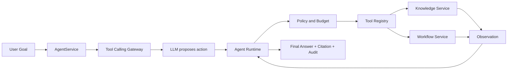
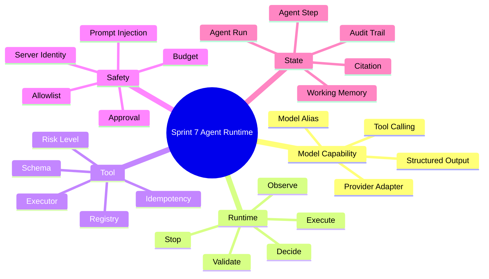
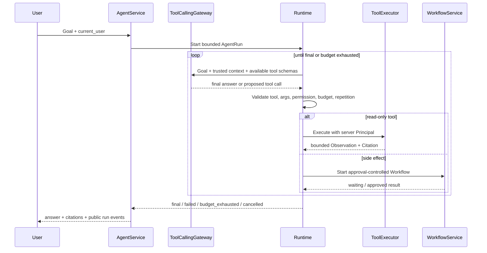

# Sprint 7: Agent Runtime（受控 Agent 运行时）

## 状态

Sprint 7 为计划阶段，必须在 Sprint 6 Workflow 完成后开始。

```text
Planned Sprint: Sprint 7 Agent Runtime
Entry Condition: 固定 Workflow 已具备状态、恢复、审批和审计能力
North Star: 模型可以建议下一步动作，但执行权始终属于受控 Runtime
```

## Sprint 定位

Agent Runtime 解决“下一步不能完全预先写死时，如何让模型在安全边界内选择动作”。

```text
RAG:      找资料并生成有引用的回答
Workflow: 开发者预先定义步骤和分支
Agent:    模型动态建议已注册工具或 Workflow
Runtime:  校验权限、参数、预算和风险后决定是否执行
```

模型输出不是命令，更不是授权。`owner_id`、可用工具、最大步数、成本、超时和审批策略
全部由服务器注入。

## Sprint North Star



## 知识思维导图



## 端到端执行循环



Runtime 不保存或对外暴露模型隐藏推理过程。只持久化业务可审计信息：工具名、受控参数摘要、
Observation 摘要、Citation、Token/成本、状态和错误分类。

## Sprint 范围

### 本 Sprint 实现

- AgentDefinition Version、AgentRun、AgentStep 和运行预算。
- 独立 Tool Calling Provider/Gateway，不污染现有 ChatProvider。
- Tool Schema、Registry、Executor、风险级别和参数校验。
- `decide -> validate -> execute -> observe` 有界循环。
- 服务端身份、Tool Allowlist、Deadline、Step Budget，以及 Token/Cost 的调用前估算预留、
  `max_output_tokens` 限制和调用后结算。
- Working Memory 与 Context 压缩，保留 Citation。
- 高风险副作用通过 Workflow + Human Approval 执行。
- 生命周期 API、事件流、取消、Fake Provider 和真实纵向验证。

### 本 Sprint 明确不做

- 多 Agent 协作、调度和共享任务图；这些属于 Sprint 13。
- Shell、任意代码、浏览器控制或不受限互联网访问。
- 无人监管的长期自治和无限循环。
- 模型自行修改 Prompt、Tool、权限或预算。
- 长期用户画像和跨会话隐式 Memory。
- 后台消息队列；异步迁移属于 Sprint 10。

## Service-first 入口

```python
AgentService.start_run(...)
AgentService.continue_run(...)
AgentService.get_run(...)
AgentService.cancel_run(...)
AgentService.stream_events(...)
```

公开请求只提交目标和允许的业务输入。AgentDefinition、Prompt Version、Tool Allowlist、
Principal、预算和真实模型均由服务器解析并形成运行快照。

## Story 路线图

| Story | 核心问题 | 真实项目练习 | 完成标准 |
| --- | --- | --- | --- |
| 7.0 Evolution & System Map | Agent 为什么不等于 Chat 或 Workflow | 画 Knowledge Analyst Agent 的完整链路 | 能明确模型、Runtime、Tool、Workflow 各自权力 |
| 7.1 Domain & Run State | 非确定性运行怎样审计和恢复 | 建 AgentDefinition、Run、Step、Budget 和 Migration | 每次运行固定 Prompt/Tool/Limit Version；不保存隐藏思维链 |
| 7.2 Tool Calling Gateway | 厂商 Tool Call 怎样隔离 | 建专用 DTO、Protocol、Fake、Factory 和真实 Adapter | SDK 类型不外泄；非法结构输出转为稳定领域异常 |
| 7.3 Tool Contract & Registry | 工具怎样安全注册和执行 | 首个只读工具接入 `search_knowledge` | 未知 Tool 拒绝；参数严格校验；执行进入现有 Service |
| 7.4 Policy & Trusted Context | 模型怎样避免伪造身份和扩大权限 | 服务端注入 Principal、allowlist、风险与输出上限 | `owner_id` 不来自模型；越权调用在执行前被拒绝 |
| 7.5 Bounded Agent Loop | 怎样避免无限循环和成本失控 | 实现循环、Deadline、Step Budget、Token/Cost Reservation、输出上限、结算和重复检测 | 预算不足时禁止下一次调用；单次实际 Usage 超过估算时按明确上限和策略结算 |
| 7.6 Working Memory | Observation 怎样进入下一轮又不撑爆 Context | 实现有界摘要、Artifact 引用和 Citation 保留 | Context 不无限增长；压缩后关键事实可追溯 |
| 7.7 Side Effects & Approval | Agent 能否直接执行有副作用动作 | 将高风险动作交给 Workflow 审批 | Agent 不能绕过业务校验；重复调用不产生重复副作用 |
| 7.8 API, Events & Cancellation | 客户端应该看到什么运行信息 | 实现 Run API、事件流和取消 | 事件不泄露 chain-of-thought；断连和取消释放上游资源 |
| 7.9 Vertical Slice & Review | Agent 是否真的优于固定流程 | 自主选择直接回答、RAG 或启动固定 Workflow | Fake 确定性验证；真实 Provider 可选验证；安全回归通过 |

## 核心安全规则

- Tool 描述和返回内容都是不可信文本，不能自动升级为 System 指令。
- 身份、KnowledgeBase 范围和敏感参数由 Runtime 注入，模型不可提交。
- 只读 Tool 与有副作用 Tool 分级；高风险动作必须审批。
- Tool 输出有大小、类型和敏感字段边界，不能原样写日志。
- 重复 Tool Call、无进展循环和 Budget 耗尽必须终止。Token/Cost 在调用前只能估算；Runtime
  先预留并限制输出，调用后按真实 Usage 结算，不能承诺绝对零超额。
- Provider 只负责生成结构化建议，不直接访问数据库或执行工具。

## 测试与验证矩阵

| 层级 | 必须证明的行为 |
| --- | --- |
| Gateway Contract | 正常 Tool Call、最终回答、非法 JSON、超时和 Provider 错误 |
| Tool Unit | Schema、未知参数、Principal 注入、输出上限和错误翻译 |
| Runtime Unit | 最大步数、Deadline、预算、重复检测、取消和终态 |
| Security | 伪造 owner、Prompt Injection、恶意 Tool 输出和高风险审批 |
| API | 认证、越权、事件顺序、断连释放和安全错误 |
| Vertical | Direct Answer、RAG Tool、Workflow Tool 与 Citation |

## ADR 与面试题候选

- ADR：Capability-specific Tool Calling Gateway。
- ADR：Server-enforced Tool Policy 与 Bounded Agent Loop。
- 面试题：为什么模型只能建议 Tool Call，不能直接拥有执行权限。
- 面试题：Working Memory、Conversation Memory 和数据库审计记录有何区别。
- 面试题：怎样测试非确定性 Agent。

## 主要风险

| 风险 | 约束 |
| --- | --- |
| 幻觉工具名或参数 | Registry allowlist + Schema validation |
| 无限循环与成本爆炸 | Step/Deadline 硬限制 + Token/Cost 预留、输出上限、结算和单次超额边界 |
| Tool 输出反向操控模型 | 不可信 Observation 标记、Prompt 分层、输出截断 |
| 模型伪造用户身份 | Principal 只由认证上下文注入 |
| 非幂等副作用重复 | Workflow、审批、幂等键和执行记录 |
| 测试不稳定 | Fake Provider 脚本化决策 + 少量真实联调 |

## Sprint 验收标准

- 能解释 Agent 与 RAG、Workflow、Tool Calling、MCP 的职责边界。
- Agent 在所有路径上受 Tool、权限、预算、超时和审批策略约束；Token/Cost 使用预留与终态
  结算，预算耗尽后禁止下一步调用。
- Agent 不直接写 SQL、不直连 Provider SDK、不绕过现有 Service。
- 运行步骤、Citation、成本和终态可审计，但不存储隐藏推理过程。
- Fake、API、安全、纵向测试、ADR、面试题和 Sprint Tag 完整。

## 前后衔接

```text
Sprint 6: 提供可审批、可恢复的固定 Workflow
Sprint 7: 在固定 Tool/Workflow 集合中增加受控动态决策
Sprint 8: 使用 MCP 标准接入外部 Tool、Resource 和 Prompt
Sprint 13: 在单 Agent 基线之上评估并实现多 Agent 协作
```
