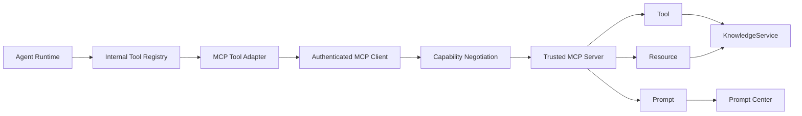
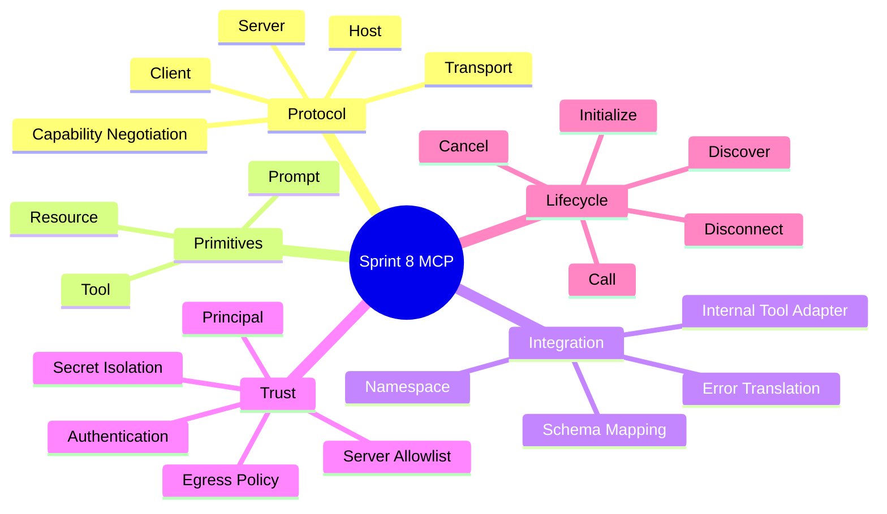
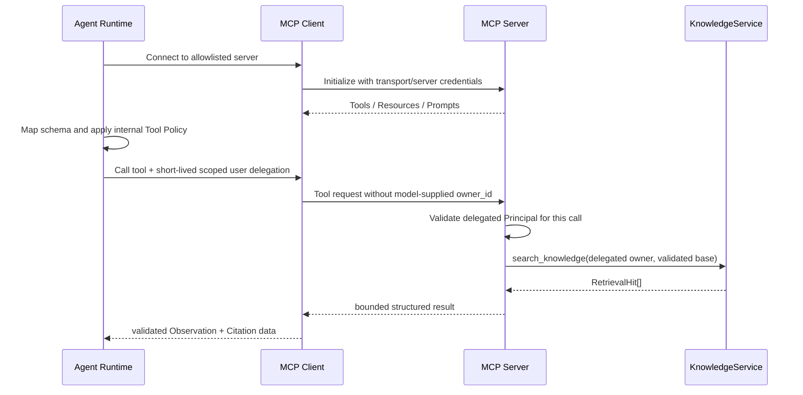

# Sprint 8: MCP Integration（标准工具与上下文协议）

## 状态

Sprint 8 为计划阶段，必须在 Sprint 7 Agent Runtime 完成后开始。

```text
Planned Sprint: Sprint 8 MCP Integration
Entry Condition: 内部 Tool Contract、Registry、Policy 和 Agent Loop 已稳定
North Star: 用标准协议连接可信 Tool、Resource、Prompt，同时保留内部授权边界
```

## Sprint 定位

MCP 解决“Host 怎样用统一协议发现和调用外部能力”，不负责模型推理、业务授权或工作流状态。

```text
Tool Calling: 模型表达想调用什么
Agent Runtime: 校验策略并决定是否执行
MCP Client: 发现和调用远端标准能力
MCP Server: 以标准协议暴露 Tool / Resource / Prompt
Backend Service: 执行真实业务规则和权限判断
```

## Sprint North Star



## 知识思维导图



## 端到端调用链



## Sprint 范围

### 本 Sprint 实现

- MCP Host、Client、Server、Transport 和三种核心 Primitive 的协议基础。
- 进入实现时核对官方规范并固定 SDK 版本与协议兼容范围。
- Transport/Server 身份认证、每次调用的短期用户 Principal 委托，以及稳定生命周期/错误契约。
- 将 `search_knowledge` 暴露为 MCP Tool。
- 将受控 Knowledge 内容暴露为 Resource，将 Prompt Center 暴露为可选 Prompt。
- 静态可信 Server 配置、Client 连接管理、发现、超时、取消与断连。
- MCP Tool 到内部 Tool Contract 的 Adapter、命名空间和二次校验。
- 互操作、安全、权限和真实纵向验证。

### 本 Sprint 明确不做

- 开放 Marketplace、动态安装未知 Server 或接受任意远程 URL。
- 让 MCP 替代 KnowledgeService、WorkflowService 或认证系统。
- 让 MCP Server 描述自动获得可信 System 权限。
- 一次实现协议全部可选能力；未进入真实用例的能力只学习不落地。
- 完整第三方 OAuth 联邦和生产级多租户 MCP 托管平台。
- 自己手写协议解析器替代成熟官方 SDK。

## Service-first 入口

```python
MCPConnectionService.connect(...)
MCPConnectionService.list_capabilities(...)
MCPConnectionService.call_tool(...)
MCPConnectionService.read_resource(...)
MCPConnectionService.get_prompt(...)
MCPConnectionService.disconnect(...)
```

Agent Runtime 仍然通过内部 ToolExecutor 执行。MCP Adapter 是一种 Tool 实现，不允许绕过
内部 allowlist、风险分级、预算和 Principal。

## Story 路线图

| Story | 核心问题 | 真实项目练习 | 完成标准 |
| --- | --- | --- | --- |
| 8.0 Protocol & System Map | MCP 与 Tool Calling、REST、Workflow 有何不同 | 画 Host/Client/Server/Primitive 全链路 | 能说明发现、授权、执行分别由谁负责 |
| 8.1 Spec, SDK & Transport | 怎样避免协议和 SDK 漂移 | 核对当期官方规范，固定 SDK，比较 stdio 与网络 Transport | ADR 记录版本与选择；最小互操作 Smoke Test 通过 |
| 8.2 Authentication & Delegation | Server 和当前用户身份分别从哪里来 | 建 Transport/Server 认证、每次调用的短期受限 Principal 委托、Capability、异常和断连边界 | 初始化认证不冒充用户授权；每次调用重新校验 Principal；模型参数不能伪造身份 |
| 8.3 MCP Tool | 现有 Service 怎样标准暴露 | 暴露 `search_knowledge` Tool | 参数不含 owner_id；跨用户 Base 不可见；错误不泄密 |
| 8.4 MCP Resource | Resource 与 Tool 何时使用 | 设计稳定 URI、MIME、Metadata、列表和读取 | 权限、大小和来源边界明确；可转换 Citation |
| 8.5 MCP Prompt | Prompt 是否等于 System 指令 | 桥接一个引用问答 Prompt | 变量严格校验；调用方选择不等于获得安全规则控制权 |
| 8.6 Client & Discovery | 外部 Server 不可用怎么办 | 建静态 allowlist、连接、发现、缓存、超时和取消 | Server 故障不挂死 Agent；能力变化可检测 |
| 8.7 Agent Adapter | 外部 Schema 怎样进入内部 Tool Policy | Schema 映射、命名空间、输入输出二次校验 | 同名 Tool 不覆盖；MCP Tool 仍受 Runtime 策略约束 |
| 8.8 Trust Hardening | MCP 扩大了哪些攻击面 | Server 身份、Secret、SSRF/Egress、输出和注入防护 | 恶意描述、超大输出、内部 URL 和越权参数均被拒绝 |
| 8.9 Interoperability & Review | 是否真的符合协议且可运营 | 官方 Client/Inspector 与项目 Agent 跑真实链路 | Tool/Resource/Prompt、取消、Citation、文档和 ADR 验收 |

## 信任与权限边界

- Server URL、Transport 和凭据来自服务器配置，不来自模型输出。
- Transport/Server Credential 只证明连接双方身份，不能代表当前业务用户。
- 每次 Tool/Resource/Prompt 调用携带短期、受 Scope 限制的 Principal 委托；Server 必须逐次
  校验并映射为内部 Service 身份，不能把连接初始化身份缓存成所有用户共享授权。
- Tool 参数不允许包含可扩大权限的 `owner_id` 或内部 Secret。
- 外部 Tool 描述、Prompt 和 Result 都是潜在 Prompt Injection 输入。
- Client 必须限制连接目标、响应大小、超时、并发和可见 Capability。
- Secret 不进入模型 Context、日志、Trace 或公共错误。

## 测试与验证矩阵

| 层级 | 必须证明的行为 |
| --- | --- |
| Protocol | 初始化、Capability、Tool/Resource/Prompt、取消和断连 |
| Interop | 官方 Client/Inspector 与项目 Server；项目 Client 与受控 Server |
| Authorization | 未认证、跨用户 Base、伪造 owner、Resource 越权，以及同一复用连接交错执行两个用户请求的隔离 |
| Adapter | Schema 映射、命名冲突、未知类型、超大/非法输出 |
| Reliability | Server Timeout、连接断开、能力变化、资源关闭 |
| Security | SSRF、恶意描述、Prompt Injection、Secret 和日志最小化 |

## ADR 与面试题候选

- ADR：官方 MCP SDK、固定协议兼容范围与 Transport 选择。
- ADR：MCP 位于内部 Tool Policy 之后的 Adapter 边界。
- 面试题：MCP、Function Calling 和普通 REST API 的区别。
- 面试题：为什么 MCP Tool 仍需后端鉴权。
- 面试题：Resource、Prompt、Tool 分别适合什么场景。

## 主要风险

| 风险 | 约束 |
| --- | --- |
| 协议版本漂移 | 固定版本、兼容矩阵、互操作测试 |
| 工具名和 Schema 冲突 | Server namespace + 内部稳定 Tool ID |
| 任意 URL 导致 SSRF | 静态 Server allowlist + Egress 限制 |
| Server 描述被错误信任 | 所有远端文本按不可信 Observation 处理 |
| 身份委托含糊或连接串用户 | Server 身份与每次用户委托分离；短期 Scope、逐次校验、并发双用户隔离测试 |
| 连接和 Stream 泄漏 | Timeout、Cancellation、上下文管理和断连测试 |

## Sprint 验收标准

- 能从 Agent Tool Call 画到 MCP Server 后端 Service，并标出每层信任边界。
- Tool、Resource、Prompt 各有一个真实、受权限保护的项目用例。
- MCP 不绕过内部 Tool Policy、Service、认证或业务数据库规则；复用连接时两个用户的
  Principal、结果和错误不会交叉。
- 与官方工具的互操作、断连、超时、安全和 Citation 均有验证证据。
- ADR、测试、面试题、文档、Review 和 Sprint Tag 完整。

## 前后衔接

```text
Sprint 7: 提供内部 Tool Registry、Policy 和 Agent Runtime
Sprint 8: 通过 MCP Adapter 接入标准外部能力
Sprint 9: 统一观察 Agent/MCP 的延迟、错误、成本和质量
Sprint 12: 将可信 MCP Connection 纳入 Workspace 级平台治理
```
