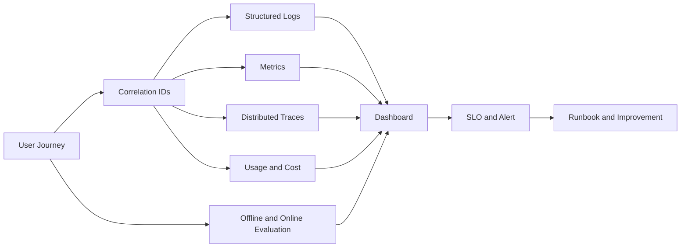
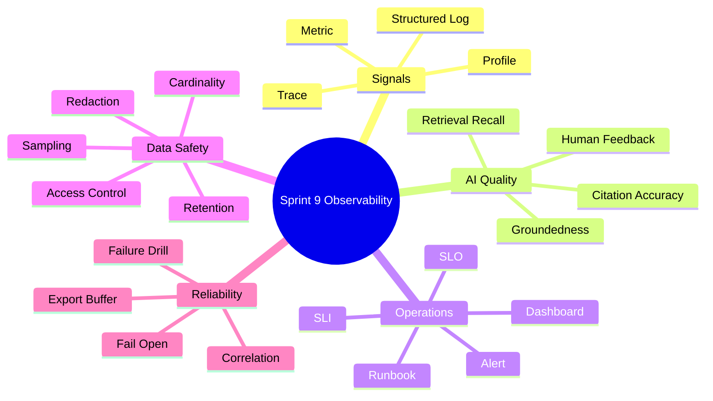
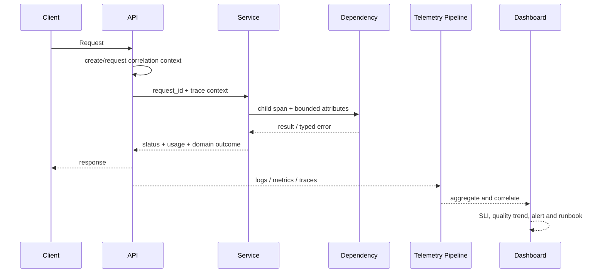

# Sprint 9: Observability & Evaluation（可观测性与 AI 质量评测）

## 状态

Sprint 9 为计划阶段，必须在 RAG、Workflow、Agent 和 MCP 具有真实运行链路后开始。

```text
Planned Sprint: Sprint 9 Observability & Evaluation
Entry Condition: 前述能力已有可观测的成功、失败、成本和质量结果
North Star: 回答系统快不快、贵不贵、稳不稳，以及 AI 结果好不好
```

## Sprint 定位

日志、指标、Trace 和 Evaluation 解决不同问题，不能互相代替：

| Signal | 主要问题 | 典型证据 |
| --- | --- | --- |
| Log | 这一次具体发生了什么 | 稳定事件、错误分类、安全字段 |
| Metric | 整体趋势和异常是否正在发生 | Rate、Error、Duration、Saturation |
| Trace | 时间花在哪一层、跨组件如何传播 | Span、Parent、关键依赖延迟 |
| Evaluation | 检索和回答是否达到质量要求 | Recall@K、Citation、Groundedness |

## Sprint North Star



## 知识思维导图



## 端到端观察链路



Telemetry 导出失败必须 fail-open，不能让监控系统故障拖垮业务请求。

## Sprint 范围

### 本 Sprint 实现

- User Journey、Signal Dictionary、关联 ID、隐私与基数规范。
- JSON Structured Logging 与跨异步边界的 Context 传播。
- HTTP、Provider、RAG、Workflow、Agent、MCP 核心 Metrics。
- OpenTelemetry Trace，以及本地 Collector、Metric、Trace、受控 Log Backend 和 Dashboard 栈。
- AI/RAG/Agent Dashboard、Golden Dataset 和离线评测 Runner。
- 受权限保护的在线反馈与评测结果版本快照。
- SLI/SLO、可执行 Alert、Runbook 和真实故障演练。
- 从本 Sprint 开始持续记录 Lead Time、缺陷、返工、发布失败和回滚等低开销交付基线，
  为 Sprint 14 提供跨 Sprint 对照数据。

### 本 Sprint 明确不做

- 企业 SIEM、跨区域生产 Observability 和完整 24x7 值班体系。
- 在 Metric Label 中放 `user_id`、query、file_id、request_id 等高基数字段。
- 默认保存 Prompt、Chunk、模型回答或 Provider 原始错误正文。
- 把 LLM-as-Judge 当作唯一质量事实。
- 为尚未实现的 Sprint 10 Queue 或 Sprint 11 Kubernetes 提前造指标。

## Service-first 入口

Observability 不是把业务逻辑塞入一个 `ObservabilityService`。先从真实 Use Case 定义可回答的问题：

```text
RAG Answer Use Case:                  方法名在 Story 5.9 固化；观察检索、Citation、Token 和终态
WorkflowService.start_run():          Run/Step 延迟、等待、失败、重试和恢复
AgentService.start_run():             Step 数、Tool 错误、预算、终态和成本
MCPConnectionService.connect():       连接、发现和断连
MCPConnectionService.call_tool():     Tool 调用、超时、错误和 Principal Scope
MCPConnectionService.read_resource(): Resource 大小、延迟、权限和错误
EvaluationService.run():              数据集、配置快照、指标和回归结论
```

埋点通过稳定事件、Middleware、Gateway/Adapter instrumentation 和评测服务完成，不能改变
业务成功语义。

## Story 路线图

| Story | 核心问题 | 真实项目练习 | 完成标准 |
| --- | --- | --- | --- |
| 9.0 Signal Architecture | 到底要观察哪些用户旅程 | 为 Upload/Index/RAG/Workflow/Agent/MCP 建 Signal Dictionary，并开始记录交付基线 | 每个信号有 owner、字段、基数、隐私和用途；研发指标定义和采集窗口固定 |
| 9.1 Structured Logging | 一次请求怎样跨层关联 | JSON Log、request/trace/run ID 和统一脱敏 | 可关联完整链路；Token、Prompt、Chunk、回答正文不出现 |
| 9.2 Metrics | 怎样看趋势而不制造高基数灾难 | Counter/Gauge/Histogram 与 Label allowlist | 核心 RED/USE 和 AI 指标可由合成流量验证 |
| 9.3 Distributed Tracing | 慢请求时间花在哪里 | Router -> Service -> Gateway -> Provider/Qdrant/MCP Span | Trace 可定位耗时和错误；Span 不保存正文 |
| 9.4 Local Stack | 信号如何真正查询 | 固定版本的 Collector、Metric、Trace、Log Backend 与 Dashboard 栈 | Compose 可启动；可用 trace/request ID 跨信号查询；Exporter 故障不影响业务 Readiness |
| 9.5 AI Dashboards | AI 系统运营者最需要看什么 | TTFT、Token/Cost、no-hit、stuck run、tool failure 面板 | 单位、分位数、聚合和过滤含义正确 |
| 9.6 Offline Evaluation | 修改 Chunk/Prompt/模型后怎样知道退化 | 版本化 Golden Dataset + Retrieval/Answer/Citation 指标 | 同一配置可重复；故意退化能被检测 |
| 9.7 Feedback & Quality | 用户反馈怎样成为证据 | Feedback 记录、权限、抽样、保留和关联 | 不能读取他人反馈；不复制敏感正文进 Telemetry |
| 9.8 SLO, Alert & Runbook | 什么异常值得叫醒人 | 定义 Availability/Latency/Error/Quality/Cost SLO | 告警可执行、有抑制规则并链接查询与恢复步骤 |
| 9.9 Failure Drill & Review | 仪表盘能否帮助真实定位 | 演练 Provider、Qdrant、MCP 和 Exporter 故障 | 从 Dashboard 到 Trace 到 Log 定位；质量/隐私验收完成 |

## 最小指标与质量基线

| 范围 | 候选指标 |
| --- | --- |
| HTTP | request rate、error rate、latency、in-flight |
| AI Gateway | TTFT、total latency、tokens、cost、provider error/retry |
| Retrieval | latency、candidate/hit count、no-hit、score distribution |
| Workflow | running/waiting/stuck、step duration、retry、terminal status |
| Agent | steps/run、tool calls/errors、budget exhausted、cost/run |
| MCP | connection、discovery/call latency、timeout、disconnect |
| Evaluation | Recall@K、MRR、Citation precision/recall、groundedness |

阈值必须通过基线数据确定，不凭感觉抄生产 SLO。主观 Judge 指标应与确定性检索、Citation
和人工抽样共同使用，并保存 Judge 模型与 Prompt Version。

## 测试与验证矩阵

| 层级 | 必须证明的行为 |
| --- | --- |
| Log Contract | 事件名、级别、关联字段、脱敏和异常翻译 |
| Metric Contract | Counter/Histogram 变化、单位、Label allowlist、无高基数 |
| Trace | Parent/Child 传播、异步边界、错误状态和正文最小化 |
| Log Query | Collector/Agent 采集、保留期、按 request/trace/run ID 查询和权限 |
| Evaluation | 固定数据重复性、配置快照、指标正确性和退化检测 |
| Failure | Exporter/Collector 不可用、缓冲饱和、依赖故障和告警触发 |
| Access | Dashboard/Feedback/评测结果的权限和保留策略 |

## ADR 与面试题候选

- ADR：OpenTelemetry 关联上下文与 Telemetry 数据最小化。
- ADR：版本化 AI Evaluation Baseline 与发布门禁边界。
- 面试题：Logs、Metrics、Traces 各解决什么问题。
- 面试题：为什么高基数 Label 会拖垮指标系统。
- 面试题：怎样评价 RAG，而不是只看回答“像不像对的”。

## 主要风险

| 风险 | 约束 |
| --- | --- |
| Telemetry 泄露敏感正文 | 字段白名单、脱敏、抽样和访问控制 |
| 指标高基数 | Label allowlist；ID 只进 Log/Trace |
| 埋点增加请求延迟 | 批量异步导出、超时、fail-open |
| Dashboard 好看但不可行动 | 从用户旅程和 Runbook 反推 Panel |
| 告警疲劳 | SLO 驱动、持续窗口、抑制与 Owner |
| Judge 偏差 | 确定性指标优先、版本快照、人工抽样 |

## Sprint 验收标准

- 能用一次真实 RAG/Agent 请求串联 Dashboard、Trace、受控日志查询、Usage 和 Evaluation。
- 监控系统故障不改变业务请求结果，敏感正文不进入默认 Telemetry。
- Golden Dataset 可重复运行并阻止一项故意引入的质量退化。
- 至少完成一次依赖故障和一次 Telemetry 故障演练。
- Sprint 14 所需的交付指标定义、采集窗口和偏差说明已开始持续记录。
- SLO、告警、Runbook、ADR、面试题、Review 和 Sprint Tag 完整。

## 前后衔接

```text
Sprint 4-8: 产生真实延迟、成本、失败和质量数据
Sprint 9:   建立可观测与可评估基线
Sprint 10: 依据数据选择长任务异步化，并复用 Trace/Metric
Sprint 11: 将同一信号体系带入 k3s 部署和 SRE 演练
```
