# AI-Knowledge-Hub Sprint 长期路线

## 路线定位

长期路线只定义阶段依赖和企业能力方向。每个 Sprint 的具体 Story、API 和验收标准以对应 Sprint 总控文档为准。

```mermaid
flowchart LR
    S0["Sprint 0<br/>Foundation"] --> S1["Sprint 1<br/>Authentication"]
    S1 --> S2["Sprint 2<br/>Session & Identity"]
    S2 --> S3["Sprint 3<br/>Storage & Resource"]
    S3 --> S4["Sprint 4<br/>AI Gateway"]
    S4 --> S5["Sprint 5<br/>Knowledge / RAG"]
    S5 --> S6["Sprint 6<br/>Workflow"]
    S6 --> S7["Sprint 7<br/>Agent Runtime"]
    S7 --> S8["Sprint 8<br/>MCP"]
    S8 --> S9["Sprint 9<br/>Observability"]
    S9 --> S10["Sprint 10<br/>Async Platform"]
    S10 --> S11["Sprint 11<br/>Cloud Native"]
    S11 --> S12["Sprint 12<br/>AI Platform"]
    S12 --> S13["Sprint 13<br/>Agent Orchestration"]
    S13 --> S14["Sprint 14<br/>Enterprise AI SDLC"]
```



## Sprint 地图

| Sprint | 定位 | 核心问题 | 企业能力 | 状态 |
| --- | --- | --- | --- | --- |
| Sprint 0 | Backend Foundation | 系统怎样获得可运行、可迁移、可探测的基础 | FastAPI、Config、Logging、MySQL、Migration、Health | 已完成 |
| Sprint 1 | Authentication | 我是谁 | 用户、密码安全、JWT Access Token | 已完成 |
| Sprint 2 | Session & Identity | 我能否继续访问，怎样管理设备会话 | Redis Session、Refresh Rotation、Logout、多设备 | 已完成 |
| Sprint 3 | Storage & Resource Management | 我的文件如何进入、保存、授权和退出系统 | File Resource、对象存储、生命周期、一致性 | 已完成 |
| Sprint 4 | AI Gateway | 业务如何稳定、安全、可观测地调用 LLM | Provider 抽象、Prompt、Streaming、Usage | 已完成 |
| Sprint 5 | Knowledge / RAG | 文件如何变成可检索、可评估的知识 | Parse、Chunk、Embedding、Vector Store、Retrieval | 进行中（Story 5.8） |
| Sprint 6 | Workflow | 多步骤业务怎样编排、重试和恢复 | 状态机、分支、人工节点、执行记录 | 计划中 |
| Sprint 7 | Agent Runtime | 模型怎样在边界内规划并调用工具 | Tool Calling、Policy、Budget、单 Agent Loop | 计划中 |
| Sprint 8 | MCP Integration | 怎样用标准协议连接工具与上下文 | MCP Server、Client、Resource、Prompt、Tool | 计划中 |
| Sprint 9 | Observability | 怎样知道系统快不快、贵不贵、好不好 | Logging、Metrics、Tracing、Evaluation、Alerting | 计划中 |
| Sprint 10 | Async Platform | 长任务怎样异步、可靠和可恢复地执行 | Queue、Worker、Scheduler、Idempotency、Compensation | 计划中 |
| Sprint 11 | Cloud Native | 怎样部署、扩缩容、发布和回滚整个平台 | Kubernetes、GitOps、Autoscaling、Secret、SRE | 计划中 |
| Sprint 12 | AI Platform | 如何统一 AI 能力与资源 | Model Management、Provider Management、Prompt Center、Knowledge Center、Workspace | 计划中 |
| Sprint 13 | Agent Orchestration | 多 Agent 如何协同、编排、调度 | Workflow DAG、Planner、Scheduler、Executor、State Machine、Event Bus、Multi-Agent | 计划中 |
| Sprint 14 | Enterprise AI SDLC | AI 如何参与整个研发流程 | AI Spec、AI Coding、AI Review、AI Test、Pipeline、Governance、Delivery | 计划中 |

## 详细学习计划

- [Sprint 6：Workflow](Sprint6.md)
- [Sprint 7：Agent Runtime](Sprint7.md)
- [Sprint 8：MCP Integration](Sprint8.md)
- [Sprint 9：Observability & Evaluation](Sprint9.md)
- [Sprint 10：Async Platform](Sprint10.md)
- [Sprint 11：Cloud Native & SRE](Sprint11.md)
- [Sprint 12：AI Platform](Sprint12.md)
- [Sprint 13：Agent Orchestration](Sprint13.md)
- [Sprint 14：Enterprise AI SDLC](Sprint14.md)

每份总控文档均包含 North Star、知识思维导图、端到端流程、Service-first 入口、Story 顺序、
项目练习、失败边界、测试矩阵、ADR、风险、完成标准和前后 Sprint 衔接。它们是未来计划，
不改变当前仍应一次只推进 Sprint 5 的一个 Story 和一个小步骤。

## 工程能力阶梯

```text
Sprint 6  -> 可靠业务编排：状态机、幂等、恢复、人工节点
Sprint 7  -> 受控动态执行：Tool Policy、预算、安全 Agent Loop
Sprint 8  -> 标准生态集成：协议、互操作、身份委托、信任边界
Sprint 9  -> 可运营与可评估：Signals、SLO、AI Quality、Runbook
Sprint 10 -> 分布式可靠性：Outbox、Queue、Worker、Retry、Reconciliation
Sprint 11 -> 生产式交付：k3s、GitOps、扩缩、回滚、备份恢复
Sprint 12 -> 平台治理：Workspace、RBAC、版本、配额、审计、控制面
Sprint 13 -> 系统级编排：Durable DAG、Event、Scheduler、Multi-Agent
Sprint 14 -> 技术领导力：AI SDLC、独立审查、供应链、可信交付
```

业务/Product 轨道贯穿 Sprint 5 之后：从一个真实业务案例开始，随着 Workflow、Agent、评估和
平台治理逐步补充规则；不先设计一个脱离业务的通用引擎。

## 关键依赖

- Authentication 和 Session 为所有受保护业务提供可信 `user_id`。
- Storage 提供稳定 File Resource；AI Gateway 提供稳定模型调用。
- Knowledge/RAG 同时依赖 File Resource 与 AI Gateway。
- Workflow 和 Agent 复用 Knowledge 与 AI Gateway，不重新直连 Provider SDK。
- Sprint 6 之前先选定一个小型真实业务案例；业务规则在纵向实现中逐步明确，不要求一次设计完整产品。
- Observability 横向观察前述能力；Async Platform 承接已经证明需要后台执行的长任务。
- Cloud Native 在系统边界和运行负载稳定后再平台化部署，不提前替代应用设计。
- AI Platform 在稳定运行底座上加入 Workspace、策略、版本、配额和审计控制面。
- Agent Orchestration 复用 Workflow、单 Agent Runtime、MCP、Async Platform 和 Workspace Policy，
  不重复建设这些能力。
- Enterprise AI SDLC 使用前述测试、评测、可观测、GitOps 和审计证据完成可信交付闭环。

## 推进规则

- 保留完整路线，但每次只展开当前 Sprint 的一个 Story 和一个小步骤。
- 后续 Sprint 的概念可以预习，但不得提前描述为已实现能力。
- 每个 Sprint 必须包含正式项目代码、测试或真实基础设施实践，不能只完成理论笔记。
- 每个 Story 完成后 Review、测试、同步文档并 Commit；整个 Sprint 验收后再创建对应 Tag。
