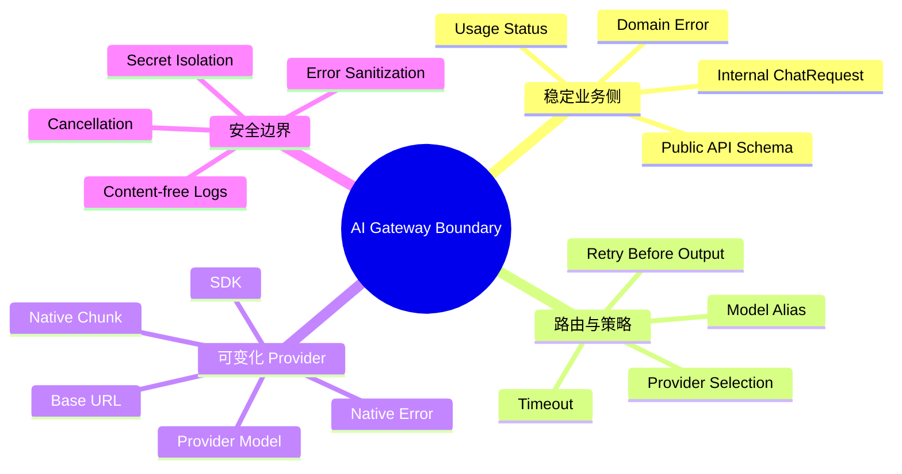
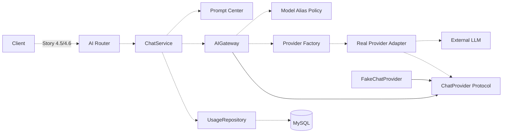
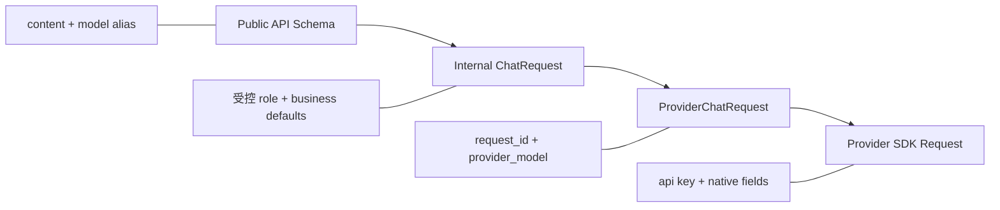

# AI Gateway Architecture

## 文档状态

Story 4.2 设计已确认，Story 4.3 已实现最小 ChatProvider 契约与 Fake Provider。
本文同时标注当前代码和目标调用链；虚线能力不能理解为已经进入运行时。

## 架构目标

AI Gateway 解决的是“业务如何稳定调用可变化的模型服务”，不是把所有 AI 能力
塞进一个万能接口。业务只依赖项目自己的请求、结果、事件和异常；Provider Adapter
负责吸收 SDK、协议、模型名称和响应结构差异。



## 当前实现与目标结构



实线表示 Story 4.3 已有代码和测试，虚线表示后续 Story 的已确认设计。

## 职责边界

| 组件 | 应负责 | 不应负责 |
| --- | --- | --- |
| AI Router | HTTP、认证依赖、Schema 转换、JSON/SSE 响应 | 模型路由、SDK 调用、Usage SQL |
| ChatService | Prompt、Gateway 与 Usage 终态的业务编排 | Provider 初始化、SDK 异常解析 |
| AIGateway | 解析模型别名、选择 Provider、执行超时与有限重试、返回稳定结果 | 用户权限、Prompt 历史、Usage 落库 |
| Provider Factory | 根据内部 Provider Key 和 Settings 创建或取得 Adapter | 业务模型选择、HTTP 响应 |
| Provider Adapter | 构造 SDK 请求、转换响应/Chunk、关闭连接、翻译 SDK 异常 | 用户身份、业务错误码、数据库 |
| UsageRepository | 读写 Usage 数据 | 计算业务终态、保存正文、调用 Provider |

Factory 只解决“如何获得一个具体 Adapter”。Gateway 仍然拥有模型别名策略、调用
生命周期、Retry/Timeout 和稳定返回边界，所以两者不是重复职责。

## 四层请求契约



- 公共 API 不接收 `role`、Provider Key、真实模型名、Base URL 或 API Key。
- ChatService 把公开输入转换为受控 `user` Message，并由 Prompt Center 添加 `system` Message。
- Gateway 把业务 `model_alias` 解析为 Provider Key 与 `provider_model`。
- API Key 只在真实 Provider 的初始化配置中出现，不进入 Request DTO。
- `finish_reason`、`usage` 和 Provider 错误是调用结果，不是初始化参数。

## Story 4.3 稳定契约

`app/ai/provider.py` 当前定义：

```text
ChatProvider
  generate(ProviderChatRequest) -> ChatResult
  stream(ProviderChatRequest) -> AsyncIterator[ChatEvent]

ChatEvent
  ChatDelta | ChatUsageEvent | ChatDone
```

Provider 流不产生 `error` Event。可预期失败以 `ProviderError` 子类抛出，避免把
正常数据和控制流混在一个过大的联合类型中。公共 SSE `error` 是后续 HTTP 层契约。

DTO 使用不可变 dataclass，避免请求在异步调用期间被其他层悄悄修改。Token Usage
允许缺失，因为部分 Provider 或异常流无法提供可信的最终统计；缺失不能伪造为零。

## Capability-specific 原则

当前 `ChatProvider` 只表达文本生成。Embedding、Rerank、Image、Audio 和 Tool Calling
不进入本接口；出现真实业务需求时定义独立 Protocol。这样不会强迫一个只支持
Embedding 的 Provider 实现无意义的 Chat 方法，也不会让调用方依赖不可用能力。

## 扩展与替换规则

增加真实 Provider 时必须满足：

1. SDK 类型只存在于 Adapter 内部。
2. 使用既有 Provider Request、Result、Event 和异常。
3. 非流式与流式都通过同一份 Contract Test。
4. 取消传播到 SDK/HTTP 调用并在 `finally` 中关闭资源。
5. 更换模型映射或 Provider 不要求修改 ChatService。

## 相关文档

- [AI Gateway Flow](ai-gateway-flow.md)
- [AI Gateway Security](ai-gateway-security.md)
- [项目结构与分层](project-structure.md)
- [Sprint 4](../Sprint/Sprint4.md)
- [ADR-0025](adr/ADR-0025-use-ai-gateway-boundary.md)
- [ADR-0026](adr/ADR-0026-use-capability-specific-chat-provider.md)
