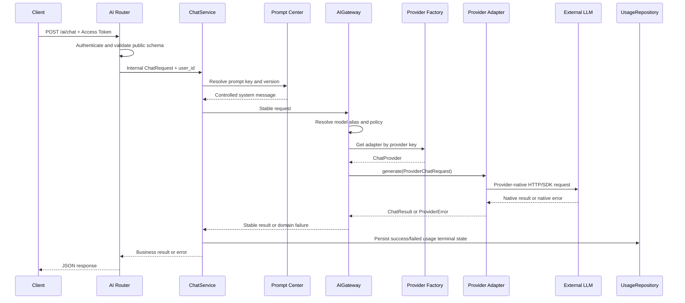
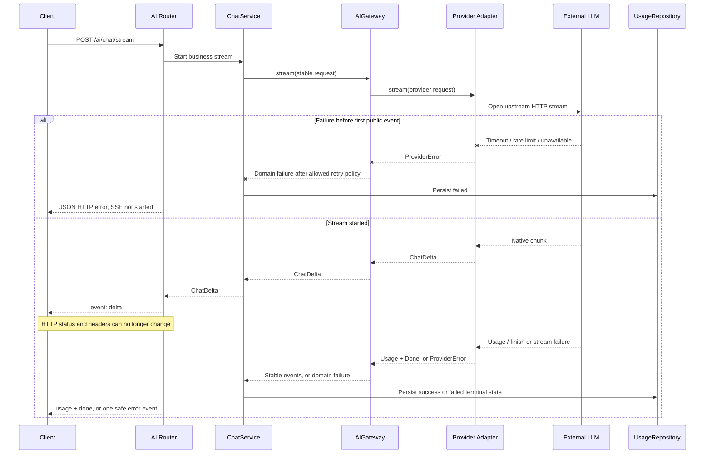
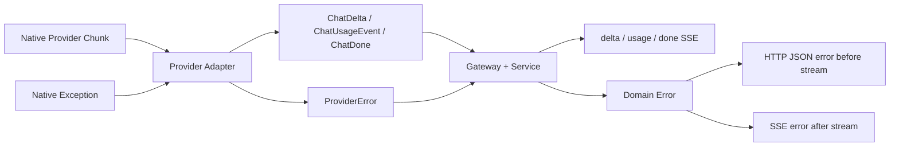
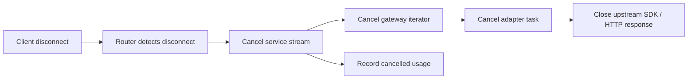

# AI Gateway Flow

## 文档状态

Story 4.2 流程设计已确认。当前只有 ChatProvider 契约与 Fake Provider 可执行；
Router、ChatService、AIGateway、Factory、真实 Adapter 和 UsageRepository 是后续实现。

## 非流式调用链

关键点：Router 不看 SDK Response，Provider 不知道 `user_id`，Gateway 不保存 Usage。
Service 是唯一知道“当前用户业务请求最后处于 success、failed 还是 cancelled”的层。

## Streaming 调用链

## Provider Event 与公共 SSE Event

`done` 与 `error` 互斥。`done` 证明流正常结束；中途异常只能进入 `error` 终态。
客户端直接断开时通常无法再接收 `cancelled` Event，因此服务端取消上游并记录
`cancelled`，不伪造一个无法送达的响应。

## Retry 边界

| 场景 | 是否重试 | 终态理由 |
| --- | --- | --- |
| 建连失败且尚未输出 | 有限重试 | 可能是短暂网络故障 |
| Rate Limit 且尚未输出 | 按明确上限候选重试 | 必须尊重总体 Deadline 和等待上限 |
| Provider 5xx 且尚未输出 | 有限重试 | 可能短暂恢复 |
| Context Too Long / 非法请求 | 不重试 | 相同输入仍会失败 |
| 鉴权、余额或配置错误 | 不重试 | 需要修复配置 |
| 已向客户端发送第一个 Delta | 不重试 | 会重复文本和重复计费 |
| 客户端断开 | 不重试 | 用户已取消需求 |

重试策略由 Gateway 执行，Adapter 只把本次 SDK 调用转换为稳定结果或异常。

## 取消与资源释放

Python 取消使用原生 `asyncio.CancelledError`，不能包装成 Provider Error。每层只完成
自己拥有资源的清理并继续传播取消；Provider Adapter 的 `finally` 负责关闭上游连接。

这里存在两条不同 HTTP 连接：客户端到 FastAPI 的下游连接由 Router 管理，FastAPI
到 LLM 的上游连接由 Provider Adapter/SDK 管理。取消必须沿调用链传播，才能同时释放两端。

## 当前 Fake Provider 的验证位置

Fake Provider 在不访问网络的情况下验证：

- 非流式成功、缺失 Usage、Rate Limit 和 Timeout。
- `delta -> usage -> done` 顺序。
- 第一个 Event 前失败和已输出一个 Event 后失败。
- 主动 `aclose()` 与任务取消都会进入 `finally` 并标记关闭。
- 非法错误位置和负延迟配置会立即拒绝。

真实 Adapter 在 Story 4.4 必须复用这些行为约束，而不是为自己的 SDK 另造契约。

## 相关文档

- [AI Gateway Architecture](ai-gateway-architecture.md)
- [AI Gateway Security](ai-gateway-security.md)
- [ADR-0027](adr/ADR-0027-streaming-retry-and-terminal-state.md)
- [Sprint 4](../Sprint/Sprint4.md)
