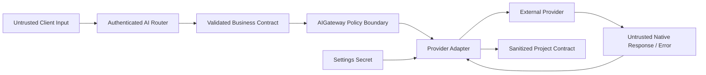

# AI Gateway Security

## 文档状态

Sprint 4 安全边界与实现已完成。真实 Provider、认证 Chat API、Prompt Center 和
Usage 均遵守本文约束；Fake Provider 继续作为不读取 Secret、不访问网络的默认测试
替身。

## 信任边界

外部 Provider 的成功响应和错误同样是不可信输入，必须经过类型转换、字段选择和
错误清理后才能进入业务层或客户端。

## 输入约束

- 用户身份只来自 Access Token 认证依赖，Body 不能提交 `user_id`。
- 客户端不提交 Message `role`；服务端创建 `user` Message，System Prompt 只来自 Prompt Center。
- `model` 只能是服务端允许的别名，不能直接使用任意 Provider Model。
- Message 数量、单条长度、总输入预算、Temperature 和 Max Output Tokens 必须有界。
- 显式输出预算超过服务端上限时直接拒绝，不静默降级为另一个值。
- 输入 Token 估算加输出预算超过 Context Window 时在调用 Provider 前拒绝。
- 未知 Prompt Key、Version、缺失变量或多余变量必须明确失败。

字符限制是 API 防滥用边界，Token 预算是模型容量边界；两者不能互相替代。

## Secret 与 Provider 配置

| 字段 | 所属边界 | 禁止出现的位置 |
| --- | --- | --- |
| API Key | Pydantic Settings Secret / Provider 初始化 | Request DTO、响应、日志、测试快照、Git |
| Base URL | 内部 Settings | 公共响应、未经清理的异常 |
| Provider Model | Gateway 映射后的 Provider Request | 公共请求、普通客户端响应 |
| Model Alias | 公共稳定契约 | 不得被当成真实厂商模型直接信任 |

Factory 可以把 Settings 和 SDK Client 注入 Adapter；不得把 Secret 附加到
`ProviderChatRequest`，否则它会随着业务 DTO 穿过不必要的层。

## 错误边界

Provider Adapter 只抛项目定义的 `ProviderError` 子类，并保留原生异常作为内部
异常链供受控诊断使用。Gateway 或 Service 再转换为稳定业务错误码，Router 负责
HTTP 状态或公共 SSE `error`。

禁止向客户端或普通日志透传：

- Provider 原始异常正文、响应 Body 和 Header。
- 完整 Endpoint、敏感 Query、Request ID Header 或账户信息。
- API Key、Authorization Header 和 SDK 配置对象。
- 用户 Message、System Prompt、模型回答或原始 Chunk。

客户端 `detail` 使用固定、安全、可本地化的项目文案；机器判断依赖稳定字符串
`code`，不依赖文案或厂商错误码。

## 日志与 Usage 数据最小化

允许记录：

- 项目 `request_id`、受控 Provider Key、Model Alias。
- 固定错误类型和业务错误码。
- 成功/失败/取消状态、Token 数量和 Latency。
- Retry Attempt、Prompt Key 与 Prompt Version。

禁止记录：

- API Key、完整 Base URL、用户 Message、Prompt 正文和模型回答。
- Provider 原始异常、原始请求响应和 SSE Chunk。
- Usage 表中的 API Key、Message、Prompt、完整回答或原始错误。

`user_id` 只作为受控业务审计字段保存在 Usage，不进入普通 AI 日志或公共响应。
Provider 永远不需要知道 `user_id`。

## Streaming 与取消安全

- 第一个公共 Event 前可以返回普通 HTTP 错误；之后只能发送一个安全 `error` Event。
- 第一个 Delta 后禁止重试，避免重复内容、重复副作用和重复计费。
- 客户端断开后立即取消上游生成，不继续消耗 Token。
- `CancelledError` 必须继续传播；Provider 在 `finally` 中关闭 SDK/HTTP Stream。
- Streaming 期间不持有数据库 Transaction，终态使用短事务写 Usage。
- Provider 未返回 Usage 时记录空值，不用零伪装成“没有消耗”。

## Readiness 与故障隔离

外部 LLM 默认不进入应用全局 Readiness。Provider 故障应让 AI API 返回受控
503/504 或 SSE `error`，但不能同时把认证、Session 和文件 API 从负载均衡摘除。
未来如需 AI 专属健康状态，应建立独立指标或端点，而不是改变全局 Liveness。

## 测试要求

- 普通测试使用 Fake Provider，不读取真实环境 Secret，也不访问网络。
- 真实 Integration Test 必须显式 Marker、严格 Token 上限和调用次数上限。
- 测试失败输出不能打印 SDK Client、Settings Secret、请求正文或原始响应。
- Contract Test 必须验证异常类型、流终态、取消传播和资源关闭。
- API Test 必须验证非法 role、Provider 字段、超限参数和未认证请求被拒绝。

## 相关文档

- [AI Gateway Architecture](ai-gateway-architecture.md)
- [AI Gateway Flow](ai-gateway-flow.md)
- [ADR-0025](adr/ADR-0025-use-ai-gateway-boundary.md)
- [ADR-0027](adr/ADR-0027-streaming-retry-and-terminal-state.md)
- [ADR-0028](adr/ADR-0028-file-based-prompt-center.md)
- [ADR-0029](adr/ADR-0029-usage-cost-snapshot-and-data-minimization.md)
- [Sprint 4](../Sprint/Sprint4.md)
