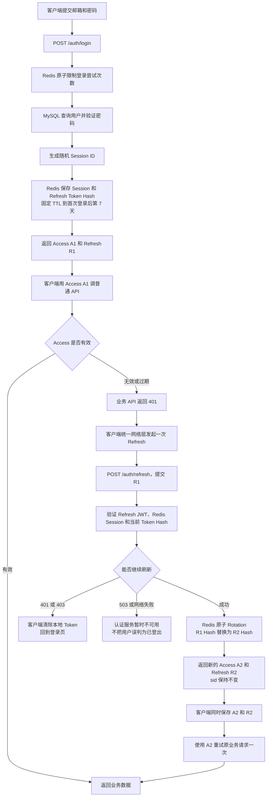
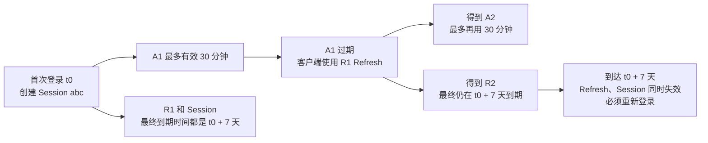
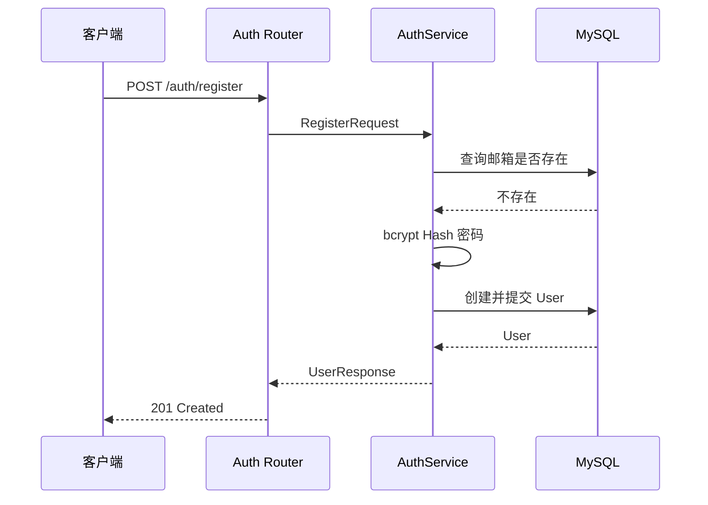
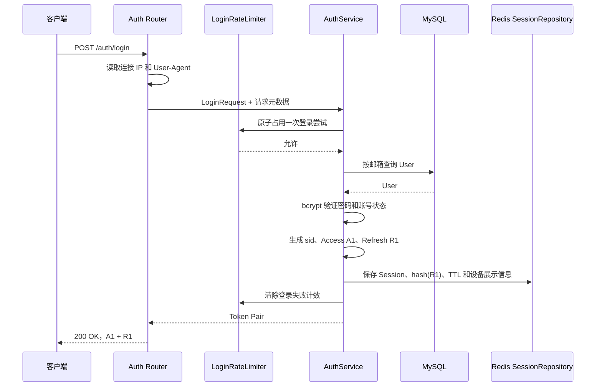
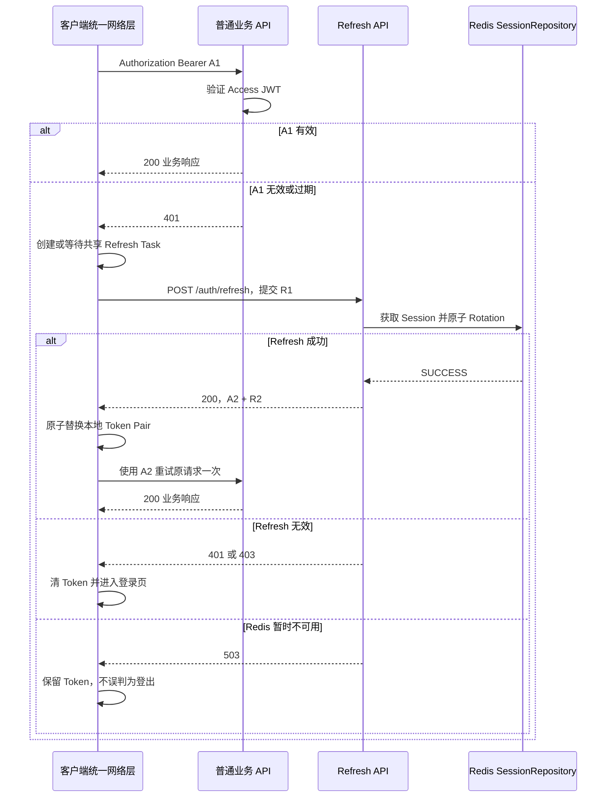
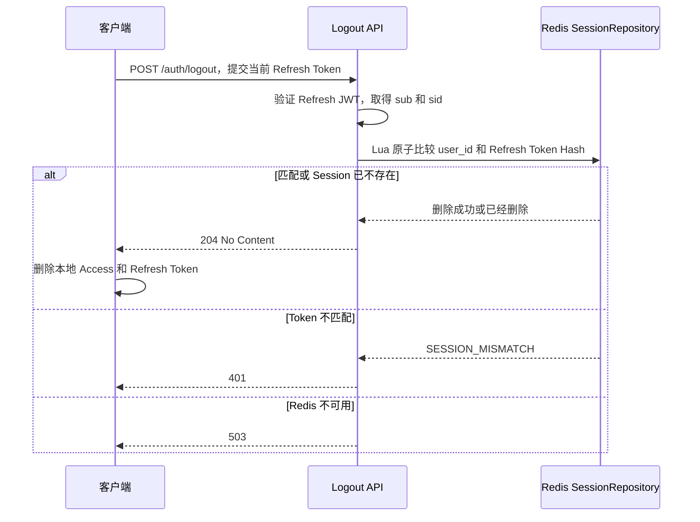
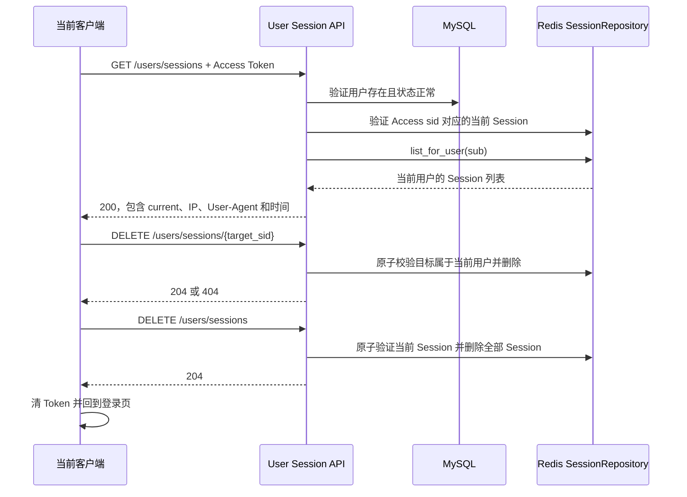

# Authentication Flow

## 1. 先看整体方向

当前项目使用：

```text
短期 Access Token
  +
可轮换 Refresh Token
  +
Redis Authentication Session
```

三者分别回答不同问题：

| 对象 | 回答的问题 | 默认时间 |
| --- | --- | --- |
| Access Token | 这个请求是谁发出的，当前 Token 是否仍在短期有效期内 | 最多 30 分钟 |
| Refresh Token | 客户端能否在不重新输入密码的情况下申请新 Token | 不超过 Session 最终到期时间 |
| Redis Session | 服务端现在是否仍允许这次登录继续 Refresh 或管理设备 | 首次登录后 7 天 |

普通业务 API 只验证 Access Token，不自动调用 Refresh，也不默认查询 Redis。客户端统一网络层收到 Access 认证 401 后，才调用 `POST /auth/refresh`。

## 2. 一张总流程图



这张图中的 Refresh 是客户端动作。后端普通业务接口只返回原本的 401，不会把业务响应和新 Token 混在同一个响应中。

## 3. 固定过期时间线

默认使用固定过期模式：



关键点：

- 每次 Refresh 都同时生成新的 Access Token 和 Refresh Token。
- 同一设备 Rotation 前后的 `sid` 不变，但 Refresh Token 的 `jti` 和完整 Token Hash 会变化。
- 固定模式不会在每次 Refresh 后重新增加 7 天；Redis TTL 会随着最终到期时间接近而逐渐减少。
- Access Token 的 `exp` 不会超过 Session 最终到期时间，因此最后一次 Access Token 可能不足 30 分钟。

## 4. 注册流程



注册只创建本地用户，不代表已经登录，也不会创建 Redis Session 或返回 Token。

## 5. 登录流程



每次登录都生成新的随机 Session ID。相同用户在 iPhone 和 Mac 登录时会得到不同 `sid`；相同 User Agent 也不能证明是同一台物理设备。

## 6. 普通 API 与 Refresh



多个普通请求同时收到 Access 401 时，客户端只能发送一次 Refresh。其他请求等待同一个结果，否则两个请求同时提交 R1 时，第二个请求会被当成旧 Refresh Token 重用，并触发 Replay 防护。

## 7. Logout 流程



Logout 删除 Redis Session 后，Refresh 立即失效。普通业务 API 默认不查询 Redis，所以已经签发且尚未过期的 Access Token 仍可能继续使用到自身 `exp`。

## 8. 多设备 Session 管理

Access Token 同时包含：

```text
sub = 当前用户 ID
sid = 当前这次登录的 Session ID
```

`sub` 用于查询这个用户的全部 Session，`sid` 用于标记哪个 Session 是当前设备。



删除其他设备 Session 后，当前设备继续登录。删除当前设备或全部设备后，当前客户端必须立即清除本地 Token。

## 9. 各类撤销实际影响

| 操作 | Redis Session | Refresh Token | 已签发的普通 Access Token |
| --- | --- | --- | --- |
| 当前设备 Logout | 删除当前 Session | 立即不能 Refresh | 最迟使用到自身 `exp` |
| 撤销其他设备 | 删除目标 Session | 目标设备立即不能 Refresh | 目标设备普通 API 最迟使用到 `exp` |
| 全部设备登出 | 删除当前用户全部 Session | 所有设备立即不能 Refresh | 普通 API 最迟使用到各自 `exp` |
| Refresh Replay | 删除发生 Replay 的当前设备 Session | 当前设备所有 Refresh 立即失效 | 普通 API 最迟使用到 `exp` |
| Session TTL 到期 | Redis 自动删除 Session Hash | Refresh JWT 即使仍被提交也无法通过 Session 校验 | Access 不会超过 Session 最终到期时间 |

Session 管理接口属于敏感接口，会额外验证 Redis Session。因此 Session 被删除后，即使 Access Token 尚未过期，调用 `/users/sessions` 也会立即返回 401。

## 10. 常见结果速查

| 场景 | HTTP 结果 | 客户端动作 |
| --- | --- | --- |
| 普通 API 的 Access Token 过期 | 401 | 发起一次 Refresh |
| Refresh 成功 | 200 | 同时保存新 Access/Refresh，并重试原请求一次 |
| Refresh JWT 或 Redis Session 无效 | 401 | 清 Token，回登录页 |
| 用户账号已停用 | 403 | 清 Token，回登录页 |
| Redis 暂时不可用 | 503 | 不清 Token，提示或稍后重试 |
| Logout 成功 | 204 | 清 Token，回登录页 |
| 撤销目标 Session 不存在或不属于当前用户 | 404 | 不暴露目标属于谁 |

## 11. 代码位置

| 职责 | 位置 |
| --- | --- |
| JWT 签发、解码、过期计算 | `backend/app/core/security.py` |
| Redis Session、Rotation、Logout 和撤销 Lua | `backend/app/db/repositories/session_repository.py` |
| 注册、登录、Refresh、Logout 和 Session 管理编排 | `backend/app/services/auth_service.py` |
| Auth HTTP 接口 | `backend/app/api/auth.py` |
| 当前用户和 Session 管理接口 | `backend/app/api/user.py` |
| 客户端 Refresh 状态机 | `docs/architecture/client-refresh-contract.md` |
| Session 数据结构和撤销边界 | `docs/architecture/session-architecture.md` |

## 12. 一句话记忆

```text
Access Token 负责短期调用 API；
Refresh Token 负责申请下一对 Token；
Redis Session 负责决定这次登录现在是否还被服务端允许；
Access 401 后由客户端 Refresh，Refresh 失败才真正退出登录。
```
