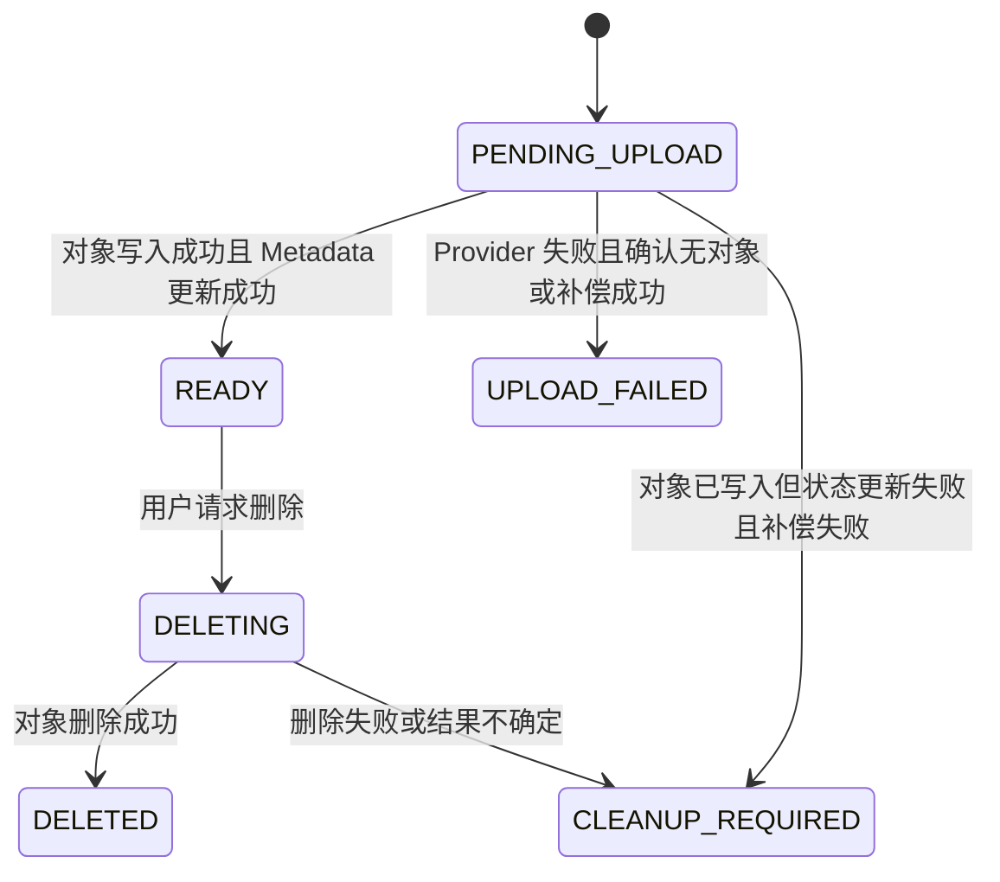

# File Resource Design

## 1. 目的与边界

本文定义 Sprint 3 的 File Resource 领域模型、对外 API 和 Owner-only 权限边界。

File Resource 不是对象存储中的原始文件 Bytes。它是用户可见、可授权、可查询、可删除的业务资源；它通过内部存储定位信息关联到 LocalStorage 或 MinIO 中的对象。

## 2. 两层概念

```text
File Resource
  -> 当前用户看到的“我的 report.pdf”
  -> 有 file_id、owner_id、状态、展示信息和审计信息

Storage Object
  -> Provider 中实际保存的文件 Bytes
  -> 由 storage_provider + bucket + object_key 定位
```

当前 Sprint 每次上传创建一个独立 File Resource 和独立 Storage Object，即使两个文件的 SHA-256 相同，也不做物理去重。

## 3. Metadata 字段

| 字段 | 预期类型 | 是否返回客户端 | 用途 |
| --- | --- | --- | --- |
| `id` | UUID 字符串 | 是 | 对外稳定 `file_id` 和主键 |
| `owner_id` | int，外键 | 否 | 关联 `users.id`，权限过滤 |
| `storage_provider` | string/enum | 否 | `local` 或 `minio` |
| `bucket` | string | 否 | Provider 中的逻辑容器 |
| `object_key` | string | 否 | 后端生成的内部对象位置 |
| `original_filename` | string | 是 | 用户展示名称，可重复 |
| `content_type` | string | 是 | 已接受文件的类型 |
| `size_bytes` | bigint | 是 | 实际流内累计的文件大小 |
| `sha256` | 64 字符 string | 否 | 文件完整性摘要与未来重复观察 |
| `status` | string/enum | 是 | 生命周期状态 |
| `failure_reason` | nullable string/enum | 否 | 固定失败原因，不保存堆栈或敏感 Provider 信息 |
| `created_at` | datetime | 是 | 列表排序和审计 |
| `updated_at` | datetime | 是 | 状态更新时间 |
| `deleted_at` | nullable datetime | 否 | 逻辑删除审计和清理依据 |

客户端不能传入 `owner_id`、`id`、Provider、Bucket 或 Object Key。Router 从认证依赖获得 `current_user.id`，Service 生成 UUID 和不可猜测的 Object Key。

## 4. 约束与索引

```text
外键
  files.owner_id -> users.id

联合唯一
  (storage_provider, bucket, object_key)

列表索引
  (owner_id, status, created_at)
```

联合唯一约束防止当前实现中两个 File Resource 意外指向同一个内部对象。它不代表未来永远禁止物理去重；若未来引入共享对象，需要新增 `FileObject` 层、引用计数与新的删除语义，再通过 Migration 调整此约束。

`original_filename` 不加唯一约束。同一用户可以上传多个同名文件，UUID `id` 才是资源身份。

## 5. 生命周期



可见性规则：

- 列表、详情和下载只允许 `READY` 且 `deleted_at IS NULL` 的资源。
- `PENDING_UPLOAD`、`UPLOAD_FAILED`、`DELETING`、`CLEANUP_REQUIRED` 和 `DELETED` 不对普通文件列表开放。
- `DELETED` 是逻辑删除，不立即物理删除 Metadata。

## 6. 对外 Response

```json
{
  "id": "550e8400-e29b-41d4-a716-446655440000",
  "original_filename": "report.pdf",
  "content_type": "application/pdf",
  "size_bytes": 1048576,
  "status": "ready",
  "created_at": "2026-08-03T10:00:00",
  "updated_at": "2026-08-03T10:00:00"
}
```

```json
{
  "items": ["FileResourceResponse"],
  "limit": 20,
  "offset": 0
}
```

不返回 `owner_id`、`storage_provider`、`bucket`、`object_key`、`sha256`、`failure_reason` 或 `deleted_at`。客户端只通过 `id` 调用详情、下载和删除接口。

## 7. API 契约

| API | 成功响应 | 主要规则 |
| --- | --- | --- |
| `POST /files` | `201 FileResourceResponse` | 仅当资源已进入 `READY` 才返回成功 |
| `GET /files?limit&offset` | `200 FileResourceListResponse` | 有界分页，只返回当前用户 `READY` 资源 |
| `GET /files/{file_id}` | `200 FileResourceResponse` | 只允许所有者读取 |
| `GET /files/{file_id}/download` | 文件流或后续短期地址 | 先验证资源归属和 `READY` 状态 |
| `DELETE /files/{file_id}` | `204 No Content` | 进入 `DELETING`，完成后逻辑删除 |

错误语义：

| 场景 | HTTP |
| --- | ---: |
| Access Token 无效或缺失 | 401 |
| 资源不存在、不是当前用户所有、或不处于可读状态 | 404 |
| 实际上传字节超限 | 413 |
| 类型策略拒绝 | 415 |
| StorageProvider 暂时不可用 | 503 |
| 未预期的数据库或内部故障 | 500，响应不泄露内部详情 |

## 8. 权限查询规则

对单个资源读取、下载或删除时，Service 使用：

```text
file_id 匹配
AND owner_id = current_user.id
AND status = READY
AND deleted_at IS NULL
```

UUID 只是稳定且较难枚举的资源身份，不能替代 `owner_id` 校验。非所有者与不存在的资源都返回 404，避免泄露其他用户资源是否存在。

## 9. 当前不实现

- 文件共享、组织空间、RBAC、公开链接。
- 物理去重、引用计数、FileObject 模型。
- 文档解析、Chunk、Embedding 和 RAG 状态。
- 异步上传、断点续传、后台自动重试或 Cleanup Worker。
