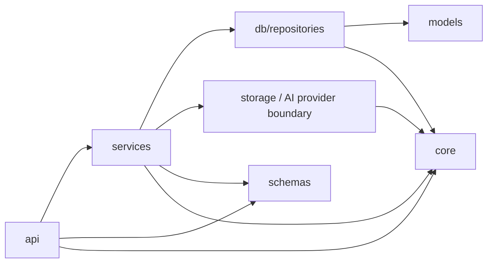

# Project Structure & Layering

## 目的

本文定义稳定目录职责和依赖方向，不维护每个文件的完整快照。实际文件以仓库为准；新目录只有在当前 Story 出现真实职责时才创建。

## 当前结构

```text
AI-Knowledge-Hub/
  backend/
    app/
      api/              # Router、依赖注入、HTTP 异常映射
      ai/               # ChatProvider 契约、领域异常与 Provider Adapter
      core/             # Settings、Security、Logging、业务异常
      db/
        repositories/  # MySQL / Redis 数据访问
      models/           # SQLAlchemy Models
      schemas/          # Pydantic 请求与响应
      services/         # 业务规则、事务和流程编排
      storage/          # StorageProvider、Local、MinIO、Factory
      main.py           # FastAPI 组装和 Router 注册
    alembic/            # Migration 环境与版本
    tests/              # Unit、API 和 Integration Test
    pyproject.toml
    uv.lock
  docs/
    Sprint/             # 阶段计划、进度、验收和总结
    architecture/       # 当前架构、流程、安全和领域设计
      adr/              # 长期技术决策及取舍
    interview/          # 面试题与项目证据
    learning/           # 主线以外的扩展学习
  infra/                # 本地 Compose 和基础设施配置
  README.md             # 项目状态与本地运行入口
```

## 依赖方向



允许：

```text
Router -> Service -> Repository
Router -> Service -> Provider
Service -> Schema / DTO
Repository -> Model
```

禁止：

```text
Router -> Repository
Router -> Provider SDK
Repository -> Service
Model -> Business Workflow
Schema -> Database
Provider -> User Permission
```

## 各层约束

### API

- 处理 HTTP Method、Path、Header、Body、Query、依赖注入和响应类型。
- 不写 SQL、不控制业务事务、不转换厂商 SDK Response。

### Service

- 负责业务规则、权限、跨依赖编排、事务、补偿和业务日志时机。
- 不直接写 SQL；通过 Repository 访问数据。
- 不向 Router 返回 ORM 对象。

### Repository

- 负责单一数据系统的读取与写入。
- MySQL Repository 默认不自行 `commit()`；事务由 Service 协调。
- 不包含 HTTP、对象存储或用户交互逻辑。

### Provider

- 隔离外部系统或 SDK，例如 Local/MinIO Storage 和未来 LLM Provider。
- 使用项目稳定类型和领域异常，不向业务扩散 SDK 类型。
- 只抽象当前已经需要的最小能力。

### Model 与 Schema

- Model 描述数据库结构、约束和关系，不承载业务流程。
- Schema 描述输入输出和校验，不访问数据库或文件系统。

## 新模块准入

新增目录或抽象前必须回答：

1. 它解决哪个当前 Story 的真实职责？
2. 现有层为什么无法清晰承担？
3. 它的输入、输出和依赖方向是什么？
4. 怎样通过测试证明该边界有效？

不能只因为未来可能需要，或为了让目录看起来更“企业级”，提前创建空的 Gateway、Client、Manager、Factory 或 Utils 层。

## Sprint 4 当前扩展

Story 4.3 已新增以下真实结构：

```text
app/ai/
  provider.py          # Provider DTO、ChatEvent 与 ChatProvider Protocol
  exceptions.py        # Provider 层可预期领域异常
  providers/
    fake.py            # 不访问网络的确定性测试替身
```

`gateway.py`、`factory.py` 和真实 Adapter 将在后续 Story 出现真实职责时新增。
Router、ChatService、公共 Schema、Model 和 Repository 仍放在现有对应目录；
当前不存在这些 AI 业务模块，也不存在已经实现的 `/ai/chat` API。
