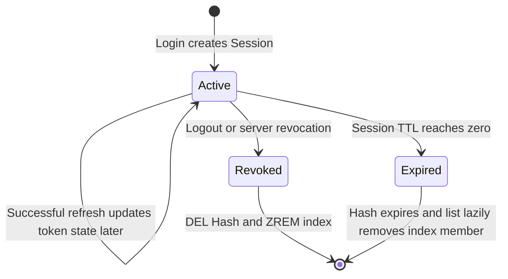
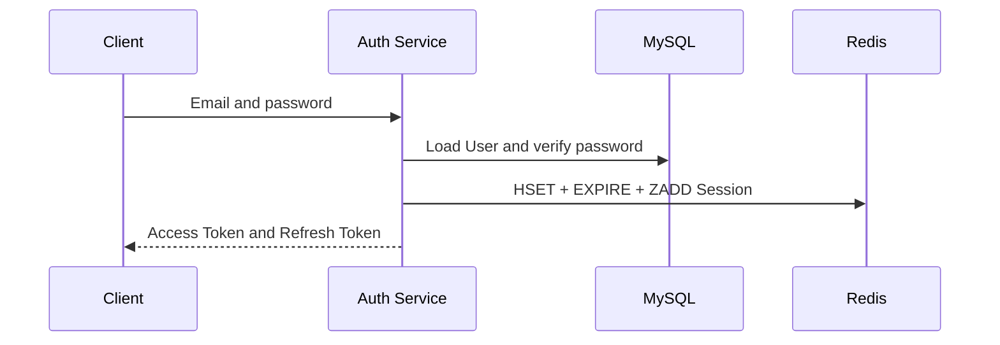
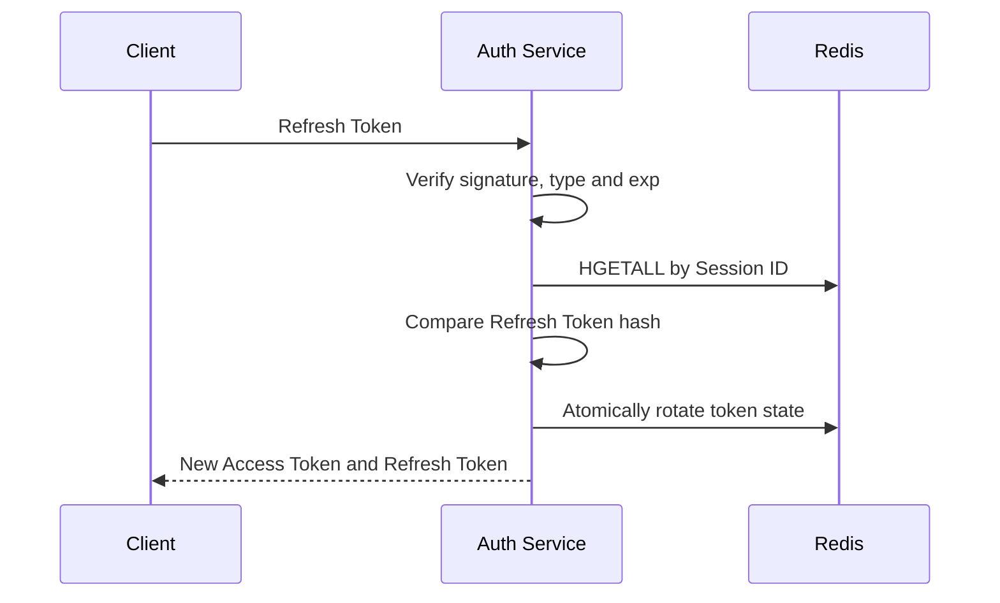
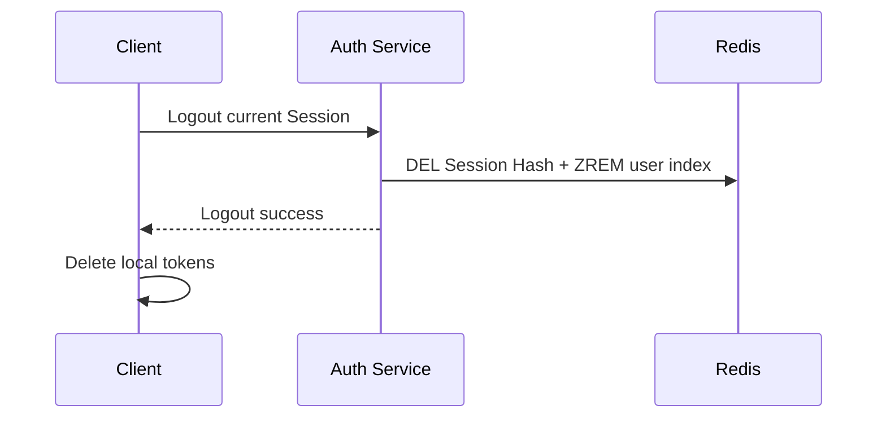

# Session Architecture

## 1. 目的

本文定义 AI-Knowledge-Hub 在 Redis 中保存认证 Session 的数据模型、生命周期和多设备索引。它只描述 Session Architecture；Refresh Token 的签发、原子轮换和重放处理由后续 Refresh Token 文档与 ADR 继续确定。

当前方案使用短期 Access Token 和受 Redis Session 控制的 Refresh Token：普通 API 只验证 Access Token，Refresh 和 Logout 才依赖 Redis Session。

## 2. 职责边界

```text
Access Token
  -> 验证普通 API 的短期访问身份
  -> 默认不查询 Redis
  -> Logout 后自然过期

Refresh Token
  -> 只用于换取新 Token
  -> 必须通过 JWT 验证和 Redis Session 验证

Redis Session
  -> 表示某台设备的一次登录状态
  -> 保存当前允许使用的 Refresh Token 摘要
  -> 支持服务端撤销、过期和多设备管理
```

MySQL 继续保存 User 等长期事实。Redis Session 是可过期的认证状态，不替代 User 表。

## 3. 数据模型

### 3.1 单个 Session

每次登录创建独立且不可猜测的 Session ID，不能使用 User ID 作为唯一 Session Key。

```text
Key: auth:session:{session_id}
Type: Hash
TTL: 与 Session 的绝对过期时间一致
```

Hash 字段：

| 字段 | 类型 | 作用 |
| --- | --- | --- |
| `user_id` | 整数字符串 | 关联本地 User |
| `refresh_token_hash` | 64 位十六进制字符串 | 当前有效 Refresh Token 的 SHA-256 摘要 |
| `created_at` | Unix 秒 | Session 创建时间 |
| `last_used_at` | Unix 秒 | 最近一次成功使用时间 |
| `expires_at` | Unix 秒 | Session 当前过期时间，也是当前 Refresh Token 的 `exp` |
| `absolute_expires_at` | Unix 秒 | Session 永远不能超过的最终过期上限 |

Redis 只保存 Refresh Token 摘要，不保存原始 Refresh Token。摘要用于确定性比较；Refresh Token 本身必须由服务端使用高熵随机值生成。

### 3.2 用户 Session 索引

```text
Key: auth:user:{user_id}:sessions
Type: Sorted Set
Member: session_id
Score: last_used_at
```

一个用户可以同时拥有多个 Session，因此每台设备互不覆盖。Sorted Set 使用 `last_used_at` 作为 Score，使 Session 列表可以按最近使用时间倒序读取。

普通 Set 只能判断成员和统计数量，不能表达稳定的最近使用顺序，因此不采用。

## 4. 写入与读取

### 4.1 创建

创建 Session 使用事务 Pipeline 一次提交：

```text
HSET   auth:session:{session_id} ...
EXPIRE auth:session:{session_id} ttl_seconds
ZADD   auth:user:{user_id}:sessions last_used_at session_id
EXEC
```

事务避免只写入 Hash、没有设置 TTL 或没有建立用户索引的部分状态。

### 4.2 获取

`HGETALL auth:session:{session_id}` 返回字段字典。Key 不存在时 redis-py 返回空字典 `{}`，Repository 将它转换为 `None`，表示 Session 已过期、已撤销或从未存在。

### 4.3 用户 Session 列表

```text
ZREVRANGE 获取按 last_used_at 倒序排列的 Session ID
  -> 非事务 Pipeline 批量 HGETALL Session Hash
  -> 将有效 Hash 转为 SessionRecord
  -> 用 ZREM 清理已经没有 Hash 的失效成员
```

批量读取使用 `transaction=False`，因为读取不需要事务隔离，Pipeline 只用于减少网络往返。

## 5. 生命周期



- 创建：登录成功后创建独立 Session Hash，并加入用户 Sorted Set。
- 使用：Refresh 先验证 JWT，再读取 Session 并比较 Token 摘要。
- 撤销：当前设备 Logout 使用事务同时 `DEL` Hash 和 `ZREM` 索引成员。
- 过期：TTL 自动删除 Hash；用户索引中的失效成员在列表读取时懒清理。
- 故障：Redis 无法完成必要的 Session 校验或写入时失败关闭，不绕过服务端登录状态。

当前默认使用固定过期模式，此时 `expires_at` 与 `absolute_expires_at` 相同，`last_used_at` 的变化不延长二者。数据模型为 Sliding 模式保留独立最终上限，但是否正式启用由 Story 2.6 安全 Review 决定。

## 6. 设计时序

### 6.1 登录



### 6.2 Refresh



原子轮换和 Replay Attack 处理仍属于 Story 2.3，不由当前 Repository 的普通 `get()` 和 `create()` 代替。

### 6.3 Logout



已签发的 Access Token 不查询 Redis，因此 Logout 后仍等待自身到期；Refresh Token 因 Session 已删除而立即不能刷新。

## 7. 多设备与单设备策略

当前默认支持多设备登录：每次登录生成新 Session ID，不覆盖同一用户已有 Session。

未来若需要单设备登录或最大设备数限制，应把它作为登录策略配置：创建新 Session 前列出并撤销旧 Session，而不是把 User ID 改成唯一 Session Key。这样数据模型仍能支持当前设备登出、设备列表和策略切换。

## 8. 已验证行为

- 单元测试验证创建、获取、不存在、删除、排序读取和失效索引清理。
- 真实 Redis 验证 Hash 字段、TTL 和 `ZREVRANGE` 最近使用顺序。
- 真实 Redis 验证 Hash TTL 到期后 Sorted Set 成员暂时残留，并在 `list_for_user()` 后被清理。

## 9. 后续边界

- Story 2.3：原子 Rotation 和 Replay Attack 已实现。
- Story 2.4：Logout API 与客户端契约已实现。
- Story 2.6：Sliding Session、Absolute Expiration 和 Secret Rotation 安全 Review。
- Story 2.9：IP、User Agent、当前设备标识和 Session 管理接口设计。
