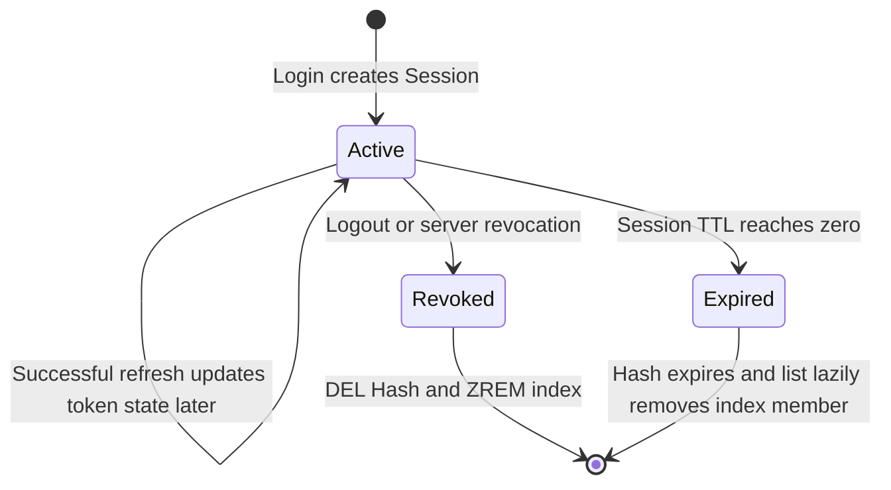
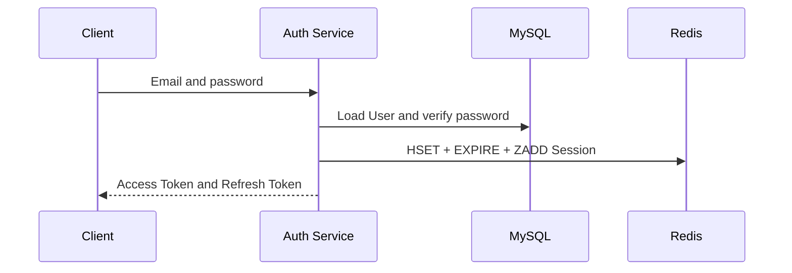
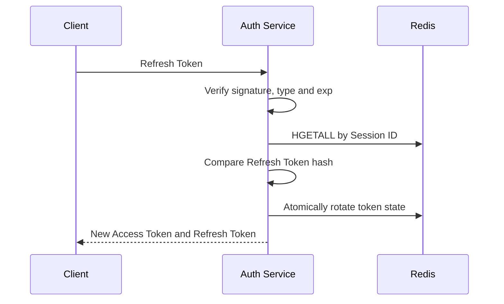
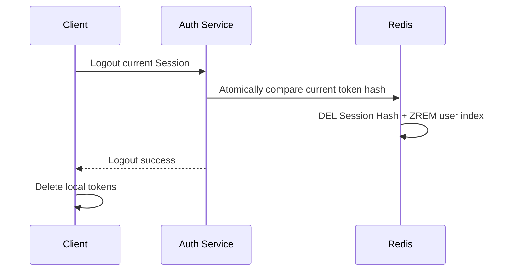

# Session Architecture

## 1. 目的

本文定义 AI-Knowledge-Hub 在 Redis 中保存认证 Session 的数据模型、生命周期和多设备索引。它只描述 Session Architecture；Refresh Token 的签发、原子轮换和重放处理由后续 Refresh Token 文档与 ADR 继续确定。

当前方案使用短期 Access Token 和受 Redis Session 控制的 Refresh Token：普通 API 只验证 Access Token，Refresh 和 Logout 才依赖 Redis Session。

## 2. 职责边界

```text
Access Token
  -> 验证普通 API 的短期访问身份
  -> 默认不查询 Redis
  -> Logout 后自然过期

Refresh Token
  -> 只用于换取新 Token
  -> 必须通过 JWT 验证和 Redis Session 验证

Redis Session
  -> 表示某台设备的一次登录状态
  -> 保存当前允许使用的 Refresh Token 摘要
  -> 支持服务端撤销、过期和多设备管理
```

MySQL 继续保存 User 等长期事实。Redis Session 是可过期的认证状态，不替代 User 表。

## 3. 数据模型

### 3.1 单个 Session

每次登录创建独立且不可猜测的 Session ID，不能使用 User ID 作为唯一 Session Key。

```text
Key: auth:session:{session_id}
Type: Hash
TTL: 与 Session 当前的 expires_at 一致
```

Hash 字段：

| 字段 | 类型 | 作用 |
| --- | --- | --- |
| `user_id` | 整数字符串 | 关联本地 User |
| `refresh_token_hash` | 64 位十六进制字符串 | 当前有效 Refresh Token 的 SHA-256 摘要 |
| `created_at` | Unix 秒 | Session 创建时间 |
| `last_used_at` | Unix 秒 | 最近一次成功使用时间 |
| `expires_at` | Unix 秒 | Session 当前过期时间，也是当前 Refresh Token 的 `exp` |
| `absolute_expires_at` | Unix 秒 | Session 永远不能超过的最终过期上限 |

Redis 只保存 Refresh Token 摘要，不保存原始 Refresh Token。摘要用于确定性比较；Refresh Token 本身必须由服务端使用高熵随机值生成。

### 3.2 用户 Session 索引

```text
Key: auth:user:{user_id}:sessions
Type: Sorted Set
Member: session_id
Score: last_used_at
```

一个用户可以同时拥有多个 Session，因此每台设备互不覆盖。Sorted Set 使用 `last_used_at` 作为 Score，使 Session 列表可以按最近使用时间倒序读取。

普通 Set 只能判断成员和统计数量，不能表达稳定的最近使用顺序，因此不采用。

### 3.3 Story 2.9 目标元数据

Session 管理接口实现后，Session Hash 增加两个可选展示字段：

| 字段 | 类型 | 作用 |
| --- | --- | --- |
| `ip_address` | 字符串或缺失 | 登录请求在可信服务端边界观察到的来源 IP |
| `user_agent` | 字符串或缺失 | 客户端标准 User-Agent Header，限制最大长度 |

两个字段必须保持可选。部署新版本时，Redis 中可能仍有最长 7 天的旧 Session Hash；读取旧数据时使用缺失值 `None`，不能因新增字段产生 `KeyError` 或强制所有设备重新登录。

## 4. 写入与读取

### 4.1 创建

创建 Session 使用事务 Pipeline 一次提交：

```text
HSET   auth:session:{session_id} ...
EXPIRE auth:session:{session_id} ttl_seconds
ZADD   auth:user:{user_id}:sessions last_used_at session_id
EXEC
```

事务避免只写入 Hash、没有设置 TTL 或没有建立用户索引的部分状态。

### 4.2 获取

`HGETALL auth:session:{session_id}` 返回字段字典。Key 不存在时 redis-py 返回空字典 `{}`，Repository 将它转换为 `None`，表示 Session 已过期、已撤销或从未存在。

### 4.3 用户 Session 列表

```text
ZREVRANGE 获取按 last_used_at 倒序排列的 Session ID
  -> 非事务 Pipeline 批量 HGETALL Session Hash
  -> 将有效 Hash 转为 SessionRecord
  -> 用 ZREM 清理已经没有 Hash 的失效成员
```

批量读取使用 `transaction=False`，因为读取不需要事务隔离，Pipeline 只用于减少网络往返。

## 5. 生命周期



- 创建：登录成功后创建独立 Session Hash，并加入用户 Sorted Set。
- 使用：Refresh 先验证 JWT，再读取 Session 并比较 Token 摘要。
- 撤销：当前设备 Logout 使用 Lua 原子比较用户与 Refresh Token Hash，匹配时同时 `DEL` Hash 和 `ZREM` 索引成员。
- 过期：TTL 自动删除 Hash；用户索引中的失效成员在列表读取时懒清理。
- 故障：Redis 无法完成必要的 Session 校验或写入时失败关闭，不绕过服务端登录状态。

当前默认使用固定过期模式，此时 `expires_at` 与 `absolute_expires_at` 相同，`last_used_at` 的变化不延长二者。Sliding 模式可以通过配置启用，但每次延长都必须同时更新 Refresh Token `exp`、Session `expires_at` 和 Redis TTL，并且不能超过 `absolute_expires_at`。

## 6. 设计时序

### 6.1 登录



### 6.2 Refresh



原子轮换和 Replay Attack 处理仍属于 Story 2.3，不由当前 Repository 的普通 `get()` 和 `create()` 代替。

### 6.3 Logout



已签发的 Access Token 不查询 Redis，因此 Logout 后仍等待自身到期；Refresh Token 因 Session 已删除而立即不能刷新。

## 7. 多设备与单设备策略

当前默认支持多设备登录：每次登录生成新 Session ID，不覆盖同一用户已有 Session。

即使两次登录的 User Agent 完全相同，也不能认为它们来自同一台物理设备。User Agent 可以重复、变化或被客户端伪造；当前 `session_id` 表示一次登录，不表示永久设备身份。若未来需要识别 App 安装实例，应单独设计客户端 Keychain 中的设备标识、服务端受信任设备记录和丢失设备恢复流程。

### 7.1 当前 Session 识别

Session 管理接口只携带 Access Token，因此 Access Token 增加 `sid` Claim。`sub` 用于列出当前用户的全部 Session，`sid` 用于标记本次请求对应的当前 Session。

```text
Access Token sub = 42
Access Token sid = abc
  -> list_for_user(42)
  -> session_id == abc 时 current = true
```

普通业务 API 继续只验证 Access Token，不查询 Redis。Session 管理属于敏感接口，必须额外确认 `sid` 对应的 Redis Session 仍存在且 `user_id` 与 `sub` 一致；当前 Session 已 Logout、过期或被撤销时，即使 Access Token 尚未到 `exp` 也返回 401。

Access Token 解码结果从单独的整数演进为 `AccessTokenClaims`，包含 `user_id`、可选 `session_id`、`issued_at` 和 `expires_at`。新 Login 和 Refresh 签发的 Access Token 必须写入当前 `sid`，同一 Session 的 Rotation 不改变 `sid`。

为兼容部署时尚未过期的旧 Access Token，JWT 解码器允许缺少 `sid` 并返回 `session_id=None`。普通 `/users/me` 只需要 `user_id`，继续接受旧 Token；`/users/sessions` 必须得到非空 `sid`，缺失时返回 401。旧 Access Token 最多 30 分钟自然过期后，所有正常签发的新 Token 都带有 `sid`。

### 7.2 设备展示信息

登录时由 FastAPI 从可信请求边界提取连接 IP 和标准 `User-Agent` Header，再传给 AuthService 写入 Redis Session。客户端不能在 JSON Body 中声明自己的 IP；部署到可信反向代理后，代理转发地址的读取规则必须单独配置，不能直接信任任意 `X-Forwarded-For`。

IP 和 User Agent 只用于帮助用户辨认登录来源，不作为设备身份证明或 Refresh 授权依据。User Agent 需要限制最大长度，避免任意客户端向 Redis 写入超长数据；IP 作为个人数据只随 Session TTL 保存，不写入认证事件日志。

现有 `last_used_at` 在登录和成功 Refresh 时更新，不因每个普通 Access API 请求更新。Session 列表中的最后活动时间是粗粒度的登录/刷新时间；不为了精确到每次请求而破坏普通 API 的无状态边界或增加 Redis 写放大。

### 7.3 Session 管理授权

- 任意仍然有效的当前 Session 可以查看当前用户的 Session 列表。
- 当前 Session 可以撤销属于同一用户的当前或其他 Session。
- 目标 Session 不存在、已过期或属于其他用户时统一返回 404，不暴露 Session 是否属于其他账号。
- 撤销必须原子校验目标 Session 的 `user_id` 后删除 Session Hash 和用户索引，不能把现有未校验所有者的 `delete(user_id, session_id)` 直接暴露给 API。
- 撤销成功记录固定 `auth.session.revoked` INFO 事件和 `current`/`other` 目标类型，不记录完整 Session ID。
- 主设备、受信任设备、密码/MFA 二次确认和 recent re-auth 不属于当前基础策略，后续安全增强时再设计。

### 7.4 Session 管理 API 契约

```http
GET /users/sessions
DELETE /users/sessions/{session_id}
DELETE /users/sessions
```

列表成功返回 HTTP 200，并按 `last_used_at` 倒序返回：

```json
{
  "sessions": [
    {
      "id": "opaque-session-id",
      "current": true,
      "ip_address": "203.0.113.10",
      "user_agent": "AIKnowledgeHub/1.0 (iOS 18)",
      "created_at": "2026-07-31T08:00:00Z",
      "last_used_at": "2026-07-31T09:30:00Z",
      "expires_at": "2026-08-07T08:00:00Z"
    }
  ]
}
```

`id` 是供撤销接口使用的高熵 Session ID，对已认证的 Session 所有者公开，但不得写入日志。响应不返回 `user_id`、Refresh Token Hash 或 `absolute_expires_at` 等内部字段；时间使用 ISO 8601 UTC，Redis 内部继续保存 Unix 秒。

撤销指定 Session 成功返回 HTTP 204。目标为当前 Session 时，客户端立即删除本地 Access/Refresh Token 并回到登录页；目标为其他 Session 时，当前客户端继续登录。目标不存在、已过期或不属于当前用户时统一返回 404。

撤销全部 Session 成功返回 HTTP 204。后端使用一次 Lua 原子操作验证当前 Session、读取用户索引、删除操作开始前已经存在的全部 Session Hash 和索引，并返回内部删除数量。当前客户端收到 204 后立即清除本地 Token；其他设备的 Refresh 能力立即失效，但已签发的普通 Access Token 仍可使用到自身 `exp`，敏感 Session 管理接口则因二次校验立即返回 401。

Lua 执行完成后才创建的新 Session 视为新的登录并保留。当前单节点 Redis 可以在脚本中操作这些 Key；未来迁移 Redis Cluster 时需要重新设计 Hash Tag 或跨 Slot 撤销策略。

日志契约：

| 事件 | 级别 | 安全字段 |
| --- | --- | --- |
| `auth.session_management.rejected` | WARNING | `user_id`、固定 `reason` |
| `auth.session.revoked` | INFO | `user_id`、`target=current/other` |
| `auth.sessions.revoked_all` | INFO | `user_id`、`revoked_count` |

读取列表成功不记录普通业务日志，避免频繁查看产生噪声。上述事件禁止记录完整 Session ID、IP、User Agent 或 Token；RedisError 继续由全局异常 Handler 统一记录。

未来若需要单设备登录或最大设备数限制，应把它作为登录策略配置：创建新 Session 前列出并撤销旧 Session，而不是把 User ID 改成唯一 Session Key。这样数据模型仍能支持当前设备登出、设备列表和策略切换。

## 8. 已验证行为

- 单元测试验证创建、获取、不存在、删除、排序读取和失效索引清理。
- 真实 Redis 验证 Hash 字段、TTL 和 `ZREVRANGE` 最近使用顺序。
- 真实 Redis 验证 Hash TTL 到期后 Sorted Set 成员暂时残留，并在 `list_for_user()` 后被清理。
- 单元测试验证可选 IP/User Agent 的新旧 Session 兼容，以及单个和批量撤销结果映射。
- AuthService 和 API 测试验证当前 Session 二次鉴权、列表响应、401/403/404/503、单设备撤销、全部设备登出和敏感日志排除。
- 真实 Redis 验证撤销不会越权删除其他用户 Session，并原子维护 Session Hash 和用户 Sorted Set 索引。

## 9. 后续边界

- Story 2.3：原子 Rotation 和 Replay Attack 已实现。
- Story 2.4：Logout API 与客户端契约已实现。
- Story 2.6：Sliding Session、Absolute Expiration 和 Secret Rotation 安全 Review。
- Story 2.9：IP、User Agent、当前设备标识和 Session 管理接口已实现。
