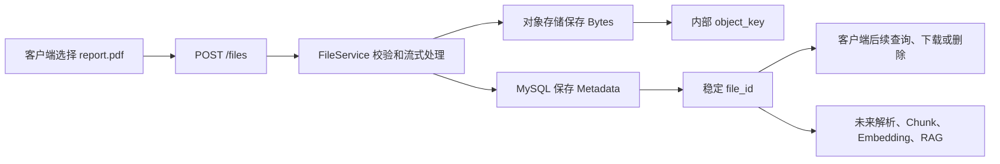
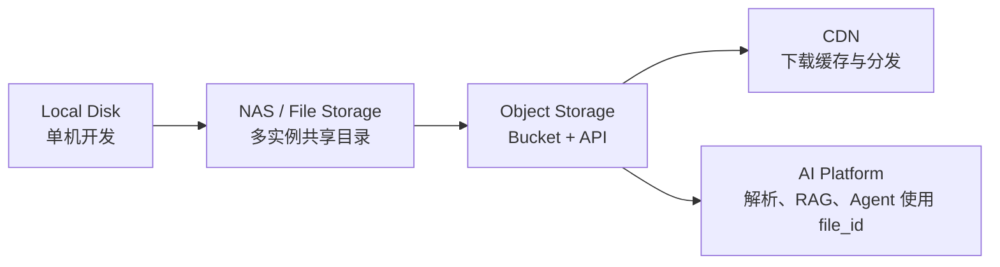

# Storage Evolution

## 1. 目的

本文建立 Sprint 3 的存储系统地图。它回答三个问题：

1. 文件的二进制内容和业务信息分别放在哪里。
2. 为什么客户端只使用稳定的 File Resource ID。
3. 为什么项目从本地存储演进到对象存储，而不是把上传文件固定写入某个服务器目录。

本文只说明架构边界和学习策略，不实现上传 API、文档解析、Chunk、Embedding 或 RAG。

## 2. AI Platform 的文件主线



一次上传最终产生两类数据：

| 位置 | 保存内容 | 例子 |
| --- | --- | --- |
| Object Storage | 文件的真实二进制内容 | PDF、图片、音频、Office 文档 |
| MySQL | 可查询、可授权的业务 Metadata | `file_id`、`owner_id`、大小、SHA-256、状态、内部 Object Key |

数据库不承担保存大文件 Bytes 的职责，对象存储也不承担用户权限、资源生命周期和业务查询的职责。

## 3. 三种存储

| 类型 | 本质 | 应用怎样访问 | 适合场景 |
| --- | --- | --- | --- |
| Block Storage | 一块原始磁盘或云硬盘 | 先格式化为文件系统，再挂载到机器 | MySQL 数据目录、虚拟机磁盘 |
| File Storage | 一棵共享的目录和文件树 | 通过路径读写，例如 `/shared/report.pdf` | NAS、团队共享目录、传统应用文件 |
| Object Storage | Bucket 中以 Object Key 标识的对象 | 通过 API 执行 Put、Get、Delete | 用户上传文件、备份、文档、媒体和 AI 数据集 |

Block Storage 面向“磁盘块”，File Storage 面向“路径和目录”，Object Storage 面向“Bucket、Key 和 API”。

Object Storage 的 Key 看起来像路径，例如 `users/42/2026/report.pdf`，但它不是客户端应该依赖的本机路径；前缀通常只是为了分类和管理对象。

## 4. 存储演进



### Local Disk

开发阶段可以将文件保存到单台机器的目录。它容易理解，也适合快速验证上传和下载行为。

限制是：

- 两个 FastAPI 实例各自拥有自己的本地磁盘；上传到实例 A 的文件，实例 B 可能读不到。
- 容器重建、临时磁盘或错误的 Volume 配置可能让文件消失。
- 容量、备份、迁移和权限管理都绑定到某台机器。

### NAS / File Storage

NAS 让多个实例挂载同一份共享目录，解决“文件只存在于某个实例”的问题。但应用仍依赖挂载路径、文件系统语义和共享存储的运维。

### Object Storage

对象存储通过网络 API 提供 Bucket 和 Object Key。多个应用实例可以访问同一份对象数据，不必共享本机目录。MinIO 提供本地可运行的 S3-compatible 对象存储；Tencent COS 和 Amazon S3 是未来可接入的云端实现。

### CDN

CDN 是下载缓存和分发层，不是文件系统的事实来源。它通常从对象存储获取内容，并在用户附近缓存热点文件。Sprint 3 不实现 CDN。

## 5. 为什么 API 返回 file_id

上传成功后，客户端拿到的是稳定的业务 Resource ID，例如 `file_id`，而不是 `/uploads/report.pdf` 或内部 `object_key`。

原因：

1. 后端可以先用 `file_id` 查 MySQL，再验证当前用户是否拥有该资源。
2. 存储实现可以从 LocalStorage 迁移到 MinIO，甚至迁移 Bucket 或重命名 Object Key，而客户端 API 不变。
3. 内部文件路径、Bucket 和 Object Key 不需要暴露给客户端，减少路径泄露和客户端伪造内部定位信息的风险。
4. `file_id` 能关联上传状态、删除状态、Checksum、审计日志和未来 RAG 处理状态。

下载接口将是：

```text
GET /files/{file_id}/download
  -> 后端认证并检查 owner_id
  -> 从 Metadata 找到内部 object_key
  -> 代理流式返回，或签发短期下载地址
```

客户端可以在 iOS 使用 `URLSession` 的下载任务异步接收文件；那是客户端实现方式，不是服务端返回 `file_id` 的原因。服务端只需要保证：下载先经过权限检查，随后得到可下载的内容或短期地址。

## 6. 本项目的存储边界

Sprint 3 的目标结构：

```text
File Router
  -> FileService
       -> FileRepository -> MySQL Metadata
       -> StorageProvider -> LocalStorage 或 MinIO
```

- Router 处理 HTTP 上传对象、参数、认证依赖和响应。
- FileService 编排权限、安全校验、上传顺序、失败补偿和日志。
- FileRepository 只读写 Metadata，不读写文件 Bytes。
- StorageProvider 只保存、读取和删除对象，不访问 MySQL，也不理解用户权限。

客户端不能指定 `owner_id`、Object Key 或服务器路径。后端从当前认证用户获得 `owner_id`，并生成稳定 Resource ID 和不可猜测的内部 Object Key。

## 7. 关键术语

| 术语 | 含义 |
| --- | --- |
| Bucket | 对象存储中用于组织对象的逻辑容器 |
| Object Key | Bucket 内对象的内部唯一名称 |
| Metadata | 描述文件的业务字段，不是文件正文 |
| SHA-256 | 对文件内容计算的摘要，用于完整性和重复观察 |
| ETag | 存储服务返回的对象版本或内容标识，不能默认等同于 SHA-256 |
| Signed URL | 存储服务签发的短期访问能力；具体使用策略在后续 Story 确定 |
| File Resource ID | 本项目面向客户端的稳定资源 ID |

## 8. 已确认与未开始

已确认：

- 文件 Bytes 与 Metadata 分离。
- LocalStorage 用于快速开发和 Unit Test。
- MinIO 用于真实对象存储契约验证。
- 未来 Provider 可以扩展到 COS 或 S3，但本 Sprint 不提前接入。

尚未开始：

- 上传 HTTP 契约、文件大小和类型策略。
- 具体 Metadata 表、Migration 和 ID 格式。
- StorageProvider 方法签名。
- 下载实现选择、删除补偿和对象存储一致性策略。
- RAG 解析、Chunk、Embedding、CDN 和分片续传。
