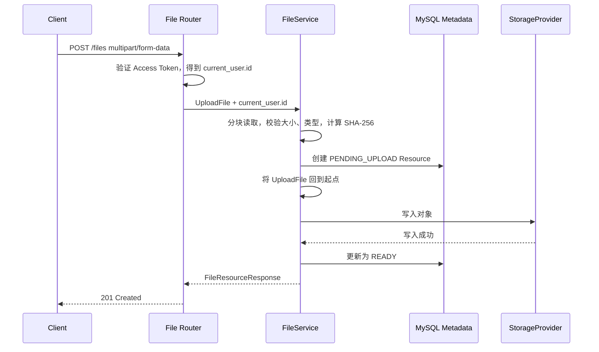
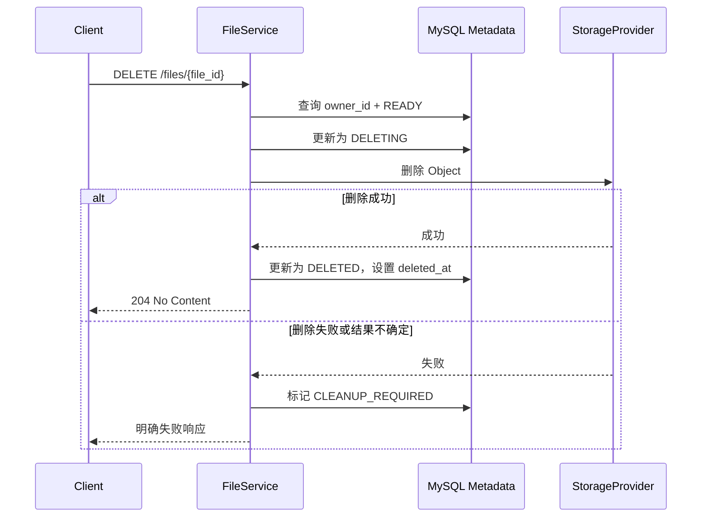

# Storage Flow

## 1. 上传主线



先完成流内校验，再创建 Resource，避免因为超大文件、类型拒绝或恶意文件名在 MySQL 留下无意义记录。文件通过校验后，Service 生成 UUID、Provider、Bucket 和 Object Key，创建 `PENDING_UPLOAD` Metadata。由于校验已经分块读取过 `UploadFile`，写入 Provider 前必须将它回到起点，再次以 Chunk 读取；整个过程不把完整文件读入业务内存。

当前上传是同步 API。客户端只有在对象写入成功并且 Metadata 已更新为 `READY` 时才得到 `201 Created`；否则得到明确错误响应，不能把 `PENDING_UPLOAD` 当作上传成功返回。

## 2. 上传失败与补偿


MySQL 与对象存储没有共享 Transaction。对象写入成功、数据库更新失败时，删除对象是补偿动作，不是假装回滚了一个分布式事务。对象写入报错或网络超时也不必然代表对象不存在；如果 Provider 无法确认结果，Service 同样必须尝试删除对象。只有确认对象不存在或补偿删除成功后，资源才进入 `UPLOAD_FAILED`；补偿失败或结果不确定时进入 `CLEANUP_REQUIRED`。

当前 Sprint 不实现后台 Worker 自动重试。发生失败时 API 返回失败；用户重新上传会创建新的 UUID 与 Object Key。后续 Cleanup Worker 可以根据 `CLEANUP_REQUIRED` 执行重试和对账。

## 3. 下载主线

```text
GET /files/{file_id}/download
  -> 验证 Access Token，得到 current_user.id
  -> 查询 file_id + owner_id + status=READY + deleted_at IS NULL
  -> 从 Metadata 获取内部 Provider、Bucket、Object Key
  -> 后续 Story 选择代理流或短期 Signed URL
```

不存在、非所有者、上传中、删除中、失败或已删除资源都返回 404。下载策略在 Story 3.6 决定，不能在本文件描述为已经使用 Signed URL。

## 4. 删除主线



先提交 `DELETING` 能避免并发下载继续把资源视为可用。Metadata 不立即物理删除，因为 Object 删除失败时它仍是补偿、审计和后续清理的唯一依据。

## 5. 错误、日志与测试

日志事件：

| 事件 | 级别 | 允许字段 |
| --- | --- | --- |
| `storage.upload.success` | INFO | `user_id`、`file_id`、`size_bytes` |
| `storage.upload.rejected` | WARNING | `user_id`、固定 `reason` |
| `storage.permission.rejected` | WARNING | `user_id`、固定 `reason` |
| `storage.provider.unavailable` | ERROR | operation、provider、异常类型 |
| `storage.compensation.failed` | ERROR | operation、provider、`file_id`、异常类型 |
| `storage.delete.success` | INFO | `user_id`、`file_id` |

日志不记录原始文件内容、完整 Object Key、Bucket、Signed URL、访问密钥或未经处理的文件名。

测试矩阵：

| 范围 | 必须验证 |
| --- | --- |
| Schema | Response 不暴露内部位置，分页参数有界 |
| Repository | owner/status/deleted 过滤、唯一约束与状态更新 |
| Service | 上传主线、超限、类型拒绝、Provider 失败、数据库更新失败补偿 |
| API | 201、401、404、413、415、503、204 契约 |
| Permission | 非所有者不能列出、读取、下载或删除他人资源 |
| Integration | Local 与真实 MinIO 的上传、读取、删除与故障路径 |

Provider 故障测试必须覆盖“明确写入失败”和“请求超时、对象结果不确定”两类情况。
