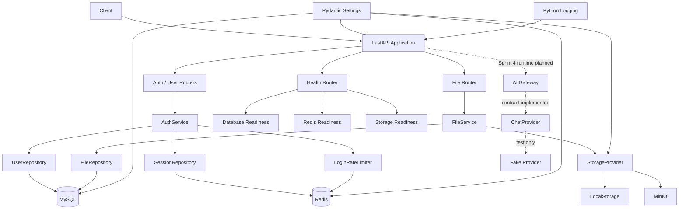
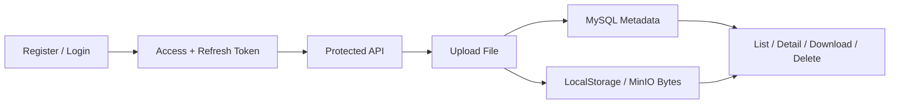

# System Overview

## 文档范围

本文描述 Sprint 3 完成后的当前运行架构，并标出 Sprint 4 已落地的 Provider
边界和后续规划。认证、Session、文件资源和 Storage 已进入运行时；Sprint 4
目前只有 ChatProvider 契约、领域异常和 Fake Provider，尚未注册 AI API 或调用真实模型。

## 当前运行架构



## 当前用户主线



## 分层边界

| 层 | 当前职责 |
| --- | --- |
| API Router | HTTP、参数、认证依赖、状态码和响应 |
| Service | 业务规则、权限、流程编排、事务和补偿 |
| Repository | MySQL 或 Redis 数据访问，不处理 HTTP |
| StorageProvider | 对象保存、读取、删除和存在性检查 |
| Model | SQLAlchemy 数据结构和关系 |
| Schema | 请求、响应与字段校验 |
| Core | Settings、Security、Logging 和全局业务异常 |

依赖方向必须从 HTTP/业务指向稳定边界。Repository 不调用 Service，Provider 不理解用户权限，Router 不直接访问数据库或存储 SDK。

## Readiness 边界

- Liveness 只证明 FastAPI 进程可以响应，不访问外部依赖。
- Readiness 检查 MySQL、Redis 和当前配置使用的 Storage。
- LocalStorage 模式不探测 MinIO；MinIO 模式使用短超时 `head_bucket()`。
- Sprint 4 外部模型 Provider 默认不进入全局 Readiness，避免第三方模型故障同时摘除认证和文件 API；AI API 使用自己的 503/504 失败语义。

## Sprint 4 当前边界与规划入口

当前已经存在且经过测试的代码边界：

```text
ProviderChatRequest -> ChatProvider -> ChatResult
                              \-----> AsyncIterator[ChatEvent]

ChatEvent = ChatDelta | ChatUsageEvent | ChatDone
Failure   = ProviderError subclass
```

`FakeChatProvider` 是测试替身，不连接 SDK，也不代表 AI Gateway 已进入运行时。

后续 Story 将在现有认证和 Service 分层之上增加：

```text
AI Router
  -> ChatService
       -> Prompt Center
       -> AIGateway
            -> ChatProvider
                 -> External LLM
       -> ChatUsageRepository -> MySQL
```

该结构的职责边界已经由 Story 4.2 确认。Factory 与真实 Adapter 已在 Story 4.4
实现并通过真实联调；Gateway、Service、Router、Prompt 和 Usage Repository 仍未实现，
不能画入当前实线运行架构。

## 相关文档

- [项目结构与分层](project-structure.md)
- [认证总流程](authentication-flow.md)
- [Storage Flow](storage-flow.md)
- [AI Gateway Architecture](ai-gateway-architecture.md)
- [AI Gateway Flow](ai-gateway-flow.md)
- [AI Gateway Security](ai-gateway-security.md)
- [Sprint 4 AI Gateway](../Sprint/Sprint4.md)
- [架构决策记录](adr/)
