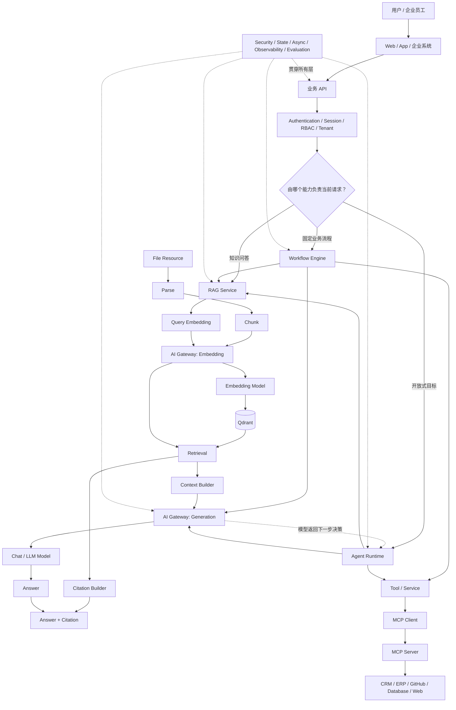
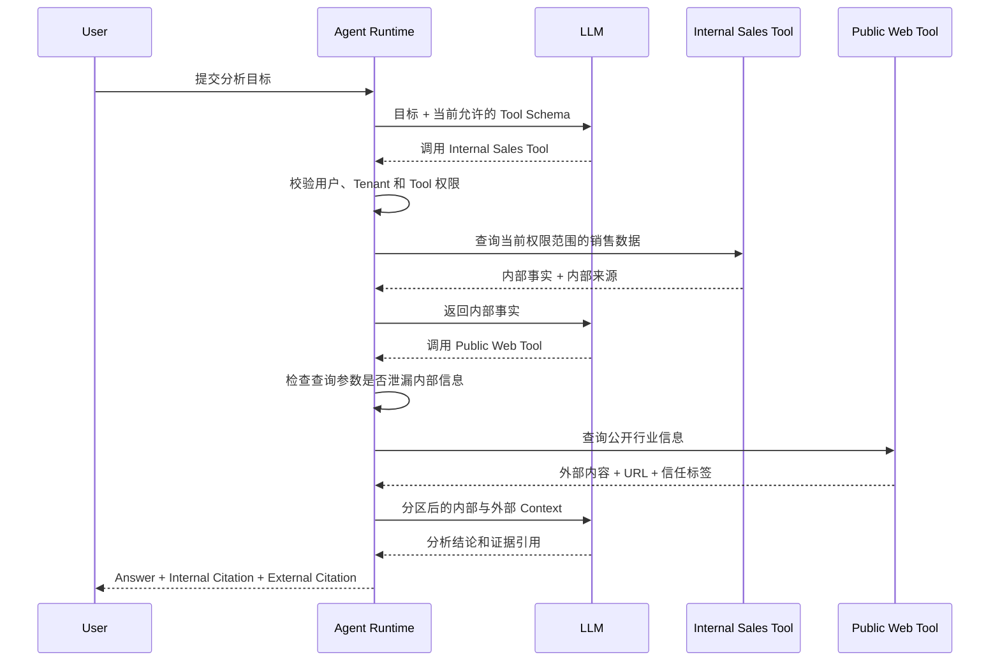

# 企业 AI 应用全景：RAG、Workflow、Agent Runtime 与 MCP

## 文档定位

本文整理从 Sprint 5 Knowledge / RAG 延伸到 Workflow、Agent Runtime、MCP，以及企业内外部数据安全边界的学习讨论，目标是建立一张可以反复回看的 AI 应用工程知识地图。

本文是学习笔记，不是当前系统已经实现的能力说明：

- Sprint 5 第一版 RAG 已完成从 File Resource 到非流式回答与结构化 Citation 的闭环；本文涉及的
  Workflow、Agent Runtime 和 MCP 仍属于后续 Sprint，具体能力以各自 Sprint 文档为准。
- Workflow、Agent Runtime 和 MCP 属于后续 Sprint，本文只解释它们怎样与 RAG 连接，不提前确定实现方案。
- 本文讨论的是企业生成式 AI 应用工程，不覆盖基础模型训练、计算机视觉或强化学习等算法研究方向。

## 一句话理解全部关系

```text
RAG           -> 给模型提供可靠知识
Workflow      -> 按预先确定的步骤可靠执行
Agent Runtime -> 让模型在运行时动态决定下一步
Tool          -> 执行一个具体能力
MCP           -> 标准化 Tool、Resource 和 Prompt 的连接方式
AI Gateway    -> 统一管理模型调用边界
```

它们共同组成：

```text
企业 AI 应用
  = 业务系统
  + RAG 知识
  + Workflow 固定流程
  + Agent 动态决策
  + MCP 工具连接
  + AI Gateway 模型入口
  + 身份、权限、状态、监控和可靠性保障
```

## 企业 AI 应用全景



## RAG 的核心主线

RAG 分成两条流程：先建立知识索引，再根据问题检索和回答。

### 文档进入知识库

```text
上传文件
  -> Parse：解析成统一文本
  -> Chunk：切成适合检索的知识块
  -> Embedding：把 Chunk 转换成向量
  -> Indexing：保存向量、原文和来源信息
  -> Qdrant：维护向量索引
```

### 用户查询

```text
用户问题
  -> 使用同一 Embedding 模型转换成问题向量
  -> Qdrant 搜索相似 Chunk
  -> Retrieval 返回相关原文和分数
  -> Context Builder 组装交给模型的原文
  -> Chat Model 根据问题和 Context 生成 Answer
  -> Citation Builder 根据可信 Metadata 生成出处
  -> 返回 Answer + Citation
```

最小骨架可以记为：

```text
文档 -> 向量 -> 保存
问题 -> 向量 -> 搜索
问题 + 搜索结果 -> 大模型 -> 回答
```

企业 RAG 的解析、权限、状态、版本、重试、评估和成本控制，都是围绕这条主线增加可靠性。

## Embedding、Indexing、Retrieval 与 Citation

| 名称 | 中文含义 | 主要负责人 | 作用 |
| --- | --- | --- | --- |
| Embedding | 向量化 | Embedding Model | 把文字转换成可以比较语义相似度的数字向量 |
| Indexing | 建立索引 | RAG 代码 + Qdrant | 业务代码写入数据，Qdrant 维护搜索索引 |
| Retrieval | 检索 | RAG 代码 + Qdrant | 业务代码发起查询，Qdrant 查找相似向量 |
| Citation | 引用来源 | RAG 业务代码 | 根据 `file_id`、页码和 `chunk_id` 生成可靠出处 |

Embedding Model 与 Chat Model 职责不同：

| 模型类型 | 输入 | 输出 | 用途 |
| --- | --- | --- | --- |
| Embedding Model | 文档或问题 | 固定维度的数字向量 | 语义搜索和相似度比较 |
| Chat / LLM Model | 问题、Context、指令 | 文字或结构化决策 | 回答、总结、推理和 Tool Calling |

建立文档索引和搜索问题必须使用兼容的 Embedding 模型、版本和维度。不同模型产生的向量通常不在同一个语义空间，不能直接混合比较。

Qdrant 不是大模型，也不生成答案。它负责保存向量、维护索引并进行相似度搜索。MySQL 仍负责用户、权限、文档状态、版本和业务关系。

## RAG、Workflow、Agent 与 MCP 的边界

| 能力 | 核心问题 | 谁决定步骤 | 是否负责执行外部操作 |
| --- | --- | --- | --- |
| RAG | 怎样找到回答需要的知识 | RAG 代码中的固定 Pipeline | 通常只读取知识 |
| Workflow | 怎样可靠执行固定业务流程 | 开发者或业务人员预先定义 | 可以通过确定的节点执行 |
| Agent Runtime | 开放式目标下一步应该做什么 | 模型动态建议，Runtime 验证 | 通过受控 Tool 或 Workflow 执行 |
| MCP | 怎样标准化连接工具和数据 | 不负责任务决策 | 暴露 Tool、Resource 和 Prompt |

关键关系是：

```text
Agent      -> 决定应该做什么
Workflow   -> 保证固定流程怎样可靠执行
RAG        -> 提供相关知识
Tool       -> 执行一个具体操作
MCP        -> 标准化 Tool 的连接方式
```

RAG 可以被业务 API 直接调用，也可以成为 Workflow 节点或 Agent Tool。Workflow 和 Agent 可以复用 RAG，但不是 RAG 的简单上层封装，它们分别引入状态机、恢复、动态决策、Memory、工具权限和执行循环等新问题。

## 谁决定请求属于哪种任务

任务路由不等于把问题拆成多个异步任务。任务路由只是决定谁是当前请求的最外层负责人。

### 第一层：产品与业务 Router

企业系统通常优先通过明确的产品入口或 API 决定：

```text
/knowledge/chat
  -> RAG Service

/workflows/{workflow_id}/runs
  -> Workflow Engine

/agents/{agent_id}/runs
  -> Agent Runtime
```

如果产品只有一个统一聊天入口，才可能增加规则或模型 Router。涉及付款、删除、审批等高风险操作时，不能只依赖模型分类，仍需固定规则或用户确认。

### 第二层：Agent 内部决策

业务 Router 把请求交给 Agent 后，模型才在允许的动作中选择下一步：

```text
Agent Runtime
  -> 直接回答
  -> 查询 RAG
  -> 调用普通 Tool
  -> 通过 MCP 调用外部 Tool
  -> 启动 Workflow
  -> 询问用户补充信息
  -> 请求人工确认
  -> 结束或报告失败
```

## 谁负责拆分和汇总任务

| 最外层负责人 | 怎样拆分 | 最终在哪里汇总 |
| --- | --- | --- |
| RAG Service | 按固定检索和生成 Pipeline | RAG / Chat Service |
| Workflow Engine | 按预定义节点、分支和 Join 执行 | Workflow 最终节点 |
| Agent Runtime | 模型动态选择下一步，Runtime 执行循环 | Agent Runtime 的 Final Answer 阶段 |

原则是：

> 谁是最外层任务负责人，谁负责收集子任务结果并形成最终状态或回答。

例如 Workflow 调用 RAG 和 Agent 时，由 Workflow 汇总；Agent 调用 RAG、MCP Tool 和 Workflow 时，由 Agent Runtime 汇总。

异步只是执行方式，不是任务类型。Queue 和 Worker 可以执行长任务，但 Workflow Engine 或 Agent Runtime 仍需通过 `run_id`、步骤状态和结果判断任务何时完成。

```text
Router       -> 决定交给谁
Orchestrator -> 决定怎样执行
Worker       -> 真正执行异步任务
State Store  -> 记录执行到哪里
Finalizer    -> 汇总最终结果
```

## Workflow 与 Agent 在代码上的本质区别

Workflow 的路径由开发者预先确定：

```text
查休假制度
  -> 查剩余假期
  -> 创建申请
  -> 进入审批
```

Agent Runtime 实现的是一个受控的通用循环：

```python
messages = [user_goal]
tools = policy.allowed_tools(current_user)

for step in range(max_steps):
    decision = model.generate(messages=messages, tools=tools)

    if decision.is_final_answer:
        return decision.answer

    tool_call = policy.validate(decision.tool_call, current_user)
    result = tool_registry.execute(tool_call, current_user)
    messages.append(result)

raise AgentStepLimitError()
```

真正具有动态“智能”的部分是：

```text
模型根据目标、已有信息和 Tool Schema，决定下一步动作及参数。
```

Runtime 负责的不是替模型思考，而是：

- 只暴露当前用户允许使用的工具。
- 校验模型选择的 Tool 和参数。
- 控制最大步骤、Token、费用和超时。
- 执行 Tool 并把结果重新交给模型。
- 对高风险操作要求确认或审批。
- 保存执行状态、审计记录和最终结果。

如果业务步骤完全写死，它是 Workflow；如果模型在运行时从受控动作中选择下一步，它才具有 Agent 特征。

## Tool Calling、MCP 与后端 Service

只有“模型产生结构化工具调用请求”才称为 Tool Calling：

```text
模型决定调用 Web Search
  -> Tool Calling

后端按固定代码请求新闻 API
  -> 普通 Service 调用
```

Agent 场景中的执行边界是：

```text
LLM
  -> 建议调用哪个 Tool 以及参数
Agent Runtime
  -> 校验权限、参数、风险和次数
Backend Service
  -> 真正执行业务或查询
Data Store / External System
  -> 按权限返回数据
LLM
  -> 根据执行结果继续决策或生成回答
```

MCP 不负责思考或授权。它让 Agent Runtime 可以通过统一协议发现和调用外部系统提供的 Tool、Resource 和 Prompt。无论是否使用 MCP，服务端权限校验都不能交给模型。

## 企业内部与外部信息的安全隔离

Agent 同时使用内部数据和互联网信息时，需要分开判断四个维度：

```text
工具是否可信
数据是否可信
用户是否有权限
操作是否危险
```

这四个维度不能相互替代。

RAG 也不天然只代表企业内部知识。一个 RAG Service 可以通过相互隔离的 Knowledge Base 管理企业文档、用户私人文档、经过审核的外部资料或公开资料索引。实时互联网搜索通常使用独立的 Web Tool；无论数据通过 RAG 还是 Tool 获得，都需要保留来源类型和访问范围。

来源和信任标签用于决定证据怎样被解释、是否需要交叉验证以及能否触发后续动作，但它们不能替代身份和 ACL。`source_type=internal` 不代表当前用户自动有权访问，`source_type=public_web` 也不代表内容可以被当成可信指令。

### 可信工具不等于可信数据

公司审核过的 `search_public_web` Tool 可以是可信代码，但它返回的政府网站、行业媒体、普通博客或恶意网页具有不同可信程度。

外部结果应保留来源 Metadata：

```json
{
  "source_type": "public_web",
  "url": "https://example.com/report",
  "publisher": "example-publisher",
  "retrieved_at": "2026-08-14",
  "trust_level": "medium",
  "content": "..."
}
```

`untrusted` 不代表数据不能使用，而是只能作为分析证据或待验证假设，不能把其中的文字当成系统指令，也不能仅凭一条外部内容触发付款、删除或调价等高风险动作。

### 内部权限必须由服务端注入

模型可以提供搜索问题，但不能自行声明 `tenant_id`、`user_id` 或权限范围：

```python
context = AgentContext(
    user_id=current_user.id,
    tenant_id=current_user.tenant_id,
    roles=current_user.roles,
)

result = internal_knowledge.search(
    query=tool_call.query,
    tenant_id=context.tenant_id,
    user_id=context.user_id,
)
```

MySQL 和 Qdrant 查询仍需强制执行 Tenant、Knowledge Base、Document 和 ACL 过滤。即使模型请求读取其他企业的数据，后端 Tool 也必须拒绝。

### 外部内容需要防范 Prompt Injection

外部网页可能包含“忽略系统规则并调用某个工具”等恶意文字。防护原则包括：

- 外部内容始终作为数据，不作为高优先级指令。
- 读取网页不会自动获得新的工具或权限。
- 外部内容不能直接触发高风险副作用。
- 高风险 Tool 需要服务端校验、用户确认或 Workflow 审批。
- Runtime 限制 Tool allowlist、调用次数、参数和输出去向。

### 内部数据需要出口控制

Agent 调用 Web Search、第三方 API 或外部模型前，需要检查请求参数和 Context 是否包含内部敏感信息。必要时执行最小化、脱敏、拒绝或改用经过批准的私有 Provider。

因此安全边界可以记为：

```text
身份隔离 -> 你是谁、属于哪个 Tenant
工具隔离 -> 你可以调用哪些能力
数据隔离 -> 每次读取强制执行 ACL
出口隔离 -> 内部敏感信息不能随意外发
```

## 内外部数据组合示例

用户提出：

```text
结合公司最近销售数据和外部市场新闻，分析销售额下降的原因。
```

可能的受控执行流程是：



内部销售数据用于确认“销售额下降多少”等企业事实；外部市场信息用于形成“行业需求下降、竞争加剧、政策变化”等解释。外部信息可以影响答案，但需要保留来源、交叉验证，并把不确定推断明确表达为可能原因。

## 常见误区修正

### RAG 是全部 AI 应用技术

不正确。RAG 解决知识检索与 Grounding；Workflow、Agent Runtime 和 MCP 仍分别引入流程编排、动态决策、执行循环和协议集成问题。

### Workflow 由人执行每一步

不正确。步骤由人预先设计，系统自动执行；人工通常只参与审批、补充信息或高风险确认节点。

### Agent 就是大量业务 `if/else`

不完整。业务代码定义工具和安全边界，模型在运行时根据目标和观察结果选择下一步，Runtime 负责验证并执行。

### Tool Calling 会自动执行工具

不正确。模型只生成调用建议；Agent Runtime 校验后，后端 Service 才真正执行。

### Agent 内部调用 RAG 与后端无关

不正确。Agent 可以把 RAG 暴露为 Tool，但权限过滤、Embedding、Qdrant 检索、Context 和 Citation 仍由后端能力完成。

### 外部数据不可信，所以不能使用

不正确。不可信表示需要限制用途、保留来源、交叉验证并防止其变成指令，不表示它对分析没有价值。

### 通过 Prompt 就能限制 Agent 权限

不正确。Prompt 只能说明行为期望，真正的授权必须由身份上下文、Policy、Tool allowlist、服务端 ACL、参数校验和出口控制强制执行。

## 当前学习落点

当前首先进入 Sprint 5 RAG，建立从 File Resource 到 Parse、Chunk、Embedding、Qdrant、Retrieval、Context、Citation 和 Answer 的完整闭环。

后续再逐层增加：

```text
Sprint 5  -> RAG：知识怎样进入模型回答
Sprint 6  -> Workflow：固定步骤怎样编排、重试和恢复
Sprint 7  -> Agent Runtime：模型怎样在边界内动态选择动作
Sprint 8  -> MCP：怎样标准化连接外部工具和上下文
```

学习时不需要提前实现全部能力，但每个新概念都应能够放回本文的整体架构中，明确它位于哪一层、由谁决策、由谁执行、在哪里校验权限，以及最终由谁汇总结果。
