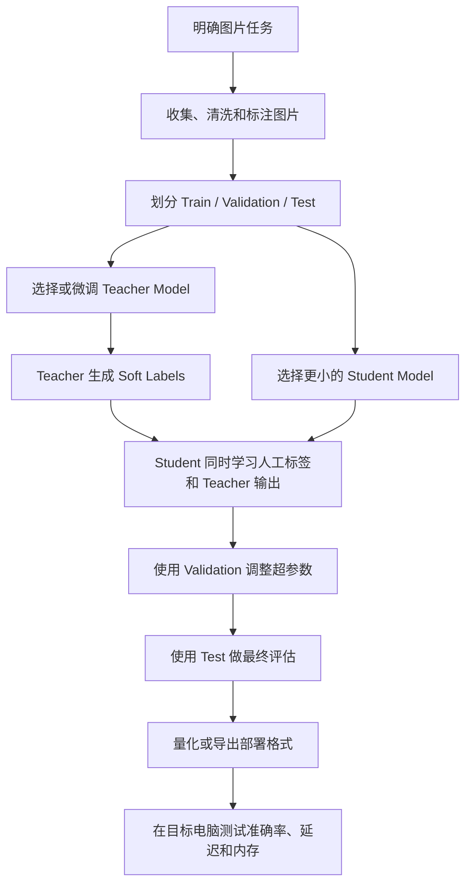

# 知识蒸馏与图片识别训练流程

## 文档定位

本文是一份 AI 模型训练扩展知识笔记，用于理解“在本地训练或部署图片识别模型”时常见的微调、知识蒸馏、量化和效果评估。

当前 AI-Knowledge-Hub 尚未实现模型训练功能，本文内容不能描述为项目已经具备的能力。

## 先看完整流程



部署阶段通常只运行 Student：

```text
客户端图片
  -> 图片预处理
  -> Student Model 推理
  -> 分类、目标框或文字结果
  -> 返回置信度和业务结果
```

## 什么是知识蒸馏

知识蒸馏（Knowledge Distillation）是让一个较小的 Student Model 学习较大的 Teacher Model 的判断方式。

```text
能力较强、运行较慢的 Teacher
              ↓ 传递知识
体积较小、运行较快的 Student
```

Teacher 对一张猫图片可能输出：

```text
猫：0.92
狐狸：0.05
狗：0.02
汽车：0.01
```

人工标签通常只告诉模型“这是一只猫”，Teacher 的输出还表达了类别之间的相似程度和置信度。这种概率分布通常称为 Soft Label。

Student 一般同时学习两类信息：

```text
总训练损失
  = 人工标签损失（Hard Label）
  + Teacher 与 Student 的差异（Distillation Loss）
```

因此，蒸馏不是简单压缩模型文件，也不是把训练图片多输入几次，而是一个包含 Teacher、Student 和蒸馏损失的训练过程。

## 蒸馏为什么能节省资源

最终部署的 Student 通常比 Teacher 更小，因此可以减少：

- 模型文件大小。
- 推理内存或显存。
- 单张图片推理时间。
- CPU、GPU 和边缘设备的运行成本。

但是蒸馏主要节省部署和推理资源，不一定节省训练资源。训练期间可能需要同时运行 Teacher 和 Student。

一种常见优化是提前保存 Teacher 的输出：

```text
Teacher 批量处理训练图片
  -> 保存 Soft Labels
  -> 后续只训练 Student
```

## 首先明确图片任务

“图片识别”可能指不同任务：

| 任务 | 输出示例 |
| --- | --- |
| 图像分类 | 这张图片是猫、狗还是汽车 |
| 目标检测 | 图片中有哪些目标以及它们的位置 |
| 图像分割 | 每个像素属于什么类别 |
| OCR | 图片中包含哪些文字 |
| 图像描述 | 用自然语言描述图片 |
| 多模态问答 | 根据图片回答问题 |
| 缺陷检测 | 产品是否存在裂纹或异常 |

任务类型决定模型架构、标注格式和评估指标。没有先定义任务，不能直接讨论该选择什么模型或参数。

## 图片数据怎样准备

数据准备通常包含：

```text
采集
  -> 清洗
  -> 去重
  -> 标注
  -> 标注检查
  -> 划分数据集
  -> 转换成模型需要的格式
```

图片数量不是唯一标准，还要检查：

- 光照、角度、背景和拍摄设备是否覆盖真实场景。
- 类别数量是否严重不平衡。
- 是否存在重复、损坏或错误标签。
- 是否包含个人隐私或未经授权的数据。
- 训练图片是否包含真实部署时会遇到的模糊、遮挡和低光情况。

分类任务的标签可以是：

```text
image_001.jpg -> normal
image_002.jpg -> defect
```

目标检测还必须标记目标位置：

```text
image_003.jpg
  -> crack: [x1, y1, x2, y2]
```

## Train、Validation 和 Test

数据通常分为三部分：

| 数据集 | 用途 |
| --- | --- |
| Train | 更新模型内部权重 |
| Validation | 调整超参数并选择最佳模型 |
| Test | 在训练完成后评估最终泛化效果 |

可以从 `80% / 10% / 10%` 开始，但比例不是固定标准，应该根据数据量和场景调整。

测试集不能与训练集重复，也不能在反复调参时不断查看测试集。否则测试结果会被间接用于训练，形成 Data Leakage，无法反映模型面对新图片时的真实效果。

只拿几张训练过的图片演示识别成功，只能证明模型能识别这些样本，不能证明模型已经具备可靠的泛化能力。

## “调整参数”可能指什么

### 模型参数

模型内部的权重由训练过程和优化器自动更新，开发者通常不会逐个手工修改。

### 超参数

超参数由开发者配置：

| 超参数 | 作用 |
| --- | --- |
| Learning Rate | 每次更新权重的步长 |
| Batch Size | 每次参与训练的图片数量 |
| Epoch | 全部训练数据重复学习的轮数 |
| Image Size | 输入模型的图片尺寸 |
| Optimizer | 权重更新策略 |
| Weight Decay | 控制过拟合 |
| Data Augmentation | 裁剪、旋转、翻转等数据增强 |
| Temperature | 平滑 Teacher 的输出概率 |
| Distillation Weight | 人工标签与 Teacher 输出各占多大权重 |
| Confidence Threshold | 低于什么置信度的预测不被采用 |

典型风险：

- Learning Rate 太大，训练可能震荡或无法收敛。
- Learning Rate 太小，训练很慢或几乎学不到。
- Epoch 太少，模型欠拟合。
- Epoch 太多，模型可能记住训练集而过拟合。
- 数据增强过强，可能破坏真实类别特征。

## 微调、蒸馏和量化的区别

| 方法 | 核心做法 | 主要目标 |
| --- | --- | --- |
| 普通监督训练 | 使用图片和人工标签训练模型 | 从数据学习任务 |
| Fine-tuning | 使用业务数据继续训练预训练模型 | 适应具体业务 |
| LoRA | 只训练少量新增参数 | 降低微调成本 |
| Knowledge Distillation | Teacher 指导 Student | 得到更小、更快的模型 |
| Quantization | FP32/FP16 转换为 INT8/INT4 等 | 降低推理内存和计算量 |
| Pruning | 删除不重要的权重或结构 | 缩小模型和减少计算 |

这些方法可以组合。例如：

```text
先用业务图片微调 Teacher
  -> 将 Teacher 的能力蒸馏给 Student
  -> 对 Student 进行量化
  -> 部署量化后的 Student
```

如果实际流程中只有“准备图片、添加标签、调整参数、训练一个模型”，更可能是普通训练或 Fine-tuning，不能据此判断使用了知识蒸馏。

## 怎样评估训练效果

### 图像分类

- Accuracy：总体预测正确比例。
- Precision：预测为某类别的结果中，有多少是真的。
- Recall：真实属于某类别的图片中，有多少被识别出来。
- F1 Score：综合 Precision 和 Recall。
- Confusion Matrix：观察哪些类别经常互相混淆。

### 目标检测

- Precision 和 Recall。
- IoU：预测框与真实框的重合程度。
- mAP：多个类别和阈值下的综合检测能力。
- 漏检率与误检率。

### 本地部署

除了准确率，还必须观察：

- 模型文件大小。
- 内存和显存占用。
- 单张图片延迟。
- 每秒处理图片数量。
- CPU 或 GPU 利用率。
- 模糊、遮挡、低光和不同设备图片上的效果。

业务指标决定评估重点。例如缺陷检测中，漏掉真正缺陷的代价很高，通常需要重点关注 Recall，而不能只看 Accuracy。

## 怎样判断对方是否真的使用了蒸馏

可以确认以下问题：

1. Teacher Model 和 Student Model 分别是什么？
2. Student 是否学习了 Teacher 的 Logits 或 Soft Labels？
3. 训练代码是否包含 Distillation Loss 和 Temperature？
4. Teacher 输出是实时计算，还是提前保存？
5. 最终部署的是 Teacher 还是 Student？
6. Test 数据是否与 Train 数据完全隔离？
7. 资源节省是来自蒸馏、量化，还是只是换了小模型？

只有明确存在 Teacher、Student 和知识传递过程，才能确认这是知识蒸馏。

## 与 AI-Knowledge-Hub 的关系

模型训练不是当前 Sprint 4 AI Gateway 的实现范围，也不属于当前项目主线，但它需要一套完整的平台基础：

```text
训练图片和标签
  -> 对象存储
  -> 数据集版本
  -> 训练任务
  -> 模型文件
  -> 评估结果
  -> 模型部署
  -> 推理日志和资源监控
```

Sprint 3 已实现的对象存储和资源元数据，未来可以用于保存训练图片、数据集、模型文件和评估产物；后续异步任务、监控和部署 Sprint 则可以继续支撑训练与推理任务。

这份联系只是未来演进方向，不代表当前项目已经实现训练平台。
