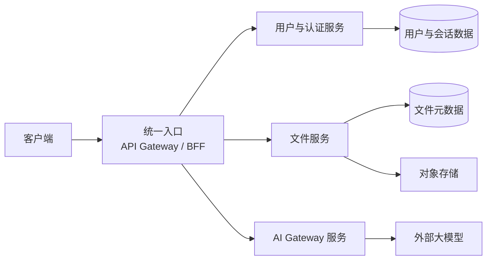
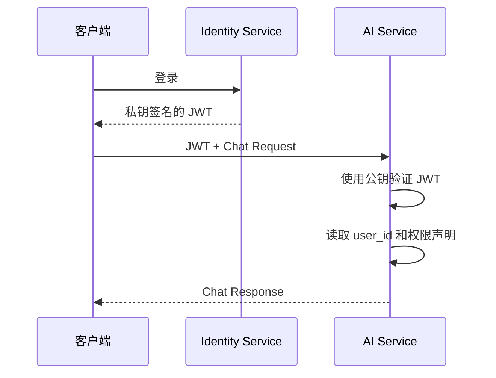
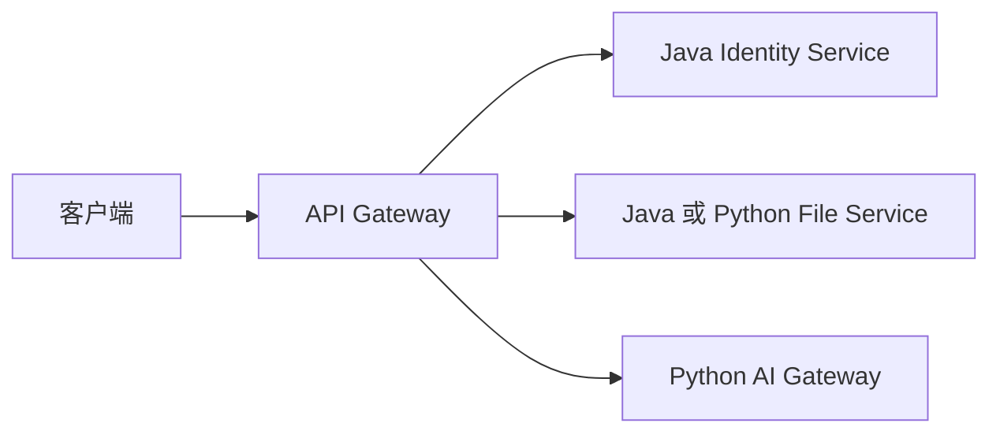
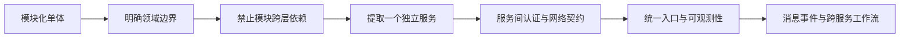

# 模块化单体、微服务与后端能力成长

## 文档定位

本文记录 2026-08-12 围绕 AI-Knowledge-Hub 架构演进产生的思考，主要回答三个问题：

1. 用户认证、文件存储和 AI Gateway 是否可以拆成独立项目。
2. 拆分后 Router、认证依赖和总项目分别承担什么职责。
3. Java 是否是微服务的最佳选择，以及当前后端学习处于什么阶段。

本文是项目完成后的候选演进路线，不表示 AI-Knowledge-Hub 当前已经采用微服务架构。

## 最初的拆分设想

当前系统已经形成三个相对清晰的业务区域：

```text
用户与认证
  -> 注册、登录、JWT、Session、用户信息

文件资源
  -> 上传、下载、删除、元数据、对象存储

AI Gateway
  -> 模型别名、Provider、Timeout、Retry、Chat、Streaming
```

因此可以设想将它们拆成三个独立项目，再由一个总项目负责统一入口和部署：



这个思路的关键不只是拆目录，而是明确每个服务是否能独立运行、部署和演进。

## 拆成多个项目不一定是微服务

如果用户、文件和 AI 仍运行在同一个 FastAPI 进程中，只是拥有独立模块：

```text
app/auth/
app/files/
app/ai/
```

这属于模块化单体。

如果它们成为独立进程，能够独立部署，并通过 HTTP、RPC 或消息事件通信：

```text
identity-service:8001
file-service:8002
ai-service:8003
```

这才属于微服务。

判断依据不是仓库数量，而是运行和部署边界：

- 是否能够独立启动、发布和扩容。
- 是否通过网络契约通信。
- 是否拥有清晰的数据所有权。
- 一个服务失败时，其他服务是否仍能继续提供自己的能力。
- 是否需要处理网络超时、重试、追踪和跨服务一致性。

## 三个服务的职责边界

### 用户与认证服务

负责：

- 注册、登录和退出。
- 用户资料与用户状态。
- JWT 签发。
- Refresh Token、Session 和多设备会话。
- 身份密钥和公钥轮换。

它可以命名为 `identity-service`，因为它不只是处理登录，还负责用户身份生命周期。

### 文件服务

负责：

- 文件上传、查询、下载和删除。
- 文件权限和资源可见性。
- 文件元数据。
- LocalStorage、MinIO 等 StorageProvider。
- 数据库与对象存储之间的失败补偿。

文件服务不负责注册和登录，但必须验证请求者身份，并根据 `user_id` 检查文件所有权。

### AI Gateway 服务

负责：

- 公共 Chat 契约。
- 模型别名和 Provider 选择。
- Provider Adapter 与 SDK 差异隔离。
- Timeout、Retry、Deadline 和取消。
- 非流式与 Streaming。
- 后续 Prompt、Usage、额度和 AI 可观测性。

AI 服务也不负责登录，但需要可信的 `user_id`，用于权限、额度、Usage 和审计。

## Router 应该放在哪里

每个服务都应拥有自己的业务 Router：

```text
identity-service
  POST /auth/register
  POST /auth/login
  GET  /users/me

file-service
  POST   /files
  GET    /files
  DELETE /files/{file_id}

ai-service
  POST /ai/chat
  POST /ai/chat/stream
```

总入口也有路由规则，但它不是业务 Router：

```text
/auth/*  -> identity-service
/users/* -> identity-service
/files/* -> file-service
/ai/*    -> ai-service
```

统一入口适合负责：

- TLS 终止和统一域名。
- 请求转发。
- 跨域和通用限流。
- Request ID 与访问日志。
- 可选的 Token 初步验证。

统一入口不应实现文件上传流程、模型选择或用户注册等领域业务，否则容易形成一个新的中心化大服务。

## 业务服务如何依赖用户系统

一种直接但脆弱的方案是每次请求都同步调用用户服务：

```text
AI 服务 -> 用户服务 -> 校验 JWT
```

这会让用户服务成为所有业务请求的运行时单点。更常见的方式是使用非对称签名 JWT：



职责分配为：

- 用户服务持有私钥并签发 Token。
- 文件服务和 AI 服务只持有公钥并验证 Token。
- 各业务服务负责本领域的授权判断。
- JWKS 可以用于发布和轮换验证公钥。

如果多个服务共同持有对称签名密钥，那么每个验证服务理论上也能伪造 Token。因此，真正拆成微服务后，应重新评估当前 JWT 算法，优先考虑 `RS256`、`ES256` 或 `EdDSA` 等非对称签名方式。

独立运行的文件或 AI 服务也不能在生产环境直接相信客户端传入的 `user_id`。演示环境可以提供明确标识的开发认证模式，但不能把它当作生产身份方案。

## 总项目可能代表什么

“总项目”至少可能有三种含义：

| 类型 | 职责 | 是否承载业务流程 |
| --- | --- | --- |
| Monorepo | 保存多个服务源码和公共工具 | 否 |
| 部署项目 | Compose、Kubernetes、配置、监控和发布 | 通常不承载 |
| API Gateway / BFF | 统一入口、转发和接口聚合 | 只承载有限的入口编排 |

不能让总项目统筹所有普通业务调用。否则三个子服务虽然分开部署，业务仍被一个中心服务紧密控制，最终会形成分布式单体：既承担网络和部署复杂度，又没有获得真正的服务独立性。

真正跨领域的长流程可以单独编排，例如：

```text
用户上传文档
  -> 文件服务保存资源
  -> 发布 FileReady 事件
  -> AI/RAG 服务建立索引
  -> 失败后重试或补偿
```

这种流程更适合使用工作流、消息队列或领域事件，而不是让统一入口同步控制每一步。

## Java 是否是微服务的最佳选择

Java 是学习成熟企业微服务生态的优秀选择，但不能简单说它在所有维度都最好。

| 维度 | Java / Spring Boot | Python / FastAPI | Go |
| --- | --- | --- | --- |
| 微服务生态 | 非常成熟 | 足够使用 | 成熟 |
| 中文资料与企业实践 | 非常多 | 较多 | 较多 |
| 开发速度 | 中等 | 快 | 中等 |
| 启动速度 | 通常较慢 | 快 | 很快 |
| 基础内存占用 | 通常较高 | 中等 | 较低 |
| 大型项目类型约束 | 强 | 中等 | 强 |
| AI SDK 与数据生态 | 可以使用 | 最丰富 | 相对较少 |
| 复杂传统业务 | 很合适 | 适合中小型和 AI 系统 | 合适但业务框架较少 |

Java 的优势主要来自完整且标准化的 Spring 生态：

```text
Spring Boot           服务开发
Spring Security       身份认证与权限
Spring Cloud Gateway  统一入口
OpenFeign             服务间 HTTP 调用
Resilience4j          超时、重试、熔断
Micrometer            Metrics
OpenTelemetry         分布式追踪
Kafka / RabbitMQ      事件通信
```

它很适合学习企业级服务治理，也对应大量后端岗位。但传统 Spring Boot 服务通常比 Go 占用更多内存，启动也更慢。GraalVM Native Image 和 AOT 可以改善这些问题，同时也会增加构建和兼容复杂度。

## 是否应该把当前项目重写成 Java

不建议仅为了体验微服务，立即把 AI-Knowledge-Hub 全部重写成 Java。这样会同时引入：

- 新语言与 Spring 框架学习。
- 服务间网络通信。
- 分布式认证。
- 多服务配置、日志和部署。
- 跨服务数据一致性。

这些问题会遮挡当前 Sprint 正在学习的 AI Gateway 核心。

更合理的路线是：

```text
先用 FastAPI 完成模块化单体
  -> 验证 Auth、File、AI 的边界
  -> 使用 FastAPI 做第一次服务拆分
  -> 单独用 Java 重做 Identity Service
  -> 学习 Spring Security 与服务治理
  -> 最后再评估混合技术栈
```

一种合理的长期混合架构可以是：



传统用户、权限、订单等复杂业务通常适合 Java；模型 SDK、RAG 和 AI 实验迭代通常使用 Python 更方便。但第一次学习微服务时不应立即混用多种语言，否则需要同时维护两套构建、测试和调试体系。

## 当前后端能力判断

目前不能说已经“完全懂了后端”，但已经掌握了中小型后端系统的核心逻辑，并开始从代码实现转向系统边界和生命周期思考。

已经形成的能力包括：

- 理解 `Router -> Service -> Repository / Gateway -> 外部依赖` 调用链。
- 区分公共 Schema、内部业务契约、数据库 Model 和 Provider DTO。
- 理解 JWT、Refresh Token、Redis Session 和用户状态的职责。
- 理解文件元数据、对象存储和失败补偿之间的边界。
- 理解 Gateway、Factory、Adapter 和 Provider 的分工。
- 理解 Timeout、Retry、Deadline、取消与错误转换。
- 理解普通 HTTP 和 SSE Streaming 的不同生命周期。
- 能主动检查职责是否放错层、字段是否泄露、资源由谁清理。

仍需继续积累的能力：

- Python 类型、异步和依赖注入语法的熟练度。
- 从需求独立拆分职责并写出第一版实现。
- 数据库锁、隔离级别、并发更新和死锁处理。
- 幂等、消息队列、最终一致性和分布式事务。
- 缓存失效、击穿、穿透和雪崩。
- 分布式日志、Metrics、Tracing 和告警。
- 容量评估、性能测试、灰度发布和故障恢复。

可以用下面的阶段表进行自我判断：

| 能力 | 当前状态 |
| --- | --- |
| 解释代码为什么这样分层 | 已具备 |
| 发现明显职责混乱和敏感信息泄露 | 已具备 |
| 在引导下完成完整功能 | 已具备 |
| 完全独立设计并实现一个完整 Story | 正在形成 |
| 处理生产级分布式系统问题 | 尚未系统实践 |

当前阶段可以概括为：已经跨过基础后端理解阶段，正在从“理解一个系统”进入“独立构建和验证系统”的阶段。

## 推荐的架构演进顺序



建议顺序：

1. 完成 AI-Knowledge-Hub 当前 Sprint，继续保持模块化单体。
2. 确认 Auth、File、AI 之间只通过稳定契约协作，不跨层读取实现细节。
3. 优先提取边界最清楚的服务，验证独立部署和失败隔离。
4. 增加非对称 JWT、统一入口、服务间 Timeout 和分布式追踪。
5. 最后再引入消息队列、跨服务工作流和 Java 服务。

最终原则不是“为了使用微服务而拆分”，而是：

> 先把单体内部边界设计到真正可拆，再让独立部署解决明确的规模、团队或可靠性问题。
