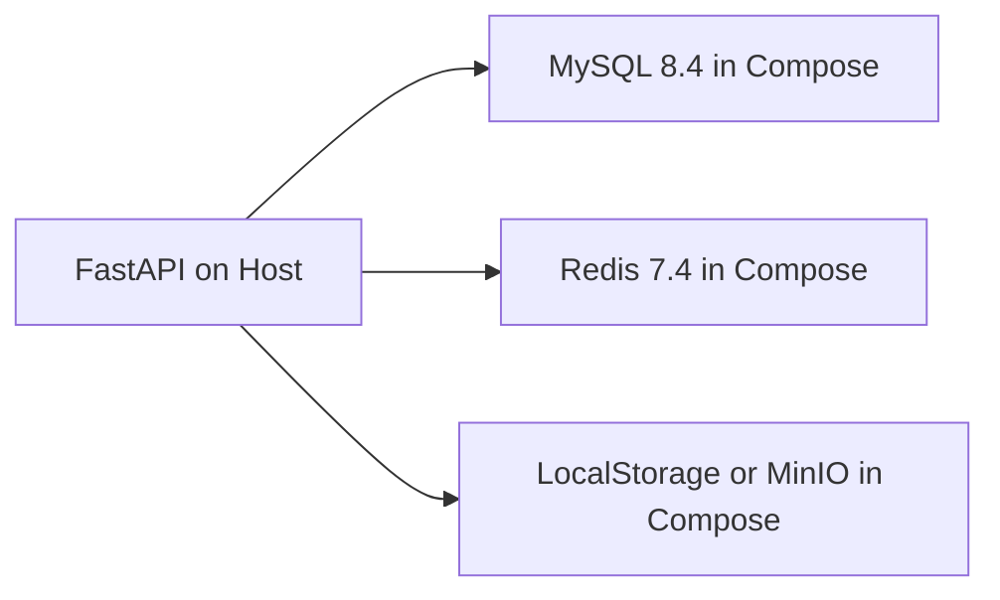
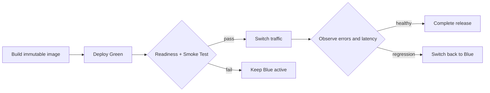

# 部署规范

## 1. 当前与目标边界

当前仓库已经交付的是本地开发拓扑，不应描述为生产环境已经上线：



未来生产演进候选为：

```text
GitHub -> Jenkins / CI -> Immutable Image Registry
  -> Blue-Green or Kubernetes / GitOps
  -> Nginx / Ingress
  -> Health Check
  -> Traffic Switch or Rollback
```

腾讯云 CCR、生产 Docker Compose、Kubernetes 和 GitOps 只有在对应 Sprint 设计、实现和验证后，才能写成当前事实。

## 2. 不可变产物

- 每次构建生成唯一、不可变的镜像版本。
- 镜像标签使用 Git Commit SHA 或不可复用 Release 标识，不使用 `latest`。
- 同一版本在环境间晋级，不在生产环境重新构建不同内容。
- Release 必须能追溯到 Git Commit、依赖 Lock File、Migration 和测试结果。

## 3. 配置与 Secret

- 配置通过环境变量或未来 Secret Manager / Kubernetes Secret 注入。
- 仓库只提交不含真实凭据的 `.env.example`。
- MySQL Root、MinIO Root 和应用账号分离；运行时应用只持最小权限凭据。
- JWT Key、Redis Password、MinIO Secret 和未来 AI API Key 不进入镜像、日志或命令历史。
- 切换 Provider、Bucket、模型或 Key 时必须考虑已有数据、Token 和兼容窗口，不只修改一个环境变量。

## 4. Health Check

- Liveness 只表示进程可响应，不访问外部依赖。
- Readiness 表示实例具备接收当前业务流量所需的依赖。
- 新版本 Readiness 未通过时禁止切换流量。
- 依赖故障不应无条件触发进程重启；先区分进程故障与外部服务不可用。
- 第三方 AI Provider 默认不进入整个应用 Readiness，避免模型故障同时摘除认证和文件 API；AI 请求使用独立错误、指标和告警。

## 5. Migration 发布顺序

- Migration 由部署流程显式执行，不在应用 import 或每个实例启动时竞争执行。
- 优先使用 Expand -> Deploy -> Contract 的兼容演进，避免旧代码和新 Schema 无法共存。
- 破坏性 Migration 必须确认备份、数据迁移、停机窗口和回滚限制。
- 应用回滚前确认旧版本是否兼容已经执行的新 Migration。

## 6. 蓝绿发布与回滚



- Rollback 必须是已经演练的操作，不是事故时临时编写的命令。
- 切流后保留旧环境足够时间，观察 Error Rate、Latency、Readiness 和关键业务流程。
- 回滚不能恢复已经不可逆修改的数据；数据库和外部系统变更必须单独设计补偿。

## 7. 数据与状态服务

- MySQL、Redis 和 MinIO 使用明确版本和持久化策略。
- 普通停止服务不能默认删除 Named Volume。
- `docker compose down -v` 只用于明确重置可丢弃的本地数据。
- 生产备份必须验证恢复，不以“已经创建备份任务”代替恢复演练。
- 对象存储、数据库和 Redis 的容量、TTL、备份与故障边界分别管理。

## 8. 发布前检查

- Unit、API 和必要 Integration Test 通过。
- Ruff、格式、Lock File 和 Migration Check 通过。
- 镜像、依赖和基础设施版本明确。
- `.env.example`、README、API、Architecture、ADR 和 Release 说明同步。
- Secret 未进入 Git Diff、镜像层、日志或测试输出。
- Liveness、Readiness、关键 Smoke Test 和回滚路径已验证。
- 发布完成后记录版本、时间、Migration、观察结果和已知风险。
