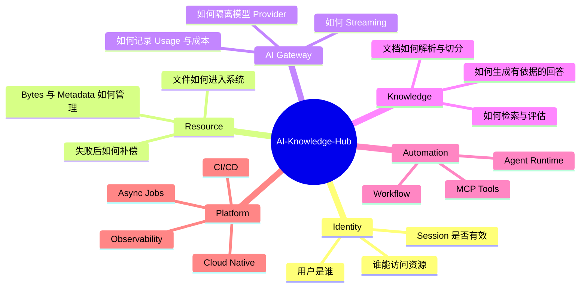
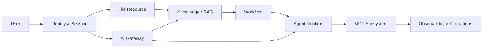

# AI-Knowledge-Hub 项目愿景

## 文档职责

本文回答三个问题：为什么做这个项目、它最终为谁解决什么问题、怎样判断项目方向没有偏离。

- 最高学习规则和工程原则见 [项目宪法](PROJECT_CONSTITUTION.md)。
- 当前阶段的目标、练习和验收见 [Sprint 文档](Sprint/)。
- 已接受的长期技术取舍见 [ADR](architecture/adr/)。

愿景不记录会频繁变化的 Story 状态、API 字段或具体实现细节。

## 双重使命

AI-Knowledge-Hub 同时承担产品使命和学习使命：

```text
产品使命
  -> 建立可持续演进的 AI 知识平台

学习使命
  -> 通过真实设计、实现、测试和运维
  -> 培养 AI Systems Engineer / AI Platform Engineer 能力
```

项目成功不能只看功能是否能运行，也不能只看学习笔记是否完整。真正的结果应是：系统具备清晰边界和可靠行为，开发者能够独立解释、画图、实现和排查这些能力。

## 目标用户

### 平台使用者

- 上传和管理自己的文件资源。
- 将文件转化为可检索的知识。
- 通过统一 AI 能力完成问答、总结和内容处理。
- 在未来使用 Workflow、Agent 和 MCP 扩展重复性工作。

### 平台开发与运维者

- 通过统一身份、资源、AI Gateway 和可观测性管理平台能力。
- 更换存储或模型 Provider 时，不要求所有业务重写。
- 能追踪请求、权限、资源状态、Token、成本、失败和恢复过程。
- 能通过测试、部署、监控和回滚维护系统，而不是依赖人工猜测。

## 要解决的核心问题



## 产品主线



Sprint 3 的 File Resource 与 Sprint 4 的 AI Gateway 是 Sprint 5 Knowledge/RAG 的两条基础输入：前者提供可靠资源，后者提供稳定模型调用。

## 产品原则

1. **稳定业务身份**：客户端依赖 User ID、File ID、Prompt Key 等业务身份，不依赖内部路径或 Provider 细节。
2. **边界清晰**：Router、Service、Repository、Provider 和基础设施各自承担单一职责。
3. **失败可解释**：成功、失败、取消和补偿状态必须可观察、可测试、可恢复。
4. **安全默认开启**：认证、最小权限、Secret、日志脱敏和输入限制不是上线前再补的功能。
5. **Provider 可替换**：对象存储和模型厂商通过最小能力边界接入，不把 SDK 扩散到业务代码。
6. **文档与实现一致**：文档描述当前事实；未来设计必须明确标记为候选或后续边界。
7. **复杂度由需求证明**：不因追求“企业级”提前引入没有真实需求的微服务、队列或抽象。

## 明确非目标

- 不以训练基础模型或研究模型算法为主线。
- 不把项目做成只展示聊天效果的 Consumer Chat Clone。
- 不为了堆技术名词提前引入所有云服务、框架和中间件。
- 不用 AI 直接生成全部关键代码来替代开发者理解。
- 不把候选架构、未来能力或一次 Demo 描述成已经交付的项目事实。

模型训练、知识蒸馏和图片识别可以作为扩展学习，但不改变项目的 AI Systems Engineering 主线。

## 成功标准

### 产品

- 用户能够安全管理资源并使用 AI 知识能力。
- 核心流程具有明确权限、错误、生命周期和恢复语义。
- Storage、Model Provider 和部署形态可以按边界演进。

### 工程

- 架构决策有 ADR，API 和数据结构有正式契约。
- Unit、API、Integration 和纵向测试覆盖真实风险。
- 日志、Metrics、Tracing、Usage 和部署验证可以支持排障。
- 每个 Sprint 都能独立验收、回顾和回滚。

### 成长

- 能不看文档讲清每个核心系统为什么这样设计。
- 能画出用户主线、组件关系、时序和失败状态。
- 能亲自实现关键代码与测试，并 Review AI 辅助结果。
- 能用项目证据回答 AI Systems Engineer 面试追问。

## 北极星

AI-Knowledge-Hub 的北极星不是“用了多少 AI 框架”，而是：

> 构建一个边界清晰、行为可靠、可以持续演进的 AI 知识平台，并在这个过程中形成独立设计、实现和维护 AI 系统的能力。
